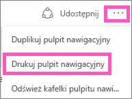
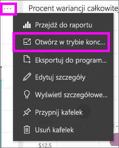
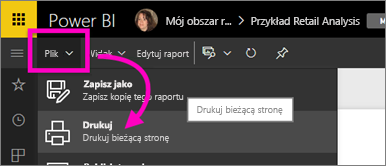

# Drukowanie z usługi Power BI
Wydrukuj cały pulpit nawigacyjny, kafelek pulpitu nawigacyjnego, stronę raportu lub element wizualny raportu z usługi Power BI. Raporty można drukować tylko po jednej stronie naraz — nie można wydrukować od razu całego raportu.

> [!NOTE]
> Drukowanie jest tylko dostępne w usłudze Power BI, a nie w aplikacji Power BI Desktop.
> 
> 

Zobacz, jak Amanda drukuje ze swojego pulpitu nawigacyjnego i raportu. Następnie postępuj zgodnie ze szczegółowymi instrukcjami poniżej wideo, aby wypróbować to samodzielnie.

<iframe width="560" height="315" src="https://www.youtube.com/embed/jtlLGRKBvXY" frameborder="0" allowfullscreen></iframe>

## Drukowanie pulpitu nawigacyjnego
1. Otwórz pulpit nawigacyjny, który chcesz wydrukować.
2. W prawym górnym rogu wybierz wielokropek (...), a następnie wybierz pozycję **Drukuj pulpit nawigacyjny**.
   
    
3. Zostanie otwarte okno drukowania w przeglądarce. Wybierz ustawienia oraz wydruku docelowy, a następnie wybierz opcję **Drukuj**.
   
   > [!NOTE]
   > Wyświetlone okno dialogowe zależy or przeglądarki, z której korzystasz.
   > 
   
    

## Drukowanie kafelka pulpitu nawigacyjnego
1. [Otwórz kafelek w trybie koncentracji uwagi](service-focus-mode.md), wybierając wielokropek i ikonę koncentracji uwagi .
   
    
2. Otwórz kafelek w [trybie pełnoekranowym](service-fullscreen-mode.md), wybierając ikonę pełnego ekranu  na górnym pasku nawigacyjnym.
3. Umieść kursor myszy nad kafelkiem, aby wyświetlić menu opcji.
   
    
4. Wybierz ikonę drukowania .     
   
   > [!NOTE]
   > Wyświetlone okno dialogowe zależy or przeglądarki, z której korzystasz.
   > 
   > 

## Drukowanie strony raportu
Raporty można drukować po jednej stronie w danym momencie.

1. Otwórz raport w widoku odczytu lub edycji.
2. Wybierz opcję **Plik** > **Drukuj**, aby wydrukować bieżącą stronę raportu.
   
    
3. Zostanie otwarte okno drukowania w przeglądarce.
   
   > [!NOTE]
   > Wyświetlone okno dialogowe zależy or przeglądarki, z której korzystasz.
   > 
   > 

## Drukowanie elementów wizualnych raportu
1. [Otwórz element wizualny w trybie koncentracji uwagi](service-focus-mode.md), przenosząc kursor myszy nad kafelek i wybierając ikonę koncentracji uwagi  w prawym górnym rogu.
2. Wykonaj kroki 2–3 w sekcji *Drukowanie strony raportu* powyżej.

## Zagadnienia i rozwiązywanie problemów
* Pytanie: nie mogę znaleźć przycisku **Drukuj**.    
* Odpowiedź: jeśli używasz aplikacji Power BI Desktop, drukowanie nie jest obsługiwane.  Drukowanie działa wyłącznie w usłudze Power BI.
* Pytanie: nie mogę wydrukować wszystkich stron raportu na raz.    
* Odpowiedź: to działanie jest poprawne. Raporty można drukować tylko po jednej stronie w danym momencie.
* Pytanie: nie mogę drukować do formatu PDF.    
* Odpowiedź: zobaczysz tę opcję tylko wtedy, jeśli w przeglądarce został skonfigurowany sterownik PDF.    
* Pytanie: elementy wyświetlone po wybraniu opcji **Drukuj** nie są takie same, jak przedstawione w tym artykule.    
* Odpowiedź: ekrany drukowania różnią się w zależności od przeglądarki i wersji oprogramowania.
* Pytanie: mój wydruk nie jest prawidłowo skalowany.  Mój pulpit nawigacyjny nie mieści się na stronie. Inne pytania dotyczące skalowania i orientacji.    
* Odpowiedź: firma Microsoft nie może zagwarantować, że wydrukowana kopia będzie dokładnie taka sama, jak przedstawiona w usłudze Power BI. Skalowanie, marginesy, szczegóły wizualne, orientacja oraz rozmiar nie są kontrolowane przez usługę Power BI. Aby uzyskać pomoc w tego typu przypadkach, zobacz dokumentację dla używanej przeglądarki.      

## Następne kroki
[Udostępnianie pulpitów nawigacyjnych i raportów współpracownikom i innym osobom](service-share-dashboards.md)

Masz więcej pytań? [Odwiedź społeczność usługi Power BI](http://community.powerbi.com/)

