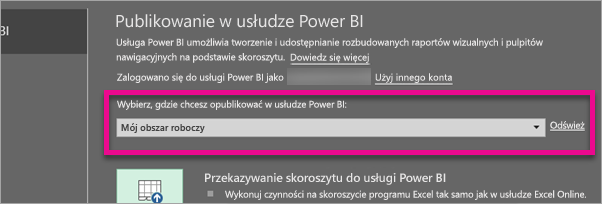
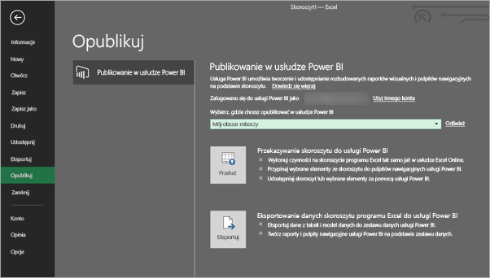
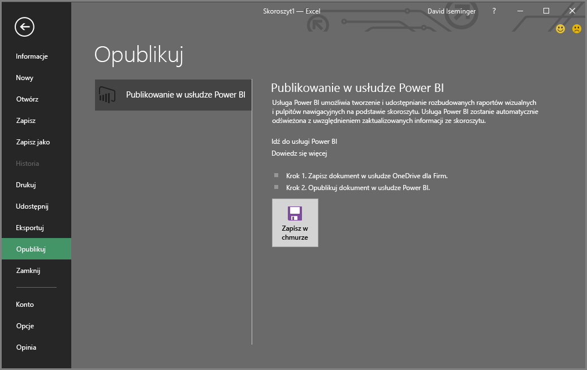
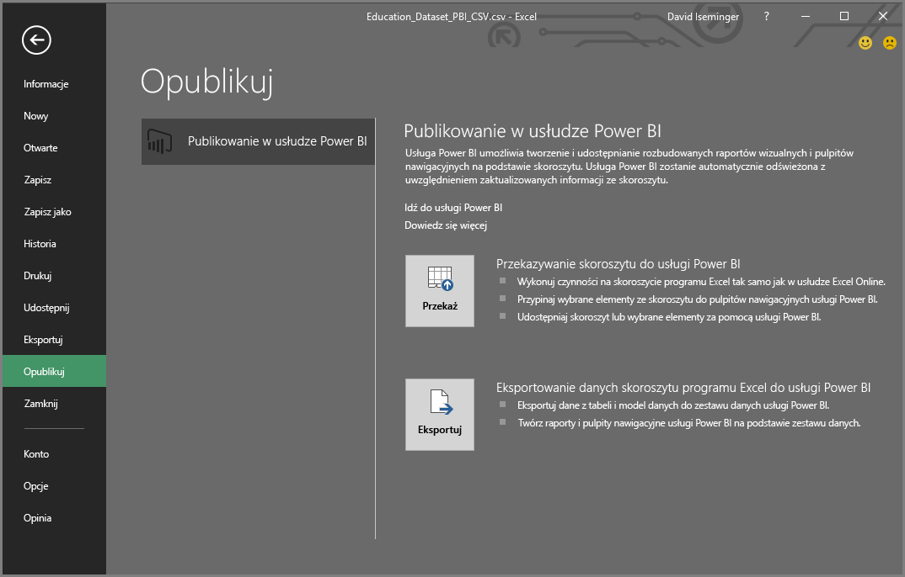

# Publikowanie w usłudze Power BI z programu Excel 2016
Przy użyciu programu Excel 2016 możesz publikować swoje skoroszyty programu Excel prosto do swojej witryny [usługi Power BI](https://powerbi.microsoft.com), w której możesz tworzyć wysoce interaktywne raporty i pulpity nawigacyjne na podstawie danych ze skoroszytu. Następnie możesz udostępniać te szczegółowe dane pozostałym osobom w organizacji.

Zanim przejdziemy dalej, weź pod uwagę kilka rzeczy:

* Przed opublikowaniem skoroszytu w usłudze Power BI należy zapisać go w usłudze OneDrive dla Firm.
* Do logowania się do usług Office, OneDrive dla Firm i Power BI należy używać tego samego konta.
* Nie można opublikować pustego skoroszytu lub skoroszytu, w którym nie ma żadnej zawartości obsługiwanej przez usługę Power BI.
* Nie można opublikować skoroszytów zaszyfrowanych, chronionych hasłem ani objętych usługą Information Protection Management.
* Publikowanie do usługi Power BI wymaga, aby było włączone nowoczesne uwierzytelnianie (domyślnie). Jeśli jest wyłączone, opcja Publikuj w menu Plik jest niedostępna.

## Publikowanie skoroszytu programu Excel
W programie Excel wybierz pozycję **Plik** > **Publikuj**.

### Publikowanie pliku lokalnego
Począwszy od aktualizacji z lutego 2017 r., program Excel 2016 obsługuje publikowanie lokalnych plików programu Excel. Nie trzeba ich zapisywać w usłudze OneDrive dla Firm ani SharePoint Online.

> [!IMPORTANT]
> Możliwość publikowania plików lokalnych zapewnia jedynie program Excel 2016 z subskrypcją usługi Office 365. Autonomiczna instalacja programu Excel 2016 nadal udostępnia opcję „Publikuj”, która jednak wymaga zapisania skoroszytu Excel w usłudze OneDrive dla Firm lub SharePoint Online.
> 
> 

Po wybraniu pozycji **Publikuj** możesz wybrać obszar roboczy, do którego chcesz opublikować dany element. Możesz wybrać osobisty obszar roboczy lub grupowy obszar roboczy, do którego masz dostęp.

Masz do wyboru dwie opcje dotyczące sposobu opublikowania skoroszytu w usłudze Power BI.

Po opublikowaniu skoroszyt jest przechowywany w usłudze Power BI jako kopia, niezależnie od pliku lokalnego. Jeśli chcesz zaktualizować plik w usłudze Power BI, musisz ponownie opublikować zaktualizowaną wersję. Możesz odświeżyć dane i ustawić zaplanowane odświeżanie w skoroszycie lub w zestawie danych w usłudze Power BI.

### Publikowanie z autonomicznego programu Excel
Jeśli skoroszyt nie jest zapisany w usłudze OneDrive, musisz najpierw to zrobić. Wybierz opcję Zapisz w chmurze i wybierz lokalizację w usłudze OneDrive dla Firm.

Po zapisaniu skoroszytu w usłudze OneDrive kliknij pozycję **Publikuj** i wybierz spośród dwóch opcji publikowania skoroszytu w usłudze Power BI.

#### Przekazywanie skoroszytu do usługi Power BI
Po wybraniu tej opcji skoroszyt pojawi się w usłudze Power BI, podobnie jak w aplikacji Excel Online. Jednak, w przeciwieństwie do aplikacji Excel Online, będziesz mieć dostęp do pewnych doskonałych funkcji ułatwiających przypinanie elementów z arkuszy do pulpitów nawigacyjnych.

Nie możesz edytować skoroszytu, gdy jest otwarty w usłudze Power BI, ale jeśli musisz wprowadzić zmiany, możesz wybrać pozycję **Edytuj**, a następnie wprowadzić zmiany do swojego skoroszytu w aplikacji Excel Online lub otworzyć go w programie Excel na komputerze. Wszelkie wprowadzone zmiany są zapisywane w skoroszycie w usłudze OneDrive.

Podczas przekazywania w usłudze Power BI nie jest tworzony żaden zestaw danych. Skoroszyt pojawi się w obszarze Raporty, w okienku nawigacji obszaru roboczego. Skoroszyty przekazywane do usługi Power BI są oznaczone specjalną ikoną programu Excel, która identyfikuje je jako przekazane skoroszyty programu Excel.

Wybierz tę opcję, jeśli w arkuszach masz tylko dane lub tabele przestawne i wykresy, które mają być wyświetlane w usłudze Power BI.
Użycie opcji przekazywania w obszarze Publikuj do usługi Power BI właściwie nie różni się od użycia opcji Pobierz dane > Plik > OneDrive dla Firm > Nawiąż połączenie z danymi programu Excel, zarządzaj tymi danymi i wyświetlaj je w usłudze Power BI, do której można uzyskać dostęp w usłudze Power BI w przeglądarce.

#### Eksportowanie danych skoroszytu programu Excel do usługi Power BI
Po wybraniu tej opcji wszelkie obsługiwane dane w tabelach i/lub model danych są eksportowane do nowego zestawu danych w usłudze Power BI. Wszelkie arkusze Power View zostaną utworzone na nowo w usłudze Power BI jako raporty.

Możesz kontynuować edytowanie skoroszytu. Po zapisaniu zmian zostaną one zsynchronizowane z zestawem danych w usłudze Power BI, zwykle w ciągu około godziny. Jeśli potrzebujesz więcej natychmiastowej gratyfikacji, wystarczy, że wybierzesz pozycję Publikuj ponownie, a zmiany zostaną od razu wyeksportowane. Wszystkie wizualizacje znajdujące się w raportach i na pulpitach nawigacyjnych również zostaną zaktualizowane.

Wybierz tę opcję, jeśli używana była opcja Pobierz i przekształć dane lub dodatek Power Pivot w celu przekazywania danych do modelu danych lub jeśli w skoroszycie znajdują się arkusze Power View z wizualizacjami, które mają być wyświetlane w usłudze Power BI.

Użycie opcji eksportowania w obszarze Publikuj do usługi Power BI właściwie nie różni się od użycia opcji Pobierz dane > Plik > OneDrive dla Firm > Eksportuj dane programu Excel do usługi Power BI, do której można uzyskać dostęp w usłudze Power BI w przeglądarce.

## Publikowanie
Bez względu na wybraną opcję program Excel zaloguje się do usługi Power BI przy użyciu Twojego bieżącego konta, a następnie opublikuje skoroszyt w Twojej witrynie usługi Power BI. Kontroluj pasek stanu w programie Excel. Pokazuje on przebieg procesu.

Po zakończeniu możesz przejść do usługi Power BI bezpośrednio z programu Excel.

## Następne kroki
[Dane programu Excel w usłudze Power BI](service-excel-workbook-files.md)  
Masz więcej pytań? [Odwiedź społeczność usługi Power BI](http://community.powerbi.com/)

