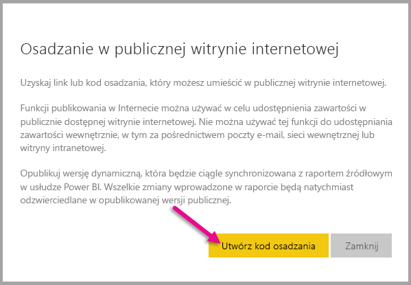
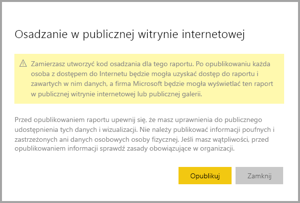
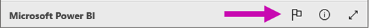

# Funkcja Publikuj w sieci Web w usłudze Power BI

Funkcja **Publikuj w sieci Web** w usłudze Power BI umożliwia łatwe osadzanie interakcyjnych wizualizacji usługi Power BI online, na przykład we wpisach w blogu, w witrynach internetowych, wiadomościach e-mail lub mediach społecznościowych, przy użyciu dowolnego urządzenia.

Opublikowane wizualizacje można także łatwo edytować, aktualizować i odświeżać oraz zatrzymywać ich udostępnianie.

> [!WARNING]
> W przypadku użycia funkcji **Publikuj w sieci Web** opublikowane raporty i wizualizacje mogą być wyświetlane przez dowolną osobę w Internecie. Podczas wyświetlania tych raportów nie jest stosowane uwierzytelnianie. Należy używać funkcji Publikuj w sieci Web wyłącznie w przypadku raportów i danych, które powinny być dostępne publicznie w Internecie (dla nieuwierzytelnionych osób). Dotyczy to także danych szczegółowych zagregowanych w raportach. Przed opublikowaniem raportu upewnij się, że masz uprawnienia do publicznego udostępnienia tych danych i wizualizacji. Nie należy publikować informacji poufnych i zastrzeżonych. Jeśli masz wątpliwości, przed opublikowaniem informacji sprawdź zasady obowiązujące w organizacji.

## Jak używać funkcji Publikuj w sieci Web

Polecenie **Publikuj w sieci Web** jest dostępne w raportach znajdujących się w Twoich osobistych lub grupowych obszarach roboczych, w których masz uprawnienia do edytowania.  Nie możesz używać funkcji Publikuj w sieci Web w przypadku raportów, które zostały Ci udostępnione lub w których dane są zabezpieczone na poziomie wiersza. W sekcji **Ograniczenia** poniżej znajduje się pełna lista przypadków, w których funkcja Publikuj w sieci Web nie jest obsługiwana. Przed użyciem funkcji Publikuj w sieci Web zapoznaj się z **ostrzeżeniem** we wcześniejszej części tego artykułu.

Aby zobaczyć, jak działa ta funkcja, zobacz to *krótkie wideo*. Następnie skorzystaj z poniższych instrukcji, aby wypróbować ją samodzielnie.

<iframe width="560" height="315" src="https://www.youtube.com/embed/UF9QtqE7s4Y" frameborder="0" allowfullscreen></iframe>

Poniżej opisano, jak używać funkcji **Publikuj w sieci Web**.

1. W raporcie w obszarze roboczym, w którym masz uprawnienia do edytowania, wybierz pozycję **Plik > Publikuj w sieci Web**.
   
   

2. Zapoznaj się z zawartością okna dialogowego, a następnie wybierz polecenie **Utwórz kod osadzania**, jak pokazano w oknie dialogowym poniżej.
   
   

3. Zapoznaj się z ostrzeżeniem widocznym w oknie dialogowym poniżej i potwierdź, że dane mogą zostać osadzone w publicznej witrynie internetowej. Jeśli tak jest, wybierz polecenie **Publikuj**.
   
   

4. Zostanie wyświetlone okno dialogowe z linkiem, który można wysłać w wiadomości e-mail, osadzić przy użyciu kodu (na przykład w elemencie iFrame) lub wkleić bezpośrednio na stronie internetowej lub w blogu.
   
   

5. Jeśli wcześniej utworzono kod osadzania dla tego raportu, zostanie on szybko wyświetlony. Można utworzyć tylko jeden kod osadzania dla jednego raportu.
   
   

## Porady i wskazówki dotyczące trybów wyświetlania

Podczas osadzania zawartości we wpisie w blogu zazwyczaj konieczne jest dopasowanie jej do określonego rozmiaru ekranu.  Możesz dostosować wysokość i szerokość w tagu elementu iFrame stosownie do potrzeb, ale może być również konieczne zapewnienie dopasowania raportu do określonego obszaru elementu iFrame — dlatego należy także wybrać odpowiedni tryb wyświetlania podczas edycji raportu.

Poniższa tabela zawiera informacje dotyczące trybów wyświetlania oraz wyglądu zawartości po osadzeniu.

| Tryb wyświetlania | Wygląd po osadzeniu |
| --- | --- |
|  |Tryb **Dopasuj do strony** zachowuje wysokość i szerokość strony raportu. Jeśli ustawisz na stronie proporcje „Dynamiczne”, na przykład 16:9 lub 4:3, zawartość będzie skalowana w celu dopasowania do elementu iFrame. W przypadku osadzenia w elemencie iFrame wybranie opcji **Dopasuj do strony** może wywołać efekt **„letterbox”**, czyli wyświetlenie szarego tła w części elementu iFrame po przeskalowaniu zawartości do rozmiaru elementu iFrame. Aby zminimalizować obszar szarego tła, ustaw odpowiednią wysokość i szerokość elementu iFrame. |
|  |Tryb **Rzeczywisty rozmiar** zapewnia zachowanie ustawionego rozmiaru strony raportu. To może spowodować wyświetlenie pasków przewijania w elemencie iFrame. Aby uniknąć wyświetlania pasków przewijania, ustaw odpowiednią wysokość i szerokość elementu iFrame. |
|  |Tryb **Dopasuj do szerokości** zapewnia dopasowanie zawartości do poziomego wymiaru elementu iFrame. Obramowanie będzie wyświetlane, ale zawartość będzie skalowana w celu wykorzystania całej dostępnej przestrzeni w poziomie. |

## Porady i wskazówki dotyczące wysokości i szerokości elementu iFrame

Kod osadzania otrzymany po użyciu polecenia Publikuj w sieci Web będzie wyglądał następująco:

Możesz ręcznie edytować szerokość i wysokość, aby dokładnie dopasować element do strony, na której chcesz go osadzić.

Aby uzyskać dokładniejsze dopasowanie, możesz spróbować dodać 56 pikseli do wysokości elementu iFrame. Odpowiada to bieżącemu rozmiarowi paska dolnego. Poniższa tabela zawiera przykładowe rozmiary, których można użyć w celu dopasowania zawartości do elementu bez wyświetlania szarego tła, jeśli na stronie raportu użyto dynamicznego ustawienia rozmiaru.

| Proporcje | Rozmiar | Wymiary (szerokość x wysokość) |
| --- | --- | --- |
| 16:9 |Mały |640 x 416 px |
| 16:9 |Średni |800 x 506 px |
| 16:9 |Duży |960 x 596 px |
| 4:3 |Mały |640 x 536 px |
| 4:3 |Średni |800 x 656 px |
| 4:3 |Duży |960 x 776 px |

## Zarządzanie kodami osadzania

Po utworzeniu kodu osadzania przy użyciu funkcji **Publikuj w sieci Web** możesz zarządzać utworzonymi kodami za pomocą menu **Ustawienia** w usłudze Power BI. W ramach zarządzania kodami osadzania można usuwać docelowe wizualizacje lub raporty z kodu (co uniemożliwia używanie kodu osadzania) lub ponownie uzyskać kod osadzania.

1. Aby zarządzać kodami osadzania funkcji **Publikuj w sieci Web**, wybierz ikonę koła zębatego **Ustawienia**, a następnie polecenie **Zarządzaj kodami osadzania**.
   
   

2. Zostanie wyświetlona lista utworzonych kodów osadzania, jak pokazano na poniższej ilustracji.
   
   

3. W przypadku każdego kodu osadzania funkcji **Publikuj w sieci Web** na liście można pobrać kod osadzania lub usunąć go, co uniemożliwi korzystanie z linków do danego raportu lub danej wizualizacji.
   
   

4. W przypadku wybrania polecenia **Usuń** zostanie wyświetlone pytanie, czy na pewno chcesz usunąć kod osadzania.
   
   

## Aktualizowanie raportów i odświeżanie danych

Po utworzeniu i udostępnieniu kodu osadzania przy użyciu funkcji **Publikuj w sieci Web** raport będzie aktualizowany w celu uwzględnienia wszelkich wprowadzonych zmian. Należy jednak pamiętać, że może upłynąć trochę czasu, zanim zmiany będą widoczne dla użytkowników. W przypadku kodów osadzania funkcji Publikuj w sieci Web aktualizacje raportów i wizualizacji są zazwyczaj odzwierciedlane w ciągu godziny.

Przy pierwszym użyciu funkcji **Publikuj w sieci web** w celu uzyskania kodu osadzania link jest aktywny od razu, a każdy, kto otworzy ten link, może wyświetlić docelową zawartość.  Po tym pierwszym opublikowaniu kolejne aktualizacje raportów i wizualizacji, do których prowadzi link funkcji Publikuj w sieci Web, mogą być widoczne dla użytkowników po upływie około godziny.

Aby uzyskać więcej informacji, zobacz sekcję **Jak to działa** w dalszej części tego artykułu. Jeśli chcesz, aby aktualizacje były widoczne natychmiast, możesz usunąć kod osadzania i utworzyć nowy.

## Odświeżanie danych

Odświeżanie danych jest odzwierciedlane automatycznie w osadzonych raportach i wizualizacjach. Odświeżone dane mogą być widoczne w zawartości osadzonej przy użyciu kodu po upływie około 1 godziny. Możesz wyłączyć automatyczne odświeżanie, wybierając pozycję **nie odświeżaj** w harmonogramie zbioru danych używanego w raporcie.  

## Wizualizacje niestandardowe

Funkcja **Publikuj w sieci Web** obsługuje niestandardowe wizualizacje. W przypadku użycia funkcji Publikuj w sieci Web użytkownicy, którym udostępnisz opublikowaną wizualizację, będą mogli wyświetlić raport bez konieczności włączania niestandardowych wizualizacji.

## Ograniczenia

Funkcja **Publikuj w sieci Web** jest obsługiwana w przypadku większości źródeł danych i raportów w usłudze Power BI, jednak następujące rodzaje zawartości nie współdziałają obecnie z funkcją Publikuj w sieci Web:

1. Raporty, w których zastosowano zabezpieczenia na poziomie wiersza.
2. Raporty używają dowolnego źródła danych z połączeniem na żywo, w tym tabelarycznych usług Analysis Services hostowanych lokalnie oraz usług Analysis Service Multidimensional, Azure Analysis Services i Power BI.
3. Raporty udostępnione Ci bezpośrednio lub za pośrednictwem organizacyjnego pakietu zawartości.
4. Raporty w grupie, w której nie jesteś członkiem uprawnionym do edytowania.
5. Wizualizacje języka R nie są obecnie obsługiwane w raportach publikowanych przy użyciu funkcji Publikuj w sieci Web.

## Ustawienia dzierżawy

Administratorzy usługi Power BI mogą włączyć lub wyłączyć funkcję publikowania w Internecie. Mogą również ograniczać dostęp do określonych grup. Możliwość tworzenia kodu osadzania zmienia się zależnie od tego ustawienia.

|Promowanie |Włączone dla całej organizacji |Wyłączone dla całej organizacji |Określone grupy zabezpieczeń   |
|---------|---------|---------|---------|
|Opcja **Publikuj w sieci Web** w menu **Plik** raportu.|Włączone dla wszystkich|Niewidoczne dla wszystkich|Widoczne tylko dla autoryzowanych użytkowników lub grup.|
|Opcja **Zarządzaj kodami osadzania** w obszarze **Ustawienia**|Włączone dla wszystkich|Włączone dla wszystkich|Włączone dla wszystkich  Opcja * **Usuń** tylko dla autoryzowanych użytkowników lub grup. Opcja * **Uzyskaj kody** włączona dla wszystkich.|
|**Kody osadzania** w portalu administracyjnym|Stan będzie odzwierciedlać jedną z następujących sytuacji: * Aktywne * Nieobsługiwane * Zablokowane|Będzie wyświetlany stan **Wyłączone**|Stan będzie odzwierciedlać jedną z następujących sytuacji: * Aktywne * Nieobsługiwane * Zablokowane  Jeśli zgodnie z ustawieniami dzierżawy użytkownik nie ma autoryzacji, będzie wyświetlany stan **Naruszenie**.|
|Istniejące opublikowane raporty|Wszystko włączone|Wszystko wyłączone|Raporty w dalszym ciągu są renderowane dla wszystkich.|

## Informacje na temat kolumny stanu kodu osadzania

Na stronie **Zarządzanie kodami osadzania** zawierającej kody osadzania utworzone przy użyciu funkcji **Publikuj w sieci Web** jest wyświetlana kolumna Stan. Kody osadzania są domyślnie aktywne, ale mogą występować dowolne z poniższych stanów.

| Stan | Opis |
| --- | --- |
| **Aktywny** |Raport jest dostępny do wyświetlania i interakcji dla użytkowników w Internecie. |
| **Zablokowany** |Zawartość raportu narusza [warunki użytkowania usługi Power BI](https://powerbi.microsoft.com/terms-of-service). Został on zablokowany przez firmę Microsoft. Jeśli uważasz, że zawartość została zablokowana w wyniku błędu, skontaktuj się z pomocą techniczną. |
| **Nieobsługiwany** |W zbiorze danych raportu zastosowano zabezpieczenia na poziomie wiersza lub inną nieobsługiwaną konfigurację. Pełną listę znajdziesz w sekcji **Ograniczenia**. |
| **Naruszenie** |Kod osadzania znajduje się poza zdefiniowanymi zasadami dzierżawy. Dzieje się tak zazwyczaj, gdy kod osadzania został utworzony, a następnie ustawienie publikowania w Internecie dzierżawy zostało zmienione w celu wykluczenia użytkownika, który jest właścicielem kodu osadzania. Jeśli ustawienie dzierżawy zostało wyłączone lub użytkownik nie może tworzyć kodu osadzania, istniejące kody osadzania będą miały stan **Naruszenie**. |

## Jak zgłosić zastrzeżenia związane z zawartością opublikowaną przy użyciu funkcji Publikuj w sieci Web

Aby zgłosić zastrzeżenia związane z zawartością opublikowaną przy użyciu funkcji **Publikuj w sieci Web** osadzoną w witrynie internetowej lub w blogu, użyj ikony **flagi** na pasku dolnym, jak pokazano na poniższej ilustracji. Zostanie wyświetlona prośba o wysłanie wiadomości e-mail z opisem problemu do firmy Microsoft. Firma Microsoft przeanalizuje zawartość pod kątem zgodności z warunkami użytkowania usługi Power BI i podejmie odpowiednie działania.

Aby zgłosić zastrzeżenia, wybierz ikonę **flagi** na pasku dolnym wyświetlonego raportu opublikowanego przy użyciu funkcji Publikuj w sieci Web.

## Licencjonowanie i ceny

Aby móc korzystać z funkcji **Publikuj w sieci Web**, musisz być użytkownikiem usługi Microsoft Power BI. Użytkownicy raportu (czytelnicy, osoby wyświetlające) nie muszą być użytkownikami usługi Power BI.

## Jak to działa (szczegóły techniczne)

Po utworzeniu kodu osadzania przy użyciu funkcji **Publikuj w sieci Web** raport będzie widoczny dla użytkowników w Internecie. Będzie dostępny publicznie, więc użytkownicy będą mogli w przyszłości łatwo udostępniać go za pośrednictwem mediów społecznościowych. Gdy użytkownicy wyświetlają raport, przechodząc bezpośrednio do publicznego adresu URL lub wyświetlając stronę internetową lub blog, gdzie osadzono raport, usługa Power BI zapisuje w pamięci podręcznej definicję raportu oraz wyniki zapytań wymaganych do wyświetlenia raportu. Dzięki temu raport może być wyświetlany przez tysiące użytkowników jednocześnie bez zmniejszenia wydajności.  

Pamięć podręczna jest przechowywana przez długi czas, dlatego w przypadku zaktualizowania definicji raportu (na przykład zmiany trybu wyświetlania) lub odświeżenia danych w raporcie może upłynąć około godziny, zanim zmiany zostaną odzwierciedlone w wersji raportu widocznej dla użytkowników. Dlatego zalecane jest wcześniejsze przygotowanie pracy i utworzenie kodu osadzania przy użyciu funkcji **Publikuj w sieci Web** dopiero wówczas, gdy wszystkie ustawienia będą zadowalające.

Masz więcej pytań? [Odwiedź społeczność usługi Power BI](http://community.powerbi.com/)