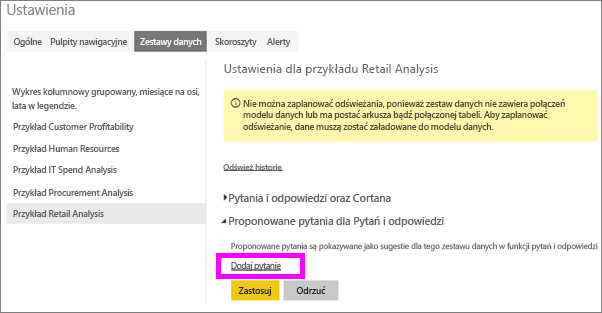
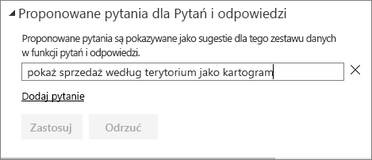
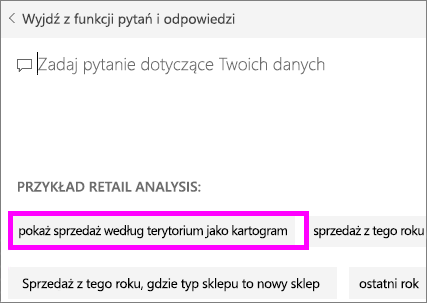
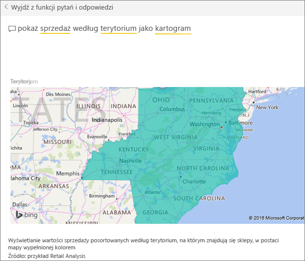

# Tworzenie proponowanych pytań dla funkcji pytań i odpowiedzi w usłudze Power BI
Jeśli jesteś właścicielem zestawu danych, możesz dodać własne proponowane pytania do tego zestawu danych.  Funkcja Pytania i odpowiedzi w usłudze Power BI wyświetli te pytania współpracownikom używającym Twojego zestawu danych (*korzystającym z niego*).  Proponowane pytania dostarczają współpracownikom pomysłów dotyczących typów pytań, jakie mogą zadać na temat zestawu danych. Proponowane pytania, jakie dodasz, zależą od Ciebie — dodaj często zadawane pytania lub takie, na które można udzielić ciekawej odpowiedzi, albo pytania, które ciężko sformułować.

Obejrzyj klip wideo, w którym Will dodaje proponowane pytania do funkcji pytań i odpowiedzi w usłudze Power BI, a następnie używa ich do eksplorowania jego zestawu danych. Następnie postępuj zgodnie ze szczegółowymi instrukcjami poniżej wideo, aby wypróbować to samodzielnie.

<iframe width="560" height="315" src="https://www.youtube.com/embed/E1mIAyEXuF4" frameborder="0" allowfullscreen></iframe>

> [!NOTE]
> Proponowanych pytań w funkcji Pytania i odpowiedzi można używać w [aplikacji Microsoft Power BI dla systemu iOS na urządzeniach iPad, iPhone i iPod Touch](mobile-apps-ios-qna.md), a także w wersji zapoznawczej funkcji Pytania i odpowiedzi w programie Power BI Desktop. Natomiast tworzenie pytań jest możliwe tylko w usłudze Power BI (app.powerbi.com).
> 

W tym artykule wykorzystano [przykład Retail Analysis Sales](sample-datasets.md).

1. Na pulpicie nawigacyjnym wybierz pole pytania funkcji Pytania i odpowiedzi.   Zwróć uwagę, że funkcja pytań i odpowiedzi pomaga przez wyświetlanie listy warunków, które pojawiają się w zestawie danych.
2. Aby dodać pytanie do tej listy, wybierz ikonę koła zębatego w prawym górnym rogu usługi Power BI.  
   
3. Wybierz kolejno pozycje **Ustawienia** &gt; **Zestawy danych** &gt; **Przykład Retail Analysis** &gt; **Proponowane pytania funkcji pytań i odpowiedzi**.  
4. Wybierz pozycję **Dodaj pytanie**.
   
   
5. W polu tekstowym wpisz pytanie i wybierz pozycję **Zastosuj**.   Opcjonalnie możesz dodać następne pytanie, wybierając pozycję **Dodaj pytanie**.  
   
6. Przejdź z powrotem do pulpitu nawigacyjnego usługi Power BI dla przykładu Retail Analysis i umieść kursor w polu pytania funkcji pytań i odpowiedzi.   
   
7. Nowe proponowane pytanie, **Sales by territory as a map** (Sprzedaż według terytorium jako mapa), jest pierwsze na liście. Wybierz je.  
8. Odpowiedź zostanie wyświetlona jako wizualizacja kartogramu.  
   

### Następne kroki
[Pytania i odpowiedzi w usłudze Power BI](power-bi-q-and-a.md)  
[Samouczek: wprowadzenie do funkcji pytań i odpowiedzi w usłudze Power BI](power-bi-visualization-introduction-to-q-and-a.md)  
[Power BI — podstawowe pojęcia](service-basic-concepts.md)  
Masz więcej pytań? [Odwiedź społeczność usługi Power BI](http://community.powerbi.com/)

