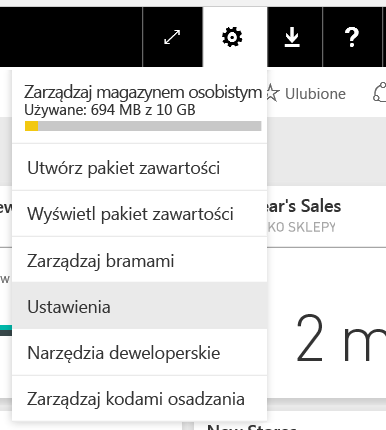
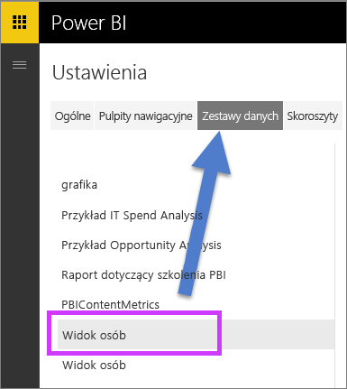
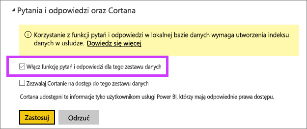

# Włączanie funkcji pytań i odpowiedzi dla połączeń na żywo
## Co to jest lokalna brama danych?  Co to jest połączenie na żywo?
Zestawy danych w usłudze Power BI można zaimportować do usługi Power BI lub utworzyć do nich połączenie na żywo. Zestawy danych korzystające z połączenia na żywo są często określane jako „lokalne”. Połączeniami na żywo zarządza się przy użyciu [bramy](service-gateway-onprem.md), a dane i zapytania są wysyłane w obie strony za pomocą zapytań na żywo.

## Funkcja pytań i odpowiedzi dla zestawów danych lokalnej bramy danych
Jeśli chcesz używać funkcji pytań i odpowiedzi w połączeniu z zestawami danych dostępnymi za pośrednictwem bramy, należy je najpierw włączyć.

Po włączeniu usługa Power BI utworzy indeks źródła danych i przekaże podzbiór danych do usługi Power BI, aby umożliwić zadawanie pytań. Utworzenie początkowego indeksu może potrwać kilka minut, a usługa Power BI będzie automatycznie obsługiwać i aktualizować indeks w przypadku zmian danych. Funkcja pytań i odpowiedzi działa z tymi zestawami danych w taki sam sposób jak z danymi opublikowanymi do usługi Power BI. Pełny zestaw funkcji dostępnych w środowisku pytań i odpowiedzi jest obsługiwany w obu przypadkach, w tym przy korzystaniu ze źródła danych za pomocą Cortany.

W miarę zadawania pytań w usłudze Power BI funkcja pytań i odpowiedzi określa najlepszą wizualizację do utworzenia lub arkusz raportu do użycia w odpowiedzi na pytanie, korzystając z indeksu zestawu danych. Po określeniu najlepszej potencjalnej odpowiedzi funkcja pytań i odpowiedzi używa zapytania bezpośredniego do pobrania danych na żywo ze źródła danych za pośrednictwem bramy, aby wypełnić wykresy i grafy. Dzięki temu funkcja pytań i odpowiedzi usługi Power BI zawsze pokazuje aktualne dane bezpośrednio z bazowego źródła danych.

Ponieważ funkcja pytań i odpowiedzi usługi Power BI używa wartości tekstowych i schematu ze źródła danych w celu określenia sposobu odpytywania bazowego modelu pod kątem odpowiedzi, wyszukiwanie konkretnych nowych lub usuniętych wartości tekstowych (takie jak pytanie o nazwisko klienta dotyczące nowo dodanego rekordu tekstowego) polega na obecności aktualnych wartości w indeksie. Usługa Power BI automatycznie aktualizuje indeks tekstowy i schematu za pomocą zmian wprowadzonych w ciągu 60-minutowego okna.

Aby uzyskać więcej informacji, zobacz:

* Co to jest [lokalna brama danych](service-gateway-onprem.md)?
* [Wprowadzenie do funkcji pytań i odpowiedzi w usłudze Power BI](power-bi-q-and-a.md)

## Włączanie funkcji pytań i odpowiedzi
Po skonfigurowaniu bramy danych nawiąż połączenie z danymi w usłudze Power BI.  Utwórz pulpit nawigacyjny za pomocą danych lokalnych lub przekaż plik pbix, który używa danych lokalnych.  Dane lokalne możesz także już mieć w pulpitach nawigacyjnych, raportach i zestawach danych, które zostały Tobie udostępnione.

1. W prawym górnym rogu ekranu usługi Power BI wybierz ikonę koła zębatego , a następnie pozycję **Ustawienia**.
   
   
2. Wybierz pozycję **Zestawy danych**, a następnie zestaw danych do włączenia na potrzeby funkcji pytań i odpowiedzi.
   
   
3. Rozwiń węzeł **Pytania i odpowiedzi oraz Cortana**, zaznacz pole wyboru **Włącz funkcję pytań i odpowiedzi dla tego zestawu danych** i wybierz polecenie **Zastosuj**.
   
    

## Jakie dane są buforowane i jak jest chroniona prywatność?
Po włączeniu funkcji pytań i odpowiedzi dla danych lokalnych podzbiór danych jest buforowany w usłudze. W ten sposób zapewnia się odpowiednią wydajność funkcji pytań i odpowiedzi. Usługa Power BI wyklucza z buforowania wartości dłuższe niż 24 znaki. Pamięć podręczna zostanie usunięta w kilka godzin po usunięciu zestawu danych lub wyłączeniu funkcji pytań i odpowiedzi przez usunięcie zaznaczenia pola wyboru **Włącz funkcję pytań i odpowiedzi dla tego zestawu danych**.

## Zagadnienia i rozwiązywanie problemów
Wersja zapoznawcza tej funkcji ma kilka ograniczeń:

* Początkowo funkcja jest dostępna tylko dla tabelarycznych źródeł danych usług SQL Server 2016 Analysis Services. Funkcja jest zoptymalizowana pod kątem pracy z danymi tabelarycznymi. Część funkcjonalności jest dostępna dla źródeł danych wielowymiarowych, lecz wielowymiarowość nie jest jeszcze w pełni obsługiwana przez funkcję pytań i odpowiedzi. W przyszłości będą wprowadzane dodatkowe źródła danych obsługiwane przez lokalną bramę danych.
* Pełna obsługa zabezpieczeń na poziomie wiersza zdefiniowanych w usługach SQL Server Analysis Services nie jest początkowo dostępna w publicznej wersji zapoznawczej. W ramach zadawania pytań za pomocą funkcji pytań i odpowiedzi, autouzupełnianie może podczas wpisywania pokazywać ciągi, do których użytkownik nie ma dostępu. Jednak zabezpieczenia na poziomie wiersza zdefiniowane w modelu są uwzględniane w przypadku raportów i wizualizacji wykresów, dzięki czemu bazowe dane liczbowe nie są ujawniane. Opcje kontrolowania tego zachowania zostaną wydane w nadchodzących aktualizacjach.
* Zabezpieczenia na poziomie obiektu nie są obsługiwane. Funkcja pytań i odpowiedzi nie uwzględnia zabezpieczeń na poziomie obiektu i może ujawnić nazwy tabel lub kolumn użytkownikom, którzy nie mają do nich dostępu. Aby upewnić się, że również wartości danych są odpowiednio zabezpieczone, należy włączyć zabezpieczenia na poziomie wiersza. 
* Połączenia na żywo są obsługiwane tylko dla lokalnej bramy danych. W związku z tym nie można ich użyć dla bramy osobistej.

## Następne kroki
[Lokalna brama danych](service-gateway-onprem.md)  
[Zarządzanie źródłem danych — Analysis Services](service-gateway-enterprise-manage-ssas.md)  
[Power BI — podstawowe pojęcia](service-basic-concepts.md)  
[Omówienie funkcji Pytania i odpowiedzi usługi Power BI](power-bi-q-and-a.md)  

Masz więcej pytań? [Zadaj pytanie społeczności usługi Power BI](http://community.powerbi.com/)

