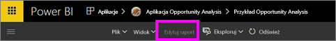
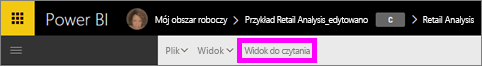

# Widok do czytania i widok do edycji w raportach usługi Power BI
W usłudze Power BI (nie w programie Power BI Desktop) są dostępne dwa tryby wyświetlania raportów i korzystania z nich: widok do czytania i widok do edycji.  

Widok do czytania jest dostępny dla wszystkich użytkowników, natomiast widok do edycji jest dostępny tylko dla twórców i właścicieli raportu. Widok do czytania jest przeznaczony dla *konsumentów* raportu, czyli współpracowników, którzy otwierają raporty z aplikacji lub którym udostępniono raporty. Widok do czytania gwarantuje, że każdy konsument konkretnego raportu widzi ten sam raport i te same wizualizacje z zastosowaniem tych samych filtrów.  Konsumenci mogą korzystać z raportów, ale nie mogą zapisywać zmian.

>**UWAGA** W pewnych okolicznościach konsumenci raportu mogą widzieć różne dane z powodu zabezpieczeń na poziomie wiersza i uprawnień dotyczących danych. 

Widok do edycji jest dostępny tylko dla tych osób, które utworzyły raport lub są jego współwłaścicielami jako członkowie lub administratorzy obszaru roboczego aplikacji.

## Widok do czytania

Widok do czytania to przyjemny i bezpieczny sposób korzystania z danych i poznawania ich. Widok do czytania nie jest tak interaktywny, jak [Widok do edycji](service-interact-with-a-report-in-editing-view.md), ale nadal udostępnia wiele opcji eksplorowania danych. Ujawnia on swoją przydatność na przykład podczas przeglądania [udostępnionych Ci](service-share-dashboards.md) raportów, które mogą być otwierane tylko w widoku do czytania.

Aby dowiedzieć się więcej, zobacz [Widok do czytania dla raportów usługi Power BI](service-interact-with-a-report-in-reading-view.md).

## Widok do edycji
Widok do edycji w usłudze Power BI (w porównaniu do [widoku do czytania](service-interact-with-a-report-in-reading-view.md)) pozwala jeszcze bardziej zagłębić się w dane poprzez dodawanie i usuwanie pól, zmianę typu wizualizacji, tworzenie nowych wizualizacji, a także dodawanie oraz usuwanie wizualizacji i stron w raporcie.

Aby dowiedzieć się więcej, zobacz [Widok do edycji dla raportów usługi Power BI](service-interact-with-a-report-in-editing-view.md).

## Przechodzenie między widokiem do edycji i widokiem do czytania
Pamiętaj, że tylko twórcy i właściciele raportu będą mogli otworzyć raport w widoku do edycji.

1. Domyślnie raport jest zwykle najpierw otwierany w widoku do czytania. Można stwierdzić, że jest się w widoku do czytania, jeśli jest widoczna opcja **Edytuj raport**. Jeśli opcja **Edytuj raport** jest wyszarzona, nie masz uprawnień do otwierania raportu w widoku do edycji.

   

2. Jeśli opcja **Edytuj raport** nie jest wyszarzona, wybierz ją, aby otworzyć raport w widoku do edycji. 
   
   
   
   Raport jest teraz w widoku do edycji i używa tych samych [ustawień wyświetlania](power-bi-report-display-settings.md), co ostatnio w widoku do czytania.

2. Aby powrócić do widoku do czytania, wybierz pozycję **Widok do czytania** na górnym pasku nawigacyjnym.
   
    

Istnieje wiele sposobów na korzystanie z raportu w widoku do czytania, dzielenie i grupowanie danych w celu uzyskania szczegółowych informacji i odpowiedzi na pytania.  Następny temat, [Interakcje z raportem w widoku do czytania](service-interact-with-a-report-in-editing-view.md), wymienia te metody i szczegółowo je opisuje.

### Następne kroki
[Interakcje z raportem w widoku do czytania](service-interact-with-a-report-in-editing-view.md)    
Wróć do [raportów w usłudze Power BI](service-reports.md)    
Masz więcej pytań? [Odwiedź społeczność usługi Power BI](http://community.powerbi.com/) 

