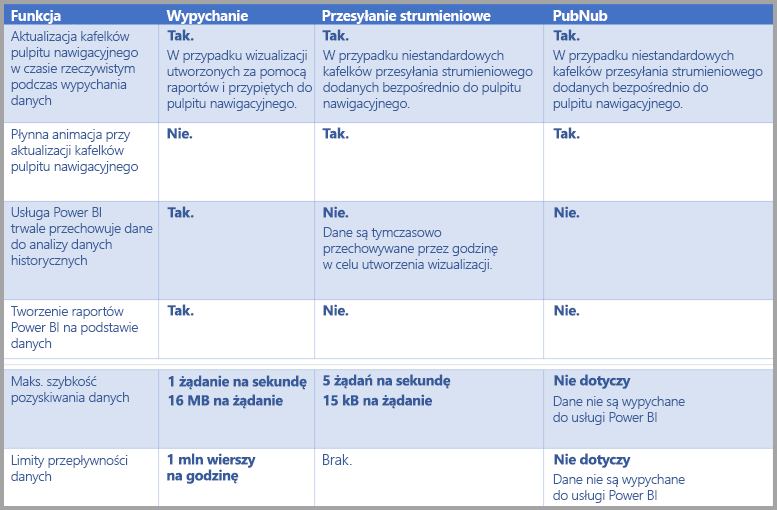

# Przesyłanie strumieniowe w czasie rzeczywistym w usłudze Power BI
Funkcja przesyłania strumieniowego w czasie rzeczywistym w usłudze Power BI umożliwia przesyłanie strumieniowe danych i aktualizowanie pulpitów nawigacyjnych w czasie rzeczywistym. Wszystkie wizualizacje i pulpity nawigacyjne tworzone w usłudze Power BI można również skonfigurować do wyświetlania i aktualizowania danych oraz wizualizacji w czasie rzeczywistym. Urządzeniami i źródłami danych przesyłania strumieniowego mogą być czujniki fabryczne, źródła mediów społecznościowych, dane użycia usług i wszelkie inne źródła, z których można zbierać lub przesyłać dane zależne od czasu.

W tym artykule przedstawiono sposób konfigurowania zestawu danych przesyłania strumieniowego w czasie rzeczywistym przy użyciu usługi Power BI. Najpierw jednak zostaną omówione rodzaje zestawów danych czasu rzeczywistego przeznaczone do wyświetlania na kafelkach (i pulpitach nawigacyjnych) oraz czym te zestawy danych się od siebie różnią.

## Typy zestawów danych czasu rzeczywistego
Istnieją trzy typy zestawów danych czasu rzeczywistego, które mogą być wyświetlane na pulpicie nawigacyjnym w czasie rzeczywistym:

* Zestaw danych wypychania
* Zestaw danych przesyłania strumieniowego
* Zestaw danych przesyłania strumieniowego PubNub

W tej sekcji omówimy, czym różnią się od siebie poszczególne zestawy danych, a następnie przedstawimy sposoby przesyłania do nich danych.

### Zestaw danych wypychania
W przypadku **zestawu danych wypychania** dane są przesyłane do usługi Power BI. Po utworzeniu zestawu danych usługa Power BI automatycznie tworzy nową bazę danych w usłudze w celu przechowywania danych. Ponieważ przychodzące dane są przechowywane w źródłowej bazie danych, raporty mogą być tworzone w oparciu o dane. Te raporty i ich wizualizacje przypominają dowolne inne wizualizacje raportów, co oznacza, że podczas tworzenia wizualizacji można korzystać ze wszystkich funkcji tworzenia raportów w usłudze Power BI, w tym niestandardowych wizualizacji, alertów danych, przypiętych kafelków pulpitu nawigacyjnego i wiele innych.

Gdy raport jest tworzony przy użyciu zestawu danych wypychania, wszystkie jego wizualizacje można przypiąć do pulpitu nawigacyjnego. Na tym pulpicie nawigacyjnym wizualizacje są aktualizowane w czasie rzeczywistym zawsze w momencie aktualizowania danych. W ramach usługi pulpit nawigacyjny uruchamia odświeżanie kafelków za każdym razem, gdy odbierane są nowe dane.

W przypadku przypiętych kafelków zestawu danych wypychania należy zwrócić uwagę na dwie kwestie:

* Przypięcie całego raportu przy użyciu opcji *Przypnij stronę dynamiczną* **nie** spowoduje automatycznej aktualizacji danych.
* Po przypięciu wizualizacji do pulpitu nawigacyjnego można użyć aparatu **Pytania i odpowiedzi**, aby zadawać pytania dotyczące zestawu danych wypychania w języku naturalnym. Po wprowadzeniu zapytania do aparatu **Pytania i odpowiedzi** otrzymaną wizualizację można z powrotem przypiąć do pulpitu nawigacyjnego. Pulpit nawigacyjny *również* zostanie zaktualizowany w czasie rzeczywistym.

### Zestaw danych przesyłania strumieniowego
Dane w **zestawie danych przesyłania strumieniowego** są również wypychane do usługi Power BI, z jedną istotną różnicą: usługa Power BI przechowuje dane wyłącznie w tymczasowej pamięci podręcznej, która szybko wygasa. Tymczasowa pamięć podręczna służy wyłącznie do wyświetlania wizualizacji, które stanowią przejściowy element historii, takich jak wykres liniowy z jednogodzinnym przedziałem czasu.

Zestaw danych **przesyłania strumieniowego** *nie* korzysta ze źródłowej bazy danych, *nie można* więc utworzyć wizualizacji raportów przy użyciu danych przesyłanych ze strumienia. W związku z tym nie można korzystać z funkcji raportów, takich jak filtrowanie czy niestandardowe wizualizacje.

Jedynym sposobem wizualizacji zestawu danych przesyłania strumieniowego jest dodanie kafelka i użycie zestawu danych przesyłania strumieniowego jako źródła danych **niestandardowych danych przesyłanych strumieniowo**. Niestandardowe kafelki przesyłania strumieniowego, które są oparte na **zestawie danych przesyłania strumieniowego** są zoptymalizowane pod kątem szybkiego wyświetlania danych w czasie rzeczywistym. Między wprowadzeniem danych do usługi Power BI a aktualizacją wizualizacji jest bardzo niewielkie opóźnienie. Wynika to z tego, że nie ma potrzeby wprowadzania danych do bazy danych ani ich odczytu z bazy danych.

W praktyce zestawy danych przesyłania strumieniowego i towarzyszące im wizualizacje przesyłane strumieniowo najlepiej sprawdzają się w sytuacjach, w których konieczne jest zminimalizowanie opóźnienia między przesyłaniem danych a ich wizualizacją. Ponadto najlepszym rozwiązaniem jest przesyłanie danych w formacie, który umożliwia ich bezpośrednią wizualizację, bez konieczności przeprowadzania dodatkowych agregacji. Przykładami takich danych nie wymagających wprowadzania zmian są temperatury i wstępnie obliczone wartości średnie.

### Zestaw danych przesyłania strumieniowego PubNub
W przypadku zestawu danych przesyłania strumieniowego **PubNub** klient internetowy usługi Power BI korzysta z zestawu PubNub SDK w celu odczytywania istniejącego strumienia danych PubNub. Należy pamiętać, że żadne dane nie są przechowywane w usłudze Power BI.

Podobnie jak w przypadku **zestawu danych przesyłania strumieniowego**, tak i **zestawu danych przesyłania strumieniowego PubNub** usługa Power BI nie korzysta ze źródłowej bazy danych. Nie można więc tworzyć wizualizacji raportów na podstawie danych przychodzących, nie jest również możliwe korzystanie z takich funkcji raportu, jak filtrowanie, niestandardowe wizualizacje itd. W związku z tym **zestaw danych przesyłania strumieniowego PubNub** może być wizualizowany tylko przez dodanie kafelka do pulpitu nawigacyjnego i skonfigurowanie strumienia danych PubNub jako źródła.

Kafelki oparte na **zestawie danych przesyłania strumieniowego PubNub** są zoptymalizowane pod kątem szybkiego wyświetlania danych czasu rzeczywistego. Ponieważ usługa Power BI jest bezpośrednio połączona ze strumieniem danych PubNub, opóźnienie pomiędzy wprowadzeniem danych do usługi Power BI a aktualizacją wizualizacji jest bardzo niewielkie.

### Tabela z informacjami na temat zestawu danych przesyłania strumieniowego
Poniższa tabela opisuje trzy typy zestawów danych przeznaczonych do przesyłania strumieniowego w czasie rzeczywistym oraz prezentuje listę możliwości i ograniczeń każdego z nich.

> [!NOTE]
> Zobacz [ten artykuł w witrynie MSDN](https://msdn.microsoft.com/library/dn950053.aspx), aby uzyskać informacje na temat limitów **wypychanych** danych.
> 
> 

## Wypychanie danych do zestawów danych
W poprzedniej sekcji opisano trzy podstawowe typy zestawów danych czasu rzeczywistego, które można wykorzystać do przesyłania strumieniowego w czasie rzeczywistym oraz występujące między nimi różnice. W tej sekcji opisano sposób tworzenia danych i wypychania ich do tych zestawów danych.

Istnieją trzy podstawowe metody wypychania danych do zestawu danych:

* Za pomocą interfejsów API REST usługi Power BI
* Za pomocą interfejsu użytkownika zestawu danych przesyłania strumieniowego
* Za pomocą usługi Azure Stream Analytics

Przyjrzyjmy się każdej z tych metod z osobna.

### Korzystanie z interfejsów API REST usługi Power BI do wypychania danych
**Interfejsy API REST usługi Power BI** mogą służyć do tworzenia i przesyłania danych do zestawów danych **wypychania** i zestawów danych **przesyłania strumieniowego**. Podczas tworzenia zestawu danych za pomocą interfejsów API REST usługi Power BI flaga trybu *defaultMode* określa, czy zestaw danych dotyczy wypychania czy przesyłania strumieniowego. Jeśli flaga trybu *defaultMode* nie jest ustawiona, zestaw danych staje się domyślnie zestawem danych **wypychania**.

Jeśli wartość trybu *defaultMode* jest ustawiona na *pushStreaming*, zestaw danych jest zarówno zestawem danych **wypychania** *, jak i*  **przesyłania strumieniowego**, łącząc w sobie zalety każdego z nich. [Artykuł dotyczący **tworzenia zestawu danych**](https://msdn.microsoft.com/library/mt203562.aspx) za pomocą interfejsu API REST opisuje tworzenie zestawu danych przesyłania strumieniowego i działanie flagi trybu *defaultMode*.

> [!NOTE]
> Używanie zestawów danych, w których flaga trybu *defaultMode* jest ustawiona na wartość *pushStreaming* wiąże się z pewnymi ograniczeniami. Jeśli żądanie przekracza maksymalny rozmiar 15 Kb dla zestawu danych **przesyłania strumieniowego** i jednocześnie nie osiąga limitu 16 MB w przypadku zestawu danych **wypychania**, żądanie zakończy się pomyślnie, a dane zostaną zaktualizowane w zestawie danych wypychanych. Wszelkie kafelki przesyłania strumieniowego tymczasowo przestaną działać.
> 
> 

Po utworzeniu zestawu danych należy użyć interfejsów API REST w celu przesłania danych za pomocą opcji [**dodawania wierszy** w interfejsie API](https://msdn.microsoft.com/library/mt203561.aspx), jak [przedstawiono w tym artykule](https://msdn.microsoft.com/library/mt203561.aspx).

Wszystkie żądania wysyłane do interfejsów API REST są chronione przy użyciu **protokołu OAuth w usłudze Azure AD**.

### Korzystanie z interfejsu użytkownika zestawu danych przesyłania strumieniowego w celu wypychania danych
W usłudze Power BI można utworzyć zestaw danych, wybierając metodę uwzględniającą interfejs **API**, jak pokazano na poniższej ilustracji.

Tworząc nowy zestaw danych przesyłania strumieniowego, można włączyć opcję **Analiza danych historycznych**, jak pokazano poniżej. Jej użycie ma istotne znaczenie.

Gdy opcja **Analiza danych historycznych** jest wyłączona (domyślnie jest zawsze wyłączona), można utworzyć **zestaw danych przesyłania strumieniowego**, jak opisano wcześniej w tym artykule. Gdy opcja **Analiza danych historycznych** jest *włączona*, utworzony zestaw danych staje się zarówno **zestawem danych przesyłania strumieniowego**, jak i **zestawem danych wypychania**. Jest to odpowiednikiem użycia interfejsów API REST usługi Power BI w celu utworzenia zestawu danych z trybem *defaultMode* ustawionym na *pushStreaming*, jak opisano wcześniej w tym artykule.

> [!NOTE]
> W przypadku zestawów danych przesyłania strumieniowego utworzonych za pomocą interfejsu użytkownika usługi Power BI, co opisano w poprzednim akapicie, uwierzytelnianie usługi Azure AD nie jest wymagane. Właściciel takiego zestawu danych otrzymuje adres URL z kluczem wiersza, który uprawnia obiekt żądający do przesyłania danych do zestawu danych bez użycia tokenu elementu nośnego OAuth usługi Azure AD. Metoda korzystająca z usługi Azure AD (AAD) nadal będzie powodować wypychanie danych do zestawu danych.
> 
> 

### Korzystanie z usługi Azure Stream Analytics w celu wypychania danych
Usługę Power BI można dodać w postaci danych wyjściowych w ramach usługi **Azure Stream Analytics** (ASA), a następnie zwizualizować te strumienie danych w usłudze Power BI w czasie rzeczywistym. W tej sekcji opisano szczegóły techniczne dotyczące tego procesu.

Usługa Azure Stream Analytics używa interfejsów API REST usługi Power BI w celu utworzenia jej strumienia danych wyjściowych do usługi Power BI, gdy tryb *defaultMode* jest ustawiony na wartość *pushStreaming* (zobacz wcześniejsze sekcje tego artykułu, aby uzyskać informacje na temat trybu *defaultMode*). Dzięki temu zestaw danych może korzystać zarówno z **wypychania**, jak i **przesyłania strumieniowego**. Podczas tworzenia zestawu danych usługa Azure Stream Analytics ustawia flagę **retentionPolicy* na wartość *basicFIFO*. Takie ustawienie sprawia, że baza danych obsługująca zestaw danych wypychania przechowuje 200 000 wierszy, a po osiągnięciu tego limitu wiersze są usuwane metodą „pierwszy na wejściu — pierwszy na wyjściu” (FIFO, first-in, first-out).

> [!CAUTION]
> Jeśli zapytanie usługi Azure Stream Analytics powoduje bardzo szybkie przesłanie danych wyjściowych do usługi Power BI (na przykład jeden lub dwa razy na sekundę), usługa Azure Stream Analytics rozpocznie przetwarzanie wsadowe tych danych wyjściowych do pojedynczego żądania. Może to przyczynić się do przekroczenia limitu przesyłania strumieniowego przez rozmiar żądania. W takim wypadku renderowanie kafelków przesyłania strumieniowego zakończy się niepowodzeniem, o czym wspomniano w poprzednich sekcjach. Najlepszym rozwiązaniem w takich przypadkach jest spowolnienie tempa przechodzenia danych do usługi Power BI. Na przykład, ustawiając wartość maksymalną w taki sposób, aby przypadała nie na jedną sekundę, ale na ponad 10 sekund.
> 
> 

## Konfigurowanie zestawu danych przesyłania strumieniowego w czasie rzeczywistym w usłudze Power BI
Teraz, gdy omówiliśmy już trzy podstawowe typy zestawów danych przesyłania strumieniowego w czasie rzeczywistym oraz trzy podstawowe sposoby wypychania danych do zestawu danych, przystąpimy do utworzenia zestawu danych przesyłania strumieniowego w czasie rzeczywistym w usłudze Power BI.

Aby rozpocząć przesyłanie strumieniowe w czasie rzeczywistym, należy wybrać jeden z dwóch sposobów używania danych przesyłania strumieniowego przez usługę Power BI:

* **kafelki** z wizualizacjami uzyskanymi z danych przesyłania strumieniowego
* **zestawy danych** utworzone na podstawie danych przesyłania strumieniowego utrwalone w usłudze Power BI

Niezależnie od wybranej opcji konieczne jest skonfigurowanie **danych przesyłania strumieniowego** w usłudze Power BI. Aby to zrobić, na pulpicie nawigacyjnym (już istniejącym lub nowym) wybierz polecenie **Dodaj kafelek**, a następnie wybierz pozycję **Niestandardowe dane przesyłane strumieniowo**.

Jeśli nie masz jeszcze skonfigurowanych danych przesyłania strumieniowego, nie martw się, wystarczy, że wybierzesz **zarządzanie danymi**, aby rozpocząć.

W polu tekstowym na tej stronie możesz wprowadzić punkt końcowy zestawu danych przesyłania strumieniowego, jeśli został już utworzony. Jeśli nie masz jeszcze zestawu danych przesyłania strumieniowego, wybierz ikonę plusa ( **+** ) w prawym górnym rogu, aby wyświetlić dostępne opcje dotyczące tworzenia zestawu danych przesyłania strumieniowego.

Po kliknięciu ikony **+** wyświetlą się dwie opcje:

W następnej sekcji opisano obie opcje, a także bardziej szczegółowo przedstawiono sposób tworzenia **kafelka** przesyłania strumieniowego oraz tworzenia **zestawu danych** na podstawie źródła danych przesyłania strumieniowego. Ta wiedza może przydać się na późniejszym etapie przygotowywania raportów.

## Tworzenie zestawu danych przesyłania strumieniowego za pomocą wybranej opcji
Istnieją dwa sposoby tworzenia strumieniowego źródła danych czasu rzeczywistego, który może być używany i wizualizowany w usłudze Power BI:

* **Interfejs API REST usługi Power BI** korzystający z punktu końcowego przesyłania strumieniowego w czasie rzeczywistym
* **PubNub**

W następnych sekcjach każda opcja jest kolejno omawiana.

### Korzystanie z interfejsu API REST usługi Power BI
**Interfejs API REST usługi Power BI** — ostatnie ulepszenia względem interfejsu API REST usługi Power BI mają na celu ułatwienie deweloperom przesyłania strumieniowego w czasie rzeczywistym. Po wybraniu w oknie **Nowy zestaw danych przesyłania strumieniowego** pozycji **Interfejs API** zostaną wyświetlone pozycje, które należy wypełnić, aby umożliwić usłudze Power BI nawiązanie połączenia i zezwolić na używanie punktu końcowego:

Jeśli chcesz, aby usługa Power BI przechowywała dane przesyłane za pośrednictwem tego strumienia danych, włącz opcję *Analiza danych historycznych*. Dzięki temu zyskasz możliwość tworzenia raportów i analiz na podstawie zebranych strumieni danych. Możesz także [uzyskać więcej informacji o interfejsie API](https://msdn.microsoft.com/library/dn877544.aspx).

Po pomyślnym utworzeniu strumienia danych otrzymasz punkt końcowy adresu URL interfejsu API REST, który Twoja aplikacja może wywołać za pomocą żądań *POST* w celu wypchnięcia danych do utworzonego w usłudze Power BI zestawu danych  **przesyłanych strumieniowo**.

Podczas wprowadzania żądań *POST* upewnij się, że treść żądania odpowiada przykładowym danym JSON dostarczonym przez interfejs użytkownika usługi Power BI. Na przykład umieść obiekty JSON w otoce tablicy.

### Korzystanie z usługi PubNub
Dzięki integracji przesyłania strumieniowego **PubNub** z usługą Power BI, możliwe jest używanie strumieni danych **PubNub** o niewielkich opóźnieniach (lub tworzenie nowych) w usłudze Power BI. Po wybraniu pozycji **PubNub**, a następnie pozycji **Dalej** pojawi się następujące okno:

> [!WARNING]
> Kanały PubNub mogą być chronione przy użyciu klucza uwierzytelniania usługi PubNub Access Manager (PAM). Ten klucz będzie udostępniany wszystkim użytkownikom, którzy mają dostęp do pulpitu nawigacyjnego. [Dowiedz się więcej na temat kontroli dostępu usługi PubNub](https://www.pubnub.com/docs/web-javascript/pam-security).
> 
> 

Strumienie danych **PubNub** cechuje zazwyczaj duża ilość danych, a ich oryginalna postać nie zawsze jest odpowiednia do przechowywania i dokonywania analizy historycznej. Aby używać usługi Power BI do analizy historycznej danych PubNub, konieczne jest zagregowanie pierwotnego strumienia PubNub i przesłanie go do usługi Power BI. W tym celu można użyć usługi [Azure Stream Analytics](https://azure.microsoft.com/services/stream-analytics/).

## Przykład użycia przesyłania strumieniowego w czasie rzeczywistym w usłudze Power BI
Poniżej przedstawiono prosty przykład działania przesyłania strumieniowego w czasie rzeczywistym w usłudze Power BI. Skorzystaj z tego przykładu, aby przekonać się o korzyściach płynących z przesyłania strumieniowego w czasie rzeczywistym.

W tym przykładzie użyto publicznie dostępnego strumienia usługi **PubNub**. Oto odpowiednie kroki:

1. W **usłudze Power BI** wybierz pulpit nawigacyjny (lub utwórz nowy), wybierz kolejno pozycje **Dodaj kafelek** > **Niestandardowe dane przesyłane strumieniowo**, a następnie przycisk **Dalej**.
   
   
2. Jeśli nie masz jeszcze źródeł danych przesyłania strumieniowego, wybierz link **zarządzanie danymi** (powyżej przycisku **Dalej**), a następnie wybierz pozycję **+ Dodaj dane przesyłania strumieniowego** z linku w prawym górnym rogu okna. Wybierz pozycję **PubNub**, a następnie **Dalej**.
3. Utwórz nazwę zestawu danych, wklej następujące wartości w wyświetlonym oknie, a następnie wybierz pozycję **Dalej**:
   
   *Klucz subskrypcji:*
   
       sub-c-5f1b7c8e-fbee-11e3-aa40-02ee2ddab7fe
   *Kanał:*
   
       pubnub-sensor-network
   
   
4. W następnym oknie wybierz wartości domyślne, które są automatycznie wypełniane, a następnie wybierz polecenie **Utwórz**.
   
   
5. Wróć do obszaru roboczego usługi Power BI i utwórz nowy pulpit nawigacyjny, a następnie dodaj kafelek (w razie potrzeby skorzystaj z powyższych instrukcji). Tym razem, tworząc kafelek i wybierając opcję **Niestandardowe dane przesyłane strumieniowo**, dane przesyłania strumieniowego są już skonfigurowane do pracy. Możesz wypróbować różne możliwości. Jeśli dodasz pola *liczby* do wykresów liniowych, a następnie dodasz inne kafelki, uzyskasz pulpit nawigacyjny w czasie rzeczywistym podobny do tego:
   
   

Wypróbuj samodzielnie różne ustawienia, bazując na przykładowym zestawie danych. Następnie utwórz własne zestawy danych i prześlij strumieniowo dane na żywo do usługi Power BI.

## Pytania i odpowiedzi
Oto kilka typowych pytań dotyczących przesyłania strumieniowego w czasie rzeczywistym w usłudze Power BI i odpowiedzi na nie.

#### Czy w przypadku zestawu danych wypychania można stosować filtry? A jak to wygląda w kontekście zestawu danych przesyłania strumieniowego?
Niestety zestawy danych przesyłania strumieniowego nie obsługują filtrowania. Zestawy danych wypychania pozwalają na tworzenie raportu, filtrowanie raportu, a następnie przypinanie odfiltrowanych wizualizacji do pulpitu nawigacyjnego. Po umieszczeniu wizualizacji na pulpicie nawigacyjnym nie można już zmienić opcji filtrowania.

Oddzielne przypięcie poszczególnych kafelek raportu dynamicznego do pulpitu nawigacyjnego umożliwia zmianę zastosowanych filtrów. Kafelki raportu dynamicznego nie będą jednak aktualizowane w czasie rzeczywistym, ponieważ występuje proces wypychania danych. Jedynym rozwiązaniem jest ręczne zaktualizowanie wizualizacji przy użyciu opcji *Odśwież kafelki pulpitu nawigacyjnego* w menu **Więcej**.

Podczas stosowania filtrów do wypychania zestawów danych z polami *DateTime* o dokładności do milisekundy operatory *równoważności* nie są obsługiwane. Jednak operatory, takie jak większe niż (>) lub mniejsze niż (<) działają prawidłowo.

#### Co należy zrobić, aby wyświetlić najnowsze wartości w zestawie danych wypychania? A jak to wygląda w kontekście zestawu danych przesyłania strumieniowego?
Zestawy danych przesyłania strumieniowego są przeznaczone do wyświetlania najnowszych danych. Aby z łatwością uzyskać wgląd w najnowsze wartości liczbowe, można skorzystać z wizualizacji przesyłania strumieniowego **Karta**. Niestety karta nie obsługuje danych typu *DateTime* i *Text*.
W przypadku zestawów danych wypychania — przy założeniu, że schemat zawiera znacznik czasu — można spróbować utworzyć wizualizację raportu z filtrem ostatnie N.

#### Czy można nawiązać połączenie z zestawami danych wypychania lub przesyłania strumieniowego za pomocą usługi Power BI Desktop?
Niestety obecnie nie jest to możliwe.

#### Biorąc pod uwagę poprzednie pytanie, w jaki sposób można modelować zestawy danych czasu rzeczywistego?
Zestawu danych przesyłania strumieniowego nie można modelować, ponieważ dane nie są w nim trwale przechowywane. Zestaw danych wypychania umożliwia użycie interfejsów API REST w ramach aktualizacji zestawu danych lub tabel w celu dodawania miar i relacji. Więcej informacji zawierają artykuły [Aktualizowanie schematu tabeli](https://msdn.microsoft.com/library/mt203560.aspx) i [Właściwości zestawu danych](https://msdn.microsoft.com/library/mt742155.aspx).

#### W jaki sposób wyczyścić wszystkie wartości w zestawie danych wypychania? A jak to wygląda w kontekście zestawu danych przesyłania strumieniowego?
W zestawie danych wypychania można użyć wywołania interfejsu API REST usuwania wierszy. Odrębnym rozwiązaniem jest poręczne narzędzie, które tworzy otokę wokół interfejsów API REST. Obecnie nie jest możliwe czyszczenie danych z zestawu danych przesyłania strumieniowego, ale dane zostaną usunięte samoczynnie po godzinie.

#### Dane wyjściowe usługi Azure Stream Analytics skonfigurowane na potrzeby usługi Power BI nie są widoczne w usłudze Power BI. Co jest nie tak?
Oto lista kontrolna, która może posłużyć do rozwiązania tego problemu:

1. Uruchom ponownie zadanie usługi Azure Stream Analytics (w przypadku zadań utworzonych przed wydaniem ogólnodostępnej wersji przesyłania strumieniowego konieczne będzie ponowne uruchomienie)
2. Spróbuj ponownie utworzyć połączenie usługi Power BI przy użyciu usługi Azure Stream Analytics
3. Który obszar roboczy został podany w danych wyjściowych usługi Azure Stream Analytics? Czy w usłudze Power BI używasz tego samego obszaru roboczego?
4. Czy usługa Azure Stream Analytics jawnie przesyła zapytanie do danych wyjściowych w usłudze Power BI? (przy użyciu słowa kluczowego INTO)
5. Czy dane przepływają przez zadanie usługi Azure Stream Analytics? Aby utworzenie zestawu danych było możliwe, musi występować przesył danych.
6. Czy masz możliwość przejrzenia dzienników usługi Azure Stream Analytics, aby sprawdzić je pod kątem ewentualnych ostrzeżeń i błędów?

## Następne kroki
Oto kilka linków, które mogą okazać się przydatne podczas pracy z przesyłaniem strumieniowym w czasie rzeczywistym w usłudze Power BI:

* [Omówienie interfejsu API REST usługi Power BI w kontekście danych w czasie rzeczywistym](https://msdn.microsoft.com/library/dn877544.aspx)
* [Ograniczenia interfejsu API REST usługi Power BI](https://msdn.microsoft.com/library/dn950053.aspx)
* [Artykuł dotyczący interfejsu API REST: **Tworzenie zestawu danych**](https://msdn.microsoft.com/library/mt203562.aspx)
* [Artykuł dotyczący interfejsu API REST: **Dodawanie wierszy**](https://msdn.microsoft.com/library/mt203561.aspx)
* [Azure Stream Analytics](https://azure.microsoft.com/services/stream-analytics/)

