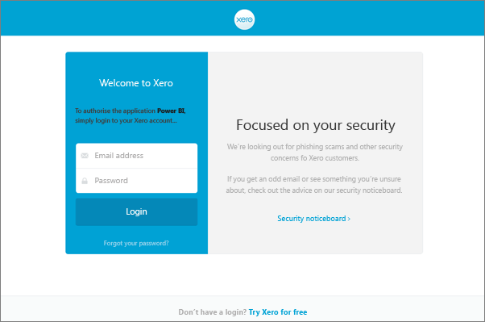
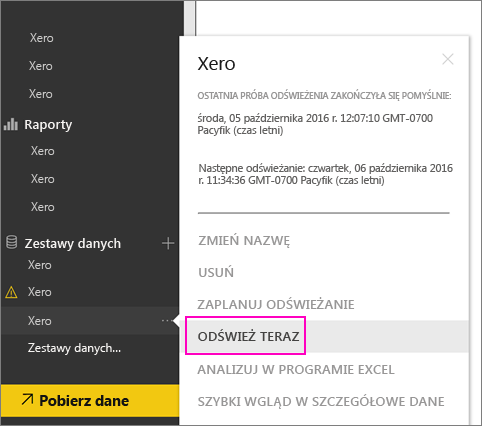

# Jak odświeżyć poświadczenia pakietu zawartości Xero, jeśli odświeżanie się nie powiodło
Jeśli używasz pakietu zawartości Xero usługi Power BI, być może wystąpiły pewne problemy z codziennym odświeżaniem zawartości pakietu ze względu na ostatnie zdarzenie w usłudze Power BI.

Sprawdzając ostatni stan odświeżenia dla zestawu danych Xero, widzisz, czy pakiet zawartości został pomyślnie odświeżony, jak pokazano na poniższym zrzucie ekranu.

Jeśli widzisz, że odświeżanie nie powiodło się, jak pokazano powyżej, wykonaj następujące kroki, aby odnowić poświadczenia pakietu zawartości.

1. Kliknij wielokropek (...) obok zestawu danych Xero, a następnie kliknij pozycję **Zaplanuj odświeżanie**. Spowoduje to otwarcie strony ustawień pakietu zawartości Xero.
   
    
2. Na stronie **Ustawienia dla Xero** wybierz pozycję **Poświadczenia źródła danych** > **Edytuj poświadczenia**.
   
    
3. Wprowadź nazwę organizacji i kliknij przycisk **Dalej**.
   
    
4. Zaloguj się do swojego konta Xero.
   
    
5. Gdy poświadczenia zostaną zaktualizowane, upewnij się, że harmonogram odświeżania został ustawiony na codzienne uruchamianie. Sprawdź to, klikając wielokropek (...) obok zestawu danych Xero, a następnie ponownie klikając przycisk **Zaplanuj odświeżanie**.
   
    
6. Możesz również wybrać natychmiastowe odświeżenie zestawu danych. Kliknij wielokropek (...) obok zestawu danych Xero, a następnie kliknij pozycję **Odśwież teraz**.
   
    

Jeśli nadal występują problemy dotyczące odświeżania, skontaktuj się z nami w witrynie [http://support.powerbi.com](http://support.powerbi.com) 

Aby dowiedzieć się więcej na temat pakietu zawartości Xero w usłudze Power BI, odwiedź stronę [pomocy dotyczącej pakietu zawartości Xero](service-connect-to-xero.md).

### Następne kroki
* Masz więcej pytań? [Odwiedź społeczność usługi Power BI](http://community.powerbi.com/)

