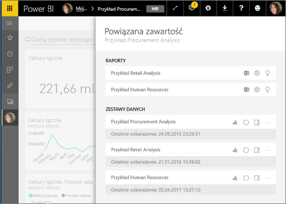
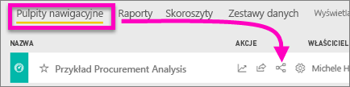
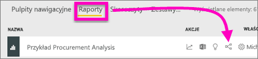
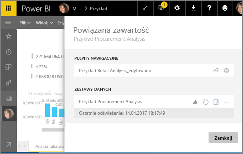
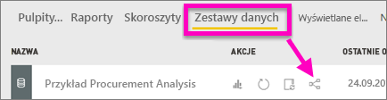
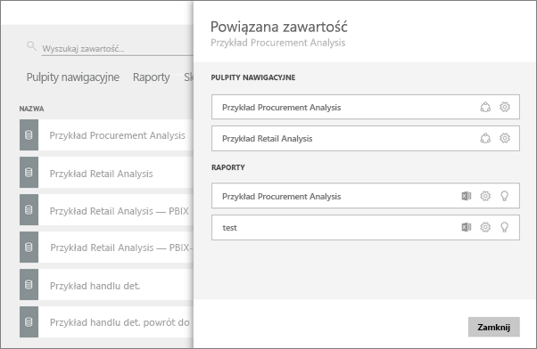

# Wyświetlanie powiązanej zawartości w usłudze Power BI
Okienko **Powiązana zawartość** wyświetla sposób połączenia między różnymi zawartościami usługi Power BI — pulpitami nawigacyjnymi, raportami i zestawami danych.  Co więcej z tego okienka możesz wykonywać typowe zadania, np. odświeżanie, zmienianie nazw, generowanie szczegółowych informacji i wiele innych. Wybierz powiązany raport lub pulpit nawigacyjny, a zostanie on otworzony w obszarze roboczym usługi Power BI.   

Prawdopodobnie już wiesz, że raporty są tworzone w oparciu o zestawy danych, następnie wizualizacje raportów są przypinane do pulpitów nawigacyjnych, po czym elementy wizualne pulpitów nawigacyjnych prowadzą z powrotem do raportów. Niemniej jak można dowiedzieć się, które pulpity nawigacyjne hostują wizualizacje z raportu Marketing? Jak zlokalizować te pulpity nawigacyjne? Czy pulpit nawigacyjny Zakupy używa wizualizacji z więcej niż jednego zestawu danych? Jeśli tak, jak się nazywają oraz jak można je otworzyć i edytować? Czy zestaw danych HR jest używany w jakichkolwiek raportach lub pulpitach nawigacyjnych? Można go przenieść bez powstawania niedziałających połączeń? Na pytania tego typu można znaleźć odpowiedzi w okienku **Powiązana zawartość**.  Okienko nie tylko wyświetla powiązaną zawartość, ale też umożliwia podejmowanie działań wobec zawartości i łatwe nawigowanie wśród powiązanych zawartości.

> [!NOTE]
> Funkcja powiązanej zawartości nie działa w przypadku strumieniowych zestawów danych.
> 
> 

## Wyświetlanie powiązanej zawartości pulpitu nawigacyjnego
Zobacz, jak Will wyświetla powiązaną zawartość pulpitu nawigacyjnego. Następnie wykonaj szczegółowe instrukcje poniżej filmu, aby spróbować samodzielnie wykonać tę procedurę, korzystając z przykładowego zestawu danych Procurement Analysis.

<iframe width="560" height="315" src="https://www.youtube.com/embed/B2vd4MQrz4M#t=3m05s" frameborder="0" allowfullscreen></iframe>

Musisz mieć co najmniej uprawnienia do *wyświetlania* pulpitu nawigacyjnego, aby otworzyć okienko **Powiązana zawartość**. W tym przykładzie używamy [próbki Procurement Analysis](sample-procurement.md).

**Metoda 1**

W obszarze roboczym wybierz kartę **Pulpity nawigacyjne**, a następnie wybierz ikonę **Wyświetl powiązane** .

 

**Metoda 2**

Po otwarciu pulpitu nawigacyjnego wybierz    z górnego menu.

Zostanie otwarte okienko **Powiązana zawartość**. Przedstawia ono wszystkie raporty zawierające wizualizacje przypięte do pulpitu nawigacyjnego oraz skojarzone zestawy danych. W przypadku tego pulpitu nawigacyjnego istnieją wizualizacje przypięte z trzech różnych raportów, a te raporty są oparte na trzech różnych zestawach danych.

W tym miejscu możesz podjąć bezpośrednie działanie wobec powiązanej zawartości.  Na przykład wybierz nazwę raportu, aby go otworzyć.  W przypadku raportu na liście wybierz ikonę [analizy w programie Excel](service-analyze-in-excel.md), [zmiany nazwy](service-rename.md) lub [pobrania informacji szczegółowych](service-insights.md). W przypadku zestawu danych wybierz ikonę [tworzenia nowego raportu](service-report-create-new.md), [odświeżenia](refresh-data.md), zmiany nazwy, [analizy w programie Excel](service-analyze-in-excel.md), [pobrania informacji szczegółowych](service-insights.md) lub otwórz okno **Ustawienia** dla zestawu danych.  

## Wyświetlanie powiązanej zawartości raportu
Musisz mieć co najmniej uprawnienia do *wyświetlania* raportu, aby otworzyć okienko **Powiązana zawartość**. W tym przykładzie używamy [próbki Procurement Analysis](sample-procurement.md).

**Metoda 1**

W obszarze roboczym wybierz kartę **Raporty**, a następnie wybierz ikonę **Wyświetl powiązane** .

 

**Metoda 2**

Otwórz raport w [Widoku do czytania](service-reading-view-and-editing-view.md) i wybierz ikonę  z górnego menu.

Zostanie otwarte okienko **Powiązana zawartość**. Przedstawia ono skojarzony zestaw danych oraz wszystkie pulpity nawigacyjne, które mają przypięty co najmniej jeden kafelek z tego raportu. W przypadku tego raportu istnieją wizualizacje przypięte do dwóch różnych pulpitów nawigacyjnych.

W tym miejscu możesz podjąć bezpośrednie działanie wobec powiązanej zawartości.  Na przykład wybierz nazwę pulpitu nawigacyjnego, aby go otworzyć.  W przypadku dowolnego pulpitu nawigacyjnego na liście wybierz ikonę, aby [udostępnić pulpit nawigacyjny innym osobom](service-share-dashboards.md) lub otwórz okno **Ustawienia** dla pulpitu nawigacyjnego. W przypadku zestawu danych wybierz ikonę [tworzenia nowego raportu](service-report-create-new.md), [odświeżenia](refresh-data.md), zmiany nazwy, [analizy w programie Excel](service-analyze-in-excel.md), [pobrania informacji szczegółowych](service-insights.md) lub otwórz okno **Ustawienia** dla zestawu danych.  

## Wyświetlanie powiązanej zawartości zestawu danych
Musisz mieć co najmniej uprawnienia do *wyświetlania* zestawu danych, aby otworzyć okienko **Powiązana zawartość**. W tym przykładzie używamy [próbki Procurement Analysis](sample-procurement.md).

W obszarze roboczym wybierz kartę **Zestawy danych**, a następnie znajdź ikonę **Wyświetl powiązane** .

Wybierz ikonę, aby otworzyć okienko **Powiązana zawartość**.

W tym miejscu możesz podjąć bezpośrednie działanie wobec powiązanej zawartości.  Na przykład wybierz nazwę pulpitu nawigacyjnego lub raportu, aby go otworzyć.  W przypadku dowolnego pulpitu nawigacyjnego na liście wybierz ikonę, aby [udostępnić pulpit nawigacyjny innym osobom](service-share-dashboards.md) lub otwórz okno **Ustawienia** dla pulpitu nawigacyjnego. W przypadku raportu wybierz ikonę [analizy w programie Excel](service-analyze-in-excel.md), [zmiany nazwy](service-rename.md) lub [pobrania informacji szczegółowych](service-insights.md).  

## Ograniczenia i rozwiązywanie problemów
* Jeśli Twoja przeglądarka nie ma wystarczającej ilości miejsca, nie zobaczysz opcji **Wyświetl powiązane**, ale nadal będzie wyświetlana ikona . Wybierz ikonę, aby otworzyć okienko **Powiązana zawartość**.
* Aby otworzyć okienko Powiązana zawartość dla raportu, musisz pracować w [Widoku odczytu](service-reading-view-and-editing-view.md).
* Zawartość powiązana nie jest dostępna w aplikacji Power BI Desktop.
* Funkcja powiązanej zawartości nie działa w przypadku strumieniowych zestawów danych.

## Następne kroki
* [Wprowadzenie do usługi Power BI](service-get-started.md)
* Masz więcej pytań? [Odwiedź społeczność usługi Power BI](http://community.powerbi.com/)

