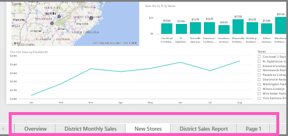

# Zmienianie nazwy prawie wszystkiego w usłudze Power BI
Ten artykuł nauczy Cię, jak zmienić nazwę pulpitu nawigacyjnego, raportu, strony raportu, skoroszytu, zestawu danych, aplikacji i obszaru roboczego w usłudze Power BI.

**Czy mogę zmienić nazwę?**

| Typ zawartości | Jestem autorem lub twórcą | Udostępnione dla mnie |
| --- | --- | --- |
| Pulpit nawigacyjny w obszarze roboczym |Tak |Nie |
| Raport w obszarze roboczym |Tak |Nie |
| Skoroszyt w obszarze roboczym |Tak |Nie |
| Zestaw danych w obszarze roboczym |Tak |Nie |
| Obszar roboczy aplikacji |Tak, jeśli jesteś właścicielem lub masz uprawnienia administratora |Nie |
| Opublikowane aplikacje |Nie z ekranu aplikacji, ale nazwę aplikacji można zmienić z obszaru roboczego aplikacji i ponownie ją opublikować pod nową nazwą, jeśli masz uprawnienia administratora |Nie |
| Zawartość aplikacji (pulpit nawigacyjny, raport, skoroszyt, zestaw danych) |Nie z ekranu aplikacji, ale nazwę zawartości aplikacji można zmienić z obszaru roboczego aplikacji i ponownie ją opublikować pod nową nazwą, jeśli masz uprawnienia administratora |Nie |
| Zawartość w pozycji **Udostępnione dla mnie** |Nie |Nie |

## Zmienianie nazwy pulpitu nawigacyjnego, raportu lub skoroszytu
1. Rozpocznij w obszarze roboczym i wybierz kartę **Pulpity nawigacyjne**, **Raporty** lub **Skoroszyty**. Umieść kursor nad elementem, którego nazwę chcesz zmienić, i wybierz ikonę koła zębatego . Jeśli ikona koła zębatego nie jest widoczna, nie masz uprawnień do zmiany nazwy.
   
   
2. Na stronie Ustawienia wpisz nową nazwę, a następnie wybierz pozycję **Zapisz**.
   
   

## Zmienianie nazwy zestawu danych
1. Rozpocznij w obszarze roboczym i wybierz kartę **Zestawy danych**.
   
   
2. Umieść kursor nad elementem, którego nazwę chcesz zmienić, wybierz wielokropek (...), a następnie wybierz pozycję **Zmień**.  
   
      
   
   > [!NOTE]
   > Opcje na liście rozwijanej będą się różnić.
   > 
   > 
3. Na stronie Ustawienia wpisz nową nazwę, a następnie wybierz pozycję **Zapisz**.
   
     

## Zmienianie nazwy obszaru roboczego aplikacji
Każdy użytkownik z uprawnieniami administratora może zmienić nazwę obszaru roboczego aplikacji.

1. Rozpocznij w obszarze roboczym, którego nazwę chcesz zmienić.
2. W prawym górnym rogu wybierz wielokropek (...), a następnie wybierz pozycję **Edytuj obszar roboczy**. Jeśli nie widzisz tej opcji, nie masz uprawnień do zmiany nazwy tego obszaru roboczego. 
   
    
3. Wpisz nową nazwę obszaru roboczego i wybierz pozycję **Zapisz**.
   
   

## Zmienianie nazwy strony w raporcie
Nie podoba Ci się nazwa strony w twoim raporcie usługi Power BI?  Nowa nazwa jest w zasięgu ręki. Nazwy stron można zmieniać w [widoku edycji raportu ](service-interact-with-a-report-in-editing-view.md).

1. Otwórz raport w [widoku do edycji](service-reading-view-and-editing-view.md).
2. Znajdź karty stron raport u dołu okna usługi Power BI.
   
    
3. Otwórz stronę raportu, której nazwę chcesz zmienić, wybierając kartę.
4. Kliknij dwukrotnie nazwę na karcie, aby ją zaznaczyć.  
   
    
5. Wpisz nową nazwę strony raportu i naciśnij klawisz ENTER.
   
    

## Zagadnienia i rozwiązywanie problemów
* Jeśli element, który ma mieć zmienioną nazwę, został Ci udostępniony lub jest częścią pakietu zawartości, nie będzie widoczna ikona koła zębatego i nie będziesz mieć dostępu do ustawień.
* Na karcie **Zestawy danych**, jeśli nie widzisz wielokropka (...), rozwiń okno przeglądarki.

Masz więcej pytań? [Odwiedź społeczność usługi Power BI](http://community.powerbi.com/)

