# Tworzenie nowego raportu w usłudze Power BI przez zaimportowanie zestawu danych
Po zapoznaniu się z tematem [Raporty w usłudze Power BI](consumer/end-user-reports.md) możesz teraz utworzyć własny raport. Istnieje wiele sposobów tworzenia raportów. W tym artykule zaczniemy od utworzenia podstawowego raportu na podstawie zestawu danych programu Excel przy użyciu usługi Power BI. Kiedy zapoznasz się z podstawami tworzenia raportów, możesz przejść do bardziej zaawansowanych tematów dostępnych w sekcji **Następne kroki** u dołu strony.  

## Wymagania wstępne
> - Usługa Power BI (w celu tworzenia raportów za pomocą programu Power BI Desktop zobacz [Widok raportu w programie Desktop](desktop-report-view.md))  
> - Zestaw danych Próbka analizy handlu detalicznego

## Importowanie zestawu danych
W przypadku tej metody tworzenia raportu punktem wyjścia jest zestaw danych i pusta kanwa raportu. Na użytek tej procedury [pobierz przykładowy zestaw danych programu Excel noszący nazwę Retail Analysis](http://go.microsoft.com/fwlink/?LinkId=529778) i zapisz go na swoim koncie w usłudze OneDrive dla Firm (opcja preferowana) lub lokalnie.

1. Utworzymy raport w obszarze roboczym usługi Power BI, więc wybierz istniejący obszar roboczy lub utwórz nowy.
   
   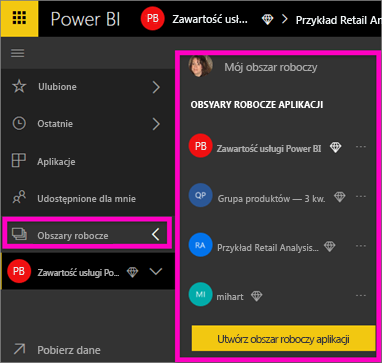
2. W dolnej części lewego okienka nawigacji wybierz opcję **Pobierz dane**.
   
   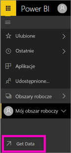
3. Wybierz pozycję **Pliki** i przejdź do miejsca, w którym został zapisany przykładowy zestaw danych Retail Analysis.
   
    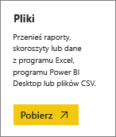
4. W ramach tego ćwiczenia wybierz pozycję **Importuj**.
   
   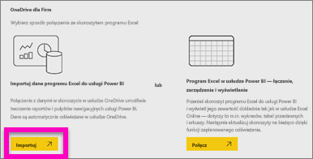
5. Po zaimportowaniu zestawu danych wybierz pozycję **Wyświetl zestaw danych**.
   
   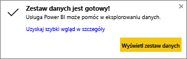
6. Wyświetlenie zestawu danych powoduje otwarcie edytora raportów.  Zostanie wyświetlona pusta kanwa i narzędzia do edycji raportów.
   
   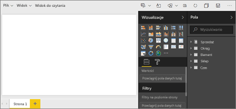

> **PORADA**: jeśli nie masz doświadczenia w pracy z kanwą do edycji raportów lub chcesz przypomnieć sobie te informacje, przed dalszym działaniem [zapoznaj się z edytorem raportów](service-the-report-editor-take-a-tour.md).
> 
> 

## Dodawanie miernika promieniowego do raportu
Po zaimportowaniu zestawu danych można już udzielać odpowiedzi na pytania.  Dyrektor ds. marketingu chce wiedzieć, jak blisko mamy do osiągnięcia tegorocznych celów w zakresie sprzedaży. Miernik [dobrze wizualizuje](visuals/power-bi-report-visualizations.md) ten typ danych.

1. W okienku Pola wybierz pozycję **Sales** > **This Year Sales** > **Value**.
   
    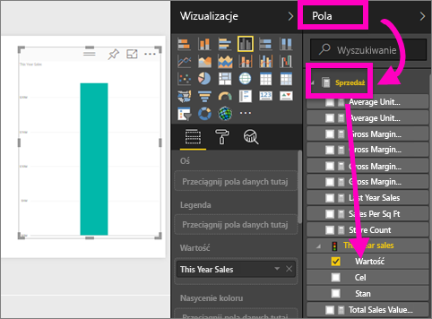
2. Skonwertuj wizualizację na miernik, wybierając szablon miernika  w okienku **Wizualizacje**.
   
    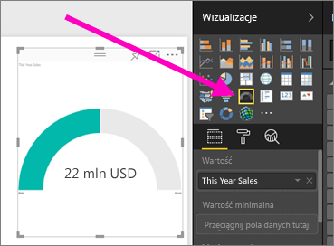
3. Przeciągnij pozycję **Sales** > **This Year Sales** > **Goal** do obszaru **Wartość docelowa**. Wygląda na to, że jesteśmy bardzo blisko celu.
   
    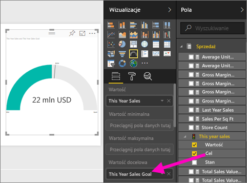
4. Teraz jest dobry moment na [zapisanie raportu](service-report-save.md).
   
   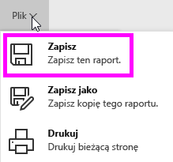

## Dodawanie wykresu warstwowego i fragmentatora do raportu
Nasz dyrektor ma jeszcze kilka dodatkowych pytań. Chce wiedzieć, jak tegoroczna sprzedaż wypada w porównaniu z ubiegłym rokiem. Wyniki mają uwzględniać poszczególne okręgi.

1. Na początek zróbmy nieco miejsca na kanwie. Zaznacz miernik i przenieś go w prawy górny róg. Następnie chwyć i przeciągnij jeden z rogów, aby zmniejszyć miernik.
2. Kliknij poza miernikiem, aby miernik nie był już zaznaczony. W okienku Pola wybierz pozycję **Sales** > **This Year Sales** > **Value**, a następnie wybierz pozycję **Sales** > **Last Year Sales**.
   
    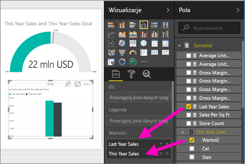
3. Skonwertuj wizualizację na wykres warstwowy, wybierając szablon wykresu warstwowego  w okienku **Wizualizacje**.
4. Wybierz pozycję **Time** > **Period**, aby dodać ją do obszaru **Oś**.
   
    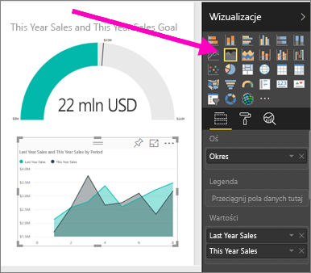
5. Aby posortować wizualizacje według okresu, wybierz wielokropek, a następnie polecenie **Sortuj według okresu**.
6. Teraz dodajmy fragmentator. Wybierz puste miejsce na kanwie, a następnie wybierz szablon fragmentatora     . Spowoduje to dodanie pustego fragmentatora do kanwy.
   
        
7. W okienku Pola wybierz pozycję **District** > **District**. Przenieś fragmentator i zmień jego rozmiar.
   
    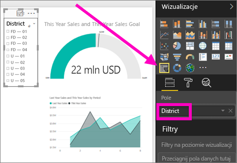  
8. Za pomocą fragmentatora poszukaj wzorców i danych szczegółowych według okręgu.
   
     

Kontynuuj przeglądanie danych i dodawanie wizualizacji. Po znalezieniu szczególnie interesujących danych szczegółowych [przypnij je do pulpitu nawigacyjnego](service-dashboard-pin-tile-from-report.md).

## Następne kroki

* Dowiedz się, jak [przypinać wizualizacje do pulpitu nawigacyjnego](service-dashboard-pin-tile-from-report.md)   
* Masz więcej pytań? [Odwiedź społeczność usługi Power BI](http://community.powerbi.com/)

