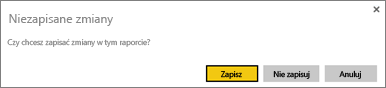
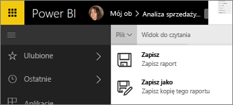
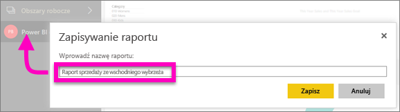

# Zapisywanie raportu w usłudze Power BI i programie Power BI Desktop
Po wprowadzeniu zmian do raportu w usłudze Power BI możesz zapisać go, zapisać pod nową nazwą lub zamknąć bez zapisywania zmian. Załóżmy, że otworzono raport, utworzono wizualizację i przypięto ją do pulpitu nawigacyjnego. Jeśli zamkniesz raport bez zapisania wprowadzonych zmian, kafelek pozostanie na pulpicie nawigacyjnym, ale wizualizacja nie zostanie zapisana w raporcie. Po kliknięciu tego kafelka na pulpicie nawigacyjnym raport zostanie otwarty, ale wizualizacja nie istnieje w raporcie.

> [!TIP]
> Szukając zapisanego raportu, zwróć uwagę na to, który obszar roboczy jest aktywny. Raport zostanie zapisany w aktywnym obszarze roboczym.
> 
> 

### Aby zapisać raport:
1. Jeśli zechcesz opuścić raport, który zawiera zmiany, usługa Power BI wyświetli monit.
   
   
2. Innym sposobem zapisania raportu jest wybranie pozycji **PLIK** \> **Zapisz** lub **Zapisz jako**. Jeśli jesteś w [widoku do czytania](consumer/end-user-reading-view.md), dostępna będzie tylko opcja Zapisz jako. 
   
   
3. Jeśli jest to nowy raport (Zapisz) lub nowa wersja istniejącego raportu (Zapisz jako), podaj opisową nazwę.  **Raport zostanie dodany do aktywnego obszaru roboczego**.
   
    

### Następne kroki
Przeczytaj więcej na temat [raportów w usłudze Power BI](consumer/end-user-reports.md)

[Power BI — podstawowe pojęcia](consumer/end-user-basic-concepts.md)

Masz więcej pytań? [Odwiedź społeczność usługi Power BI](http://community.powerbi.com/)

