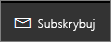
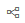

# Subskrybowanie raportu i pulpitu nawigacyjnego w usłudze Power BI
Nigdy nie było łatwiej być na czasie w przypadku najważniejszych pulpitów nawigacyjnych i raportów. Zasubskrybuj dla siebie i swoich współpracowników strony raportów oraz pulpity nawigacyjne, które są najważniejsze dla Ciebie, a usługa Power BI wyśle wiadomość e-mail z migawką do Twojej skrzynki odbiorczej. Poinformuj usługę Power BI, jak często chcesz otrzymywać wiadomości e-mail: od raz dziennie do raz w tygodniu. 

W wiadomości e-mail i migawce będzie używany język skonfigurowany w ustawieniach usługi Power BI (zobacz temat [Języki i kraje/regiony obsługiwane w usłudze Power BI](supported-languages-countries-regions.md)). Jeśli żaden język nie zostanie zdefiniowany, usługa Power BI będzie używać języka zgodnie z ustawieniami regionalnymi w bieżącej przeglądarce. Aby zobaczyć lub ustawić preferencję języka, wybierz ikonę z kołem zębatym  > **Ustawienia > Ogólne > Język**. 

Subskrypcje można tworzyć tylko w usłudze Power BI. Po otrzymaniu wiadomości e-mail będzie ona zawierała link „przejdź do raportu lub pulpitu nawigacyjnego”. Na urządzeniach przenośnych z zainstalowanymi aplikacjami usługi Power BI zaznaczenie tego linku powoduje uruchomienie aplikacji (w przeciwieństwie do domyślnej akcji otwierania raportu lub pulpitu nawigacyjnego w witrynie internetowej usługi Power BI).

## Wymagania
- **Tworzenie** subskrypcji jest funkcją usługi Power BI Pro i aby móc utworzyć taką subskrypcję, musisz mieć uprawnienia edycji do zawartości (pulpitu nawigacyjnego lub raportu). 
- Ponieważ wiadomości e-mail subskrypcji są wysyłane tylko podczas aktualizowania lub odświeżania źródłowego zestawu danych, subskrypcje nie działają w przypadku zestawów danych, które nie są aktualizowane lub odświeżane.

## Subskrybowanie pulpitu nawigacyjnego lub strony raportu
Niezależnie od tego, czy subskrybowany jest pulpit nawigacyjny, czy raport, wykonywane działania są bardzo podobne. Ten sam przycisk umożliwia subskrybowanie (dla siebie i dla innych) pulpitów nawigacyjnych i raportów usługi Power BI.
 
.

1. Otwórz pulpit nawigacyjny lub raport.
2. Z górnego menu wybierz pozycję **Subskrybuj** lub wybierz ikonę koperty .
   
   

3. Aby włączyć/wyłączyć subskrypcję, użyj żółtego suwaka.  Ustawienie suwaka w pozycji Wył. nie spowoduje usunięcia subskrypcji. Aby usunąć subskrypcję, wybierz ikonę śmietnika.

4. Wprowadź szczegóły wiadomości e-mail. Twój adres e-mail jest wstępnie wypełniany, ale możesz dodać do subskrypcji również inne osoby. Dodawać można tylko adresy e-mail z tej samej domeny. Aby uzyskać więcej szczegółów, zobacz **Istotne zagadnienia i rozwiązywanie problemów** poniżej. Jeśli raport lub pulpit nawigacyjny jest hostowany w [pojemności Premium](service-premium.md), będzie możliwe zasubskrybowanie innych osób przy użyciu indywidualnych adresów e-mail lub aliasów grup. Jeśli raport lub pulpit nawigacyjny nie jest hostowany w pojemności Premium, nadal można subskrybować inne osoby przy użyciu ich indywidualnych adresów e-mail, ale te osoby muszą również mieć licencje usługi Power BI Pro.

    Na poniższych zrzutach ekranu widać, że subskrybowanie raportu polega w rzeczywistości na zasubskrybowaniu *strony* raportu.  Aby zasubskrybować więcej niż jedną stronę raportu, wybierz pozycję **Dodaj kolejną subskrypcję** i wybierz inną stronę. 
      
     

5. Wybierz pozycję **Zapisz i zamknij**, aby zapisać subskrypcję. Subskrybenci otrzymają wiadomość e-mail z migawką pulpitu nawigacyjnego lub strony raportu po każdej zmianie dowolnych danych w źródłowym zestawie danych. Jeśli pulpit nawigacyjny lub raport jest odświeżany częściej niż raz dziennie, wiadomość e-mail jest wysyłana tylko po pierwszym odświeżeniu.  
   
    
   
   > [!TIP]
   > Chcesz natychmiast zobaczyć wiadomość e-mail? Wiadomość e-mail można wyzwolić, odświeżając jeden z zestawów danych skojarzonych z pulpitem nawigacyjnym lub zestaw danych skojarzony z raportem. (Jeśli nie masz uprawnień do edytowania zestawu danych, musisz poprosić kogoś, kto ma te uprawnienia, aby wykonał tę operację). Aby dowiedzieć się, które zestawy danych zostały użyte, wybierz ikonę **Przejrzyj powiązane** , aby otworzyć pozycję **Powiązana zawartość**, a następnie wybierz ikonę odświeżania . 
   > 
   > 
   
   

## Jak jest określany harmonogram wiadomości e-mail
W poniższej tabeli opisano, jak często będzie wysyłana wiadomość e-mail. Zależy to od metody połączenia zestawu danych, na którym jest oparty pulpit nawigacyjny lub raport (zapytanie bezpośrednie, połączenie na żywo, import do usługi Power BI lub plik programu Excel w usłudze OneDrive lub SharePoint Online), a także od dostępnych i wybranych opcji subskrypcji (codziennie, co tydzień lub brak).

|  | **Zapytanie bezpośrednie** | **Połączenie na żywo** | **Zaplanowane odświeżenie (import)** | **Plik programu Excel w usłudze OneDrive/SharePoint Online** |
| --- | --- | --- | --- | --- |
| **Jak często raport/pulpit nawigacyjny jest odświeżany?** |Co 15 min |Usługa Power BI sprawdza co 15 minut, a jeśli zestaw danych został zmieniony, odświeża raport. |Użytkownik może wybrać brak, codziennie lub co tydzień. Codziennie może oznaczać do 8 razy dziennie. Co tydzień to w rzeczywistości harmonogram tygodniowy utworzony przez użytkownika z możliwością ustawienia odświeżenia od jednego razu na tydzień nawet do odświeżania codziennego. |Co godzinę |
| **Jaką kontrolę ma użytkownik nad harmonogramem subskrypcji wiadomości e-mail?** |Opcje to: codziennie lub co tydzień |Brak opcji: do użytkownika są wysyłane wiadomości e-mail, jeśli raport zostanie odświeżony, ale nie więcej niż raz dziennie. |Jeśli został ustawiony codzienny harmonogram odświeżania, dostępne opcje to codziennie i co tydzień.  W przypadku cotygodniowego harmonogramu odświeżania jedyną opcją jest co tydzień. |Brak opcji: do użytkownika jest wysyłana wiadomość e-mail przy każdej aktualizacji zestawu danych, ale nie więcej niż raz dziennie. |

## Zarządzanie subskrypcjami
Tylko osoba, która utworzyła subskrypcję, może nią zarządzać.  Istnieją 2 ścieżki do ekranu do zarządzania subskrypcjami.  Pierwsza polega na wybraniu pozycji **Zarządzaj wszystkimi subskrypcjami** w oknie dialogowym **Subskrybowanie wiadomości e-mail** (zobacz zrzuty ekranu poniżej kroku 4 powyżej). Druga polega na wybraniu ikony przypominającej koło zębate usługi Power BI  z górnego menu, a następnie wybraniu pozycji **Ustawienia**.

Określone wyświetlane subskrypcje będą zależeć od aktualnie aktywnego obszaru roboczego.  Aby wyświetlić wszystkie swoje subskrypcje naraz dla wszystkich obszarów roboczych, upewnij się, że pozycja **Mój obszar roboczy** jest aktywna. Aby uzyskać pomoc dotyczącą obszarów roboczych, zobacz [Workspaces in Power BI](service-create-distribute-apps.md) (Obszary robocze w usłudze Power BI).

Subskrypcje zostaną zakończone po wygaśnięciu licencji wersji Pro, po usunięciu pulpitu nawigacyjnego lub raportu przez właściciela lub po usunięciu konta użytkownika użytego do utworzenia subskrypcji.

## Istotne zagadnienia i rozwiązywanie problemów
* Jeśli w przypadku subskrypcji wiadomości e-mail dla pulpitu nawigacyjnego do pewnych kafelków zastosowano zabezpieczenia na poziomie wiersza, te kafelki nie będą wyświetlane.  Jeśli w przypadku subskrypcji wiadomości e-mail dla raportu zestaw danych używa zabezpieczeń na poziomie wiersza, nie będzie można utworzyć subskrypcji.
* Subskrypcje stron raportów są związane z nazwą danej strony raportu. Jeśli zasubskrybujesz stronę raportu, a następnie zmienisz jej nazwę, trzeba będzie ponownie utworzyć subskrypcję
* Twoja organizacja może skonfigurować w usłudze Azure Active Directory niektóre ustawienia, aby ograniczyć możliwość korzystania z subskrypcji wiadomości e-mail w usłudze Power BI.  Dotyczy to m.in. konieczności używania uwierzytelniania wieloskładnikowego lub ograniczeń zakresu adresów IP podczas uzyskiwania dostępu do zasobów.
* Obecnie subskrypcje e-mail raportów/pulpitów nawigacyjnych korzystających z zestawów danych z połączeniem na żywo nie są obsługiwane podczas subskrybowania użytkowników innych niż Ty.
* Dla subskrypcji wiadomości e-mail dla zestawów danych połączenia na żywo otrzymasz wiadomości e-mail tylko po zmianie danych. Jeśli więc nastąpi odświeżanie bez żadnej zmiany danych, usługa Power BI nie wyśle wiadomości e-mail.
* Subskrypcje e-mail nie obsługują większości [niestandardowych elementów wizualnych](power-bi-custom-visuals.md).  Jedynym wyjątkiem są te niestandardowe elementy wizualne, które zostały [certyfikowane](power-bi-custom-visuals-certified.md).  
* Subskrypcje e-mail nie obsługują obecnie wizualizacji niestandardowych bazujących na języku R.  
* Jeśli do niektórych kafelków zastosowano zabezpieczenia na poziomie wiersza, te kafelki nie będą wyświetlane.
* Nie można zasubskrybować innych użytkowników do raportu, który ma zastosowane zabezpieczenia na poziomie wiersza.
* Subskrypcje wiadomości e-mail są wysyłane wraz z domyślnymi stanami filtru i fragmentatora raportu. Wszelkie zmiany w wartościach domyślnych wprowadzone po rozpoczęciu subskrypcji nie będą uwzględniane w wiadomości e-mail.    
* Subskrypcje wiadomości e-mail nie są jeszcze obsługiwane na stronach raportu utworzonych przez program Power BI Desktop połączonych na żywo z funkcją usługi.    
* W szczególności dla subskrypcji pulpitów nawigacyjnych niektóre typy kafelków nie są jeszcze obsługiwane.  Należą do nich: kafelki przesyłania strumieniowego, kafelki wideo, kafelki niestandardowej zawartości internetowej.     
* Jeśli współużytkujesz pulpit nawigacyjny ze współpracownikiem spoza Twojej dzierżawy, nie będzie możliwe utworzenie subskrypcji dla tego współpracownika. Jeśli więc Twój adres e-mail to aaron@xyz.com, możesz udostępniać zawartość użytkownikowi o adresie e-mail anyone@ABC.com, ale nie możesz jeszcze dodać subskrypcji dla adresu anyone@ABC.com i ten użytkownik nie może zasubskrybować zawartości udostępnionej.      
* Subskrypcje mogą zakończyć się niepowodzeniem dla pulpitów nawigacyjnych i raportów z wyjątkowo dużymi obrazami, co wynika z ograniczeń rozmiarów wiadomości e-mail.    
* Usługa Power BI automatycznie wstrzymuje odświeżanie zestawów danych skojarzonych z pulpitami nawigacyjnymi i raportami, które nie były odwiedzane przez więcej niż 2 miesiące.  Jeśli jednak dodasz subskrypcję do pulpitu nawigacyjnego lub raportu, nie zostanie ona wstrzymana nawet wtedy, gdy nie jest odwiedzany.    
* Jeśli nie otrzymujesz wiadomości e-mail subskrypcji, upewnij się, że Twoja główna nazwa użytkownika (UPN) umożliwia odbieranie wiadomości e-mail. [Zespół usługi Power BI pracuje nad ograniczeniem tego wymagania](https://community.powerbi.com/t5/Issues/No-Mail-from-Cloud-Service/idc-p/205918#M10163), więc uzbrój się w cierpliwość. 
* Jeśli Twój pulpit nawigacyjny lub raport jest w pojemności Premium, możesz użyć aliasów e-mail grupy na potrzeby subskrypcji, zamiast subskrybować kolejno adresy e-mail poszczególnych współpracowników. Te aliasy bazują na bieżącej usłudze Active Directory. 

## Następne kroki
* Masz więcej pytań? [Zadaj pytanie społeczności usługi Power BI](http://community.powerbi.com/)    
* [Przeczytaj wpis na blogu](https://powerbi.microsoft.com/blog/introducing-dashboard-email-subscriptions-a-360-degree-view-of-your-business-in-your-inbox-every-day/)

