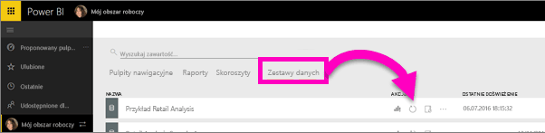

# Subskrybowanie raportu lub pulpitu nawigacyjnego usługi Power BI
Nigdy nie było łatwiej być na czasie w przypadku najważniejszych pulpitów nawigacyjnych i raportów. Subskrybuj strony raportów i pulpity nawigacyjne, które są najważniejsze dla Ciebie, a usługa Power BI wyśle wiadomość e-mail z migawką do Twojej skrzynki odbiorczej. Poinformuj usługę Power BI, jak często chcesz otrzymywać wiadomości e-mail: od raz dziennie do raz w tygodniu. W wiadomościach e-mail i migawkach będzie używany język określony w ustawieniach usługi Power BI. Jeśli w ustawieniach nie będzie zdefiniowanego żadnego języka, usługa Power BI użyje języka używanej przeglądarki.

Aby zobaczyć preferencję języka, wybierz ikonę z kołem zębatym  **> Ustawienia > Ogólne > Język**.

> [!NOTE]
> Subskrypcje można tworzyć tylko w usłudze Power BI. Po otrzymaniu wiadomości e-mail będzie ona zawierała link „przejdź do raportu/pulpitu nawigacyjnego”. Na urządzeniach przenośnych z zainstalowanymi aplikacjami usługi Power BI zaznaczenie tego linku powoduje uruchomienie aplikacji (w przeciwieństwie do domyślnej akcji otwierania raportu lub pulpitu nawigacyjnego w witrynie internetowej usługi Power BI).
> 
> 

Oglądaj, jak Sirui konfiguruje subskrypcję e-mail dla raportu. Następnie postępuj zgodnie ze szczegółowymi instrukcjami poniżej wideo, aby wypróbować to samodzielnie.

<iframe width="560" height="315" src="https://www.youtube.com/embed/saQx7G0pxhc" frameborder="0" allowfullscreen></iframe>

## Wymagania
**Tworzenie** subskrypcji jest funkcją usługi Power BI Pro i musisz mieć uprawnienie wyświetlania lub edycji do zawartości (pulpitu nawigacyjnego lub raportu).

## Subskrypcja dla pulpitu nawigacyjnego

1. Otwórz pulpit nawigacyjny.
2. Z górnego menu wybierz pozycję **Subskrybuj** lub wybierz ikonę koperty .
   
   
3. Aby włączyć/wyłączyć subskrypcję, użyj żółtego suwaka.  Ustawienie suwaka w pozycji Wył. nie spowoduje usunięcia subskrypcji. Aby usunąć subskrypcję, wybierz ikonę śmietnika.
   
   
4. Wybierz pozycję **Zapisz i zamknij**, aby zapisać subskrypcję. Otrzymasz wiadomość e-mail z migawką pulpitu nawigacyjnego po każdej zmianie dowolnych danych w źródłowym zestawie danych. Jeśli pulpit nawigacyjny jest odświeżany częściej niż raz dziennie, wiadomość e-mail z migawką otrzymasz tylko po pierwszym odświeżeniu.
   
   
   
   > [!TIP]
   > Chcesz natychmiast zobaczyć wiadomość e-mail? Możesz wyzwolić wiadomość e-mail, odświeżając jeden z zestawów danych skojarzonych z pulpitem nawigacyjnym. (Jeśli nie masz uprawnień do edytowania zestawu danych, musisz poprosić kogoś, kto ma te uprawnienia, aby wykonał tę operację). Aby dowiedzieć się, które zestawy danych zostały użyte do utworzenia pulpitu nawigacyjnego, z poziomu pulpitu nawigacyjnego wybierz ikonę **Przejrzyj powiązane** , aby otworzyć pozycję **Powiązana zawartość**, a następnie wybierz ikonę odświeżania . 
   > 
   > 
   
   

## Subskrybowanie strony raportu
1. Wyświetl raport w [Widoku do odczytu](service-reading-view-and-editing-view.md).
2. Z górnego menu wybierz pozycję **Subskrybuj**.
   
   
3. Jednocześnie możesz subskrybować jedną stronę raportu. Wybierz konkretną stronę raportu z listy rozwijanej.
   
   
   
   Kontynuuj dodawanie stron raportu.
4. Aby włączyć/wyłączyć subskrypcję każdej strony, użyj żółtego suwaka.  Ustawienie suwaka w pozycji Wył. nie spowoduje usunięcia subskrypcji. Aby usunąć subskrypcję, wybierz ikonę śmietnika.
   
   
5. Wybierz pozycję **Zapisz i zamknij**, aby zapisać subskrypcję. Będziesz odbierać wiadomość e-mail z migawką każdej strony raportu, gdy raport zostanie odświeżony. Jeśli raport nie będzie odświeżany, nie otrzymasz wiadomości e-mail z migawką danego dnia.  Jeśli raport jest odświeżany częściej niż raz dziennie, wiadomość e-mail z migawką otrzymasz tylko po pierwszym odświeżeniu.
   
   
   
   > [!TIP]
   > Chcesz natychmiast zobaczyć wiadomość e-mail? Możesz wyzwolić wiadomość e-mail, otwierając zestaw danych i wybierając pozycję **Odśwież teraz**. Jeśli nie masz uprawnień do edytowania zestawu danych, musisz poprosić kogoś, kto ma te uprawnienia, aby wykonał tę operację.
   > 
   > 
   > 
   > 

## Jak jest określany harmonogram wiadomości e-mail dla raportów
W poniższej tabeli opisano, jak często będzie wysyłana wiadomość e-mail. Zależy to od metody połączenia zestawu danych, na którym jest oparty pulpit nawigacyjny lub raport (zapytanie bezpośrednie, połączenie na żywo, import do usługi Power BI lub plik programu Excel w usłudze OneDrive lub SharePoint Online), a także od dostępnych i wybranych opcji subskrypcji (codziennie, co tydzień lub brak).

|  | **Zapytanie bezpośrednie** | **Połączenie na żywo** | **Zaplanowane odświeżenie (import)** | **Plik programu Excel w usłudze OneDrive/SharePoint Online** |
| --- | --- | --- | --- | --- |
| **Jak często raport/pulpit nawigacyjny jest odświeżany?** |Co 15 min |Usługa Power BI sprawdza co 15 minut, a jeśli zestaw danych został zmieniony, odświeża raport. |Użytkownik może wybrać brak, codziennie lub co tydzień. Codziennie może oznaczać do 8 razy dziennie. Co tydzień to w rzeczywistości harmonogram tygodniowy utworzony przez użytkownika z możliwością ustawienia odświeżenia od jednego razu na tydzień nawet do odświeżania codziennego. |Co godzinę |
| **Jaką kontrolę ma użytkownik nad harmonogramem subskrypcji wiadomości e-mail?** |Opcje to: codziennie lub co tydzień |Brak opcji: do użytkowników są wysyłane wiadomości e-mail, jeśli raport zostanie odświeżony, ale nie więcej niż raz dziennie. |Jeśli został ustawiony codzienny harmonogram odświeżania, dostępne opcje to codziennie i co tydzień.  W przypadku cotygodniowego harmonogramu odświeżania jedyną opcją jest co tydzień. |Brak opcji: do użytkownika jest wysyłana wiadomość e-mail przy każdej aktualizacji zestawu danych, ale nie więcej niż raz dziennie. |

## Zarządzanie subskrypcjami
Istnieją 2 ścieżki do ekranu do zarządzania subskrypcjami.  Pierwsza polega na wybraniu pozycji **Zarządzaj wszystkimi subskrypcjami** w oknie dialogowym **Subskrybowanie wiadomości e-mail** (zobacz krok 3 powyżej). Druga polega na wybraniu ikony przypominającej koło zębate usługi Power BI  z górnego menu, a następnie wybraniu pozycji **Ustawienia**.

Określone wyświetlane subskrypcje będą zależeć od aktualnie aktywnego obszaru roboczego.  Aby wyświetlić wszystkie swoje subskrypcje naraz dla wszystkich obszarów roboczych, upewnij się, że pozycja **Mój obszar roboczy** jest aktywna. Aby uzyskać pomoc dotyczącą obszarów roboczych, zobacz [Workspaces in Power BI](service-create-distribute-apps.md) (Obszary robocze w usłudze Power BI).

Subskrypcje zostaną zakończone po wygaśnięciu licencji wersji Pro, po usunięciu pulpitu nawigacyjnego lub raportu przez właściciela, po usunięciu konta użytkownika użytego do utworzenia subskrypcji.

## Zagadnienia i rozwiązywanie problemów
* Obecnie subskrypcja jest niedostępna dla pulpitów nawigacyjnych i raportów, które pochodzą z pakietów zawartości lub aplikacji usługi Power BI. Ale istnieje obejście... wykonaj kopię raportu/pulpitu nawigacyjnego i zamiast tego dodaj subskrypcje do tej wersji.
* Subskrypcje stron raportów są związane z nazwą danej strony raportu. Jeśli zasubskrybujesz stronę raportu, a następnie zmienisz jej nazwę, trzeba będzie ponownie utworzyć subskrypcję
* Dla subskrypcji wiadomości e-mail dla zestawów danych połączenia na żywo otrzymasz wiadomości e-mail tylko po zmianie danych. Jeśli więc nastąpi odświeżanie bez żadnej zmiany danych, usługa Power BI nie wyśle wiadomości e-mail.
* Subskrypcje e-mail nie obsługują większości [niestandardowych elementów wizualnych](power-bi-custom-visuals.md).  Jedynym wyjątkiem są te niestandardowe elementy wizualne, które zostały [certyfikowane](power-bi-custom-visuals-certified.md).  
* Subskrypcje wiadomości e-mail są wysyłane wraz z domyślnymi stanami filtru i fragmentatora raportu. Wszelkie zmiany w wartościach domyślnych wprowadzone przed rozpoczęciem subskrypcji nie będą uwzględniane w wiadomości e-mail.    
* Subskrypcje wiadomości e-mail nie są jeszcze obsługiwane na stronach raportu utworzonych przez program Power BI Desktop połączonych na żywo z funkcją usługi.    
* W szczególności dla subskrypcji pulpitów nawigacyjnych niektóre typy kafelków nie są jeszcze obsługiwane.  Należą do nich: kafelki przesyłania strumieniowego, kafelki wideo, kafelki niestandardowej zawartości internetowej.     
* Jeśli udostępniasz pulpit nawigacyjny współpracownikom spoza dzierżawy, nie będą oni mogli subskrybować pulpitu nawigacyjnego lub skojarzonych z nim stron raportu. Dlatego, jeśli jesteś aaron@xyz.com, możesz udostępniać anyone@ABC.com.  Ale anyone@ABC.com nie może subskrybować zawartości udostępnionej.    
* Subskrypcje mogą zakończyć się niepowodzeniem dla pulpitów nawigacyjnych i raportów z wyjątkowo dużymi obrazami, co wynika z ograniczeń rozmiarów wiadomości e-mail.    
* Usługa Power BI automatycznie wstrzymuje odświeżanie zestawów danych skojarzonych z pulpitami nawigacyjnymi i raportami, które nie były odwiedzane przez więcej niż 2 miesiące.  Jeśli jednak dodasz subskrypcję do pulpitu nawigacyjnego lub raportu, nie zostanie ona wstrzymana nawet wtedy, gdy nie jest odwiedzany.    
* Jeśli nie otrzymujesz wiadomości e-mail subskrypcji, upewnij się, że Twoja główna nazwa użytkownika (UPN) umożliwia odbieranie wiadomości e-mail. [Zespół usługi Power BI pracuje nad ograniczeniem tego wymagania](https://community.powerbi.com/t5/Issues/No-Mail-from-Cloud-Service/idc-p/205918#M10163), więc uzbrój się w cierpliwość. 

## Następne kroki
* Masz więcej pytań? [Zadaj pytanie społeczności usługi Power BI](http://community.powerbi.com/)    
* [Przeczytaj wpis na blogu](https://powerbi.microsoft.com/blog/introducing-dashboard-email-subscriptions-a-360-degree-view-of-your-business-in-your-inbox-every-day/)

