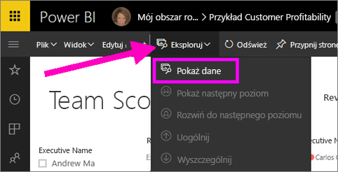
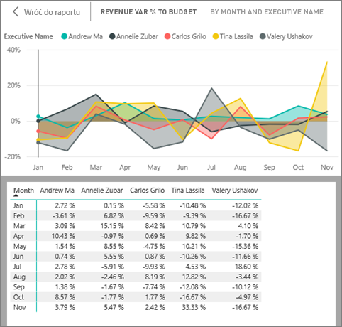
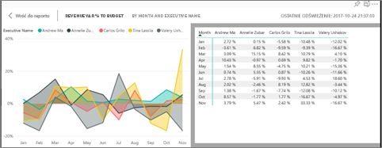
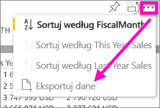

# Wyświetlanie danych użytych podczas tworzenia wizualizacji
## Wyświetlanie danych
Wizualizacja usługi Power BI jest tworzona przy użyciu danych z zestawów danych. Jeśli interesują Cię informacje niewidoczne na pierwszym planie, usługa Power BI umożliwia *wyświetlenie* danych używanych do tworzenia wizualizacji. Po wybraniu pozycji **Pokaż dane** usługa Power BI wyświetli dane poniżej (lub obok) wizualizacji.

Można także eksportować dane używane do tworzenia wizualizacji jako plik xlsx lub csv i wyświetlić je w programie Excel. Aby uzyskać więcej informacji, zobacz [Eksportowanie danych z wizualizacji usługi Power BI](power-bi-visualization-export-data.md).

> [!NOTE]
> Opcje *Pokaż dane* i *Eksportuj dane* są dostępne zarówno w usłudze Power BI, jak i programie Power BI Desktop. Program Power BI Desktop zapewnia jednak jedną dodatkową warstwę szczegółów — pozycja [*Pokaż rekordy* umożliwia wyświetlenie rzeczywistych wierszy z zestawu danych](desktop-see-data-see-records.md).
> 
> 

## Korzystanie z opcji *Pokaż dane* w usłudze Power BI
1. W usłudze Power BI otwórz raport w [widoku do czytania lub widoku do edycji](service-reading-view-and-editing-view.md), a następnie wybierz wizualizację.  W programie Power BI Desktop otwórz widok raportu.
2. Aby wyświetlić dane, na których wizualizacja jest oparta, wybierz pozycję **Eksploruj** > **Pokaż dane**.
   
   
3. Domyślnie dane są wyświetlane poniżej wizualizacji.
   
   
4. Aby zmienić orientację, wybierz układ pionowy  w prawym górnym rogu wizualizacji.
   
   
5. Aby wyeksportować dane do pliku CSV, wybierz wielokropek, a następnie polecenie **Eksportuj dane**.
   
    
   
    Aby uzyskać więcej informacji o eksportowaniu danych do programu Excel, zobacz [Eksportowanie danych z wizualizacji usługi Power BI](power-bi-visualization-export-data.md).
6. Aby ukryć dane, cofnij zaznaczenie pozycji **Eksploruj** > **Pokaż dane**.

### Następne kroki
[Eksportowanie danych z wizualizacji usługi Power BI](power-bi-visualization-export-data.md)    
[Wizualizacje w raportach usługi Power BI](power-bi-report-visualizations.md)    
[Raporty usługi Power BI](service-reports.md)    
[Power BI — podstawowe pojęcia](service-basic-concepts.md)    
Masz więcej pytań? [Odwiedź społeczność usługi Power BI](http://community.powerbi.com/)

