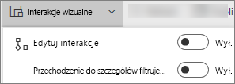
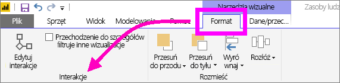
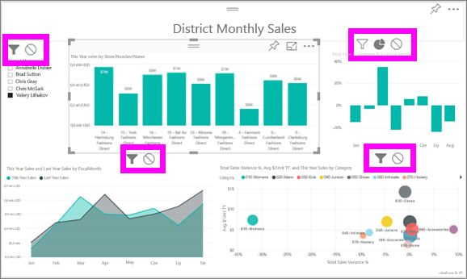

# Interakcje wizualizacji w raporcie usługi Power BI
Jeśli masz uprawnień do edytowania raportu, możesz użyć pozycji **Interakcje wizualne**, aby zmienić sposób wpływania wizualizacji na siebie nawzajem na stronie raportu. 

Domyślnie wizualizacje na stronie raportu mogą służyć do krzyżowego filtrowania i wyróżniania innych wizualizacji na stronie.
Na przykład wybranie stanu na wizualizacji mapy powoduje wyróżnienie wykresu kolumnowego i filtruje wykres liniowy, aby wyświetlić tylko te dane, które dotyczą tego jednego stanu.
Zobacz [Informacje o filtrowaniu i wyróżnianiu](power-bi-reports-filters-and-highlighting.md). A jeśli masz wizualizacje, które obsługują [przechodzenie do szczegółów](power-bi-visualization-drill-down.md), domyślnie przechodzenie do szczegółów jednej wizualizacji nie ma wpływu na inne wizualizacje na stronie raportu. Oba te zachowania domyślne można przesłonić, a interakcje skonfigurować dla poszczególnych wizualizacji.

W tym artykule przedstawiono sposób użycia **Interakcji wizualnych** w [Widoku do edycji](service-interact-with-a-report-in-editing-view.md) usługi Power BI i w programie Power BI Desktop. Jeśli raport został Ci udostępniony, nie będzie można zmienić ustawień interakcji wizualnych.

> [!NOTE]
> Terminy *filtr krzyżowy* i *wyróżnienie krzyżowe* służą do odróżnienia opisanego tutaj zachowania od tego, co się dzieje, gdy używasz okienka **Filtry** do filtrowania i wyróżniania wizualizacji.  
> 
> 

<iframe width="560" height="315" src="https://www.youtube.com/embed/N_xYsCbyHPw?list=PL1N57mwBHtN0JFoKSR0n-tBkUJHeMP2cP" frameborder="0" allowfullscreen></iframe>

1. Wybierz wizualizację, aby ją uaktywnić.  
2. Wyświetl opcje **Interakcji wizualnych**.
    - W usłudze Power BI wybierz listę rozwijaną z paska menu raportu.

       

    - W programie Desktop wybierz pozycje **Format > Interakcje**.

        

3. Aby włączyć kontrolki interakcji wizualizacji, wybierz pozycję **Edytuj interakcje**. Usługa Power BI dodaje ikony filtru i wyróżnienia krzyżowego do wszystkich innych wizualizacji na stronie raportu.
   
    
3. Ustal, jaki wpływ wybrana wizualizacja powinna mieć na inne.  Opcjonalnie powtórz to dla wszystkich innych wizualizacji na stronie raportu.
   
   * Jeśli powinna filtrować krzyżowo wizualizacje, wybierz ikonę **filtru** .
   * Jeśli powinna wyróżniać krzyżowo tę wizualizację, wybierz ikonę **wyróżnienia** .
   * Jeśli nie powinna mieć żadnego wpływu, wybierz ikonę **brak wpływu** .

4. Aby włączyć kontrolki przechodzenia do szczegółów, wybierz pozycję **Przechodzenie do szczegółów filtruje inne elementy wizualne**.  Teraz po przejściu do szczegółów (i uogólnieniu) wizualizacji inne wizualizacje na stronie raportu zmienią się, aby odzwierciedlić bieżący wybór przechodzenia do szczegółów. 

   

### Następne kroki
[Jak używać filtrów raportu](power-bi-how-to-report-filter.md)

[Filtry i wyróżnianie w raportach](power-bi-reports-filters-and-highlighting.md)

[Power BI — podstawowe pojęcia](service-basic-concepts.md)

Masz więcej pytań? [Odwiedź społeczność usługi Power BI](http://community.powerbi.com/)

