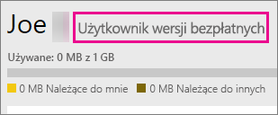
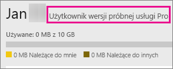

# Rejestrowanie się w usłudze Power BI jako użytkownik indywidualny
Dowiedz się, jak utworzyć konto usługi Power BI i zacząć z niego korzystać na potrzeby osobistych raportów i wizualizacji.

Usługa Power BI może być osobistym narzędziem do raportowania i wizualizacji, a także służyć jako aparat obsługujący analizy i proces podejmowania decyzji na potrzeby grupy projektów, działów lub całych firm.

Ten artykuł pomoże Ci zarejestrować się i zacząć korzystać z usługi Power BI. Aby uzyskać informacje na temat różnic między usługą Power BI w wersji bezpłatnej a usługą Power BI Pro, zobacz [Power BI — wersja bezpłatna a wersja Pro](service-free-vs-pro.md).

## Masz kilka opcji
Jako użytkownik indywidualny masz kilka opcji, aby zarejestrować się i zacząć korzystać z usługi Power BI. Możesz utworzyć bezpłatne konto lub możesz kupić subskrypcję usługi Power BI Pro. Jeśli utworzysz bezpłatne konto, po przejściu do usługi możesz zdecydować się na 60-dniową wersję próbną usługi Power BI Pro.

Jeśli jesteś częścią istniejącej organizacji korzystającej z usługi Office 365, możesz nadal zarejestrować się, aby utworzyć bezpłatne konto. Administrator IT także ma pewne opcje zakupu usługi Power BI Pro i przypisania licencji. Aby uzyskać więcej informacji o opcjach dostępnych dla administratora IT, zobacz [Zakup usługi Power BI Pro](service-admin-purchasing-power-bi-pro.md).

> [!NOTE]
> Jeśli użytkownik znajduje się w organizacji, funkcja rejestracji użytkowników indywidualnych może być wyłączona. Zobacz sekcję [Rejestracja użytkowników indywidualnych została wyłączona](#individual-sign-up-has-been-turned-off), aby uzyskać więcej informacji w przypadku wyświetlenia komunikatu o błędzie z informacją, że ta funkcja została wyłączona.
>

## Czego potrzebujesz, aby się zarejestrować?

Aby zarejestrować się w usłudze Power BI, potrzebujesz działającego adresu e-mail. Podczas rejestrowania się w usłudze Power BI nie można podać osobistego adresu e-mail.

### Jakiego adresu e-mail można używać w usłudze Power BI?
Usługa Power BI wymaga użycia służbowego adresu e-mail podczas rejestracji. Nie można zarejestrować się w usłudze Power BI przy użyciu adresów e-mail dostarczonych przez dostawców konsumenckich usług poczty e-mail ani dostawców usług telekomunikacyjnych, w tym outlook.com, hotmail.com, gmail.com itd.

Jeśli spróbujesz zarejestrować się przy użyciu osobistego adresu e-mail, zostanie wyświetlony komunikat z prośbą o użycie służbowego adresu e-mail.

> [!NOTE]
> W usłudze Power BI można się zarejestrować, korzystając z adresów w domenie .gov lub .mil. Aby uzyskać informacje na ten temat, zobacz [Rejestrowanie organizacji rządowej USA w usłudze Power BI](https://docs.microsoft.com/en-us/power-bi/service-govus-signup).
>

> [!NOTE]
> Po rejestracji można [zapraszać gości](https://docs.microsoft.com/en-us/azure/active-directory/active-directory-b2b-what-is-azure-ad-b2b) do wyświetlania zawartości w Twojej dzierżawie usługi Power BI. Mogą oni korzystać z dowolnego adresu e-mail, w tym konta osobistego.
>

## Której opcji potrzebujesz?
Aby określić, czego potrzebujesz, zobacz, co jest dostarczane z poszczególnymi typami licencji. Użytkownicy wersji bezpłatnej otrzymują większość funkcjonalności usług, z wyjątkiem funkcji udostępniania i współpracy. Użytkownicy usługi Power BI Pro mogą korzystać ze wszystkich funkcji w usłudze, ale nie jest ona bezpłatna. Jeśli nie musisz udostępniać żadnej zawartości, wersja bezpłatna może być opcją dla Ciebie. Więcej informacji na ten temat można znaleźć na [stronie cennika usługi Power BI](https://powerbi.microsoft.com//pricing/).

W dalszej części tego artykułu opisano sposób rejestrowania się dla każdej opcji.

## Rejestrowanie się w usłudze Power BI (bezpłatnej) jako użytkownik indywidualny
Najszybszym sposobem zarejestrowania się w usłudze Power BI jest utworzenie bezpłatnego konta w usłudze Power BI. To konto jest całkowicie bezpłatne i umożliwia korzystanie z wielu spośród funkcji dostępnych w usłudze.

> [!NOTE]
> Jeśli otrzymasz komunikat, że rozpoznaliśmy Cię jako istniejącego użytkownika, spróbuj przejść do witryny https://app.powerbi.com i zalogować się.
> 
> 

Aby zarejestrować się w usłudze Power BI, możesz wykonać poniższe czynności.

1. Przejdź do witryny [powerbi.com](https://powerbi.microsoft.com).
2. Wybierz pozycję **Rozpocznij za darmo** lub **Bezpłatna rejestracja**.
   
    
3. Na stronie Wprowadzenie wybierz pozycję **Wypróbuj bezpłatnie >** w obszarze usługi Power BI.
   
    
4. Wprowadź adres e-mail używany do rejestracji, a następnie wybierz pozycję **Zarejestruj**. Upewnij się, że Twój adres e-mail jest dozwolony na potrzeby rejestrowania się. Aby uzyskać więcej informacji na temat adresu e-mail, którego można użyć, zobacz sekcję [Jakiego adresu e-mail można używać w usłudze Power BI?](#what-email-address-can-be-used-with-power-bi).
   
    
5. Otrzymasz komunikat z prośbą o sprawdzenie poczty e-mail.
   
    
6. Wybierz link znajdujący się w wiadomości, aby zweryfikować swój adres e-mail. Spowoduje to powrót do przepływu rejestracji. Może być konieczne podanie dodatkowych informacji osobistych.
7. Następnie nastąpi przekierowanie do witryny https://app.powerbi.com i możesz rozpocząć korzystanie z usługi Power BI jako użytkownik bezpłatnego konta.

### Jak to wygląda w usłudze
Podczas pracy w usłudze możesz sprawdzić, czy masz bezpłatne konto, przechodząc do ikony **koła zębatego** i wybierając pozycję **Zarządzaj magazynem osobistym**.

### Co zrobić, jeśli użytkownik jest już częścią istniejącej organizacji?
Jeśli Twoje konto jest częścią istniejącej organizacji, otrzymasz komunikat z prośbą o zalogowanie się za pomocą tego konta. Wybierz pozycję **Kontynuuj** i zaloguj się przy użyciu swoich danych logowania usługi Office 365.

Zostanie wtedy wyświetlony komunikat z prośbą o wybranie pozycji **Rozpoczęcie**.

## 60-dniowa wersja próbna usługi Power BI Pro wewnątrz usługi
Po zarejestrowaniu się i utworzeniu bezpłatnego konta możesz opcjonalnie wypróbować wersję Pro usługi bezpłatnie przez 60 dni. Podczas okresu próbnego będziesz mieć dostęp do wszystkich funkcji usługi Power BI Pro. Usługa Power BI Pro oferuje wszystkie funkcje bezpłatnej wersji usługi Power BI oraz dodatkowe funkcje udostępniania i współpracy. Aby uzyskać więcej informacji, zobacz [Cennik usługi Power BI](https://powerbi.microsoft.com/pricing). Aby wypróbować 60-dniową bezpłatną wersję próbną usługi Power BI Pro, zaloguj się do usługi Power BI i wypróbuj jedną z następujących funkcji usługi Power BI Pro:

* [Tworzenie obszaru roboczego aplikacji](service-create-distribute-apps.md)
* [Udostępnianie pulpitu nawigacyjnego](service-share-dashboards.md)

Kiedy zaczniesz korzystać z dowolnej z tych funkcji, zostanie wyświetlony monit o rozpoczęcie bezpłatnego okresu próbnego. Możesz również rozpocząć okres próbny, przechodząc do ikony koła zębatego i wybierając pozycję **Zarządzaj magazynem osobistym**. Następnie wybierz pozycję **Wypróbuj bezpłatnie wersję Pro** po prawej stronie.

Następnie wybierz pozycję **Rozpocznij okres próbny**.

>[!NOTE]
>Użytkownicy korzystający z tej wersji próbnej usługi Power BI Pro w ramach produktu nie są widoczni w portalu administracyjnym usługi Office 365 jako użytkownicy wersji próbnej usługi Power BI Pro (są wyświetlani jako użytkownicy wersji bezpłatnej usługi Power BI). Będą jednak wyświetlani jako użytkownicy usługi Power BI Pro w wersji próbnej na stronie **zarządzania magazynem** w usłudze Power BI.

>[!NOTE]
>Jeśli jesteś administratorem IT i chcesz uzyskać oraz wdrożyć licencje na wersję próbną usługi Power BI dla wielu użytkowników w organizacji bez konieczności akceptowania warunków wersji próbnej przez poszczególnych użytkowników, możesz zarejestrować się, korzystając z [wersji próbnej subskrypcji usługi Power BI Pro](https://portal.office.com/Signup/MainSignup15.aspx?OfferId=d59682f3-3e3b-4686-9c00-7c7c1c736085&dl=POWER_BI_PRO). Musisz być przy tym administratorem globalnym lub administratorem rozliczeń w usłudze Office 365 albo utworzyć nową dzierżawę, aby umożliwić rejestrację w wersji próbnej dla administratora. Aby uzyskać więcej informacji, zobacz [Zakup usługi Power BI Pro](service-admin-purchasing-power-bi-pro.md).
> 
> [!NOTE]
> Wraz z dostępnością usługi Power BI Premium i zmianami w ofercie bezpłatnej usługi Power BI od 1 czerwca 2017 możesz zyskać uprawnienia do skorzystania z rozszerzonej wersji próbnej Pro. Aby uzyskać więcej informacji, zobacz [Aktywacja rozszerzonej wersji próbnej Pro](service-extended-pro-trial.md).
> 
> 

### Jak to wygląda w usłudze
Podczas pracy w usłudze możesz sprawdzić, czy masz konto wersji próbnej Pro, przechodząc do ikony **koła zębatego* i wybierając pozycję **Zarządzaj magazynem osobistym**.

## Co zrobić, jeśli chcesz uzyskać pełną usługę Power BI Pro?
Nie masz możliwości uzyskania licencji usługi Power BI Pro jako użytkownik indywidualny. Konieczne będzie skontaktowanie się z administratorem IT w celu zakupienia licencji i przypisania jej do Twojego konta użytkownika. Aby uzyskać więcej informacji, zobacz [Zakup usługi Power BI Pro](service-admin-purchasing-power-bi-pro.md).

## Rozwiązywanie problemów
W wielu przypadkach rejestrację w usłudze Power BI można przeprowadzić, wykonując prosty proces rejestracji samoobsługowej opisany powyżej. Jednak niekiedy z pewnych przyczyn nie można ukończyć rejestracji samoobsługowej.  Poniższa tabela zawiera podsumowanie najbardziej typowych przyczyn tych problemów i sposobów na ich obejście.

| **Objaw / komunikat o błędzie** | **Przyczyna i obejście** |
| --- | --- |
| **Osobiste adresy e-mail (np. nancy@gmail.com)** Podczas rejestrowania się pojawia się następujący komunikat:    *Wprowadzony adres e-mail jest adresem prywatnym: wprowadź swój służbowy adres e-mail, aby umożliwić bezpieczne przechowywanie danych firmowych.*    lub    *That looks like a personal email address. Enter your work address so we can connect you with others in your company. And don’t worry. We won’t share your address with anyone. (Ten adres wygląda na osobisty adres e-mail. Wprowadź swój adres służbowy, abyśmy mogli połączyć Cię z innymi użytkownikami w firmie. I nie martw się, nie udostępnimy nikomu Twojego adresu).* |Usługa Power BI nie obsługuje adresów e-mail dostarczonych przez dostawców konsumenckich usług poczty e-mail ani dostawców usług telekomunikacyjnych.    Aby ukończyć rejestrację, spróbuj ponownie, używając swojego służbowego adresu e-mail.    Jeśli nadal nie możesz zarejestrować się, ale chcesz ukończyć bardziej zaawansowany proces konfiguracji, [zarejestruj się, aby uzyskać nową subskrypcję wersji próbnej Office 365 i użyj adresu e-mail przypisanego do tej subskrypcji w celu zarejestrowania się](service-admin-signing-up-for-power-bi-with-a-new-office-365-trial.md).    Zaproś konto użytkownika jako [gościa Azure B2B](https://docs.microsoft.com/en-us/azure/active-directory/active-directory-b2b-what-is-azure-ad-b2b). |
| **Rejestracja samoobsługowa jest wyłączona** Podczas rejestracji został wyświetlony poniższy komunikat:    *We can't finish signing you up. Your IT department has turned off signup for Microsoft Power BI. Contact them to complete signup. (Nie możemy ukończyć rejestrowania Ciebie. Twój dział IT wyłączył rejestrowanie w programie Microsoft Flow. Aby ukończyć rejestrowanie, skontaktuj się z działem IT).*    lub    *That looks like a personal email address. Enter your work address so we can connect you with others in your company. And don’t worry. We won’t share your address with anyone. (Ten adres wygląda na osobisty adres e-mail. Wprowadź swój adres służbowy, abyśmy mogli połączyć Cię z innymi użytkownikami w firmie. I nie martw się, nie udostępnimy nikomu Twojego adresu).* |Administrator IT Twojej organizacji wyłączył możliwość samoobsługowej rejestracji w usłudze Power BI.    Aby ukończyć rejestrację, skontaktuj się z administratorem IT. Poproś go o wykonanie instrukcji wyświetlanych na stronie, aby zezwolić istniejącym użytkownikom na rejestrowanie się w programie Microsoft Flow, a nowym użytkownikom na dołączanie do istniejącej dzierżawy.    Ten problem może również występować, jeśli rejestracji w usłudze Office 365 dokonano przez partnera. [Dowiedz się więcej](service-admin-syndication-partner.md)    [Usługa Power BI w organizacji](https://support.office.com/en-ca/article/Power-BI-in-your-Organization-d7941332-8aec-4e5e-87e8-92073ce73dc5#BKMK_HowCanIAllowO365Tenant) |
| **Adres e-mail nie jest identyfikatorem usługi Office 365** Podczas rejestrowania się pojawia się następujący komunikat:    *We can't find you at contoso.com.  Do you use a different ID at work or school?   Try signing in with that, and if it doesn't work, contact your IT department. (Nie możemy znaleźć Twoich danych w domenie contoso.com. Czy w pracy lub w szkole korzystasz z innego identyfikatora? Spróbuj utworzyć konto, korzystając z tego identyfikatora, a jeśli to nie zadziała, skontaktuj się z działem IT w swojej organizacji).* |Do logowania się do usługi Office 365 i innych usług firmy Microsoft Twoja organizacja używa innych identyfikatorów niż adres e-mail.  Na przykład Twój adres e-mail to Nancy.Smith@contoso.com, ale Twój identyfikator to nancys@contoso.com.    Aby ukończyć rejestrację, użyj identyfikatora, który został Ci przypisany przez organizację w celu logowania się do usługi Office 365 lub innych usług firmy Microsoft.  Jeśli nie wiesz, jaki jest Twój identyfikator, skontaktuj się z administratorem IT.    Jeśli nadal nie możesz zarejestrować się, ale możesz ukończyć bardziej zaawansowany proces konfiguracji, [zarejestruj się, aby uzyskać nową subskrypcję wersji próbnej Office 365 i użyj adresu e-mail przypisanego do tej subskrypcji w celu zarejestrowania się](service-admin-signing-up-for-power-bi-with-a-new-office-365-trial.md). |

## Następne kroki
[Usługa Power BI (wersja bezpłatna) w organizacji](service-admin-service-free-in-your-organization.md)  
[Zakup usługi Power BI Pro](service-admin-purchasing-power-bi-pro.md)  
[Umowa usługi Power BI dla użytkowników indywidualnych](https://powerbi.microsoft.com/terms-of-service/)  
[Power BI Premium — co to jest?](service-premium.md)  
[Oficjalny dokument firmy Microsoft na temat usługi Power BI Premium](https://aka.ms/pbipremiumwhitepaper)  

Masz więcej pytań? [Zadaj pytanie społeczności usługi Power BI](http://community.powerbi.com/)

