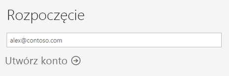

# Rejestrowanie się w usłudze Power BI jako użytkownik indywidualny

Usługa Power BI może być osobistym narzędziem do raportowania i wizualizacji, a także służyć jako aparat obsługujący analizy i proces podejmowania decyzji na potrzeby grupy projektów, działów lub całych firm. W tym artykule wyjaśniono, jak utworzyć konto wersji próbnej usługi Power BI jako użytkownik indywidualny. Jeśli jesteś administratorem usługi Power BI, zobacz [Licencjonowanie usługi Power BI w organizacji](service-admin-licensing-organization.md).

## Obsługiwane adresy e-mail

Przed rozpoczęciem procesu rejestracji należy zapoznać się z typami adresów e-mail, których można użyć w usłudze Power BI:

* Usługa Power BI wymaga użycia służbowego adresu e-mail podczas rejestracji. Nie można zarejestrować się przy użyciu adresów e-mail dostarczonych przez dostawców konsumenckich usług poczty e-mail ani dostawców usług telekomunikacyjnych, w tym outlook.com, hotmail.com, gmail.com itd.

* Po rejestracji można [zapraszać użytkowników-gości](https://docs.microsoft.com/azure/active-directory/active-directory-b2b-what-is-azure-ad-b2b) do wyświetlania zawartości w Twojej usłudze Power BI. Mogą oni korzystać z dowolnego adresu e-mail, w tym konta osobistego.

* Możesz zarejestrować się w usłudze Power BI, używając adresu w domenie .gov lub .mil, ale wymaga to skorzystania z innej procedury. Aby uzyskać więcej informacji, zobacz [Rejestrowanie organizacji rządowej USA w usłudze Power BI](service-govus-signup.md).

## Tworzenie konta bezpłatnej wersji próbnej

Aby utworzyć konto wersji próbnej usługi Power BI Pro, wykonaj następujące czynności. Zobacz następną sekcję [Wygaśnięcie wersji próbnej](#trial-expiration), aby dowiedzieć się, jakie masz opcje, gdy ta wersja próbna wygaśnie.

1. Przejdź do [strony rejestracji](https://app.powerbi.com/signupredirect?pbi_source=web) w usłudze Power BI.

1. Wprowadź swój adres e-mail, a następnie wybierz pozycję **Utwórz konto**.

    

1. Jeśli otrzymasz komunikat podobny do poniższego, wybierz opcję otrzymania kodu weryfikacyjnego, a następnie przejdź do kolejnego kroku tej procedury.

    

    Jeśli otrzymasz komunikat podobny do poniższego, wykonaj odpowiednie czynności, aby zalogować się i korzystać z usługi Power BI.

    

1. Wprowadź otrzymany kod, a następnie wybierz pozycję **Utwórz konto**.

    

1. Na swoim koncie e-mail poszukaj wiadomości podobnej do poniższej.

    

1. Na następnym ekranie wprowadź swoje dane oraz kod weryfikacyjny otrzymany w wiadomości e-mail. Wybierz region, zapoznaj się z zasadami, do których prowadzi link na tym ekranie, a następnie wybierz pozycję **Rozpocznij**.

    

1. Nastąpi przekierowanie do strony https://app.powerbi.com, gdzie możesz rozpocząć korzystanie z usługi Power BI.

    

## Wygaśnięcie wersji próbnej

Po wygaśnięciu wersji próbnej usługi Power BI Pro, Twoja licencja zmieni się na licencję usługi Power BI (wersja bezpłatna). W takiej sytuacji nie będziesz mieć już dostępu do funkcji, które wymagają licencji usługi Power BI Pro. Aby uzyskać więcej informacji, zobacz [Funkcje według typu licencji](service-features-license-type.md).

Jeśli licencja usługi Power BI (wersja bezpłatna) jest wystarczająca, nie musisz wykonywać żadnych dodatkowych działań. Jeśli chcesz korzystać z funkcji usługi Power BI Pro, zwróć się do administratora IT w sprawie zakupu licencji usługi Power BI Pro.

## Rozwiązywanie problemów podczas tworzenia konta

W większości przypadków możesz zarejestrować się w usłudze Power BI, wykonując opisane tu czynności. Mogą jednak wystąpić problemy uniemożliwiające ukończenie rejestracji. Te problemy wraz z rozwiązaniami zostały omówione w poniższej tabeli.

|                                                                                                                                                                                                                          **Objaw / komunikat o błędzie**                                                                                                                                                                                                                           |                                                                                                                                                                                                                                                                                                                                                **Przyczyna i obejście**                                                                                                                                                                                                                                                                                                                                                |
|--------------------------------------------------------------------------------------------------------------------------------------------------------------------------------------------------------------------------------------------------------------------------------------------------------------------------------------------------------------------------------------------------------------------------------------------------------------------------------|------------------------------------------------------------------------------------------------------------------------------------------------------------------------------------------------------------------------------------------------------------------------------------------------------------------------------------------------------------------------------------------------------------------------------------------------------------------------------------------------------------------------------------------------------------------------------------------------------------------------------------------------------------------------------------------------------------------------|
| <strong>Osobiste adresy e-mail (np. nancy@gmail.com)</strong> Podczas rejestrowania się pojawia się następujący komunikat:    *Wprowadzony adres e-mail jest adresem prywatnym: wprowadź swój służbowy adres e-mail, aby umożliwić bezpieczne przechowywanie danych firmowych.*    lub    *That looks like a personal email address. Enter your work address so we can connect you with others in your company. And don’t worry. We won’t share your address with anyone. (Ten adres wygląda na osobisty adres e-mail. Wprowadź swój adres służbowy, abyśmy mogli połączyć Cię z innymi użytkownikami w firmie. I nie martw się, nie udostępnimy nikomu Twojego adresu).* |                          Usługa Power BI nie obsługuje adresów e-mail dostarczonych przez dostawców konsumenckich usług poczty e-mail ani dostawców usług telekomunikacyjnych.    Aby ukończyć rejestrację, spróbuj ponownie, używając swojego służbowego adresu e-mail.    Jeśli nadal nie możesz zarejestrować się, ale chcesz ukończyć bardziej zaawansowany proces konfiguracji, [zarejestruj się, aby uzyskać nową subskrypcję wersji próbnej Office 365 i użyj adresu e-mail przypisanego do tej subskrypcji w celu zarejestrowania się](service-admin-signing-up-for-power-bi-with-a-new-office-365-trial.md).    Możesz również zwrócić się do istniejącego użytkownika, aby [zaprosił Cię jako gościa](service-admin-azure-ad-b2b.md).                           |
|            **Rejestracja samoobsługowa jest wyłączona** Podczas rejestracji został wyświetlony poniższy komunikat:    *We can't finish signing you up. Your IT department has turned off signup for Microsoft Power BI. Contact them to complete signup. (Nie możemy ukończyć rejestrowania Ciebie. Twój dział IT wyłączył rejestrowanie w programie Microsoft Flow. Aby ukończyć rejestrowanie, skontaktuj się z działem IT).*    lub    *That looks like a personal email address. Enter your work address so we can connect you with others in your company. And don’t worry. We won’t share your address with anyone. (Ten adres wygląda na osobisty adres e-mail. Wprowadź swój adres służbowy, abyśmy mogli połączyć Cię z innymi użytkownikami w firmie. I nie martw się, nie udostępnimy nikomu Twojego adresu).*             |                             Administrator IT Twojej organizacji wyłączył możliwość samoobsługowej rejestracji w usłudze Power BI.    Aby ukończyć rejestrację, skontaktuj się z administratorem IT i poproś go o [wykonanie instrukcji w celu włączenia możliwości rejestracji](service-admin-licensing-organization.md#enable-or-disable-individual-user-sign-up-in-azure-active-directory).    Ten problem może również występować, jeśli [rejestracji w usłudze Office 365 dokonano za pośrednictwem partnera](service-admin-syndication-partner.md). |
|                                                                                          **Adres e-mail nie jest identyfikatorem usługi Office 365** Podczas rejestrowania się pojawia się następujący komunikat:    *We can't find you at contoso.com.  Do you use a different ID at work or school?   Try signing in with that, and if it doesn't work, contact your IT department. (Nie możemy znaleźć Twoich danych w domenie contoso.com. Czy w pracy lub w szkole korzystasz z innego identyfikatora? Spróbuj utworzyć konto, korzystając z tego identyfikatora, a jeśli to nie zadziała, skontaktuj się z działem IT w swojej organizacji).*                                                                                           | Do logowania się do usługi Office 365 i innych usług firmy Microsoft Twoja organizacja używa innych identyfikatorów niż adres e-mail.  Na przykład Twój adres e-mail to Nancy.Smith@contoso.com, ale Twój identyfikator to nancys@contoso.com.    Aby ukończyć rejestrację, użyj identyfikatora, który został Ci przypisany przez organizację w celu logowania się do usługi Office 365 lub innych usług firmy Microsoft.  Jeśli nie wiesz, jaki jest Twój identyfikator, skontaktuj się z administratorem IT.    Jeśli nadal nie możesz zarejestrować się, ale chcesz ukończyć bardziej zaawansowany proces konfiguracji, [zarejestruj się, aby uzyskać nową subskrypcję wersji próbnej Office 365 i użyj adresu e-mail przypisanego do tej subskrypcji w celu zarejestrowania się](service-admin-signing-up-for-power-bi-with-a-new-office-365-trial.md). |
|  |  |

## Następne kroki

[Zakup usługi Power BI Pro](service-admin-purchasing-power-bi-pro.md)  
[Umowa usługi Power BI dla użytkowników indywidualnych](https://powerbi.microsoft.com/terms-of-service/)  

Masz więcej pytań? [Zadaj pytanie społeczności usługi Power BI](http://community.powerbi.com/)