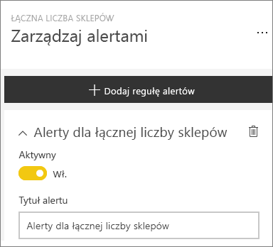
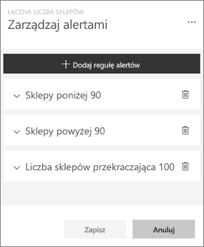
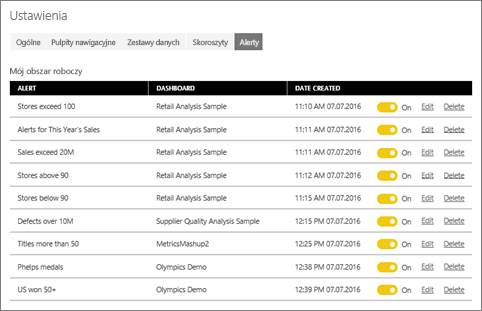

# Alerty dotyczące danych w usłudze Power BI
Ustaw alerty, aby otrzymywać powiadomienia, gdy zmiany dotyczące danych w pulpitach nawigacyjnych przekroczą ustalone progi. 

Alerty dla kafelków możesz ustawiać, jeśli masz licencję usługi Power BI Pro lub jeśli udostępniono Ci pulpit nawigacyjny z [pojemności Premium](service-premium.md). Alerty można ustawić tylko dla kafelków przypiętych z poziomu wizualizacji raportu oraz tylko dla mierników, kluczowych wskaźników wydajności i kart. Alerty można ustawić dla wizualizacji utworzonych na podstawie zestawów danych przesyłania strumieniowego, które zostały przypięte z poziomu raportu do pulpitu nawigacyjnego, ale nie można ich ustawić dla kafelków przesyłania strumieniowego utworzonych bezpośrednio na pulpicie nawigacyjnym przy użyciu pozycji **Dodaj kafelek** > **Niestandardowe dane przesyłane strumieniowo**. 

Tylko Ty możesz zobaczyć ustawione przez siebie alerty, nawet jeśli udostępniasz pulpit nawigacyjny. Alerty dotyczące danych są w pełni zsynchronizowane między platformami. Możesz je ustawiać i wyświetlać [w aplikacjach mobilnych Power BI](mobile-set-data-alerts-in-the-mobile-apps.md) i w usłudze Power BI. Nie są dostępne w programie Power BI Desktop. Alerty można nawet [zautomatyzować i zintegrować z usługą Microsoft Flow](https://flow.microsoft.com) - [spróbuj to zrobić samodzielnie](service-flow-integration.md).

> [!WARNING]
> Powiadomienia o alertach oparte na danych dostarczają informacji o danych. Jeśli dane usługi Power BI są przeglądane na urządzeniu przenośnym i to urządzenie zostanie skradzione, zaleca się wyłączenie wszystkich reguł alertów opartych na danych przy użyciu usługi Power BI.
> 
> 

## Ustawianie alertów dotyczących danych w usłudze Power BI
Zobacz, jak Amanda dodaje alerty do kafelków pulpitu nawigacyjnego. Następnie postępuj zgodnie ze szczegółowymi instrukcjami poniżej wideo, aby wypróbować to samodzielnie.

<iframe width="560" height="315" src="https://www.youtube.com/embed/JbL2-HJ8clE" frameborder="0" allowfullscreen></iframe>

W tym przykładzie użyto kafelku karty z pulpitu nawigacyjnego przykładu Retail Analysis.

1. Rozpocznij na pulpicie nawigacyjnym. Z poziomu miernika, kluczowego wskaźnika wydajności lub kafelka karty pulpitu nawigacyjnego wybierz wielokropek.
   
   
2. Wybierz ikonę dzwonka , aby dodać jeden lub więcej alertów dla pozycji **Total stores**.
   
1. Na początek wybierz opcję **+ Dodaj regułę alertów**, upewnij się, że suwak jest w pozycji **Włączony** i nadaj tytuł alertowi. Tytuły ułatwiają rozpoznawanie alertów.
   
   
4. Przewiń w dół, a następnie wprowadź szczegóły alertu.  W tym przykładzie utworzymy alert, który raz dziennie będzie powiadamiał, jeśli łączna liczba sklepów przekroczy wartość 100. Alerty zostaną wyświetlone w centrum powiadomień. Poza tym usługa Power BI wyśle wiadomość e-mail.
   
   
5. Wybierz pozycję **Zapisz**.

## Otrzymywanie alertów
Gdy śledzone dane osiągną jeden z ustawionych progów, zostanie wykonanych kilka działań. Najpierw usługa Power BI sprawdzi, czy od ostatniego wysłania alertu upłynęła więcej niż godzina lub więcej niż 24 godziny (w zależności od wybranej opcji). Jeśli dane przekroczą wyznaczony próg, otrzymasz alert.

Następnie usługa Power BI wysyła alert do centrum powiadomień i, opcjonalnie, w wiadomości e-mail. Każdy alert zawiera bezpośredni link do danych. Wybierz link, aby wyświetlić odpowiedni kafelek, gdzie możesz eksplorować, udostępniać i zdobywać dodatkowe informacje.  

1. Jeśli ustawiony przez Ciebie alert ma wysyłać wiadomości e-mail, w swojej skrzynce odbiorczej znajdziesz wiadomość podobną do tej.
   
   
2. Usługa Power BI dodaje komunikat do **centrum powiadomień** oraz ikonę nowego alertu do odpowiedniego kafelka.
   
   
3. Otwórz centrum powiadomień, aby wyświetlić szczegóły alertu.
   
    
   
   > [!NOTE]
   > Alerty działają tylko z odświeżonymi danymi. Podczas odświeżania danych usługa Power BI sprawdza, czy został dla nich ustawiony alert. Jeśli dane osiągną wartość progową alertu, alert zostanie wywołany.
   > 
   > 

## Zarządzanie alertami
Istnieje wiele sposobów zarządzania alertami: z poziomu kafelka pulpitu nawigacyjnego, z poziomu menu ustawień usługi Power BI oraz z poziomu pojedynczego kafelka w [aplikacji mobilnej usługi Power BI na telefonie iPhone](mobile-set-data-alerts-in-the-mobile-apps.md) lub [aplikacji mobilnej usługi Power BI dla systemu Windows 10](mobile-set-data-alerts-in-the-mobile-apps.md).

### Z poziomu kafelka
1. Jeśli chcesz zmienić lub usunąć alert dla danego kafelka, otwórz ponownie okno **Zarządzanie alertami**, wybierając ikonę dzwonka . Zostaną wyświetlone wszystkie alerty ustawione dla danego kafelka.
   
    .
2. Aby zmodyfikować alert, wybierz strzałkę po lewej stronie nazwy alertu.
   
    .
3. Aby usunąć alert, wybierz kosz na śmieci po prawej stronie nazwy alertu.
   
      

### Z poziomu menu ustawień usługi Power BI
1. Wybierz ikonę koła zębatego z paska menu usługi Power BI.
   
    .
2. W obszarze **Ustawienia** wybierz pozycję **Alerty**.
   
    
3. W tym miejscu można włączyć i wyłączyć alerty, otworzyć okno **Zarządzanie alertami**, aby zmienić alert, a także usunąć alert.

## Porady i rozwiązywanie problemów
* Alerty nie są obecnie obsługiwane przez kafelki usługi Bing ani kafelki kart z miarami daty i godziny.
* Alerty działają tylko z liczbowymi typami danych.
* Alerty działają tylko z odświeżonymi danymi. Nie działają z danymi statycznymi.
* Alerty będą działać w przypadku zestawów danych przesyłania strumieniowego tylko wtedy, gdy zostanie utworzona wizualizacja raportu dla kluczowego wskaźnika wydajności, karty lub miernika, która następnie zostanie przypięta do pulpitu nawigacyjnego.

## Następne kroki
[Tworzenie przepływu Microsoft Flow zawierającego alert dotyczący danych](service-flow-integration.md)    
[Ustawianie alertów dotyczących danych na urządzeniu przenośnym](mobile-set-data-alerts-in-the-mobile-apps.md)    
[Wprowadzenie do usługi Power BI](service-get-started.md)    
Masz więcej pytań? [Zadaj pytanie społeczności usługi Power BI](http://community.powerbi.com/)

