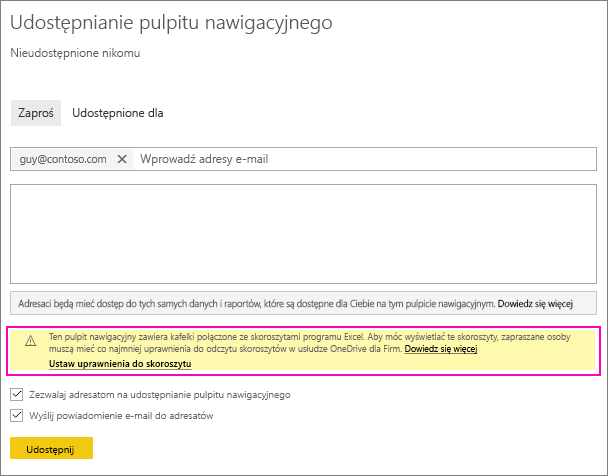
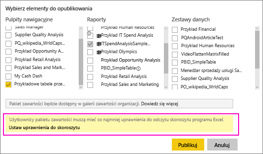
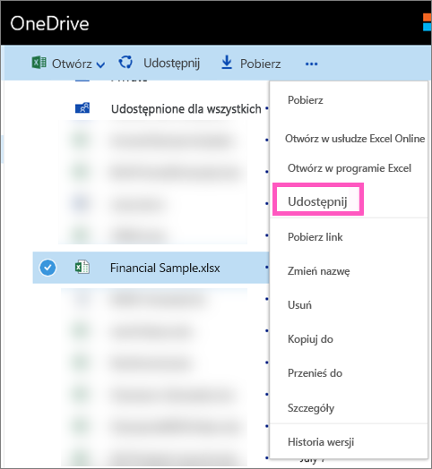

# Udostępnianie pulpitu nawigacyjnego usługi Power BI prowadzącego do pliku programu Excel w usłudze OneDrive
W usłudze Power BI możesz [nawiązać połączenie ze skoroszytami programu Excel w usłudze OneDrive dla Firm](service-excel-workbook-files.md) i przypiąć kafelki do pulpitu nawigacyjnego z tego skoroszytu. Podczas udostępniania tego pulpitu nawigacyjnego lub tworzenia pakietu zawartości obejmującego ten pulpit nawigacyjny:

* Twoi współpracownicy mogą wyświetlić kafelki bez uprawnień do samego skoroszytu. Dzięki temu możesz utworzyć pakiet zawartości i mieć pewność, że współpracownicy będą w stanie wyświetlić kafelki utworzone na podstawie skoroszytu programu Excel w usłudze OneDrive.
* Kliknięcie kafelka spowoduje otworzenie skoroszytu w usłudze Power BI. Skoroszyt zostanie otworzony tylko wtedy, gdy współpracownicy będą mieć co najmniej [uprawnienia do odczytu](https://support.office.com/en-us/article/Share-documents-or-folders-in-Office-365-1fe37332-0f9a-4719-970e-d2578da4941c) do skoroszytu w usłudze OneDrive dla Firm.

## Udostępnianie pulpitu nawigacyjnego zawierającego kafelki skoroszytu
Aby udostępnić pulpit nawigacyjny z linkiem do skoroszytu programu Excel w usłudze OneDrive dla Firm, zobacz [Udostępnianie pulpitu nawigacyjnego](service-share-dashboards.md). Różnica polega na tym, że masz opcję zmodyfikowania uprawnień dla połączonego skoroszytu programu Excel przed jego udostępnieniem.

  

1. Wprowadź adresy e-mail współpracowników.
2. Aby umożliwić współpracownikom wyświetlanie skoroszytu programu Excel z poziomu usługi Power BI, wybierz opcję **Przejdź do usługi OneDrive dla Firm, aby ustawić uprawnienia skoroszytu**.
3. W usłudze OneDrive [zmodyfikuj uprawnienia](https://support.office.com/en-US/article/Share-files-and-folders-and-change-permissions-9fcc2f7d-de0c-4cec-93b0-a82024800c07) zgodnie z potrzebami.
4. Wybierz pozycję **Udostępnij**.

>[!NOTE]
>Współpracownicy nie będą mogli przypiąć dodatkowych kafelków z tego skoroszytu lub wprowadzić zmian w skoroszycie programu Excel z poziomu usługi Power BI.
> 
> 

## Tworzenie organizacyjnego pakietu zawartości z pulpitem nawigacyjnym zawierającym kafelki skoroszytu
Podczas [publikowania pakietu zawartości](service-organizational-content-pack-create-and-publish.md) zapewnia się dostęp dla poszczególnych współpracowników lub grup. Podczas publikowania pakietu zawartości obejmującego linki skoroszytu masz opcję zmodyfikowania uprawnień dla połączonego skoroszytu programu Excel przed jego opublikowaniem.

1. Na ekranie **Tworzenie pakietu zawartości** wprowadź adresy e-mail, nadaj pakietowi zawartości tytuł i opis oraz przekaż obraz.
2. Wybierz pulpit nawigacyjny i/lub raport połączony ze skoroszytem programu Excel w usłudze OneDrive dla Firm.
   
    
3. Wybierz opcję **Przejdź do usługi OneDrive dla Firm, aby ustawić uprawnienia skoroszytu**.
4. W usłudze OneDrive [zmodyfikuj uprawnienia](https://support.office.com/en-US/article/Share-files-and-folders-and-change-permissions-9fcc2f7d-de0c-4cec-93b0-a82024800c07) zgodnie z potrzebami.
5. Wybierz polecenie **Publikuj**.

## Udostępnianie pulpitu nawigacyjnego z obszaru roboczego usługi Power BI
Udostępnianie pulpitu nawigacyjnego z obszaru roboczego usługi Power BI jest podobne do udostępniania pulpitu nawigacyjnego z własnego obszaru roboczego, poza tym, że pliki są zlokalizowane w witrynie obszaru roboczego usługi Office 365, a nie na prywatnym koncie usługi OneDrive dla Firm. Zmodyfikuj uprawnienia skoroszytu programu Excel przed udostępnieniem pulpitu nawigacyjnego osobom spoza obszaru roboczego.

## Następne kroki
* [Przypinanie kafelka do pulpitu nawigacyjnego usługi Power BI z programu Excel](service-dashboard-pin-tile-from-excel.md)
* [Power BI — podstawowe pojęcia](service-basic-concepts.md)
* Masz więcej pytań? [Odwiedź społeczność usługi Power BI](http://community.powerbi.com/)

