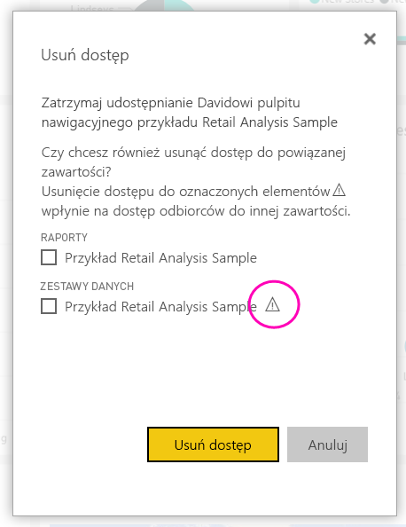

# Udostępnianie pulpitów nawigacyjnych usługi Power BI współpracownikom i innym osobom
*Udostępnianie* to świetna metoda na zapewnienie kilku osobom dostępu do Twojego pulpitu nawigacyjnego i raportów. Usługa Power BI zapewnia również [kilka sposobów współpracy i rozpowszechniania pulpitów nawigacyjnych i raportów](service-how-to-collaborate-distribute-dashboards-reports.md).

Niezależnie od tego, czy udostępniasz zawartość wewnątrz lub na zewnątrz organizacji, potrzebna do tego jest [licencja usługi Power BI Pro](service-free-vs-pro.md). Także adresaci muszą mieć licencję usługi Power BI Pro lub zawartość musi być uwzględniona w [pojemności Premium](service-premium.md). 

Pulpity nawigacyjne i raporty można udostępniać z większości miejsc w usłudze Power BI: Ulubione, Ostatnie, Udostępnione mi (jeśli właściciel to umożliwia), Mój obszar roboczy lub z innych obszarów roboczych. Osoby, którym udostępniasz pulpit nawigacyjny lub raport, mogą go wyświetlać i korzystać z niego, ale nie mogą go edytować. O ile nie zastosowano [zabezpieczeń na poziomie wiersza](service-admin-rls.md), osoby te widzą na pulpicie nawigacyjnym i w raportach te same dane, które Ty widzisz. Współpracownicy, którym udostępniono zawartość, mogą udostępnić ją swoim współpracownikom, jeśli mają na to zezwolenie. Osoby spoza organizacji mogą również wyświetlać pulpit nawigacyjny lub raport oraz korzystać z nich, ale nie mogą ich udostępniać. 

[Pulpit nawigacyjny można także udostępnić za pomocą aplikacji mobilnych Power BI](mobile-share-dashboard-from-the-mobile-apps.md). Pulpity nawigacyjne mogą być udostępniane za pomocą usługi Power BI i aplikacji mobilnych Power BI, ale nie z poziomu programu Power BI Desktop.

## Klip wideo: Udostępnianie pulpitu nawigacyjnego
Zobacz, jak Amanda udostępnianie swój pulpit nawigacyjny współpracownikom ze swojej firmy i osobom spoza niej. Następnie postępuj zgodnie ze szczegółowymi instrukcjami poniżej wideo, aby wypróbować to samodzielnie.

<iframe width="560" height="315" src="https://www.youtube.com/embed/0tUwn8DHo3s?list=PL1N57mwBHtN0JFoKSR0n-tBkUJHeMP2cP" frameborder="0" allowfullscreen></iframe>

## Udostępnianie pulpitu nawigacyjnego lub raportu

1. Na liście pulpitów nawigacyjnych lub raportów lub w funkcji otwierania pulpitu nawigacyjnego lub raportu wybierz opcję **Udostępnij** .

1. W polu u góry wprowadź pełne adresy e-mail użytkowników indywidualnych, grup dystrybucyjnych lub grup zabezpieczeń. Zawartości nie można udostępniać dynamicznym listom dystrybucyjnym. 
   
   Udostępnianie osobom, których adresy nie należą do Twojej organizacji, jest możliwe, ale w takiej sytuacji zostanie wyświetlone ostrzeżenie.
   
    
 
3. Jeśli chcesz, możesz dodać wiadomość. Jest to opcjonalne.
4. Aby umożliwić współpracownikom udostępnianie Twojego pulpitu nawigacyjnego innym osobom, zobacz temat **Zezwalanie adresatom na udostępnianie pulpitu nawigacyjnego/raportu**.
   
   Zezwalanie innym na udostępnianie jest nazywane *udostępnianiem dalej*. Jeśli zezwolisz innym na udostępnianie dalej, może się to odbyć z poziomu usługi Power BI i aplikacji mobilnych lub też przez przesłanie dalej wiadomości e-mail z zaproszeniem do innych osób w danej organizacji. Zaproszenie wygasa po upływie miesiąca. Nie można udostępnić dalej zawartości osobom spoza organizacji. Jako właściciel zawartości możesz wyłączyć opcję ponownego udostępniania lub indywidualnie odwołać możliwość ponownego udostępniania. Zobacz temat [Anulowanie udostępniania lub uniemożliwianie innym udostępniania](service-share-dashboards.md#stop-sharing-or-stop-others-from-sharing) poniżej.

5. Wybierz pozycję **Udostępnij**.
   
     
   
   Usługa Power BI wysyła wiadomość e-mail z zaproszeniem do osób, ale nie do grup. Wiadomość zawiera link do udostępnionej zawartości. Zostaje wyświetlone powiadomienie **Sukces**. 
   
   Kiedy adresaci w Twojej organizacji klikną link, usługa Power BI doda dany pulpit nawigacyjny lub raport do ich listy **Udostępnione mi**. Taki użytkownik może wybrać Twoje imię i nazwisko, aby wyświetlić wszystkie zawartości, które zostały jemu przez Ciebie udostępnione. 
   
   
   
   Kiedy adresat spoza Twojej organizacji kliknie link, zobaczy pulpit nawigacyjny lub raport, ale nie w standardowym portalu usługi Power BI. Aby uzyskać szczegółowe informacje, zobacz temat [Udostępnianie osobom spoza organizacji](service-share-dashboards.md#share-a-dashboard-with-people-outside-your-organization) poniżej.

## Kto ma dostęp do udostępnionego pulpitu nawigacyjnego lub raportu?
Czasami zachodzi potrzeba wyświetlenia listy osób, którym zostały przez Ciebie udostępnione zawartości, oraz użytkowników, którym z kolei udostępniły je te osoby.

1. Na liście pulpitów nawigacyjnych i raportów lub w obrębie samego pulpitu nawigacyjnego lub raportu wybierz pozycję **Udostępnij** . 
2. W oknie dialogowym **Udostępnianie pulpitu nawigacyjnego/raportu** wybierz kartę **Dostęp**.
   
    
   
    Osoby spoza organizacji są oznaczone jako **Gość**.

## Anulowanie udostępniania lub uniemożliwianie innym udostępniania
Tylko właściciel pulpitu nawigacyjnego lub raportu może włączyć i wyłączyć możliwość jego ponownego udostępniania.

### Jeśli zaproszenie do udostępniania nie zostało jeszcze wysłane
* Wyczyść pole wyboru **Zezwalaj adresatom na udostępnianie pulpitu nawigacyjnego/raportu** w dolnej części zaproszenia przed jego wysłaniem.

### Jeśli pulpit nawigacyjny lub raport został już udostępniony
1. Na liście pulpitów nawigacyjnych i raportów lub w obrębie samego pulpitu nawigacyjnego lub raportu wybierz pozycję **Udostępnij** . 
2. W oknie dialogowym **Udostępnianie pulpitu nawigacyjnego/raportu** wybierz kartę **Dostęp**.
   
    
3. Wybierz przycisk wielokropka (**...**) obok pozycji **Odczyt i udostępnianie dalej** i wybierz pozycję:
   
   
   
   * **Odczyt**, aby uniemożliwić danej osobie udostępnianie tej zawartości innym.
   * **Usuń dostęp**, aby uniemożliwić danej osobie wyświetlenie udostępnionej zawartości.

4. W oknie dialogowym **Usuń dostęp** zdecyduj, czy chcesz też usunąć dostęp do powiązanej zawartości, takiej jak raporty i zestawy danych. Jeśli usuwasz elementy z ikoną ostrzeżenia , najlepiej jest usunąć powiązaną zawartość, ponieważ nie będzie ona wyświetlana poprawnie.

    

## Udostępnianie pulpitu nawigacyjnego lub raportu osobom spoza organizacji
Jeśli udostępnisz pulpit nawigacyjny lub raport osobom spoza organizacji, otrzymają one wiadomość e-mail z linkiem do udostępnionego pulpitu nawigacyjnego lub raportu. Aby go wyświetlić, muszą się one zalogować do usługi Power BI. Jeśli któraś z tych osób nie ma licencji usługi Power BI Pro, może zarejestrować się w celu uzyskania licencji po kliknięciu linku.

Po zalogowaniu się użytkownik zobaczy udostępniony pulpit nawigacyjny lub raport w osobnym oknie przeglądarki bez lewego okienka nawigacji, a nie w standardowym portalu usługi Power BI. Aby w przyszłości uzyskać dostęp do tego pulpitu nawigacyjnego lub raportu, użytkownik musi dodać do zakładek otrzymany link.

Użytkownik spoza organizacji nie może edytować jakiejkolwiek zawartości w tym pulpicie nawigacyjnym lub raporcie. Może interaktywnie używać wykresów oraz zmieniać filtry i fragmentatory w raporcie, ale nie może zapisywać swoich zmian.

Udostępniony pulpit nawigacyjny lub raport może być wyświetlany tylko przez bezpośrednich adresatów. Na przykład w przypadku wysłania wiadomości e-mail na adres Vicki@contoso.com tylko Vicki może wyświetlić pulpit nawigacyjny. Nikt inny nie widzi tego pulpitu nawigacyjnego, nawet jeśli ma link. Aby Vicki uzyskała dostęp do tego pulpitu nawigacyjnego, musi użyć tego samego adresu e-mail, na który została wysłana wiadomość. Jeśli Vicki utworzy konto przy użyciu innego adresu e-mail, nie będzie miała dostępu do pulpitu nawigacyjnego.

Osoby spoza organizacji nie zobaczą żadnych danych, jeśli w modelach tabelarycznych lokalnych usług Analysis Services zostały zaimplementowane zabezpieczenia na poziomie roli lub wiersza.

Jeśli wyślesz link z aplikacji mobilnej Power BI do osoby spoza organizacji, a ona kliknie ten link, pulpit nawigacyjny zostanie otwarty w przeglądarce, a nie w aplikacji mobilnej Power BI.

## Ograniczenia i istotne zagadnienia
Ważne kwestie dotyczące udostępniania pulpitów nawigacyjnych i raportów:

* Ogólnie rzecz biorąc, zarówno Ty, jak i Twoi współpracownicy widzicie na pulpicie nawigacyjnym lub w raporcie te same dane. Jeśli zatem masz uprawnienia do wyświetlania większej ilości danych niż oni, współpracownicy będą mogli zobaczyć wszystkie Twoje dane na pulpicie nawigacyjnym lub raporcie. Jeśli jednak do zestawu danych wyświetlanych na pulpicie nawigacyjnym lub w raporcie zastosowano [zabezpieczenia na poziomie wiersza](service-admin-rls.md), to dane dostępne dla poszczególnych użytkowników zależą od ich poświadczeń.
* Każda osoba, której udostępniasz swój pulpit nawigacyjny, może go wyświetlać i korzystać ze związanych z nim raportów za pomocą [widoku do czytania](service-reading-view-and-editing-view.md). Nie może jednak tworzyć raportów ani zapisywać zmian w istniejących raportach.
* Nikt nie może wyświetlić ani pobrać zestawu danych.
* Każdy może ręcznie [odświeżyć dane](refresh-data.md).
* Jeśli korzystasz z usługi Office 365 do obsługi poczty e-mail, możesz udostępnić pulpit nawigacyjny członkom grupy dystrybucyjnej, wprowadzając adres e-mail skojarzony z daną grupą.
* Współpracownicy, którzy mają adres e-mail w tej samej domenie co Ty, oraz współpracownicy, którzy korzystają z innej domeny, ale zarejestrowanej w ramach tej samej dzierżawy, mogą udostępniać pulpit nawigacyjny innym osobom. Załóżmy na przykład, że domeny contoso.com i contoso2.com są zarejestrowane w ramach tej samej dzierżawy. Jeśli Twój adres e-mail to konrads@contoso.com, wówczas zarówno posiadacz adresu ravali@contoso.com, jak i adresu gustav@contoso2.com może udostępniać pulpit nawigacyjny, o ile dostał od Ciebie uprawnienia do udostępniania.
* Jeśli Twoi współpracownicy mają już dostęp do określonego pulpitu nawigacyjnego lub raportu, możesz wysłać bezpośredni link, kopiując adres URL dostępny podczas korzystania z tego pulpitu nawigacyjnego lub raportu. Na przykład: `https://powerbi.com/dashboards/g12466b5-a452-4e55-8634-xxxxxxxxxxxx`
* Analogicznie, jeśli Twoi współpracownicy mają już dostęp do określonego pulpitu nawigacyjnego, możesz [wysłać bezpośredni link do jego raportu źródłowego](service-share-reports.md). 

## Rozwiązywanie problemów z udostępnianiem

### Odbiorcy mojego pulpitu nawigacyjnego widzą ikonę blokady na kafelku albo komunikat „Wymagane uprawnienie”

Osoby, którym udostępniasz pulpit nawigacyjny, mogą widzieć na nim zablokowany kafelek albo komunikat „Wymagane uprawnienie” przy próbie wyświetlenia raportu.

Jeśli tak, musisz udzielić im uprawnienia do bazowego zestawu danych. Oto jak to zrobić.

1. Przejdź na kartę **Zestawy danych** na liście zawartości.

1. Wybierz wielokropek (**...**) obok zestawu danych > **Zarządzaj uprawnieniami**.

    

3. Wybierz pozycję **Dodaj użytkownika**.

    

1. Wprowadź pełne adresy e-mail osób, grup dystrybucyjnych lub grup zabezpieczeń. Zawartości nie można udostępniać dynamicznym listom dystrybucyjnym.

    

5. Wybierz pozycję **Dodaj**.

### Nie mogę udostępnić pulpitu nawigacyjnego lub raportu

Aby udostępnić pulpit nawigacyjny lub raport, musisz mieć uprawnienie do udostępniania dalej jego bazowej zawartości — wszystkich powiązanych raportów i zestawów danych. Jeśli zobaczysz komunikat z informacją, że nie możesz udostępnić zawartości, poproś autora raportu o uprawnienie do udostępniania dalej tych raportów i zestawów danych.

## Następne kroki
* Chcesz przesłać opinię? Jeśli masz sugestie, przejdź do [witryny społeczności usługi Power BI](https://community.powerbi.com/).
* [Jak współpracować nad pulpitami nawigacyjnymi i raportami oraz je udostępniać?](service-how-to-collaborate-distribute-dashboards-reports.md)
* [Udostępnianie filtrowanego raportu usługi Power BI](service-share-reports.md)
* Masz pytania? [Odwiedź społeczność usługi Power BI](http://community.powerbi.com/).

