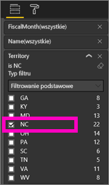
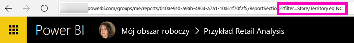
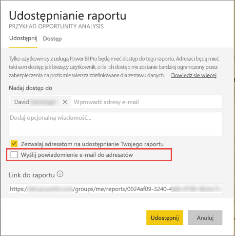

# Udostępnij filtrowane raportu usługi Power BI współpracownikom
*Udostępnianie* to świetna metoda na zapewnienie kilku osobom dostępu do Twojego pulpitu nawigacyjnego i raportów. Usługa Power BI oferuje również [kilka innych sposobów współpracy i rozpowszechniania raportów](service-how-to-collaborate-distribute-dashboards-reports.md).

Zarówno osoba udostępniająca, jak i adresaci zawartości muszą mieć [licencję na usługę Power BI Pro](service-features-license-type.md) lub zawartość musi być uwzględniona w [pojemności Premium](service-premium.md). Masz jakieś sugestie? Zespół zajmujący się usługą Power BI chętnie zapozna się z Twoją opinią. Aby ją przekazać, przejdź do [witryny społeczności usługi Power BI](https://community.powerbi.com/).

Raport w usłudze Power BI można udostępniać współpracownikom w tej samej domenie poczty e-mail z większości miejsc: Ulubione, Ostatnie, Udostępnione mi (jeśli właściciel to umożliwia), Mój obszar roboczy lub z innych obszarów roboczych. Osoby, którym udostępniasz raport, mogą go wyświetlać i korzystać z niego, ale nie mogą go edytować. O ile nie zastosowano [zabezpieczeń na poziomie wiersza](service-admin-rls.md), osoby te widzą w raporcie te same dane co Ty. 

## Filtrowanie i udostępnianie raportu
Czasami zachodzi potrzeba udostępnienia filtrowanej wersji raportu. Może to być raport zawierający tylko dane dotyczące określonego miasta, sprzedawcy lub roku. Można to zrobić, tworząc niestandardowy adres URL.

1. Otwórz raport w [widoku do edycji](consumer/end-user-reading-view.md), zastosuj filtr i zapisz raport.
   
   W tym przykładzie przefiltrujemy dane z zestawu [Retail Analysis](sample-tutorial-connect-to-the-samples.md), wyświetlając tylko wartości, w których pole **Territory** ma wartość **NC**.
   
   
2. Dodaj następujący ciąg na końcu adresu URL strony z raportem:
   
   ?filter=*nazwatabeli*/*nazwapola* eq *wartość*
   
    Pole musi być **ciągiem**, a parametry *nazwatabeli* i *nazwapola* nie mogą zawierać spacji.
   
   W naszym przykładzie nazwa tabeli to **Store**, nazwa pola to **Territory**, a wartość, według której chcemy filtrować, to **NC**:
   
    ?filter=Store/Territory eq 'NC'
   
   
   
   Przeglądarka dodaje znaki specjalne reprezentujące ukośniki, spacje i apostrofy. Końcowy ciąg wygląda następująco:
   
   app.powerbi.com/groups/me/reports/010ae9ad-a9ab-4904-a7a1-xxxxxxxxxxxx/ReportSection2?filter=Store%252FTerritory%20eq%20%27NC%27

3. [Udostępnij raport](service-share-dashboards.md), ale wyczyść pole wyboru **Wyślij powiadomienie e-mail do adresatów**. 

    

4. Wyślij łącze z utworzonym wcześniej filtrem.

## Następne kroki
* Chcesz przesłać opinię? Jeśli masz sugestie, przejdź do [witryny społeczności usługi Power BI](https://community.powerbi.com/).
* [Jak współpracować nad pulpitami nawigacyjnymi i raportami oraz je udostępniać?](service-how-to-collaborate-distribute-dashboards-reports.md)
* [Udostępnianie pulpitu nawigacyjnego](service-share-dashboards.md)
* Masz więcej pytań? [Odwiedź Społeczność usługi Power BI](http://community.powerbi.com/).

