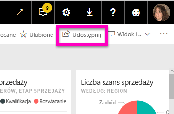
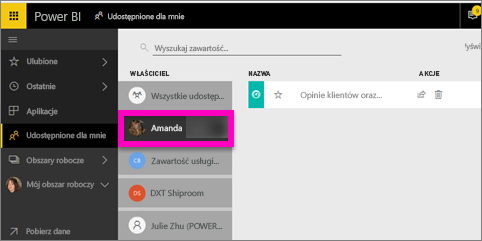

# Wyświetlanie pulpitów nawigacyjnych usługi Power BI, które zostały mi udostępnione
## Udostępnione dla mnie

Gdy współpracownik udostępni Ci pulpit nawigacyjny, jego tytuł jest dodawany do Twojej listy **Udostępnione mi**. Pulpit nawigacyjny jest dostępny wyłącznie z listy **Udostępnione mi** i nie jest dostępny z obszaru roboczego lub z **Aplikacji**.

Obejrzyj, jak Amanda wyjaśnia zawartość listy **Udostępnione mi** i pokazuje, jak filtrować listę i nawigować po niej. Następnie postępuj zgodnie ze szczegółowymi instrukcjami poniżej wideo, aby wypróbować to samodzielnie. Aby wyświetlać udostępnione mi pulpity nawigacyjne, musisz mieć licencję usługi Power BI Pro. Przeczytaj temat [Co to jest usługa Power BI Premium?](service-premium.md), aby zapoznać się ze szczegółami.

<iframe width="560" height="315" src="https://www.youtube.com/embed/G26dr2PsEpk" frameborder="0" allowfullscreen></iframe>

Będziesz mieć wiele opcji interakcji z pulpitem nawigacyjnym i raportami źródłowymi w zależności od uprawnień, które udostępnił Ci właściciel. Obejmują one możliwość tworzenia kopii pulpitu nawigacyjnego, otwieranie raportu [w widoku czytania](service-reading-view-and-editing-view.md) i ponownie udostępnianie innym współpracownikom.

## Akcje dostępne z ekranu **Udostępnione mi**
* Wybierz ikonę gwiazdki, aby [ustawić pulpit nawigacyjny jako ulubiony](service-dashboard-favorite.md).
* [Usuwanie pulpitu nawigacyjnego](service-delete.md) 
* Niektóre pulpity nawigacyjne mogą być ponownie udostępnione  
* Ponadto, jeśli listy pulpitów nawigacyjnych stają się długie, [użyj pola wyszukiwania i sortowania, aby odnaleźć to, czego potrzebujesz](service-navigation-search-filter-sort.md).
  
  > [!NOTE]
  > Aby uzyskać informacje o klasyfikacjach EGRC, wybierz przycisk klasyfikacji lub [odwiedź klasyfikację danych pulpitu nawigacyjnego ](service-data-classification.md).
  > 
  > 
* Wybierz nazwę pulpitu nawigacyjnego, aby otworzyć go i zbadać. Po otwarciu udostępnionego pulpitu nawigacyjnego możesz użyć funkcji pytań i odpowiedzi oraz zadać pytania dotyczące danych źródłowych lub wybrać kafelek, aby otworzyć i wejść w interakcję z raportem w widoku do czytania.

## Filtrowanie udostępnionych pulpitów nawigacyjnych przez właściciela
Zawartość ekranu **Udostępnione mi** może być dalej filtrowana według właściciela zawartości. Na przykład, jeśli wybiorę **Amandę**, zobaczę tylko pulpit nawigacyjny, który Amanda mi udostępniła.

## Następne kroki
[Power BI — podstawowe pojęcia](service-basic-concepts.md)  
[Power BI Premium — co to jest?](service-premium.md)  

Masz więcej pytań? [Zadaj pytanie społeczności usługi Power BI](http://community.powerbi.com/)

