# Szybki start — poruszanie się po usłudze Power BI

Gdy znasz już podstawy używania **usługi Power BI**, możemy przyjrzeć się jej bliżej. Być może jedna z osób w Twoim zespole zajmuje się wyłącznie łączeniem danych i tworzeniem raportów w programie **Power BI Desktop**. Załóżmy z kolei, że Ty korzystasz tylko z usługi Power BI i przeglądasz zawartość utworzoną przez inne osoby oraz wchodzisz z nią w interakcję (w środowisku **korzystania**) albo pobierasz dane i tworzysz własne raporty oraz pulpity nawigacyjne (w środowisku **tworzenia**). W tym przewodniku Szybki start zaimportujesz przykładowe dane, a następnie ich użyjesz, aby dowiedzieć się, jak obsługiwać usługę Power BI. 
 
## Wymagania wstępne

- Jeśli nie masz konta usługi Power BI, na początku [zacznij korzystać z bezpłatnej wersji próbnej](https://app.powerbi.com/signupredirect?pbi_source=web).

- Zapoznaj się z tematem [Usługa Power BI — podstawowe pojęcia](service-basic-concepts.md).

## Otwieranie usługi Power BI i pobieranie danych
Pobierzemy przykładowe dane i użyjemy ich do zapoznania się z usługą Power BI. Udostępniamy wiele różnych typów przykładowych danych. Tym razem użyjemy zestawu dotyczącego sklepów detalicznych.    
1. Otwórz stronę app.powerbi.com i wybierz link **Przykłady**. 

    

2. Wybierz pozycję **Przykład Retail Analysis > Połącz**.

    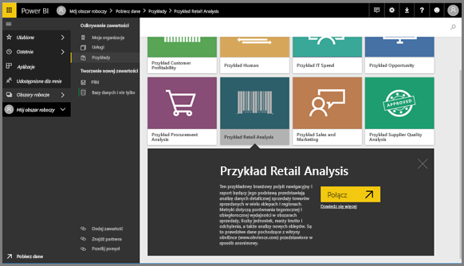

    Usługa Power BI zaimportuje przykład i wyświetli pulpit nawigacyjny. Pulpity nawigacyjne w usłudze Power BI są inne niż w programie Power BI Desktop. Ten przykład zawiera również raport i zestaw danych, które omówimy później.

    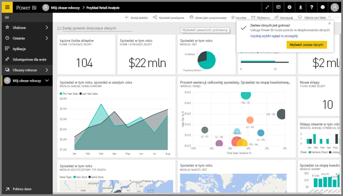

Obejrzyj Amandę pokazującą przewodnik obsługi nawigacji usługi Power BI.  Następnie wykonaj szczegółowe instrukcje poniżej klipu wideo, aby eksplorować nowy interfejs samodzielnie.

<iframe width="560" height="315" src="https://www.youtube.com/embed/G26dr2PsEpk" frameborder="0" allowfullscreen></iframe>

## Wyświetlanie zawartości (pulpitów nawigacyjnych, raportów, skoroszytów, zestawów danych, obszarów roboczych i aplikacji).
Najpierw przyjrzymy się sposobowi zorganizowania podstawowych typów zawartości (pulpitów nawigacyjnych, raportów, zestawów danych, skoroszytów). Zawartość jest wyświetlana w kontekście obszaru roboczego. Teraz masz tylko jeden obszar roboczy o nazwie **Mój obszar roboczy**. W kontenerze Mój obszar roboczy przechowywana jest zawartość, której jesteś właścicielem. To obszar roboczy przeznaczony do obsługi Twojej własnej zawartość. Zawartość z obszaru Mój obszar roboczy możesz udostępniać współpracownikom. Obszar roboczy zawiera 4 karty zawartości: Pulpity nawigacyjne, Raporty, Skoroszyty i Zestawy danych.

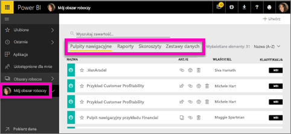

Wybierz obszar roboczy w lewym okienku nawigacji. Karty odpowiadające skojarzonej zawartości (takiej jak pulpity nawigacyjne, raporty, skoroszyty, zestawy danych) są wyświetlane po prawej stronie okna usługi Power BI.

Jeśli jesteś nowym użytkownikiem, zostanie wyświetlony tylko jeden obszar roboczy — **Mój obszar roboczy**.

Karty te (czyli *widoki zawartości*) zawierają informacje o zawartości oraz akcjach, które możesz wykonać na tej zawartości.  Na przykład na karcie Pulpity nawigacyjne możesz otworzyć pulpit nawigacyjny, a także na przykład udostępniać, usuwać, wyszukiwać, sortować i tworzyć zawartość.

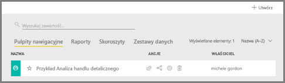

Otwórz pulpit nawigacyjny, wybierając jego nazwę.

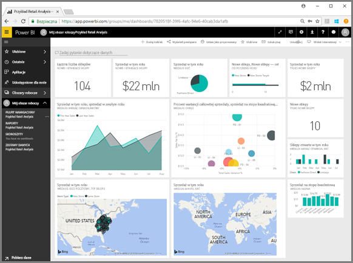

## Dodawanie pulpitu nawigacyjnego lub raportu do ulubionych
Funkcja **Ulubione** pozwala szybko uzyskać dostęp do zawartości, która jest dla Ciebie najważniejsza.  

1. Otwórz pulpit nawigacyjny i wybierz pozycję **Dodaj do ulubionych** w prawym górnym rogu.
   
   
   
   Pozycja **Dodaj do ulubionych** zmieni się w pozycję **Usuń z ulubionych**, a ikona gwiazdki stanie się żółta.
   
   

2. Aby wyświetlić listę całej zawartości, która została dodana jako ulubiona, w lewym okienku nawigacji wybierz strzałkę znajdującą się z prawej strony pozycji **Ulubione**. Ponieważ lewe okienko nawigacji jest stałą funkcją usługi Power BI, dostęp do tej listy można uzyskać z dowolnego miejsca w usłudze Power BI.
   
    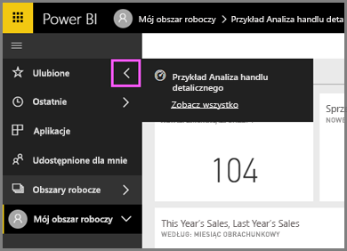
   
    Na razie mamy tylko jeden ulubiony element. Do Ulubionych można dodawać pulpity nawigacyjne, raporty i aplikacje.  

1. Innym sposobem, aby oznaczyć pulpit nawigacyjny lub raport jako ulubiony, jest użycie pozycji **Pulpity nawigacyjne** lub **Raporty** na karcie Obszar roboczy.  Otwórz kartę **Raporty**, a następnie wybierz ikonę gwiazdki na lewo od nazwy raportu.
   
   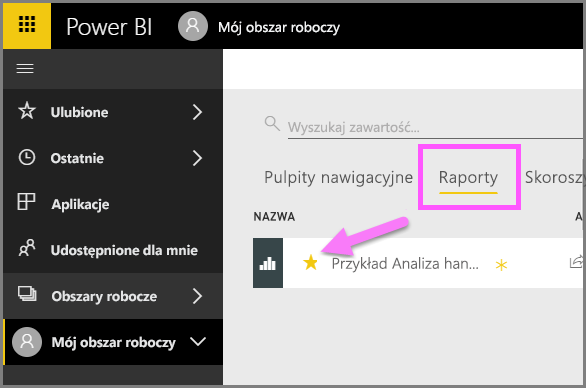

3. Otwórz *okienko* **Ulubione**, wybierając pozycję **Ulubione** w lewym okienku nawigacji lub wybierając ikonę gwiazdki .
   
   
   
   Masz teraz dwa elementy w Ulubionych — pulpit nawigacyjny i raport. W tym miejscu możesz otwierać i wyszukiwać zawartość, usuwać ją z ulubionych lub udostępniać współpracownikom.

4. Wybierz nazwę raportu, aby otworzyć go w edytorze raportów.

    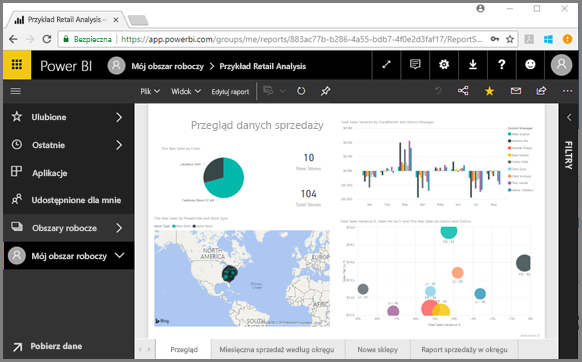

Aby dowiedzieć się więcej, zobacz [Ulubione](service-dashboard-favorite.md)

## Znajdowanie najnowszej zawartości

1. Podobnie jak w funkcji Ulubione, możesz szybko wyświetlić ostatnio używaną zawartość z dowolnego miejsca w usłudze Power BI, wybierając strzałkę obok pozycji **Ostatnie** w lewym okienku nawigacji.

   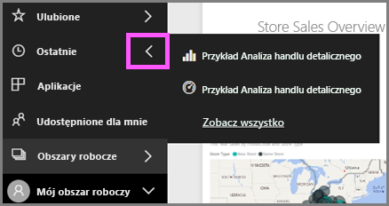

    W wysuwanym okienku wybierz zawartość, aby ją otworzyć.

2. Czasami nie trzeba jej otwierać, tylko wyświetlić informacje lub wykonać inne działania, takie jak udostępnianie, uruchamianie analiz lub eksportowanie do programu Excel. Wystarczy wtedy otworzyć okienko **Ostatnie**, wybierając pozycję **Ostatnie** lub ikonę w lewym okienku nawigacji. Jeśli masz kilka obszarów roboczych, na tej liście jest widoczna zawartość ze wszystkich z nich.

   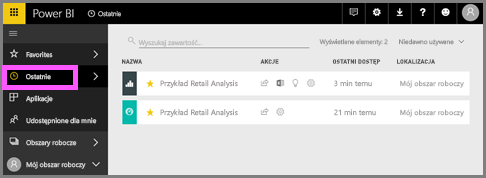

Aby dowiedzieć się więcej, zobacz [Funkcja Ostatnie w usłudze Power BI](service-recent.md).

### Przeszukiwanie i sortowanie zawartości
Widok zawartości ułatwia wyszukiwanie, filtrowanie i sortowanie zawartości. Aby wyszukać pulpit nawigacyjny, raport lub skoroszyt, wpisz odpowiedni ciąg w obszarze wyszukiwania. Usługa Power BI zwróci tylko tę zawartość, której nazwa zawiera wyszukiwany ciąg.

Ponieważ mamy tylko jeden przykład, wyszukiwanie i sortowanie nie jest konieczne.  Jednak te funkcje są bardzo przydatne, jeśli korzysta się z wielu pulpitów nawigacyjnych, raportów, skoroszytów i zestawów danych.

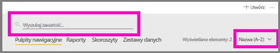

Zawartość można również sortować według nazwy lub właściciela.  

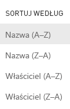

Aby dowiedzieć się więcej, zobacz [Nawigacja w usłudze Power BI: wyszukiwanie, sortowanie, filtrowanie](service-navigation-search-filter-sort.md)

## Czyszczenie zasobów
Jeśli chcesz, po zakończeniu tego przewodnika Szybki start możesz usunąć pulpit nawigacyjny, raport i zestaw danych przykładu Retail Analysis.

1. Otwórz usługę Power BI (app.powerbi.com) i zaloguj się.    
2. W lewym okienku nawigacji wybierz kolejno pozycje **Obszary robocze > Mój obszar roboczy**.  
    Widzisz żółtą gwiazdkę informującą o tym, że jest to element ulubiony?    
3. Na karcie **Pulpity nawigacyjne** wybierz ikonę kosza na śmieci **Usuń** obok pulpitu nawigacyjnego Retail Analysis.    

    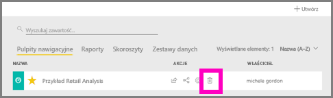

4. Wybierz kartę **Raporty** i zrób to samo dla raportu Retail Analysis.
1. Wybierz kartę **Zestawy danych** i zrób to samo dla zestawu danych Retail Analysis.

## Następne kroki

> [!div class="nextstepaction"]
> [Widok do czytania i widok do edycji w usłudze Power BI](./service-reading-view-and-editing-view.md)