# Poruszanie się po usłudze Power BI
## Lewe okienko nawigacji

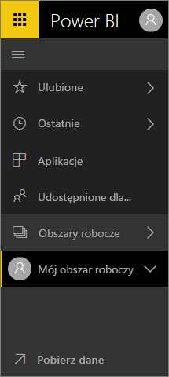

**Krótki przewodnik**

| Akcja | Nowa (bieżąca) ścieżka |
| --- | --- | --- |
| Dodawanie pulpitu nawigacyjnego lub raportu do ulubionych |Obszar roboczy > Pulpity nawigacyjne lub Obszar roboczy > Raporty, a następnie wybierz ikonę gwiazdki, aby zmieniła kolor na żółty |
| Dodawanie aplikacji do ulubionych | Wybierz pozycję **Aplikacje** z okienka nawigacji po lewej stronie i wybierz gwiazdkę obok nazwy aplikacji
| Wyświetlanie listy ulubionych |Wybierz pozycję **Ulubione** w lewym okienku nawigacji |
| Wyświetlenie listy ostatnio odwiedzonych pulpitów nawigacyjnych i raportów |Wybierz pozycję **Ostatnie** w lewym okienku nawigacji |
| Wyświetlenie listy pulpitów nawigacyjnych, które zostały Ci udostępnione |Wybierz pozycję **Udostępnione mi** w lewym okienku nawigacji |
| Udostępnianie pulpitu nawigacyjnego |Otwórz pulpit nawigacyjny i wybierz pozycję **Udostępnij** lub utwórz i opublikuj aplikację |
| Usunięcie pulpitu nawigacyjnego |Mój obszar roboczy > Pulpity nawigacyjne > ikona kosza na śmieci |
| Usunięcie raportu |Mój obszar roboczy > Raporty > ikona kosza na śmieci |
| Usunięcie zestawu danych |Mój obszar roboczy > Zestawy danych > ... > Usuń |
| Otwarcie pulpitu nawigacyjnego |Obszar roboczy > Pulpity nawigacyjne > wybierz nazwę pulpitu nawigacyjnego |
| Otwarcie raportu |Obszar roboczy > Raporty > wybierz nazwę raportu |
| Otwarcie zestawu danych |Obszar roboczy > Zestawy danych > wybierz nazwę zestawu danych |
| Utworzenie pulpitu nawigacyjnego |Na górnym pasku nawigacyjnym wybierz pozycję Utwórz > Pulpit nawigacyjny |
| Utworzenie raportu |Na górnym pasku nawigacyjnym wybierz pozycję Utwórz > Raport |
| Utworzenie zestawu danych |Na górnym pasku nawigacyjnym wybierz pozycję Utwórz > Zestaw danych |
| Utworzenie aplikacji |Obszary robocze > Utwórz obszar roboczy aplikacji |
| Wyświetlenie listy wszystkich pulpitów nawigacyjnych, raportów i zestawów danych, których jesteś właścicielem |Obszary robocze > Mój obszar roboczy |

## Typowe zadania

Obejrzyj Amandę pokazującą przewodnik obsługi nawigacji usługi Power BI.  Następnie wykonaj szczegółowe instrukcje poniżej klipu wideo, aby eksplorować nowy interfejs samodzielnie.

<iframe width="560" height="315" src="https://www.youtube.com/embed/G26dr2PsEpk" frameborder="0" allowfullscreen></iframe>

## Wyświetlanie zawartości (pulpitów nawigacyjnych, raportów, skoroszytów, zestawów danych, obszarów roboczych i aplikacji).
Najpierw przyjrzymy się sposobowi zorganizowania podstawowych typów zawartości (pulpitów nawigacyjnych, raportów, zestawów danych, skoroszytów). Wcześniej cała zawartość była przedstawiona w lewym okienku nawigacji. Obecnie ten widok nadal jest dostępny, ale domyślnie wyświetlane są typy zawartości w kontekście obszaru roboczego. Wybierz obszar roboczy w lewym okienku nawigacji. Karty odpowiadające skojarzonej zawartości (takiej jak pulpity nawigacyjne, raporty, skoroszyty, zestawy danych) są wyświetlane po prawej stronie okna usługi Power BI.

Jeśli masz bezpłatną wersję usługi Power BI, zostanie wyświetlony tylko jeden obszar roboczy — **Mój obszar roboczy**.

### Ulubione pulpity nawigacyjne, raporty i aplikacje
Funkcja **Ulubione** pozwala szybko uzyskać dostęp do zawartości, która jest dla Ciebie najważniejsza.  

1. Otwórz pulpit nawigacyjny lub raport i wybierz pozycję **Dodaj do ulubionych** w prawym górnym rogu.
   
   
   
   Pozycja **Dodaj do ulubionych** zmieni się w pozycję **Usuń z ulubionych**, a ikona gwiazdki stanie się żółta.
   
   

2. W przypadku aplikacji wybierz pozycję **Aplikacje** w lewym okienku nawigacji, umieść kursor nad aplikacją, a następnie wybierz gwiazdkę, aby ustawić ją jako ulubioną.

2. Aby wyświetlić listę całej zawartości, która została dodana jako ulubiona, w lewym okienku nawigacji wybierz strzałkę znajdującą się z prawej strony pozycji **Ulubione**. Ponieważ lewe okienko nawigacji jest stałą funkcją usługi Power BI, dostęp do tej listy można uzyskać z dowolnego miejsca w usłudze Power BI.
   
    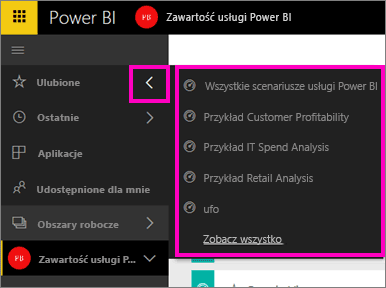
   
    W tym miejscu można wybrać pulpit nawigacyjny, raport lub aplikację, aby je otworzyć.

3. Aby otworzyć okienko **Ulubione**, w lewym okienku nawigacji wybierz pozycję **Ulubione** lub ikonę Ulubione .
   
   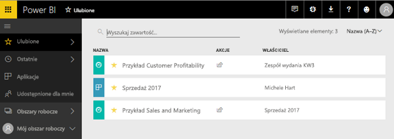
   
   W tym miejscu możesz otwierać, wyszukiwać zawartość, usuwać z ulubionych lub udostępniać zawartość współpracownikom.

1. Innym sposobem, aby oznaczyć pulpit nawigacyjny lub raport jako ulubiony, jest użycie pozycji **Pulpity nawigacyjne** lub **Raporty** na karcie Obszar roboczy.  Po prostu otwórz obszar roboczy, aby wyświetlić widok zawartości, a następnie wybierz ikonę gwiazdki po lewej stronie nazwy.
   
   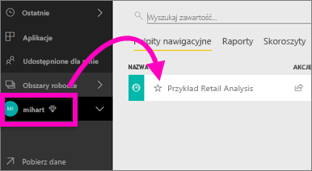

Aby dowiedzieć się więcej, zobacz [Ulubione](service-dashboard-favorite.md)

### Ostatnie
Korzystając z okienka **Ostatnie**, można szybko uzyskać dostęp do zawartości, która była ostatnio używana. Obejmuje to zawartość ze wszystkich obszarów roboczych danego użytkownika.

  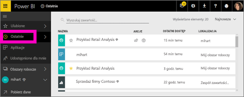

Podobnie jak w przypadku funkcji Ulubione, możesz szybko wyświetlić ostatnie elementy z dowolnego miejsca w usłudze Power BI, wybierając strzałkę obok pozycji **Ostatnie** w lewym okienku nawigacji.

  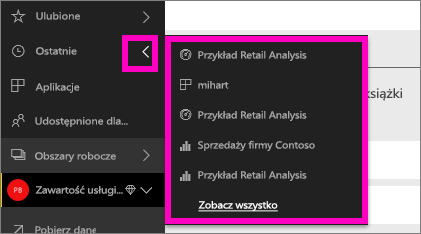

Aby dowiedzieć się więcej, zobacz [Funkcja Ostatnie w usłudze Power BI](service-recent.md).

### Aplikacje
Aplikacja to kolekcja pulpitów nawigacyjnych i raportów utworzona w celu udostępnienia wszystkich najważniejszych metryk w jednym miejscu. Aplikacje mogą być przeznaczone do użytku wewnątrz organizacji lub [do użytku z usługami zewnętrznymi](service-connect-to-services.md), takimi jak Google Analytics i Microsoft Dynamics CRM. 

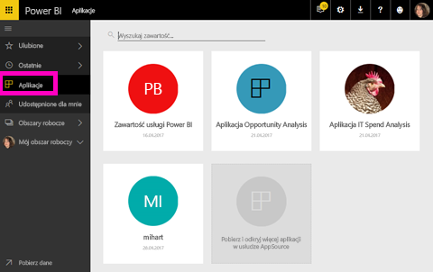

Aby dowiedzieć się więcej, zobacz **Obszary robocze aplikacji** (poniżej) i [Co to są aplikacje Power BI](service-install-use-apps.md).

### Udostępnione dla mnie
W obszarze **Udostępnione mi** znajduje się cała zawartość, która została Ci udostępniona przez współpracowników.  Zawartość tego obszaru można filtrować według właściciela pulpitu nawigacyjnego. Pole wyszukiwania umożliwia znalezienie odpowiednich elementów, a elementy można sortować według daty.  Często używaną zawartość można niezwykle łatwo dodać do ulubionych bezpośrednio z widoku **Udostępnione mi**.

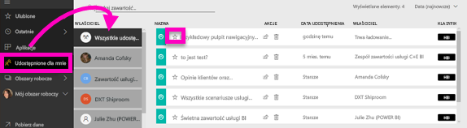

Aby dowiedzieć się więcej, zobacz [Udostępnione mi](service-shared-with-me.md).

### Praca z obszarami roboczymi
Następna pozycja w lewym okienku nawigacji to *Obszary robocze*. Obszary robocze to swego rodzaju *kontenery* przechowujące zawartość w usłudze Power BI. Istnieją dwa typy obszarów roboczych: **Mój obszar roboczy** i obszary robocze aplikacji.

Jeśli nie jesteś członkiem obszaru roboczego aplikacji ani administratorem, w okienku nawigacji po lewej stronie mogą nie być wyświetlone żadne obszary robocze aplikacji. Jeśli korzystasz z bezpłatnej wersji usługi Power BI, nie zobaczysz żadnych obszarów roboczych aplikacji.

#### Mój obszar roboczy
W kontenerze **Mój obszar roboczy** przechowywana jest zawartość, której jesteś właścicielem. To obszar roboczy przeznaczony do obsługi Twojej własnej zawartość. Zawartość z obszaru Mój obszar roboczy możesz udostępniać współpracownikom. Obszar roboczy zawiera 4 karty zawartości: Pulpity nawigacyjne, Raporty, Skoroszyty i Zestawy danych.

#### Obszary robocze aplikacji
Aplikacje i obszary robocze aplikacji to funkcje dostępne w ramach usługi Power BI Pro. Jeśli tworzysz pulpity nawigacyjne i raporty przeznaczone dla innych użytkowników, możesz to robić w obszarach roboczych aplikacji. Obszar roboczy aplikacji to miejsce, w którym są tworzone aplikacje. Aby utworzyć aplikację, trzeba najpierw utworzyć obszar roboczy aplikacji. Są one kolejnym etapem ewolucji obszarów roboczych grupy — obszarów tymczasowych i kontenerów zawartości w aplikacji.  Razem ze swoimi współpracownikami możesz pracować nad pulpitami nawigacyjnymi, raportami i inną zawartością, która ma zostać rozpowszechniona wśród większej liczby osób lub nawet w całej organizacji.

Aby dowiedzieć się więcej, zobacz [Tworzenie i rozpowszechnianie aplikacji w usłudze Power BI](service-create-distribute-apps.md#app-workspaces).

Podobnie jak w przypadku elementu **Obszar roboczy** zawartość jest zorganizowana na 4 kartach: Pulpity nawigacyjne, Raporty, Skoroszyty i Zestawy danych.

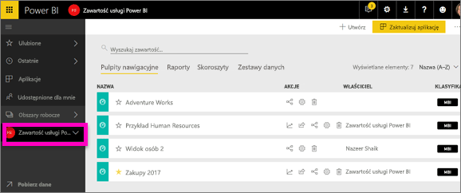

Wybierając pozycję **Obszary robocze** w lewym okienku nawigacji, można przełączać się między obszarami roboczymi.

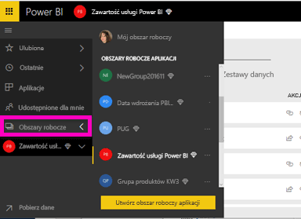

### Przeszukiwanie i sortowanie zawartości
Widok zawartości ułatwia wyszukiwanie, filtrowanie i sortowanie zawartości. Aby wyszukać pulpit nawigacyjny, raport lub skoroszyt, wpisz odpowiedni ciąg w obszarze wyszukiwania. Usługa Power BI zwróci tylko tę zawartość, której nazwa zawiera wyszukiwany ciąg.

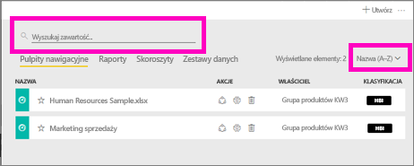

Zawartość można również sortować według nazwy lub właściciela.  

Aby dowiedzieć się więcej, zobacz [Nawigacja w usłudze Power BI: wyszukiwanie, sortowanie, filtrowanie](service-navigation-search-filter-sort.md)

## Następne kroki
Usługa Power BI — [podstawowe pojęcia](service-basic-concepts.md)    

Masz pytania lub opinię? [Odwiedź forum społeczności usługi Power BI](http://community.powerbi.com/t5/Navigation-Preview-Forum/bd-p/NavigationPreview)

