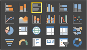

# Przewodnik po edytorze raportów w usłudze Power BI

*Edytor raportów* w usłudze Power BI jest podobny do edytora raportów w programie Power BI Desktop. Film pokazuje edytor raportu w programie Power BI Desktop, a ten artykuł przedstawia edytor raportu w usłudze Power BI. 

Twórca raportów tworzy oraz edytuje pulpity nawigacyjne i raporty. Następnie rozpowszechnia je wśród użytkowników raportów. Użytkownicy mogą korzystać z pulpitów nawigacyjnych i raportów w Widoku do czytania usługi Power BI, ale nie mogą ich edytować. Dowiedz się więcej o różnicach między [Widokiem do czytania i Widokiem do edycji raportów w usłudze Power BI](consumer/end-user-reading-view.md) 

<iframe width="560" height="315" src="https://www.youtube.com/embed/IkJda4O7oGs" frameborder="0" allowfullscreen></iframe>

W usłudze Power BI edytor raportów jest dostępny tylko w Widoku do edycji. Aby otworzyć raport w Widoku do edycji, musisz być właścicielem lub twórcą raportu albo współautorem obszaru roboczego aplikacji, w którym znajduje się raport.

Edytor raportów usługi Power BI składa się z trzech sekcji:  

1. okienek **Pola**, **Wizualizacje** i **Filtry**
2. górne paski nawigacyjne    
3. kanwa raportu     

## 1. Okienka edytora raportu

Po pierwszym otworzeniu raportu są widoczne trzy okienka: Wizualizacje, Filtry i Pola. Okienka po lewej stronie, Wizualizacje i Filtry, kontrolują wygląd Twoich wizualizacji — typ, kolory, filtrowanie, formatowanie.  A okienko po prawej stronie, Pola, zarządza podstawowymi danymi używanymi w wizualizacjach. 

Zawartość wyświetlana w edytorze raportu jest zależna od wyborów dokonanych na kanwie raportu.  Na przykład po wybraniu jednej wizualizacji:

|  |  |
| --- | --- |
|  |<ul><li>Górna część okienka wizualizacji identyfikuje typ używanego elementu wizualnego; w tym przykładzie jest to wykres słupkowy grupowany.  </li> <li>Dolna część okienka wizualizacji (może okazać się konieczne przewinięcie) wyświetla pola używane w elemencie wizualnym. Ten wykres używa pól FiscalMonth, DistrictManager i Total Sales Variance.   </li><li>Okienko filtry (może okazać się konieczne przewinięcie) wyświetla wszelkie filtry, które zostały zastosowane.   </li><li>Okienko pól zawiera listę dostępnych tabel, a jeśli rozwiniesz nazwę tabeli, pola, które tworzą daną tabelę. Żółta czcionka informuje, że co najmniej jedno pole z tej tabeli jest używane do wizualizacji.  </li><li> Aby wyświetlić okienko formatowania dla wybranej wizualizacji, wybierz ikonę wałka do malowania.  </li><li> Aby wyświetlić okienko analizy, wybierz ikonę lupy.</ul> |

## Okienko Wizualizacje

To właśnie tutaj wybierasz typ wizualizacji. Małe obrazki są nazywane *szablonami*. Na ilustracji powyżej jest wybrany wykres słupkowy grupowany. Jeśli nie wybierzesz najpierw typu wizualizacji, ale zamiast tego zaczniesz tworzenie wizualizacji, wybierając pola, usługa Power BI sama wybierze typ wizualizacji. Możesz zachować wybór usługi Power BI lub zmienić typ, wybierając inny szablon. Możesz się przełączać tyle razy, ile trzeba, aby znaleźć typ wizualizacji, który najlepiej reprezentuje Twoje dane.

### Zarządzanie polami w wizualizacji

Zasobniki (czasem nazywane *źródłami*) pokazane w tym okienku różnią się w zależności od wybranego typu wizualizacji.  Jeśli na przykład wybrano wykres słupkowy, zobaczysz zasobniki dla następujących elementów: wartości, oś i legenda. Gdy wybierasz pole lub przeciągasz je na kanwie, usługa Power BI dodaje to pole do jednego z zasobników.  Możesz też przeciągać pola z listy pól bezpośrednio do zasobników.  Niektóre zasobniki są ograniczone do pewnych typów danych.  Na przykład **wartości** nie akceptują pól nienumerycznych. Dlatego, jeśli przeciągniesz pole **employeename** pole do zasobnika **Wartości**, usługa Power BI zmieni go na **liczba employeename**.

### Usuwanie pola
Aby usunąć pole z wizualizacji, wybierz znak **X** z prawej strony nazwy pola.

Aby uzyskać więcej informacji, zobacz [Dodawanie wizualizacji do raportu usługi Power BI](visuals/power-bi-report-add-visualizations-i.md)

### Formatowanie elementów wizualnych
Wybierz ikonę wałka do malowania, aby wyświetlić okienko Format. Dostępność opcji zależy od wybranego typu wizualizacji.

Możliwości formatowania są prawie nieskończone.  Aby dowiedzieć się więcej, rozpocznij samodzielną eksplorację lub zapoznaj się z następującymi artykułami:

* [Dostosowywanie tytułu, tła i legendy wizualizacji](visuals/power-bi-visualization-customize-title-background-and-legend.md)
* [Formatowanie koloru](visuals/service-getting-started-with-color-formatting-and-axis-properties.md)
* [Dostosowywanie właściwości osi x i y](visuals/power-bi-visualization-customize-x-axis-and-y-axis.md)

### Dodawanie analizy do wizualizacji
Aby wyświetlić okienko analizy, wybierz ikonę lupy. Dostępność opcji zależy od wybranego typu wizualizacji.

    
Za pomocą okienka analizy w usłudze Power BI możesz dodać linie odwołania dynamicznego do wizualizacji i skoncentrować się na ważnych trendach lub szczegółowych informacjach. Aby dowiedzieć się więcej, zobacz [Okienko analizy w usłudze Power BI](service-analytics-pane.md) lub [Okienko analizy w programie Power BI Desktop](desktop-analytics-pane.md).

- - -
## Okienko Filtry
Okienko Filtry służy do wyświetlania, ustawiania i modyfikowania trwałych filtrów odnoszących się do raportów na poziomie strony, raportu, przeglądania szczegółowego i wizualizacji. Tak, możesz zastosować filtrowanie w trybie ad hoc stron raportu i elementów wizualnych, wybierając elementy wizualne lub korzystając z takich narzędzi, jak fragmentatory, ale w przypadku korzystania z okienka Filtry stan filtrów jest zapisywany razem z raportem. 

Okienko Filtry ma inną zaawansowaną funkcję – możliwość filtrowania za pomocą pola ***, które nie jest jeszcze używane w jednym z elementów wizualnych w raporcie***. Wyjaśnienie jest następujące. Po utworzeniu strony raportu usługa Power BI automatycznie dodaje wszystkie pola używane w Twojej wizualizacji do obszaru filtrów na poziomie elementu wizualnego okienka Filtry.  Jeśli jednak chcesz ustawić element wizualny, stronę, przeglądanie szczegółowe lub filtr raportu przy użyciu pola, które nie jest aktualnie używane w wizualizacji, wystarczy przeciągnąć je do jednego z zasobników filtrów.   

Aby uzyskać więcej informacji, zobacz [Dodawanie filtru do raportu](power-bi-report-add-filter.md).

- - -
## Okienko Pola
W okienku pól są wyświetlane tabele i pola, które istnieją w Twoich danych i których możesz używać do tworzenia wizualizacji.

|  |  |
| --- | --- |
|  |<ul><li>Przeciągnij pole na stronę, aby rozpocząć nową wizualizację.  Możesz również przeciągnąć pole na istniejącą wizualizację, aby dodać pole do tej wizualizacji.  </li> <li>Po dodaniu znacznika wyboru obok pola usługa Power BI dodaje to pole do aktywnej (lub nowej) wizualizacji. A także decyduje, w którym zasobniku należy umieścić to pole.  Na przykład, czy pole powinno być używane jako legenda, oś lub wartość? Usługa Power BI ułatwia podjęcie decyzji i w razie potrzeby możesz przenieść je z tego zasobnika do innego.   </li><li>W każdym przypadku każde wybrane pole jest dodawane do okienka Wizualizacje w edytorze raportu.</li></ul> |

**UWAGA**: Jeśli używasz programu Power BI Desktop, będą również dostępne opcje pokazywania/ukrywania pól, dodawania obliczeń itd.

### Co oznaczają ikony pól?
**Agregaty ∑** Agregat jest wartością numeryczną, która będzie na przykład sumowana lub uśredniana. Agregaty są importowane z danymi (zdefiniowanymi w modelu danych, na którym jest oparty Twój raport).
Aby uzyskać więcej informacji, zobacz [Wartości zagregowane w raportach usługi Power BI](service-aggregates.md).

 **Obliczane miary (nazywane również polami obliczeniowymi)**  
Każde pole obliczeniowe ma własną ustaloną formułę. Nie możesz zmienić obliczenia, jeśli, na przykład, jest to suma, pozostanie sumą. Aby uzyskać więcej informacji, przeczytaj [Opis miar](desktop-measures.md)

 **Pola unikatowe**  
Pola z tą ikoną zostały zaimportowane z programu Excel i są ustawione na pokazywanie wszystkich wartości, nawet jeśli mają one duplikaty. Na przykład Twoje dane mogą mieć dwa rekordy dla osób o nazwisku „Jan Kowalski” i każdy z nich będzie traktowany jako unikatowy — nie zostaną one zsumowane.  

** Pola lokalizacji geograficznej**  
Pola lokalizacji mogą służyć do tworzenia wizualizacji map. 

** Hierarchia**  
Wybierz strzałkę, aby ujawnić pola, które tworzą hierarchię. 

## 2. Górny pasek nawigacyjny
Na górnym pasku nawigacyjnym są dostępne liczne akcje, przy czym cały czas są dodawane nowe akcje. Aby uzyskać informacje o określonej akcji, użyj spisu treści lub pola wyszukiwania dokumentacji usługi Power BI.

## 3. Kanwa raportu
Kanwa raportu jest miejscem, gdzie jest wyświetlana Twoja praca. Gdy używasz okienek pól, filtrów i wizualizacji do tworzenia elementów wizualnych, są one budowane i wyświetlane na kanwie Twojego raportu. Każda karta w dolnej części kanwy reprezentuje stronę raportu. Wybierz kartę, aby otworzyć tę stronę. 

## Następne kroki
[Tworzenie raportu](service-report-create-new.md)

Więcej informacji na temat raportów w [usłudze Power BI](service-report-create-new.md), [programie Power BI Desktop](desktop-report-view.md) i [aplikacjach mobilnych Power BI](consumer/mobile/mobile-apps-view-phone-report.md).

[Podstawowe pojęcia dla projektantów usługi Power BI](service-basic-concepts.md)

Masz więcej pytań? [Odwiedź społeczność usługi Power BI](http://community.powerbi.com/)

