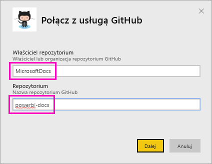

# Samouczek: nawiązywanie połączenia z aplikacją GitHub przy użyciu usługi Power BI
W tym samouczku nawiążemy połączenie z danymi w usłudze GitHub przy użyciu usługi Power BI, która automatycznie utworzy pulpity nawigacyjne i raporty. Po połączeniu się z publicznym repozytorium zawartości usługi Power BI (ang. *repo* — repozytorium) możemy uzyskać następujące informacje. Ile osób współtworzy publiczną zawartość w usłudze Power BI? Kto jest najbardziej aktywnym współautorem? W jaki dzień tygodnia jest przesyłanych najwięcej materiałów? Na te pytania znajdziemy odpowiedzi. 

Ten samouczek obejmuje następujące kroki:

> [!div class="checklist"]
> * Tworzenie konta GitHub, jeśli jeszcze go nie masz 
> * Logowanie się do konta usługi Power BI lub tworzenie konta, jeśli jeszcze go nie masz
> * Otwieranie usługi Power BI
> * Znajdowanie aplikacji GitHub
> * Wprowadzanie informacji dotyczących publicznego repozytorium GitHub usługi Power BI
> * Wyświetlanie pulpitu nawigacyjnego i raportu z danymi GitHub
> * Czyszczenie zasobów przez usunięcie aplikacji

Jeśli nie masz konta usługi Power BI, na początku [zacznij korzystać z bezpłatnej wersji próbnej](https://app.powerbi.com/signupredirect?pbi_source=web).

## Wymagania wstępne

Do ukończenia tego samouczka jest wymagane konto GitHub. 

- Utwórz [konto GitHub](https://docs.microsoft.com/contribute/get-started-setup-github).

## Jak nawiązać połączenie
1. Zaloguj się w usłudze Power BI (http://powerbi.com). 
2. W lewym okienku nawigacji wybierz pozycje **Aplikacje** i **Pobierz aplikacje**.
   
    

3. Wybierz pozycję **Aplikacje**, wpisz **github** w polu wyszukiwania, a następnie wybierz pozycję **Pobierz teraz**.
   
    

4. Podaj nazwę i właściciela repozytorium. Adres URL tego repozytorium to https://github.com/MicrosoftDocs/powerbi-docs. **Właścicielem repozytorium** jest **MicrosoftDocs**, a **nazwa repozytorium** to **powerbi-docs**. 
   
    

5. Wprowadź utworzone poświadczenia usługi GitHub. W usłudze Power BI można pominąć ten krok, jeśli już zalogowano się do usługi GitHub w przeglądarce. 

6. W polu **Metoda uwierzytelniania** wybierz opcję **oAuth2** \> **Zaloguj**.

7. Postępuj zgodnie z instrukcjami dotyczącymi uwierzytelniania w usłudze Github. Przyznaj usłudze Power BI dostęp do danych usługi GitHub.
   
   Teraz usługa Power BI może połączyć się z danymi w usłudze GitHub.  Dane są odświeżane raz dziennie.

8. Gdy usługa Power BI zaimportuje dane, zostanie wyświetlony nowy kafelek GitHub. 
 
    

8. Wybierz ikonę nawigacji globalnej, aby zminimalizować menu nawigacji po lewej stronie. Dzięki temu zyskasz więcej miejsca.

    

10. Wybierz kafelek GitHub z kroku 8. 
    
    Zostanie otwarty pulpit nawigacyjny usługi GitHub. Są to bieżące dane, dlatego wartości widoczne na Twoim ekranie mogą się różnić.

    

    

## Zadaj pytanie

11. Umieść kursor w obszarze **Zadaj pytanie dotyczące Twoich danych**, a następnie wybierz pozycję **pull requests** (żądania ściągnięcia). 

    

12. Wpisz **by month** (według miesięcy).
 
    

     Usługa Power BI utworzy wykres słupkowy przedstawiający liczbę żądań ściągnięcia w poszczególnych miesiącach.

13. Wybierz pozycję **Wyjdź z funkcji pytań i odpowiedzi**.

## Wyświetlanie raportu usługi GitHub 

1. Na pulpicie nawigacyjnym GitHub wybierz kombinacyjny wykres kolumnowo-liniowy **Pull Requests by Month** (Żądania ściągnięcia według miesięcy), aby otworzyć powiązany raport.

    

2. Wybierz nazwę użytkownika na wykresie **Total pull requests by user** (Łączna liczba żądań ściągnięcia według użytkowników). W tym przykładzie widać, że jego średnia liczba godzin jest większa niż łączna średnia wartość dla marca.

    

3. Wybierz kartę **Punch Card** (Karta perforowana), aby wyświetlić następną stronę w raporcie. 
 
    

    Jak widać, najwięcej *zatwierdzeń* występuje we wtorki o godzinie 15, gdy członkowie personelu ewidencjonują swoją pracę.

## Czyszczenie zasobów

Po zakończeniu pracy z tym samouczkiem możesz usunąć aplikację GitHub. 

1. Wybierz pozycję **Aplikacje** na lewym pasku nawigacyjnym.
2. Umieść kursor na kafelku GitHub i wybierz pozycję **Usuń** — ikonę kosza na śmieci.

    

## Następne kroki

W tym samouczku połączyliśmy się z publicznym repozytorium GitHub i pobraliśmy dane, które zostały sformatowane na pulpicie nawigacyjnym i w raporcie usługi Power BI. Dzięki informacjom widocznym na pulpicie nawigacyjnym i w raporcie udało się znaleźć odpowiedzi na pytania. Teraz możesz dowiedzieć się więcej na temat nawiązywania połączenia z innymi usługami, takimi jak Salesforce, Microsoft Dynamics i Google Analytics. 
 
> [!div class="nextstepaction"]
> [Łączenie się z używanymi usługami online](./service-connect-to-services.md)

