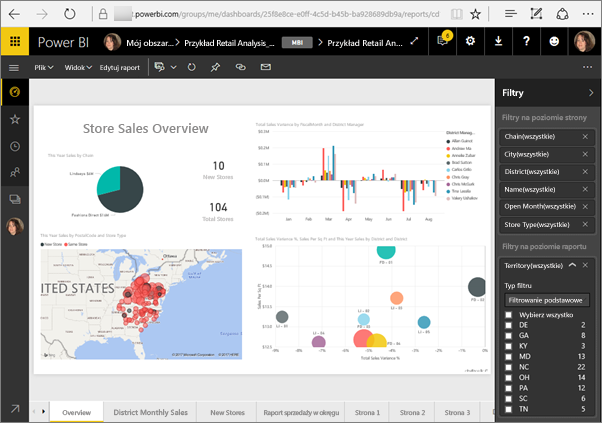
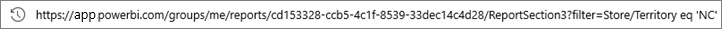
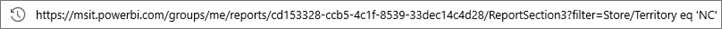
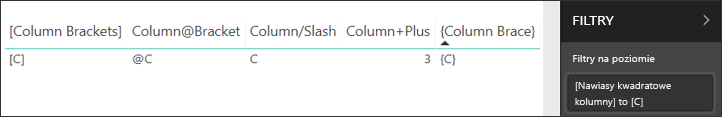

# <a name="filter-a-report-using-query-string-parameters-in-the-url"></a>Filtrowanie raportu za pomocą parametrów ciągu zapytania w adresie URL

Po otwarciu raportu w usłudze Power BI każda strona raportu ma własny unikatowy adres URL. Aby wykonać filtrowanie takiej strony raportu, możesz użyć okienka Filtr na kanwie raportów.  Możesz też dodać parametry ciągu zapytania do adresu URL, aby wstępnie filtrować raport. Być może masz raport, który chcesz pokazać współpracownikom, ale najpierw planujesz go wstępnie przefiltrować. Jeden ze sposobów filtrowania polega na tym, aby rozpocząć od domyślnego adresu URL raportu, dodać do niego parametry filtru, a następnie wysłać cały nowy adres URL za pośrednictwem poczty e-mail.



## <a name="uses-for-query-string-parameters"></a>Zastosowania parametrów ciągu zapytania

Załóżmy, że pracujesz w programie Power BI Desktop. Chcesz utworzyć raport, który zawiera linki do innych raportów usługi Power BI, ale chcesz pokazać tylko niektóre informacje z innych raportów. Najpierw filtruj raporty za pomocą parametrów ciągu zapytania i zapisz adresy URL. Następnie utwórz tabelę w programie Desktop, korzystając z tych nowych adresów URL raportów.  Następnie opublikuj i udostępnij raport.

Parametry ciągu zapytania mogą też być używane przez osobę tworzącą zaawansowane rozwiązanie usługi Power BI.  Korzystając z języka DAX, ta osoba tworzy raport, który generuje adres URL przefiltrowanego raportu dynamicznie na podstawie elementów wybranych przez jej klienta w bieżącym raporcie. Gdy klient wybierze adres URL, zobaczy tylko odpowiednie informacje. 

## <a name="query-string-parameter-syntax-for-filtering"></a>Składnia parametru ciągu zapytania dotycząca filtrowania

Za pomocą parametrów możesz filtrować raport pod kątem jednej lub większej liczby wartości, nawet jeśli te wartości zawierają spacje lub znaki specjalne. Podstawowa składnia jest dość prosta: zacznij od adresu URL raportu, dodaj znak zapytania, a następnie składnię filtru.

URL?filter=***Tabela***/***Pole*** eq '***wartość***'



* W nazwach **tabel** i **pól** jest uwzględniana wielkość liter, natomiast w przypadku **wartości** wielkość liter nie jest uwzględniania.
* Pola ukryte w widoku raportu mogą być nadal filtrowane.

### <a name="field-types"></a>Typy pól

Typem pola może być liczba, data/godzina lub ciąg, a używany typ musi być zgodny z typem ustawionym w zestawie danych.  Na przykład określenie dla kolumny tabeli typu „ciąg” nie zadziała, jeśli szukasz wartości daty/godziny lub liczbowej w kolumnie zestawu danych ustawionej jako data, na przykład Table/StringColumn eq 1.

* **Ciągi** muszą być ujęte w apostrofy — 'nazwa menedżera'.
* **Liczby** nie wymagają żadnego specjalnego formatowania
* **Daty i godziny** muszą być ujęte w apostrofy. W protokole OData 3 muszą one być poprzedzane słowem datetime. Nie jest ono wymagane w przypadku protokołu OData 4.

Jeśli nadal masz jakieś wątpliwości, czytaj dalej, aby uzyskać bardziej szczegółowe informacje.  

## <a name="filter-on-a-field"></a>Filtrowanie według pola

Załóżmy, że adres URL raportu wygląda następująco.


Na przedstawionej wizualizacji mapy (patrz powyżej) widać, że w Karolinie Północnej są zlokalizowane sklepy.

>[!NOTE]
>Ten przykład jest oparty na [próbce analizy handlu detalicznego](sample-datasets.md).
> 

Aby zastosować filtrowanie raportu w celu uwzględnienia wyłącznie danych dla sklepów w Karolinie Północnej („NC”), dołącz następujący ciąg do adresu URL:

?filter=Store/Territory eq 'NC'



>[!NOTE]
>*NC* oznacza wartość przechowywaną w polu **Territory** tabeli **Store**.
> 

Raport jest filtrowany pod kątem Karoliny Północnej; wszystkie wizualizacje na stronie raportu wyświetlają wyłącznie dane dotyczące Karoliny Północnej.


## <a name="filter-on-multiple-fields"></a>Filtrowanie według wielu pól

Można również filtrować według wielu pól, dodając dodatkowe parametry do adresu URL. W tym celu należy przejść do pierwotnego parametru filtru.

```
?filter=Store/Territory eq 'NC'
```

Aby filtrować przy użyciu dodatkowych pól, dodaj operator „**and**” oraz kolejne pole w tym samym formacie jak powyżej. Oto przykład:

```
?filter=Store/Territory eq 'NC' and Store/Chain eq 'Fashions Direct'
```

<iframe width="640" height="360" src="https://www.youtube.com/embed/0sDGKxOaC8w?showinfo=0" frameborder="0" allowfullscreen></iframe>

## <a name="operators"></a>Operatory

Usługa Power BI obsługuje wiele operatorów poza operatorem „**and**”. W poniższej tabeli wymieniono te operatory wraz z typem zawartości, którą obsługują.

|operator  | definicja | ciąg  | liczba | Data |  Przykład|
|---------|---------|---------|---------|---------|---------|
|**and**     | Oraz |  tak      | tak |  tak|  produkt/cena le 200 and cena gt 3,5 |
|**eq**     | równa się |  tak      | tak   |  tak       | Adres/Miasto eq 'Redmond' |
|**ne**     | nie równa się |   tak      | tak  | tak        |  Adres/Miasto ne 'Londyn' |
|**ge**     |  większe niż lub równe       | nie | tak |tak |  produkt/cena ge 10
|**gt**     | większe niż        |nie | tak | tak  | produkt/cena gt 20
|**le**     |   mniejsze niż lub równe      | nie | tak | tak  | produkt/cena le 100
|**lt**     |  mniejsze niż       | nie | tak | tak |  produkt/cena lt 20
|**in****     |  w tym       | tak | tak |  tak | Uczen/Wiek in (27, 29)


\** W przypadku korzystania z operatora **in** wartością po prawej stronie operatora **in** może być rozdzielana przecinkami lista ujęta w nawias lub pojedyncze wyrażenie, które zwraca kolekcję.

### <a name="numeric-data-types"></a>Typy danych liczbowych

Filtr adresu URL usługi Power BI może zawierać liczby w następujących formatach.

|Typ liczby  |Przykład  |
|---------|---------|
|**liczba całkowita**     |   5      |
|**liczba długa**     |   5L lub 5l      |
|**liczba o podwójnej precyzji**     |   5,5, 55e-1, 0,55e+1, 5D, 5d, 0,5e1D, 0,5e1d, 5,5D, 5,5d, 55e-1D lub 55e-1d     |
|**liczba dziesiętna**     |   5M, 5m, 5,5M lub 5,5m      |
|**liczba zmiennoprzecinkowa**     | 5F, 5f, 0,5e1F lub 0,5e-1d        |

### <a name="date-data-types"></a>Typy danych daty

Usługa Power BI obsługuje protokół OData zarówno w wersji 3, jak i 4 w przypadku typów danych **Date** i **DateTimeOffset**.  Daty są reprezentowane przy użyciu formatu EDM (2019-02-12T00:00:00), więc jeśli podasz datę w formacie RRRR-MM-DD, usługa Power BI zinterpretuje ją jako RRRR-MM-DDT00:00:00.

Dlaczego to rozróżnienie jest istotne? Załóżmy, że utworzysz parametr ciągu zapytania **Tabela/Data gt 2018-08-03**.  Czy wyniki będą obejmować dzień 3 sierpnia 2018 r., czy będą rozpoczynać się od 4 sierpnia 2018 r.? Ponieważ usługa Power BI przekształca zapytanie w zapytanie **Tabela/Data gt 2018-08-03T00:00:00**, wyniki obejmują wszelkie daty z częścią godziny różną od zera, ponieważ takie daty są większe niż **2018-08-03T00:00:00**.

## <a name="special-characters-in-url-filters"></a>Znaki specjalne w filtrach adresów URL

Znaki specjalne i spacje wymagają dodatkowego formatowania. Gdy zapytanie zawiera spacje, kreski lub inne znaki spoza zestawu ASCII, zamiast danego znaku specjalnego podaj prefiks w postaci *kodu ucieczki* rozpoczynający się od znaku podkreślenia i litery X (**_x**), a następnie wpisz czterocyfrowy kod **Unicode** i kolejny znak podkreślenia. Jeśli kod Unicode zawiera mniej niż cztery znaki, musisz uzupełnić go zerami. Poniżej przedstawiono kilka przykładów.

|Identyfikator  |Kod Unicode  | Kodowanie dla usługi Power BI  |
|---------|---------|---------|
|**Nazwa tabeli**     | Spacja to 0x20        |  Nazwa_x0020_tabeli       |
|**Kolumna**@**Numer**     |   @ to 0x40     |  Kolumna_x0040_Numer       |
|**[Kolumna]**     |  [ jest 0x0058] to 0x0050       |  _x0058_Kolumna_x0050       |
|**Kolumna+Plus**     | + to 0x2B        |  Kolumna_x002B_Plus       |

Nazwa_x0020_tabeli/Kolumna_x002B_Plus eq 3 


Tabela_x0020_specjalna/_x005B_Kolumna:_x0020_nawiasy_x0020_kwadratowe_x005D_ eq '[C]' 

## <a name="use-dax-to-filter-on-multiple-values"></a>Korzystanie z języka DAX w celu filtrowania według wielu wartości

Innym sposobem filtrowania z użyciem wielu pól jest utworzenie kolumny obliczeniowej łączącej dwa pola w pojedynczą wartość. Następnie można filtrować według tej wartości.

Istnieją na przykład dwa pola: Territory i Chain. W programie Power BI Desktop [utwórz nową kolumnę obliczeniową](desktop-tutorial-create-calculated-columns.md) (pole) o nazwie TerritoryChain. Należy pamiętać, że nazwa **pola** nie może zawierać spacji. Oto formuła języka DAX dla tej kolumny.

TerritoryChain = [Territory] & " - " & [Chain]

Opublikuj raport w usłudze Power BI, a następnie użyj ciągu zapytania adresu URL, aby przefiltrować dane w celu wyświetlenia wyłącznie sklepów Lindseys w Karolinie Północnej (NC).

    https://app.powerbi.com/groups/me/reports/8d6e300b-696f-498e-b611-41ae03366851/ReportSection3?filter=Store/TerritoryChain eq 'NC – Lindseys'

## <a name="pin-a-tile-from-a-filtered-report"></a>Przypinanie kafelka z filtrowanego raportu

Po przefiltrowaniu raportu za pomocą parametrów ciągu zapytania możesz przypiąć wizualizację z tego raportu do pulpitu nawigacyjnego.  Kafelek na pulpicie nawigacyjnym wyświetla odfiltrowane dane, a wybranie tego kafelka pulpitu nawigacyjnego powoduje otwarcie raportu, który został użyty do jego utworzenia.  Jednak filtrowanie przeprowadzone za pomocą adresu URL nie jest zapisywane wraz z raportem. Wybranie kafelka pulpitu nawigacyjnego powoduje otwarcie raportu w stanie bez filtrowania.  Z tego względu dane wyświetlane na kafelku pulpitu nawigacyjnego nie odpowiadają danym wyświetlanym w wizualizacji raportu.

Ta niezgodność jest przydatna, jeśli chcesz wyświetlać różne wyniki: filtrowane na pulpicie nawigacyjnym i niefiltrowane w raporcie.

## <a name="considerations-and-troubleshooting"></a>Istotne zagadnienia i rozwiązywanie problemów

Używając parametrów ciągu zapytania, należy pamiętać o kilku rzeczach.

* W przypadku korzystania z operatora *in* wartością po prawej stronie operatora *in* musi być rozdzielana przecinkami lista ujęta w nawias.    
* W przypadku serwera raportów usługi Power BI możesz [przekazywać parametry raportu](https://docs.microsoft.com/sql/reporting-services/pass-a-report-parameter-within-a-url?view=sql-server-2017.md) przez uwzględnienie ich w adresie URL raportu. Te parametry w adresie URL nie mają prefiksów, ponieważ są przekazywane bezpośrednio do aparatu przetwarzania raportów.
* Filtrowanie ciągu zapytania nie działa z [publikowaniem w Internecie](service-publish-to-web.md).
* [Osadzanie za pomocą składnika Web Part raportu w usłudze SharePoint Online](service-embed-report-spo.md) nie obsługuje filtrów adresów URL.
* Typ danych liczby długiej jest ograniczony do (2^53-1) ze względu na ograniczenia języka JavaScript.
* Filtry adresów URL raportów mają limit 10 wyrażeń (10 filtrów połączonych operatorem I).

## <a name="next-steps"></a>Następne kroki

[Przypinanie wizualizacji do pulpitu nawigacyjnego](service-dashboard-pin-tile-from-report.md)  
[Zarejestruj się, aby uzyskać dostęp do bezpłatnej wersji próbnej](https://powerbi.microsoft.com/get-started/)

Masz więcej pytań? [Zadaj pytanie społeczności usługi Power BI](http://community.powerbi.com/)
