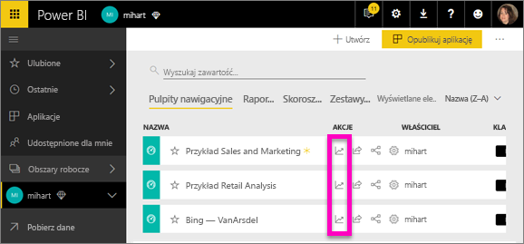

# Metryki użycia pulpitów nawigacyjnych i raportów

Jeśli tworzysz pulpity nawigacyjne i raporty, metryki użycia pomogą Ci określić ich oddziaływanie. Uruchamiając metryki użycia pulpitów nawigacyjnych lub raportów, możesz dowiedzieć się, w jaki sposób są one używane w organizacji: jaka zawartość jest używana, przez kogo i w jakim celu.  

> [!NOTE]
> Metryki użycia będą śledzić użycie raportów osadzonych w usłudze SharePoint Online. Nie będą one jednak śledzić osadzania pulpitów nawigacyjnych i raportów za pośrednictwem przepływów „użytkownik jest właścicielem poświadczeń” i „aplikacja jest właścicielem poświadczeń”. Metryki użycia nie będą również śledzić użycia osadzania raportów za pomocą polecenia [Publikuj w Internecie](service-publish-to-web.md).

Te raporty metryk użycia są tylko do odczytu. Możesz jednak spersonalizować raport metryk użycia, korzystając z funkcji Zapisz jako. To spowoduje utworzenie nowego zestawu danych i przekonwertowanie raportu tylko do odczytu na w pełni funkcjonalny raport usługi Power BI, który można edytować. Spersonalizowany raport zawiera metryki dotyczące wybranego pulpitu nawigacyjnego lub raportu, a ponadto dzięki usunięciu domyślnego filtru zapewnia dostęp do metryk użycia wszystkich pulpitów nawigacyjnych lub wszystkich raportów w wybranym obszarze roboczym. Możesz nawet zobaczyć nazwy użytkowników końcowych.

## Dlaczego metryki użycia są istotne?

Wiedza na temat sposobu, w jaki używana jest zawartość, pomaga w określeniu swojego oddziaływania i ustaleniu priorytetów swoich działań. Metryki użycia mogą na przykład wskazywać, że jeden z Twoich raportów jest używany codziennie przez dużą część organizacji, a z kolei utworzony przez Ciebie pulpit nawigacyjny nie jest w ogóle wyświetlany. Tego typu informacje zwrotne są bezcenne w kontekście planowania dalszej pracy.

Raporty metryk użycia można uruchamiać tylko w usłudze Power BI.  Jeśli jednak zapiszesz raport metryk użycia lub przypniesz go do pulpitu nawigacyjnego, możesz go otworzyć i używać również na urządzeniach przenośnych.

### Wymagania wstępne

- Funkcja metryk użycia przechwytuje informacje o użyciu od wszystkich użytkowników, niezależnie od licencji, które do nich przypisano. Natomiast korzystanie z metryk użycia i dostęp do ich danych są możliwe tylko dla użytkowników z licencją usługi Power BI Pro.
- Metryki użycia są dostępne dla pulpitów nawigacyjnych i raportów w wybranym obszarze roboczym. Aby uzyskać dostęp do metryk użycia określonego pulpitu nawigacyjnego lub raportu, musisz:    
    • Mieć uprawnienia do edycji tego pulpitu nawigacyjnego lub raportu • Mieć licencję wersji Pro

## Informacje o raporcie metryk użycia

Po wybraniu pozycji **Metryki użycia** lub ikony  usługa Power BI generuje wstępnie utworzony raport zawierający metryki użycia danej zawartości z ostatnich 90 dni.  Jest on podobny do raportów usługi Power BI, które już znasz, ale pełni funkcję informacyjną — nie jest interakcyjny. Dane możesz fragmentować na podstawie sposobu uzyskania dostępu przez użytkowników końcowych, tego, czy korzystali z interfejsu internetowego, czy aplikacji mobilnej itp. Raport metryk użycia będzie zmieniał się wraz z docelowymi pulpitami nawigacyjnymi i raportami i będzie uzupełniany codziennie nowymi danymi.  

Raporty metryk użycia nie będą widoczne na listach zawartości **Ostatnio używane**, **Obszary robocze**, **Ulubione** ani innych. Nie można dodawać ich do aplikacji. Jeśli przypniesz do pulpitu nawigacyjnego kafelek z raportu metryk użycia, nie będzie można dodać tego pulpitu nawigacyjnego do aplikacji ani do pakietu zawartości.

Aby dokładniej analizować dane raportu lub tworzyć własne raporty na podstawie tego samego zestawu danych, użyj polecenia **Zapisz jako** (zobacz [Zapisywanie raportu metryk użycia jako w pełni funkcjonalnego raportu usługi Power BI](#Save-the-Usage-Metrics-report-as-a-full-featured-Power-BI-report-(personalize))).

## Otwieranie raportu metryk użycia dotyczącego pulpitu nawigacyjnego lub raportu

1. Zacznij w obszarze roboczym zawierającym wybrany pulpit nawigacyjny lub raport.
2. Z poziomu listy zawartości obszaru roboczego albo samego pulpitu nawigacyjnego lub raportu wybierz ikonę **metryk użycia** .

    

    
3. Za pierwszym razem usługa Power BI utworzy raport metryk użycia i powiadomi Cię, gdy będzie gotowy.

    
4. Aby otworzyć wyniki, wybierz polecenie **Wyświetl metryki użycia**.

    Metryki użycia są bardzo pomocne w procesie wdrażania i utrzymywania pulpitów nawigacyjnych i raportów usługi Power BI. Zastanawiasz się, które strony raportu są najbardziej użyteczne, a które należałoby wycofać? Użyj fragmentatora **stron raportu**, aby się tego dowiedzieć. Zastanawiasz się nad utworzeniem układu pulpitu nawigacyjnego dla urządzeń przenośnych? Użyj fragmentatora **platform**, aby dowiedzieć się, ilu użytkowników uzyskuje dostęp do zawartości za pośrednictwem aplikacji mobilnych, a ilu za pośrednictwem przeglądarki internetowej.

5. Opcjonalnie umieść kursor nad wizualizacją i wybierz ikonę pinezki, aby dodać wizualizację do pulpitu nawigacyjnego. Alternatywnie z górnego paska menu wybierz pozycję **Przypnij stronę dynamiczną**, aby dodać całą stronę do pulpitu nawigacyjnego. Z poziomu pulpitu nawigacyjnego możesz łatwiej monitorować metryki użycia lub udostępnić je innym.

    > [!NOTE]
    > Jeśli przypniesz do pulpitu nawigacyjnego kafelek z raportu metryk użycia, nie będzie można dodać tego pulpitu nawigacyjnego do aplikacji ani do pakietu zawartości.

## Jakie metryki są uwzględniane w raporcie?

| Metryka | Pulpit nawigacyjny | Raport | Opis |
| --- | --- | --- | --- |
| Fragmentator metody dystrybucji |tak |tak |Sposób uzyskania dostępu do zawartości przez użytkowników. Istnieją 3 możliwości: użytkownicy mogą uzyskać dostęp do pulpitu nawigacyjnego lub raportu, będąc członkami [obszaru roboczego aplikacji](consumer/end-user-experience.md), przez [udostępnienie im](service-share-dashboards.md) zawartości lub przez zainstalowanie aplikacji albo pakietu zawartości.  Zwróć uwagę, że wyświetlenia za pośrednictwem aplikacji są liczone w kategorii „pakiet zawartości”. |
| Fragmentator platform |tak |tak |Czy użytkownik uzyskał dostęp do pulpitu nawigacyjnego lub raportu za pośrednictwem usługi Power BI (powerbi.com), czy urządzenia przenośnego? W kategorii urządzeń przenośnych uwzględniane są wszystkie aplikacje dla systemów iOS, Android i Windows. |
| Fragmentator stron raportu |nie |tak |Jeśli raport ma więcej niż 1 stronę, możesz użyć tego fragmentatora, aby określić, które strony były wyświetlane. Jeśli na liście znajduje się pozycja „Puste”, oznacza to, że niedawno dodano (w takim przypadku rzeczywista nazwa nowej strony pojawi się na liście w ciągu 24 godzin) i/lub usunięto strony raportu. Pozycja „Puste” rejestruje tego typu sytuacje. |
| Wyświetlenia na dzień |tak |tak |Łączna liczba wyświetleń w ciągu dnia — wyświetlenie jest definiowane jako załadowanie strony raportu lub pulpitu nawigacyjnego przez użytkownika. |
| Unikatowe osoby przeglądające na dzień |tak |tak |Liczba *różnych* użytkowników, którzy wyświetlili pulpit nawigacyjny lub raport (na podstawie konta użytkownika usługi AAD). |
| Wyświetlenia na użytkownika |tak |tak |Liczba wyświetleń w ciągu ostatnich 90 dni z podziałem na poszczególnych użytkowników. |
| Udostępnienia na dzień |tak |nie |Liczba udostępnień danego pulpitu nawigacyjnego innym użytkownikom lub grupom. |
| Łączna liczba wyświetleń |tak |tak |Liczba wyświetleń w ciągu ostatnich 90 dni. |
| Łączna liczba osób przeglądających |tak |tak |Liczba unikatowych osób przeglądających w ciągu ostatnich 90 dni. |
| Łączna liczba udostępnień |tak |nie |Liczba udostępnień danego pulpitu nawigacyjnego lub raportu w ciągu ostatnich 90 dni. |
| Łącznie w organizacji |tak |tak |Liczba wszystkich pulpitów nawigacyjnych i raportów w całej organizacji, które zostały wyświetlone co najmniej raz w ciągu ostatnich 90 dni.  Ta wartość jest używana do obliczenia rangi. |
| Ranga: łączna liczba wyświetleń |tak |tak |Ranga danego pulpitu nawigacyjnego lub raportu wśród wszystkich pulpitów nawigacyjnych i raportów w organizacji wyświetlanych w ciągu ostatnich 90 dni. |
| Ranga: łączna liczba udostępnień |tak |nie |Ranga danego pulpitu nawigacyjnego lub raportu wśród wszystkich pulpitów nawigacyjnych i raportów w organizacji udostępnianych w ciągu ostatnich 90 dni. |

### Raport metryk użycia pulpitu nawigacyjnego

### Raport metryk użycia raportu

## Zapisywanie raportu metryk użycia jako w pełni funkcjonalnego raportu usługi Power BI (personalizowanie)

Możesz użyć funkcji **Zapisz jako**, aby przekonwertować raport metryk użycia na w pełni funkcjonalny raport usługi Power BI, który można dostosowywać i udostępniać. Po utworzeniu spersonalizowanej kopii raportu uzyskasz pełny dostęp do podstawowego zestawu danych, co umożliwi Ci dostosowanie raportu metryk użycia do własnych potrzeb. Możesz nawet tworzyć niestandardowe raporty metryk użycia w programie Power BI Desktop, korzystając z [funkcji połączenia na żywo z usługą Power BI](https://powerbi.microsoft.com/blog/connecting-to-datasets-in-the-power-bi-service-from-desktop).

W dodatku bazowy zestaw danych zawiera szczegółowe dane o użyciu wszystkich pulpitów nawigacyjnych lub raportów w wybranym obszarze roboczym. To otwiera zupełnie nowe możliwości. Na przykład możesz utworzyć raport porównujący wszystkie pulpity nawigacyjne w Twoim obszarze roboczym pod względem użycia. Możesz też utworzyć pulpit nawigacyjny metryk użycia dla swojej aplikacji Power BI, agregując dane dotyczące użycia całej zawartości dystrybuowanej w ramach tej aplikacji.  Zobacz poniższą sekcję dotyczącą [usuwania filtru na poziomie strony](#remove-the-filter-to-see-all-the-usage-metrics-data-in-the-workspace).

### Co jest tworzone w przypadku użycia funkcji „Zapisz jako”?

Podczas tworzenia w pełni funkcjonalnego raportu usługi Power BI jest tworzony również nowy zestaw danych **obejmujący wszystkie pulpity nawigacyjne lub wszystkie raporty w bieżącym obszarze danych**, które były używane w ciągu ostatnich 90 dni. Załóżmy na przykład, że masz obszar roboczy o nazwie „Sprzedaż”, zawierający trzy pulpity nawigacyjne i dwa raporty, i tworzysz raport metryk użycia dla pulpitu nawigacyjnego „Północny wschód”. Następnie używasz funkcji **Zapisz jako**, aby spersonalizować raport i przekonwertować go na raport w pełni funkcjonalny. Zestaw danych tego nowego raportu zawiera metryki użycia *nie tylko pulpitu nawigacyjnego „Północny wschód”*, ale wszystkich trzech pulpitów nawigacyjnych w obszarze roboczym „Sprzedaż”. Domyślnie w raporcie będą wyświetlane dane dotyczące pulpitu nawigacyjnego „Północny wschód” i konieczne będzie [usunięcie filtru](#remove-the-filter-to-see-all-the-usage-metrics-data-in-the-workspace) (jednym kliknięciem) w celu wyświetlenia danych dotyczących wszystkich trzech pulpitów nawigacyjnych.

### Tworzenie kopii raportu użycia za pomocą polecenia „Zapisz jako”

W przypadku utworzenia kopii raportu za pomocą polecenia „Zapisz jako” (spersonalizowania raportu) usługa Power BI konwertuje wstępnie utworzony raport tylko do odczytu na raport w pełni funkcjonalny.  Na pierwszy rzut oka niczym się on nie różni. Możesz jednak teraz otwierać go w widoku do edycji, dodawać nowe wizualizacje, filtry i strony, modyfikować lub usuwać istniejące wizualizacje i nie tylko. Usługa Power BI zapisuje nowy raport i zestaw danych w bieżącym obszarze roboczym. W poniższym przykładzie bieżącym obszarem roboczym jest **mihart**.

1. We wstępnie utworzonym raporcie metryk użycia wybierz pozycję **Plik > Zapisz jako**. Usługa Power BI przekonwertuje raport metryk użycia na w pełni funkcjonalny raport usługi Power BI. Jest to tak zwany *spersonalizowany* raport metryk użycia. Spersonalizowany raport użycia i zestaw danych są zapisywane w bieżącym obszarze roboczym o nazwie *mihart*.

    
2. Możesz otworzyć ten raport w widoku do edycji i [korzystać z niego tak samo, jak ze zwykłego raportu usługi Power BI](service-interact-with-a-report-in-editing-view.md). Na przykład możesz dodawać nowe strony, tworzyć nowe wizualizacje, dodawać filtry, formatować czcionki i kolory itp.

    
3. Możesz także rozpocząć od nowo utworzonego zestawu danych, a następnie utworzyć raport od podstaw.

    
4. Nowy raport zostanie zapisany w bieżącym obszarze roboczym (mihart) i dodany do listy zawartości **Ostatnio używane**.

    

### Usuwanie filtru w celu wyświetlenia ***wszystkich*** danych metryk użycia w obszarze roboczym

Aby wyświetlić metryki dotyczące wszystkich pulpitów nawigacyjnych lub raportów w obszarze roboczym, należy usunąć filtr. Domyślnie raport spersonalizowany jest filtrowany w celu wyświetlenia tylko metryk dotyczących pulpitu nawigacyjnego lub raportu użytego do jego utworzenia.

Jeśli na przykład nowy raport spersonalizowany został utworzony na podstawie pulpitu nawigacyjnego o nazwie „Sprzedaż w Europie”, zostaną wyświetlone tylko dane dotyczące użycia pulpitu nawigacyjnego „Sprzedaż w Europie”. Aby usunąć filtr i wyświetlić dane dotyczące wszystkich pulpitów nawigacyjnych w wybranym obszarze roboczym:

1. Otwórz raport spersonalizowany w widoku do edycji.

    
2. W okienku Filtry znajdź zasobnik **Filtry na poziomie raportu** i usuń filtr, wybierając znak „x”.

    

    Teraz w raporcie spersonalizowanym będą wyświetlane metryki dotyczące całego obszaru roboczego.

## Opcje kontroli administracyjnej dotyczące metryk użycia — dla administratorów usługi Power BI

Administratorzy usługi Power BI lub Office 365 mogą włączać i wyłączać funkcję raportów metryk użycia. Administratorzy mają szczegółową kontrolę nad tym, którzy użytkownicy mają dostęp do metryk użycia — domyślnie wszyscy użytkownicy w organizacji mają dostęp.

1. Otwórz portal administracyjny, wybierając w usłudze Power BI ikonę koła zębatego w prawym górnym rogu, a następnie pozycję **Portal administracyjny**.

    
2. W portalu administracyjnym wybierz pozycję **Ustawienia dzierżawy**, a następnie **Metryki użycia dla twórców zawartości**.

    
3. Włącz lub wyłącz metryki użycia i wybierz przycisk **Zastosuj**.

    

Domyślnie dane na użytkownika są włączone dla metryki użycia, a informacje o koncie autora zawartości są uwzględniane w raporcie metryki. Jeśli nie chcesz uwzględnić tych informacji dla niektórych lub wszystkich użytkowników, wyłączyć funkcję dla określonych grup zabezpieczeń lub całej organizacji. Informacje o koncie będą wyświetlane w raporcie jako *Bez nazwy*.

Wyłączając metryki użycia dla całej organizacji, administratorzy mogą skorzystać z opcji **Usuń całą istniejącą zawartość metryk użycia**, aby usunąć wszystkie istniejące raporty i kafelki pulpitów nawigacyjnych utworzone na podstawie raportów i zestawów danych metryk użycia. To uniemożliwi również dostęp do danych metryk użycia wszystkim użytkownikom w organizacji, którzy już z nich korzystali. Zachowaj ostrożność, ponieważ usunięcie istniejącej zawartości metryk użycia jest nieodwracalne.

## Metryki użycia w chmurach krajowych

Usługa Power BI jest dostępna w osobnych chmurach krajowych. Te chmury zapewniają ten sam poziom bezpieczeństwa, prywatności, zgodności i przejrzystości co wersja globalna usługi Power BI, a także udostępniają unikatowy model na potrzeby przepisów lokalnych dotyczących świadczenia usług, przechowywania danych, dostępu i kontroli. Ze względu na ten unikatowy model dla przepisów lokalnych metryki użycia nie są dostępne w chmurach krajowych. Więcej informacji można znaleźć na stronie dotyczącej [chmur krajowych](https://powerbi.microsoft.com/en-us/clouds/).

## Istotne zagadnienia i ograniczenia

Ważne jest, aby rozumieć różnice, które mogą wystąpić podczas porównywania metryk użycia i dzienników inspekcji, oraz ich przyczyny. *Dzienniki inspekcji* są zbierane przy użyciu danych z usługi Power BI, a *Metryki użycia* są zbierane na komputerze klienckim. Ta różnica sprawia, że zagregowana liczba działań w dziennikach inspekcji nie zawsze musi być zgodna z metrykami użycia, ponieważ:

* Metryki użycia mogą czasami zaniżać liczbę działań z powodu niespójnych połączeń sieciowych, blokad reklam lub innych problemów, które mogą zakłócać wysyłanie zdarzeń od klienta.
* Niektóre typy widoków nie są uwzględnione w metrykach użycia zgodnie z opisem we wcześniejszej części tego artykułu.
* Metryki użycia mogą czasami zawyżać liczbę działań w sytuacjach, w których klient dokonuje odświeżania, ale nie ma konieczności wysłania żądania z powrotem do usługi Power BI.

Jako uzupełnienie znajomości potencjalnych różnic między użyciem metryk i dzienników inspekcji, użytkownikom i administratorom mogą przydać się następujące pytania i odpowiedzi dotyczące metryk użycia:

Pytanie: Nie można uruchomić metryk na pulpicie nawigacyjnym ani w raporcie. Odpowiedź: Metryki użycia można wyświetlać tylko w przypadku zawartości, której jesteś właścicielem lub którą możesz edytować.

Pytanie: Czy metryki użycia uwzględniają wyświetlenia osadzonych pulpitów nawigacyjnych i raportów?
Odpowiedź: W metrykach użycia nie jest obecnie obsługiwane przechwytywanie użycia osadzonych pulpitów nawigacyjnych, raportów i przepływu [publikowania w Internecie](service-publish-to-web.md).          W takich przypadkach zalecamy korzystanie z istniejących internetowych platform analitycznych w celu śledzenia użycia aplikacji lub portalu, gdzie hostowana jest zawartość.

Pytanie: Nie można uruchomić metryk użycia dla jakiejkolwiek zawartości.
Odpowiedź 1: Administratorzy mogą wyłączyć tę funkcję w organizacji.  Skontaktuj się z administratorem, aby dowiedzieć się, czy tak się stało.
Odpowiedź 2: Metryki użycia to funkcja usługi Power BI Pro.

Pytanie: Dane wydają się nieaktualne. Nie są na przykład widoczne niektóre metody dystrybucji, brakuje niektórych stron raportów itp. Odpowiedź: Aktualizowanie danych może potrwać do 24 godzin.

Pytanie: W obszarze roboczym znajdują się cztery raporty, ale w metrykach użycia widoczne są tylko 3.
Odpowiedź: Raport metryk użycia zawiera tylko raporty (lub pulpity nawigacyjne), które były używane w ciągu ostatnich 90 dni.  Jeśli raport (lub pulpit nawigacyjny) nie jest widoczny, prawdopodobnie nie był używany w ciągu ostatnich 90 dni.

## Następne kroki

[Dodawanie pulpitu nawigacyjnego do ulubionych](consumer/end-user-favorite.md)

Masz więcej pytań? [Odwiedź społeczność usługi Power BI](http://community.powerbi.com/)