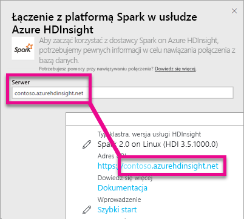

# Platforma Spark w usłudze HDInsight z zapytaniem bezpośrednim
Platforma Spark w usłudze HDInsight z zapytaniem bezpośrednim umożliwia tworzenie dynamicznych raportów na podstawie danych i metryk, które już znajdują się w klastrze Spark. Dzięki zapytaniu bezpośredniemu zapytania są wysyłane do klastra Spark usługi Azure HDInsight w czasie, gdy eksplorujesz dane w widoku raportu. To środowisko jest zalecane dla użytkowników zaznajomionych z jednostkami, z którymi się łączą.

> [!WARNING]
> Automatyczne odświeżanie kafelków zostało wyłączone dla kafelków pulpitów nawigacyjnych utworzonych w oparciu o zestawy danych bazujące na platformie Spark. Możesz wybrać pozycję **Odśwież kafelki pulpitu nawigacyjnego**, aby odświeżyć je ręcznie. Nie ma to wpływu na raporty i powinny być one nadal aktualizowane. 
> 
> 

Aby nawiązać połączenie ze źródłem danych platformy Spark w usłudze Azure HDInsight za pomocą zapytania bezpośredniego w usłudze Power BI, możesz wykonać następujące kroki.

> [!Important]
> Pracowaliśmy nad ulepszeniem łączności z platformą Spark.  Aby uzyskać najlepsze wyniki podczas łączenia ze źródłem danych platformy Spark, użyj programu Power BI Desktop.  Po skompilowaniu modelu i raportów możesz opublikować go w usłudze Power BI.  Bezpośredni łącznik z platformą Spark w usłudze Power BI jest już przestarzały.
>

1. Wybierz pozycję **Pobierz dane** w dolnej części okienka nawigacji po lewej stronie.
   
     
2. Wybierz pozycję **Bazy danych i inne**.
   
     
3. Zaznacz łącznik **Platforma Spark w usłudze HDInsight** i wybierz przycisk **Połącz**.
   
     
4. Wprowadź nazwę **serwera**, z którym chcesz się połączyć, a także **nazwę użytkownika** i **hasło**. Nazwa serwera ma zawsze format \<nazwaklastra\>.azurehdinsight.net. Poniżej znajdują się szczegółowe informacje o tym, jak znaleźć te wartości.
   
     
   
     
5. Po nawiązaniu połączenia zostanie wyświetlony nowy zestaw danych o nazwie „SparkDataset”. Dostęp do tego zestawu danych można także uzyskać za pomocą utworzonego kafelka zastępczego.
   
     
6. Przechodząc do szczegółów zestawu danych, można eksplorować tabele i kolumny bazy danych. Wybór kolumny spowoduje wysłanie zapytania do źródła i dynamiczne utworzenie wizualizacji. Te wizualizacje można zapisać w nowym raporcie i ponownie przypiąć do pulpitu nawigacyjnego.

## Znajdowanie parametrów platformy Spark w usłudze HDInsight
Nazwa serwera ma zawsze format \<nazwaklastra\>.azurehdinsight.net i można ją znaleźć w witrynie Azure Portal.

W witrynie Azure Portal można także znaleźć nazwę użytkownika i hasło.

## Ograniczenia
Te ograniczenia i uwagi mogą ulegać zmianom w miarę kontynuowania procesu ulepszania środowisk. Dodatkową dokumentację można znaleźć w artykule [Korzystanie z narzędzi do analizy biznesowej przy użyciu platformy Apache Spark w usłudze Azure HDInsight](https://azure.microsoft.com/documentation/articles/hdinsight-apache-spark-use-bi-tools/)

* Usługa Power BI obsługuje tylko następującą konfigurację: platforma Spark 2.0 i usługa HDInsight 3.5.
* Wszystkie akcje, takie jak wybór kolumny lub dodanie filtru, powodują wysłanie zapytania zwrotnego do bazy danych — przed zaznaczeniem bardzo dużych pól warto wybrać odpowiedni typ wizualizacji.
* Funkcja Pytania i odpowiedzi nie jest dostępna dla zestawów danych zapytania bezpośredniego.
* Zmiany schematu nie są pobierane automatycznie.
* Usługa Power BI obsługuje 16 000 kolumn **w ramach wszystkich tabel** zestawu danych. Usługa Power BI dodaje także wewnętrzną kolumnę z numerami wierszy w każdej tabeli. Oznacza to, że jeśli zestaw danych zawiera 100 tabel, liczba dostępnych kolumn wyniesie 15 900. W zależności od ilości danych ze źródła danych Spark mogą wystąpić ograniczenia.

## Rozwiązywanie problemów
Jeśli występują problemy z wykonywaniem zapytań względem klastra, sprawdź, czy aplikacja działa, i w razie potrzeby uruchom ją ponownie.

Możesz również przydzielić dodatkowe zasoby w witrynie Azure Portal w obszarze **Konfigurowanie** > **Skaluj klaster**:

## Następne kroki
[Wprowadzenie: tworzenie klastra platformy Apache Spark w usłudze HDInsight w systemie Linux i uruchamianie interaktywnych zapytań przy użyciu programu Spark SQL](https://azure.microsoft.com/documentation/articles/hdinsight-apache-spark-jupyter-spark-sql)  
[Co to jest usługa Power BI?](power-bi-overview.md)  
[Pobieranie danych dla usługi Power BI](service-get-data.md)  
Masz więcej pytań? [Odwiedź społeczność usługi Power BI](http://community.powerbi.com/)

