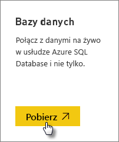
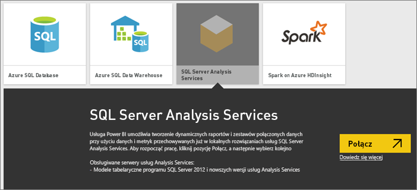
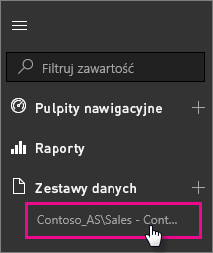

# Dane na żywo usług SQL Server Analysis Services w usłudze Power BI
W usłudze Power BI istnieją dwa sposoby nawiązywania połączeń z serwerem SQL Server Analysis Services na żywo. W oknie **Pobierz dane** można połączyć się z serwerem SQL Server Analysis Services. Można również połączyć się z [plikiem programu Power BI Desktop](service-desktop-files.md) lub [skoroszytem programu Excel](service-excel-workbook-files.md), które już mają połączenie z serwerem usług Analysis Services.

 >[!IMPORTANT]
 >* Aby można było połączyć się z serwerem usług Analysis Services na żywo, administrator musi zainstalować i skonfigurować lokalną bramę danych. Aby uzyskać więcej informacji, zobacz [Lokalna brama danych](service-gateway-onprem.md).
 >* Gdy używasz bramy, dane pozostają w środowisku lokalnym.  Raporty tworzone w oparciu o te dane są zapisywane w usłudze Power BI. 
 >* Połączenia na żywo usług Analysis Services zawierają funkcję [wysyłania pytań i uzyskiwania odpowiedzi w języku naturalnym](service-q-and-a-direct-query.md) w wersji Preview.

## Aby nawiązać połączenie z modelem z poziomu okna Pobierz dane
1. W oknie **Mój obszar roboczy** wybierz pozycję **Pobierz dane**. Możesz również przełączyć się na obszar roboczy grupy, jeśli jest dostępny.
   
   
2. Wybierz pozycję **Bazy danych i inne**.
   
   
3. Wybierz pozycję **SQL Server Analysis Services** > **Połącz**. 
   
   
4. Wybierz serwer. Jeśli w tym miejscu nie są wyświetlane żadne serwery, oznacza to, że nie skonfigurowano bramy i źródła danych albo że konta nie ma na karcie **Użytkownicy** źródła danych w bramie. Skontaktuj się z administratorem.
5. Wybierz model, z którym chcesz nawiązać połączenie. Może to być model tabelaryczny lub wielowymiarowy.

Po nawiązaniu połączenia z modelem zostanie on wyświetlony w witrynie usługi Power BI w oknie **Mój obszar roboczy/Zestawy danych**. Jeśli przełączysz się na obszar roboczy grupy, zestaw danych będzie wyświetlany w grupie.

## Kafelki pulpitu nawigacyjnego
Jeśli przypinasz wizualizacje z raportu do pulpitu nawigacyjnego, przypięte kafelki są automatycznie odświeżane co 10 minut. Gdy dane na lokalnym serwerze usług Analysis Services zostaną aktualizowane, po upływie 10 minut kafelki również zostaną automatycznie zaktualizowane.

## Następne kroki
[Lokalna brama danych](service-gateway-onprem.md)  
[Zarządzanie źródłami danych usług Analysis Services](service-gateway-enterprise-manage-ssas.md)  
[Rozwiązywanie problemów z lokalną bramą danych](service-gateway-onprem-tshoot.md)  
Więcej pytań? [Odwiedź społeczność usługi Power BI](http://community.powerbi.com/)

