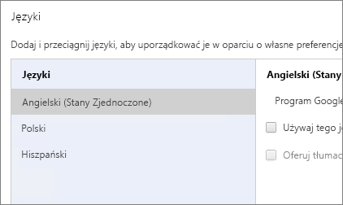
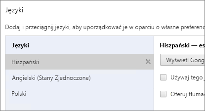
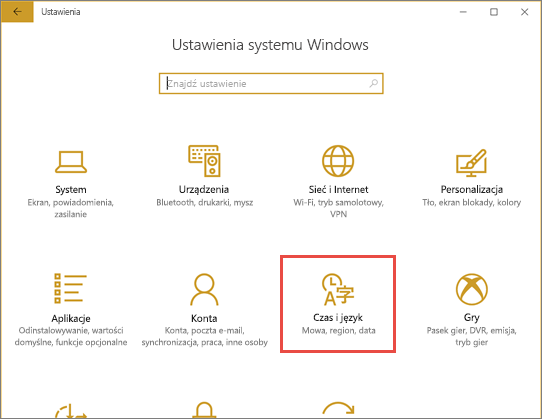

# Języki i kraje/regiony obsługiwane w usłudze Power BI
## Kraje i regiony, w których usługa Power BI jest dostępna
Aby uzyskać listę krajów i regionów, w których usługa Power BI jest dostępna, zobacz [listę międzynarodowej dostępności](https://products.office.com/business/international-availability). 

## Języki usługi Power BI
Usługa Power BI (w przeglądarce) jest dostępna w następujących 42 językach:

* Arabski
* Baskijski — Basque
* Bułgarski — Български
* Kataloński — català
* Chiński (uproszczony) — 中文(简体)
* Chiński (tradycyjny) — 中文(繁體)
* Chorwacki — hrvatski
* Czeski — čeština
* Duński — dansk
* Holenderski — Nederlands
* Angielski — English
* Estoński — eesti
* Fiński — suomi
* Francuski — français
* Galicyjski — galego
* Niemiecki — Deutsch
* Grecki — Ελληνικά
* Hebrajski
* Hindi — हिंदी
* Węgierski — magyar
* Indonezyjski — Bahasa Indonesia
* Włoski — italiano
* Japoński — 日本語
* Kazachski — Қазақ
* Koreański — 한국어
* Łotewski — latviešu
* Litewski — lietuvių
* Malajski — Bahasa Melayu
* Norweski (Bokmål) — norsk (bokmål)
* Polski — polski
* Portugalski (Brazylia) — Português
* Portugalski (Portugalia) — português
* Rumuński — română
* Rosyjski — Русский
* Serbski (cyrylica) — српски
* Serbski (łaciński) — srpski
* Słowacki — slovenčina
* Słoweński — slovenski
* Hiszpański — español
* Szwedzki — svenska
* Tajski — ไทย
* Turecki — Türkçe
* Ukraiński — українська
* Wietnamski — Tiếng Việt

## Tłumaczone elementy
Menu, przyciski, komunikaty i inne elementy środowiska są tłumaczone na Twój język, dzięki czemu łatwiejsze jest nawigowanie w usłudze Power BI i interakcja z nią.

Obecnie kilka funkcji jest dostępnych tylko w języku angielskim:

* Pulpity nawigacyjne i raporty tworzone dla Ciebie przez usługę Power BI po połączeniu z usługami takimi jak Microsoft Dynamics CRM, Google Analytics, Salesforce itd. (Własne pulpity nawigacyjne i raporty możesz tworzyć w swoim języku).
* Eksplorowanie danych za pomocą pytań i odpowiedzi.

Śledź aktualności, ponieważ pracujemy nad udostępnieniem dodatkowych funkcji w innych językach. 

## Wybieranie języka w usłudze Power BI
1. W usłudze Power BI wybierz ikonę **Ustawienia**  > **Ustawienia**.
2. Na karcie **Ogólne** wybierz pozycję **Język**.
3. Wybierz swój język, a następnie wybierz przycisk **Zastosuj**.

## Wybieranie języka w przeglądarce
Usługa Power BI wykrywa język na podstawie preferencji językowych na komputerze. Sposób uzyskiwania dostępu do tych preferencji i ich zmiany może się różnić w zależności od używanego systemu operacyjnego i przeglądarki. Poniżej przedstawiono sposób uzyskania dostępu do tych preferencji z poziomu przeglądarek Internet Explorer i Google Chrome.

### Internet Explorer (wersja 11)
1. Kliknij przycisk **Narzędzia** w prawym górnym rogu okna przeglądarki:
   
   
2. Kliknij polecenie **Opcje internetowe**.
3. W oknie dialogowym Opcje internetowe na karcie Ogólne w obszarze Wygląd kliknij przycisk **Języki**.

### Google Chrome (wersja 42)
1. Kliknij przycisk menu w prawym górnym rogu okna przeglądarki:
   
   
2. Kliknij polecenie **Ustawienia**.
3. Kliknij opcję **Pokaż ustawienia zaawansowane**.
4. W obszarze Języki kliknij przycisk **Ustawienia języka i wprowadzania treści**.
5. Kliknij przycisk **Dodaj**, wybierz język i kliknij przycisk **OK**.
   
   
   
   Nowy język znajduje się na końcu listy. 
6. Przeciągnij nowy język na początek listy, a następnie kliknij przycisk **Wyświetl Google Chrome w tym języku**.
   
   
   
   Aby zmiana została zastosowana, może być konieczne zamknięcie i ponowne uruchomienie przeglądarki.

## Wybieranie języka lub ustawień regionalnych programu Power BI Desktop
Program Power BI Desktop można uzyskać na dwa sposoby: pobrać go lub zainstalować ze Sklepu Windows.

* Podczas [instalacji programu Power BI Desktop ze Sklepu Windows](#choose-a-language-for-power-bi-desktop-installed-from-the-windows-store) instalowane są wszystkie języki, a program jest wyświetlany w języku odpowiadającym domyślnemu językowi systemu Windows.
* W przypadku [pobierania programu Power BI Desktop](#choose-a-language-when-you-download-power-bi-desktop) można wybrać język pobieranego programu. 
* Dodatkowo możesz [wybrać ustawienia regionalne, które mają być używane podczas importowania danych](#choose-the-locale-to-be-used-when-importing-data-into-power-bi-desktop) dla konkretnego raportu. 

### Wybieranie języka programu Power BI Desktop zainstalowanego ze Sklepu Windows
1. [Zainstaluj program Power BI Desktop](http://aka.ms/pbidesktopstore) ze Sklepu Windows.
2. Aby zmienić język, na komputerze wyszukaj opcję **Ustawienia systemu Windows**. 
3. Wybierz pozycję **Czas i język**.
   
     
4. Wybierz pozycję **Region i język**, wybierz język, a następnie wybierz przycisk **Ustaw jako domyślny**.
   
     
   
     Po następnym uruchomieniu program Power BI Desktop będzie używać języka, który został ustawiony jako domyślny. 

### Wybieranie języka podczas pobierania programu Power BI Desktop
Język wybrany dla programu Power BI Desktop wpływa na format wyświetlania liczb i dat w raportach. 

* Wybierz język podczas [pobierania programu Power BI Desktop](https://powerbi.microsoft.com/desktop). 

Aby zmienić język w programie Power BI Desktop, wróć do strony pobierania i pobierz program w innym języku.

### Wybieranie ustawień regionalnych, które będą używane podczas importowania danych do programu Power BI Desktop
Niezależnie od tego, czy program Power BI Desktop zostanie pobrany, czy zainstalowany ze Sklepu Windows, dla konkretnego raportu możesz wybrać ustawienia regionalne inne niż ustawienia regionalne w używanej wersji programu Power BI Desktop. Spowoduje to zmianę sposobu interpretowania danych importowanych ze źródła danych. W ten sposób możesz na przykład określić, czy data „3/4/2017” ma zostać zinterpretowana jako 3 kwietnia, czy 4 marca. 

1. W programie Power BI Desktop wybierz opcję **Plik** > **Opcje i ustawienia** > **Opcje**.
2. W obszarze **Bieżący plik** wybierz opcję **Ustawienia regionalne**.
3. W polu **Ustawienia regionalne** wybierz inne ustawienia regionalne. 
   
   
4. Wybierz przycisk **OK**.

## Języki dokumentacji pomocy
Zlokalizowana pomoc jest dostępna w następujących 10 językach: 

* Chiński (uproszczony) — 中文(简体)
* Chiński (tradycyjny) — 中文(繁體)
* Francuski — français
* Niemiecki — Deutsch
* Włoski — italiano
* Japoński — 日本語
* Koreański — 한국어
* Portugalski (Brazylia) — Português
* Rosyjski — Русский
* Hiszpański — español

## Następne kroki
* Używasz jednej z aplikacji mobilnych usługi Power BI? Zobacz [Obsługiwane języki w aplikacjach mobilnych Power BI](mobile-apps-supported-languages.md), aby uzyskać więcej szczegółów.
* Masz pytania? Zadaj pytanie [społeczności usługi Power BI](http://community.powerbi.com/).
* Nadal masz problem? Odwiedź [stronę pomocy technicznej usługi Power BI](https://powerbi.microsoft.com/support/).

