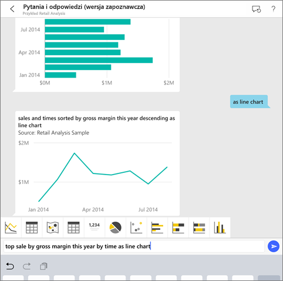
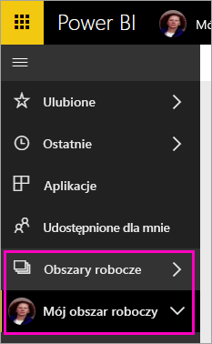
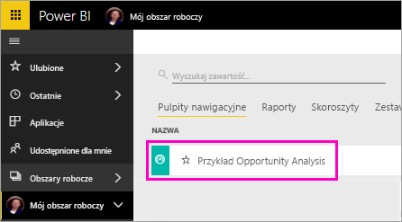

# Samouczek: zadawanie pytań dotyczących danych za pomocą wirtualnego analityka pytań i odpowiedzi w aplikacjach systemu iOS — usługa Power BI

Najprostszym sposobem, aby dowiedzieć się więcej o swoich danych, jest zadać własnymi słowami pytanie na ich temat. W tym samouczku można zadać pytania i wyświetlić proponowane szczegółowe informacje na temat przykładowych danych przy użyciu wirtualnego analityka pytań i odpowiedzi w aplikacji mobilnej usługi Microsoft Power BI na urządzeniach iPad, iPhone i iPod Touch. 

Dotyczy:

|  |  |
|:--- |:--- |
| Telefony iPhone |Urządzenia iPad |

Wirtualny analityk pytań i odpowiedzi to konwersacyjne środowisko analizy biznesowej, które ma dostęp do bazowych danych pytań i odpowiedzi w usłudze Power BI [(https://powerbi.com)](https://powerbi.com). Proponuje ono wgląd w szczegółowe informacje, a użytkownik może zadawać swoje pytania, wpisując je lub wypowiadając.

Ten samouczek obejmuje następujące kroki:

> [!div class="checklist"]
> * Instalowanie aplikacji mobilnej usługi Power BI dla systemu iOS
> * Pobieranie przykładowego pulpitu nawigacyjnego i raportu usługi Power BI
> * Sprawdzanie, jakie polecane szczegółowe informacje zasugeruje aplikacja mobilna

Jeśli nie masz konta usługi Power BI, na początku [zacznij korzystać z bezpłatnej wersji próbnej](https://app.powerbi.com/signupredirect?pbi_source=web).

## Wymagania wstępne

### Instalowanie usługi Power BI dla aplikacji systemu iOS
[Pobierz aplikację dla systemu iOS](http://go.microsoft.com/fwlink/?LinkId=522062 "Pobierz aplikację na telefon iPhone") ze sklepu Apple App Store na swoje urządzenie iPad, iPhone lub iPod Touch.

Poniższe wersje obsługują usługę Power BI dla aplikacji systemu iOS:
- urządzenie iPad z systemem iOS 10 lub nowszym.
- telefon iPhone 5 i nowsze wersje z systemem iOS 10 lub nowszym. 
- urządzenie iPod Touch z systemem iOS 10 lub nowszym.

### Pobieranie przykładu Opportunity Analysis
W pierwszym kroku tego samouczka należy pobrać przykład Opportunity Analysis w usłudze Power BI.

1. Otwórz usługę Power BI w przeglądarce (app.powerbi.com) i zaloguj się.

1. Wybierz ikonę nawigacji globalnej, aby otworzyć obszar nawigacji po lewej stronie.

    

2. W lewym okienku nawigacji wybierz pozycję **Obszary robocze** > **Mój obszar roboczy**.

    

3. W lewym dolnym rogu wybierz pozycję **Pobierz dane**.
   
    

3. Na stronie Pobieranie danych wybierz ikonę **Przykłady**.
   
   

4. Wybierz pozycję **Opportunity Analysis Sample**.
 
    
 
8. Wybierz pozycję **Połącz**.  
  
   
   
5. Usługa Power BI zaimportuje przykład i doda nowy pulpit nawigacyjny, raport oraz zestaw danych do Twojego obszaru roboczego.
   
   

Wszystko jest teraz gotowe do wyświetlenia przykładu na urządzeniu z systemem iOS.

## Korzystanie z opcji „featured insights” (polecane wyniki analizy)
1. Otwórz aplikację Power BI na telefonie iPhone lub urządzeniu iPad i zaloguj się przy użyciu poświadczeń konta usługi Power BI używanych już w usłudze Power BI w przeglądarce.

1.  Naciśnij przycisk nawigacji globalnej  > **Obszary robocze** > **Mój obszar roboczy**, a następnie otwórz pulpit nawigacyjny przykładu Opportunity Analysis.

2. Naciśnij ikonę wirtualnego analityka pytań i odpowiedzi  w menu akcji w dolnej części strony (w górnej części strony w urządzeniu iPad).

     

     Wirtualny analityk pytań i odpowiedzi usługi Power BI proponuje kilka sugestii w zakresie rozpoczęcia pracy.

     
3. Naciśnij pozycję **featured insights** (polecane wyniki analizy).

     Wirtualny analityk pytań i odpowiedzi podpowie wyniki analizy.
4. Przewiń w prawo i naciśnij pozycję **Insight 2** (Wyniki analizy 2).

    

     Wirtualny analityk pytań i odpowiedzi wyświetli wyniki analizy 2 (Insight 2).

    
5. Naciśnij wykres, aby otworzyć go w trybie koncentracji uwagi.

    
6. Naciśnij strzałkę w lewym górnym rogu, aby powrócić do środowiska wirtualnego analityka pytań i odpowiedzi.

## Czyszczenie zasobów

Po zakończeniu tego samouczka możesz usunąć pulpit nawigacyjny, raport i zestaw danych przykładu Opportunity Analysis.

1. Otwórz usługę Power BI (app.powerbi.com) i zaloguj się.

2. W lewym okienku nawigacji wybierz pozycję **Obszary robocze** > **Mój obszar roboczy**.

3. Na karcie **Pulpity nawigacyjne** wybierz ikonę kosza na śmieci **Usuń** obok pulpitu nawigacyjnego Opportunity Analysis.

    

4. Wybierz kartę **Raporty** i zrób to samo dla raportu Opportunity Analysis.

5. Wybierz kartę **Zestawy danych** i zrób to samo dla zestawu danych Opportunity Analysis.

## Następne kroki

Wypróbowano wirtualnego asystenta pytań i odpowiedzi w aplikacjach mobilnych usługi Power BI dla systemu iOS. Dowiedz się więcej o funkcji Pytania i odpowiedzi w usłudze Power BI.
> [!div class="nextstepaction"]
> [Pytania i odpowiedzi w usłudze Power BI](/.power-bi-q-and-a.md)

