# Używanie wizualizacji macierzy w usłudze Power BI
Funkcja wizualizacji **Macierz** pozwala tworzyć wizualizacje macierzy (czasami określane jako *tabele*) w raportach programu **Power BI Desktop** i **usługi Power BI**, a także umożliwia wyróżnianie krzyżowe elementów w macierzy oraz w innych wizualizacjach. Ponadto możesz zaznaczać do wyróżnienia krzyżowego wiersze, kolumny, a nawet pojedyncze komórki. Zaznaczone pojedyncze komórki oraz zaznaczone obszary składające się z wielu komórek można kopiować i wklejać w innych aplikacjach. Aby jeszcze skuteczniej wykorzystać miejsce, wizualizacja macierzy obsługuje układ schodkowy.

Z macierzą jest skojarzonych wiele funkcji. Omówimy je w kolejnych sekcjach tego artykułu.

## Motywy raportu
Wizualizacje macierzy i tabeli odzwierciedlają stylizację (w tym kolorystykę) zastosowanego **motywu raportu**. Te kolory mogą różnić się od oczekiwanych w wizualizacji macierzy. Możesz je zmienić w konfiguracji **motywu raport**. Aby uzyskać więcej informacji o motywach, zobacz [**Używanie motywów raportów w programie Power BI Desktop**](../desktop-report-themes.md).

## W jaki sposób usługa Power BI oblicza sumy

Zanim przejdziemy do sposobu używania wizualizacji **Macierz**, ważne jest, aby zrozumieć, jak usługa Power BI oblicza sumy i sumy częściowe w tabelach i macierzach. W przypadku wierszy sum i sum częściowych miara jest obliczana z uwzględnieniem wszystkich wierszy danych podstawowych — *nie* jest to jedynie proste dodanie wartości w widocznych lub wyświetlanych wierszach. To oznacza, że w wierszu sumy można uzyskać wartości różniące się od oczekiwanych. 

Zobacz następujące wizualizacje **Macierz**. 

W tym przykładzie każdy wiersz w wizualizacji **Macierz** najdalej z prawej strony zawiera *kwotę* dla każdej kombinacji sprzedawca/data. Ze względu na to, że sprzedawca jest wyświetlany w odniesieniu do wielu dat, liczby mogą wystąpić więcej niż raz. Dlatego dokładna suma z danych podstawowych i proste dodanie widocznych wartości nie są równoważne. Jest to typowy wzorzec, gdy sumowana wartość znajduje się po stronie „jeden” w relacji jeden do wielu.

Przeglądając sumy i sumy częściowe należy pamiętać, że wartości te są oparte na danych podstawowych, a nie wyłącznie na wartościach, które są widoczne. 

<!-- use Nov blog post video

## Expanding and collapsing row headers
There are two ways you can expand row headers. The first is through the right-click menu. You’ll see options to expand the specific row header you clicked on, the entire level or everything down to the very last level of the hierarchy. You have similar options for collapsing row headers as well.

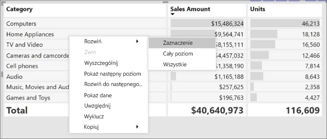

You can also add +/- buttons to the row headers through the formatting pane under the row headers card. By default, the icons will match the formatting of the row header, but you can customize the icons’ color and size separately if you want. 
Once the icons are turned on, they work similarly to the icons from PivotTables in Excel.

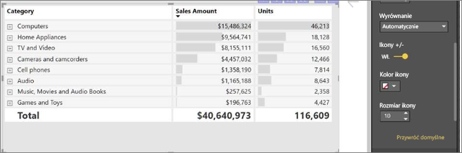

The expansion state of the matrix will save with your report. It can be pinned to dashboards as well, but consumers will need to open up the report to change the state. Conditional formatting will only apply to the inner most visible level of the hierarchy. Note that this expand/collapse experience is not currently supported when connecting to AS servers older than 2016 or MD servers.

Watch the following video to learn more about expand/collapse in the matrix:

-->
## Przechodzenie do szczegółów w wizualizacji macierzy
Wizualizacja **Macierz** oferuje wiele interesujących, niedostępnych wcześniej sposobów przechodzenia do szczegółów. Obejmuje to między innymi przechodzenie do szczegółów w wierszach, kolumnach, a nawet sekcjach i komórkach. Przyjrzyjmy się, jak to działa.

### Przechodzenie do szczegółów w nagłówkach wierszy
W okienku **Wizualizacje** możesz dodać wiele pól w sekcji **Wiersze** obszaru **Pola**, aby umożliwić przechodzenie do szczegółów w wierszach wizualizacji macierzy. Ta opcja działa podobnie do tworzenia hierarchii, która umożliwia przechodzenie do szczegółów (i wracanie do wyższych poziomów) oraz analizowanie danych na każdym poziomie.

Na poniższej ilustracji sekcja **Wiersze** zawiera pozycje *Category* (Kategoria) i *SubCategory* (Podkategoria). Uzyskany w ten sposób podział na grupy (inaczej hierarchia) pozwala przechodzić do szczegółów.

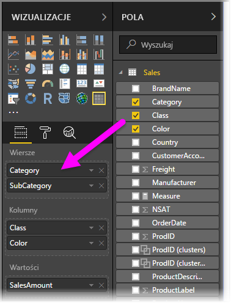

W lewym górnym rogu wizualizacji, w której utworzono grupy w sekcji **Wiersze**, są wyświetlane ikony *Przejdź do szczegółów* i *Rozwiń*.

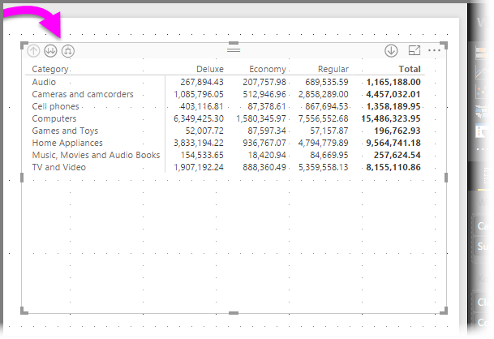

Podobnie jak w przypadku innych wizualizacji, przyciski te umożliwiają przechodzenie do szczegółów i wracanie do bardziej ogólnych poziomów hierarchii. W tym przypadku możemy przejść do szczegółów z grupy *Category* (Kategoria) do grupy *SubCategory* (Podkategoria). Widać to na poniższej ilustracji, gdzie wybrano ikonę przejścia do szczegółów o jeden poziom (przypominającą widły).

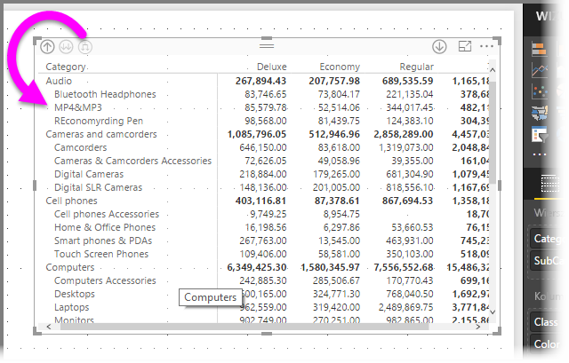

Oprócz korzystania z tych ikon możesz kliknąć dowolny nagłówek wiersza prawym przyciskiem myszy i wybrać z menu opcję przejścia do szczegółów.

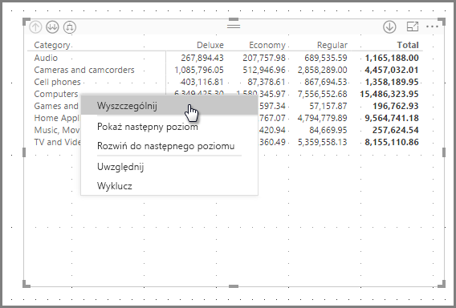

Wyświetlane menu zawiera kilka opcji, które generują różne wyniki:

Wybranie opcji **Przejdź do szczegółów** rozwija macierz dla poziomu *tego* wiersza (klikniętego prawym przyciskiem myszy) — *z wykluczeniem* wszystkich pozostałych nagłówków wierszy. Na poniższej ilustracji kliknięto prawym przyciskiem pozycję *Computers*  (Komputery) i wybrano polecenie **Przejdź do szczegółów**. Zauważ, że pozostałe wiersze najwyższego poziomu nie są już widoczne w macierzy. Ten sposób przechodzenia do szczegółów jest przydatną funkcją szczególnie, gdy przejdziemy do sekcji na temat **wyróżniania krzyżowego**.

Możesz kliknąć ikonę **Uogólnij**, aby wrócić do widoku najwyższego poziomu. Jeśli z menu podręcznego wybierzesz opcję **Pokaż następny poziom**, uzyskasz listę alfabetyczną wszystkich pozycji następnego poziomu (w tym przypadku z pola *SubCategory* (Podkategoria)) bez podziału na kategorie wyższego poziomu.

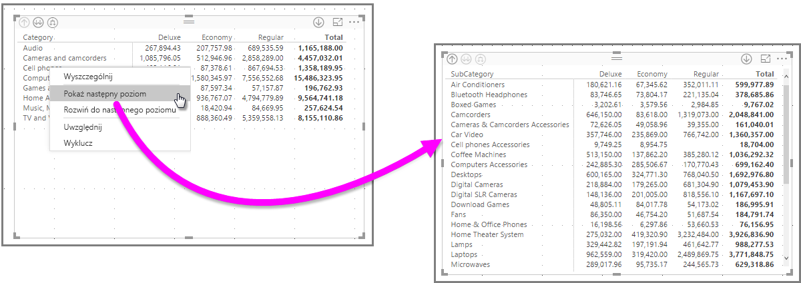

Gdy klikniesz ikonę **Uogólnij** w lewym górnym rogu, aby wyświetlić wszystkie kategorie najwyższego poziomu w macierzy, a następnie ponownie klikniesz prawym przyciskiem myszy i wybierzesz opcję **Rozwiń do następnego poziomu**, zobaczysz następującą wizualizację.

Są również dostępne elementy menu **Dołącz** i **Wyklucz**, które pozwalają odpowiednio zachować lub usunąć wiersz macierzy kliknięty prawym przyciskiem myszy (wraz z wszystkimi podkategoriami).

### Przechodzenie do szczegółów w nagłówkach kolumn
Możesz przechodzić do szczegółów **kolumn** podobnie jak w przypadku wierszy. Na poniższej ilustracji widać, że w obszarze **Kolumny** znajdują się dwa pola. Tworzą one hierarchię podobną do wierszy z poprzedniego artykułu. W obszarze **Kolumny** znajdują się pozycje *Class* (Klasa) i *Color* (Kolor).

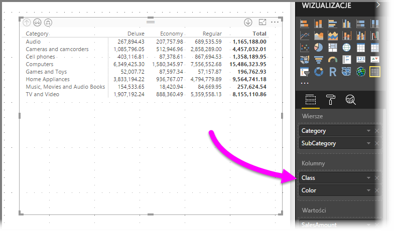

Po kliknięciu kolumny prawym przyciskiem myszy w wizualizacji **Macierz** widzimy opcję przejścia do szczegółów. Na poniższej ilustracji klikniemy prawym przyciskiem myszy pozycję *Deluxe* (Luksusowe) i wybierzemy polecenie **Przejdź do szczegółów**.

Wybranie polecenia **Przejdź do szczegółów** spowoduje wyświetlenie kolejnego poziomu hierarchii kolumn *Deluxe* (Luksusowe) — w tym przypadku *Color* (Kolor).

Pozostałe elementy menu kontekstowego działają na kolumnach tak samo jak na wierszach (zobacz poprzednią sekcję **Przechodzenie do szczegółów w nagłówkach wierszy**). Do kolumn — podobnie jak do wierszy — można stosować polecenia **Pokaż następny poziom**, **Rozwiń do następnego poziomu**, **Dołącz** i **Wyklucz**.

> [!NOTE]
> Ikony przechodzenia do szczegółów i uogólniania w lewym górnym rogu wizualizacji macierzy dotyczą tylko wierszy. Aby przejść do szczegółów kolumny, trzeba użyć menu kontekstowego.
> 
> 

## Układ schodkowy wizualizacji macierzy
Wizualizacja **Macierz** automatycznie tworzy wcięcia podkategorii w hierarchii pod każdym elementem nadrzędnym. Jest to tak zwany **układ schodkowy**.

W *pierwotnej* wersji wizualizacji macierzy podkategorie były wyświetlane w odrębnej kolumnie, przez co zajmowały o wiele więcej miejsca. Na poniższej ilustracji przedstawiono tabelę w pierwotnej wizualizacji **macierzy**. Zwróć uwagę na oddzielną kolumnę podkategorii.

Na poniższej ilustracji przedstawiono wizualizację **Macierz** z **układem schodkowym**. Zwróć uwagę, że w kategorii *Computers* (Komputery) widać nieznacznie przesunięte podkategorie — Computers Accessories (Akcesoria komputerowe), Desktops (Komputery biurkowe), Laptops (Laptopy), Monitors (Monitory) itd. — dzięki czemu wizualizacja jest czytelniejsza i zajmuje mniej miejsca.

Możesz łatwo dopasować ustawienia układu schodkowego. Po wybraniu wizualizacji **Macierz** w sekcji **Format** (ikona wałka do malowania) okienka **Wizualizacje** rozwiń sekcję **Nagłówki wierszy**. Masz dwie opcje: przełącznik **Układ schodkowy** (włącza lub wyłącza ten układ) oraz **Wcięcie układu schodkowego** (określa głębokość wcięcia w pikselach).

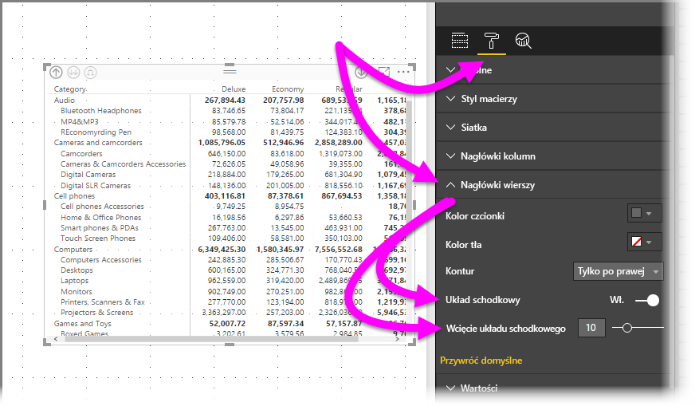

Wyłączenie opcji **Układ schodkowy** powoduje, że podkategorie są wyświetlane w odrębnej kolumnie, a nie z wcięciami pod kategorią nadrzędną.

## Sumy częściowe w wizualizacji macierzy
W wizualizacji macierzy możesz włączyć lub wyłączyć sumy częściowe wierszy i kolumn. Na poniższej ilustracji widać **włączone** sumy częściowe wierszy.

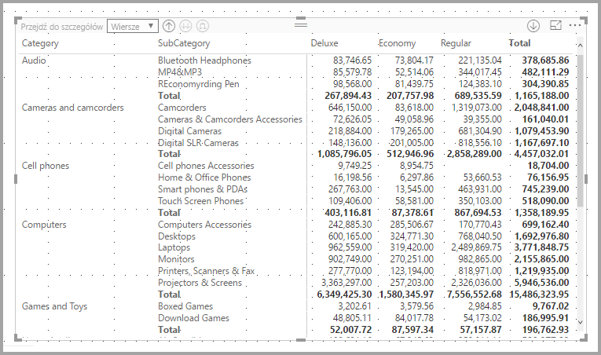

W sekcji **Format** okienka **Wizualizacje** rozwiń kartę **Sumy częściowe** i przesuń suwak **Sumy częściowe wierszy** do pozycji **Wyłącz**. Spowoduje to ukrycie sum częściowych.

Taki sam proces dotyczy sum częściowych kolumn.

## Wyróżnianie krzyżowe w wizualizacji macierzy
Przy użyciu wizualizacji **Macierz** można zaznaczyć dowolne elementy macierzy w celu wyróżnienia krzyżowego. Kiedy zaznaczysz kolumnę w wizualizacji **Macierz**, zostanie ona wyróżniona we wszystkich innych wizualizacjach na stronie raportu. Ten typ wyróżniania krzyżowego był wspólną funkcją innych wizualizacji i zaznaczonych punktów danych, dlatego teraz wizualizacja **Macierz** oferuje tę samą funkcję.

Wyróżnianie krzyżowe reaguje także na kliknięcia z wciśniętym klawiszem Ctrl. Na przykład poniższa ilustracja zawiera kolekcję podkategorii zaznaczonych w wizualizacji **Macierz**. Zauważ, że elementy niezaznaczone w wizualizacji są wygaszone, a pozostałe wizualizacje na stronie odzwierciedlają zaznaczenie z wizualizacji **Macierz**.

## Kopiowanie wartości z usługi Power BI do użycia w innych aplikacjach

Macierz lub tabela może mieć zawartość, której chcesz używać w innych aplikacjach, takich jak Dynamics CRM lub Excel, a nawet w innych raportach usługi Power BI. Klikając prawym przyciskiem myszy w usłudze Power BI, możesz skopiować jedną komórkę lub grupę komórek do schowka i wkleić je w innej aplikacji.

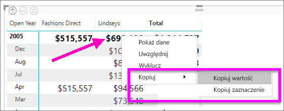

* Aby skopiować wartość pojedynczej komórki, zaznacz komórkę, kliknij prawym przyciskiem myszy, i wybierz polecenie **Skopiuj wartość**. Niesformatowaną wartość komórki ze schowka możesz teraz wkleić w innej aplikacji.

    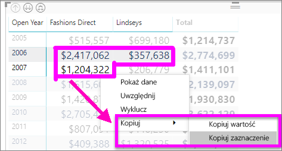

* Aby skopiować więcej niż jedną komórkę, zaznacz zakres komórek lub użyj klawisza CTRL, aby zaznaczyć co najmniej jedną komórkę. Kopia będzie obejmować nagłówki kolumn i wierszy.

    

## Cieniowanie i kolory czcionek w wizualizacji macierzy
Wizualizacja **Macierz** pozwala zastosować **formatowanie warunkowe** (kolory i cieniowanie) do tła komórek macierzy oraz do tekstu i wartości.

Aby użyć formatowania warunkowego, wykonaj jedną z tych czynności po wybraniu wizualizacji macierzy:

* W okienku **Pola** kliknij pole prawym przyciskiem myszy i wybierz z menu polecenie **Formatowanie warunkowe**.
  
  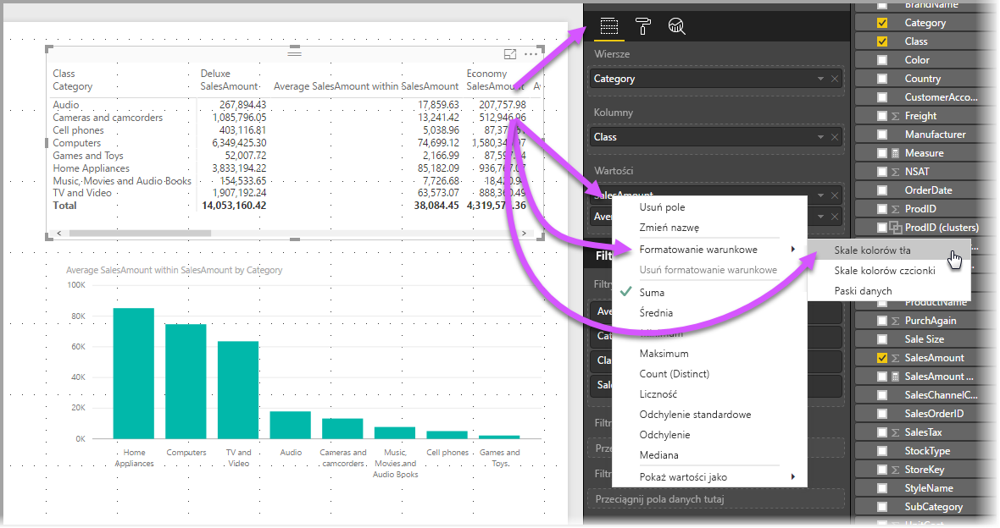
* Możesz też w okienku **Format** rozwinąć kartę **Formatowanie warunkowe** i przesunąć suwak obok opcji **Skale koloru tła** lub **Skale koloru czcionki** do pozycji **Włącz**. Włączenie dowolnej opcji powoduje wyświetlenie linku do okna *Kontrolki zaawansowane*, które umożliwia dostosowanie kolorów i wartości formatowania kolorów.
  
  

Niezależnie od wybranej metody wynik będzie taki sam. Wybranie opcji *Kontrolki zaawansowane* powoduje wyświetlenie następującego okna dialogowego, w którym możesz dostosować opcje:

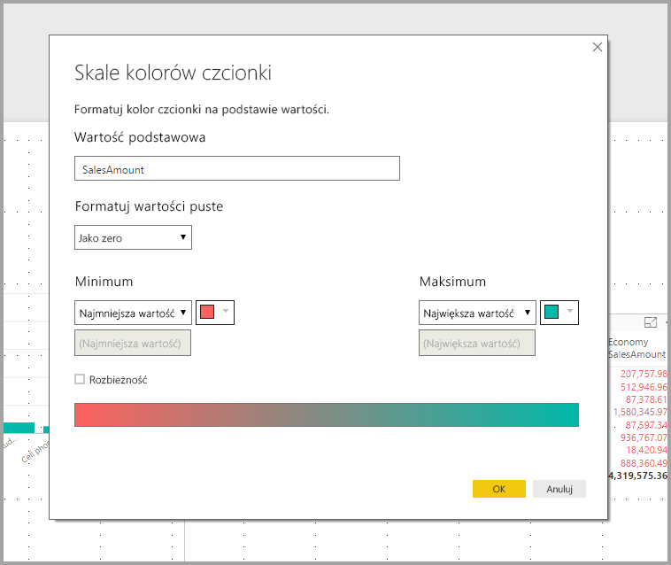

## Następne kroki

[Wykresy punktowe i bąbelkowe w usłudze Power BI](power-bi-visualization-scatter.md)

[Typy wizualizacji w usłudze Power BI](power-bi-visualization-types-for-reports-and-q-and-a.md)