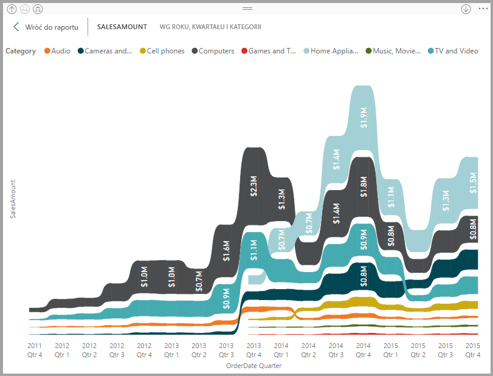
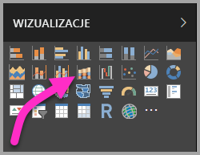
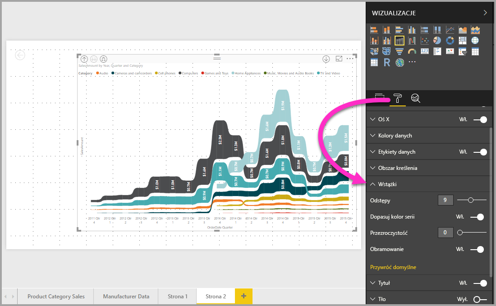

# Używanie wykresów wstążkowych w usłudze Power BI
Przy użyciu wykresów wstążkowych możesz wizualizować dane i szybko wykrywać, które kategorie danych mają najwyższą rangę (największa wartość). Wykresy wstążkowe dobrze obrazują zmianę rangi, zawsze wyświetlając najwyższą rangę (wartość) u góry dla każdego przedziału czasu. 

## Tworzenie wykresu wstążkowego
Aby utworzyć wykres wstążkowy, wybierz pozycję **Wykres wstążkowy** na panelu **Wizualizacje**.

Wykresy wstążkowe łączą kategorię danych w całym wizualizowanym przedziale czasu za pomocą wstążki, umożliwiając sprawdzenie, jaka była ranga danej kategorii na przestrzeni osi x wykresu (zazwyczaj jest to oś czasu).

## Formatowanie wykresu wstążkowego
Gdy tworzysz wykres wstążkowy, opcje formatowania są dostępne w sekcji **Formatowanie** w okienku **Wizualizacje**. Opcje formatowania dla wykresów wstążkowych są podobne do opcji wykresu skumulowanego kolumnowego z dodatkowymi opcjami formatowania specyficznymi dla wstążki.

Opcje formatowania dla wykresów wstążkowych umożliwiają dostosowanie.

* **Odstępy** — Możesz dostosować odstępy między wstążkami. Liczba określa wartość procentową maksymalnej wysokości kolumny.
* **Dopasuj do koloru serii** — Umożliwia dopasowanie koloru wstążek do koloru serii. Kiedy ta opcja jest **wyłączona**, wstążki są szare.
* **Przezroczystość** — Określa, jak przezroczyste są wstążki (ustawienie domyślne to 30).
* **Obramowanie** — Umożliwia umieszczenie ciemnego obramowania u góry i u dołu wstążek. Domyślnie obramowanie jest wyłączone.

## Następne kroki

[Wykresy punktowe i bąbelkowe w usłudze Power BI](power-bi-visualization-scatter.md)

[Typy wizualizacji w usłudze Power BI](power-bi-visualization-types-for-reports-and-q-and-a.md)