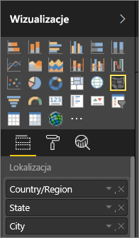

# Porady i wskazówki dotyczące wizualizacji z mapami w usłudze Power BI
Usługa Power BI integruje się z usługą Mapy Bing w celu zapewnienia domyślnych współrzędnych mapy (w procesie zwanym kodowaniem geograficznym), co pozwala na tworzenie map. Wspólnie używają algorytmów do zidentyfikowania poprawnej lokalizacji, ale czasami jest to tylko najbardziej prawdopodobna odpowiedź. Jeśli usługa Power BI nie może utworzyć wizualizacji z mapą samodzielnie, korzysta z usługi Mapy Bing. 

Użytkownik lub administrator może być zmuszony do aktualizacji zapory, aby umożliwić dostęp do adresów URL używanych przez usługę Bing do geokodowania.  Te adresy URL to:
* https://dev.virtualearth.net/REST/V1/Locations
* https://platform.bing.com/geo/spatial/v1/public/Geodata
* https://www.bing.com/api/maps/mapcontrol

Aby zwiększyć prawdopodobieństwo poprawnego kodowania geograficznego, użyj następujących wskazówek. Pierwszy zestaw porad jest przydatny, jeśli masz dostęp do zestawu danych. Drugi zestaw porad to działania, które można wykonać w usłudze Power BI, jeśli nie masz dostępu do zestawu danych. Ostateczny zestaw jest listą adresów URL

## Co jest wysyłane do usługi Mapy Bing?
Usługa Power BI i program Power BI Desktop przesyłają do usługi Bing dane geograficzne wymagane do utworzenia wizualizacji z mapą. Mogą to być dane w zasobnikach **Lokalizacja**, **Szerokość geograficzna** i **Długość geograficzna** oraz pola geograficzne w dowolnym zasobniku filtrów: **Poziom raportu**, **Poziom strony** i **Poziom wizualny**. Wysyłane dane różnią się w zależności od typu mapy. Aby dowiedzieć się więcej, zobacz [Mapy usługi Bing — prywatność](https://go.microsoft.com/fwlink/?LinkID=248686).

* W przypadku map (map bąbelkowych), jeśli podano długość i szerokość geograficzną, do usługi Bing nie są przesyłane żadne dane. W przeciwnym razie do usługi Bing są przesyłane wszystkie dane z zasobników Lokalizacja (i filtr).     
* Wypełnione mapy wymagają pola w zasobniku Lokalizacja, nawet jeśli podano współrzędne geograficzne. Niezależnie od danych w zasobniku Lokalizacja, zasobniki Długość geograficzna i Szerokość geograficzna są przesyłane do usługi Bing.
  
    W przykładzie poniżej pole **Dostawca** jest używane do kodowania geograficznego, więc wszystkie dane dostawcy są wysyłane do usługi Bing. Dane z zasobników **Rozmiar** i **Nasycenie kolorów** nie są wysyłane do usługi Bing.
  
    
  
    W drugim przykładzie poniżej pole **Territory** jest używane do kodowania geograficznego, więc wszystkie dane terytorium są wysyłane do usługi Bing. Dane z zasobników **Legenda** i **Nasycenie kolorów** nie są wysyłane do usługi Bing.
  
    

## W zestawie danych: porady dotyczące poprawy bazowego zestawu danych
Jeśli masz dostęp do zestawu danych używanego do tworzenia wizualizacji z mapą, istnieje kilka rzeczy, które możesz zrobić, aby zwiększyć prawdopodobieństwo poprawnego kodowania geograficznego.

**1. Kategoryzacja pól z danymi geograficznymi w programie Power BI Desktop**

W programie Power BI Desktop możesz upewnić się, że pola są poprawnie kodowane geograficznie przez ustawienie wartości *Kategoria danych* dla pól danych. Wybierz odpowiednią tabelę, przejdź do wstążki **Zaawansowane**, a następnie ustaw parametr **Kategoria** na **Adres**, **Miasto**, **Kontynent**, **Kraj/region**, **Powiat**, **Kod pocztowy**, **Stan** lub **Prowincja**. Te kategorie umożliwiają usłudze Bing poprawne kodowanie danych. Aby dowiedzieć się więcej, zobacz [Kategoryzacja danych w programie Power BI Desktop](../desktop-data-categorization.md). Jeśli masz połączenie na żywo z usługami SQL Server Analysis Services, musisz ustawić kategoryzację danych poza usługą Power BI przy użyciu narzędzi [SQL Server Data Tools (SSDT)](https://docs.microsoft.com/sql/ssdt/download-sql-server-data-tools-ssdt).

**2. Użyj więcej niż jednej kolumny lokalizacji.**    
 Czasami nawet ustawienie kategorii danych do mapowania nie wystarcza usłudze Bing do poprawnego odgadnięcia intencji. Niektóre oznaczenia są niejednoznaczne, ponieważ lokalizacja występuje w wielu krajach lub regionach. Na przykład miasta o nazwie ***Southampton*** znajdują się w Anglii, Pensylwanii i stanie Nowy Jork.

Usługa Power BI korzysta z [usługi szablonów URL bez struktury](https://msdn.microsoft.com/library/ff701714.aspx) w usłudze Bing, aby uzyskać współrzędne geograficzne na podstawie zestawu wartości adresów dla danego kraju. Jeśli dane nie zawierają wystarczającej ilości danych lokalizacji, dodaj te kolumny i odpowiednio je sklasyfikuj.

 Na przykład jeśli masz tylko kolumnę Miasto, usługa Bing może mieć problem z kodowaniem geograficznym. Dodaj inne kolumny geograficzne, aby uczynić lokalizację jednoznaczną.  Czasami wystarczy dodać do zestawu danych jedną dodatkową kolumnę lokalizacji, w tym przypadku Stan/województwo. Nie zapomnij też o poprawnej kategoryzacji, patrz punkt 1 powyżej.

Upewnij się, że każde pole zawiera tylko określone informacje powiązane z kategoryzacją.  Na przykład pole lokalizacji Miasto powinno mieć wartość **Southampton**, a nie **Southampton, Nowy Jork**.  Z kolei pole lokalizacji Adres powinno mieć wartość **1 Microsoft Way**, nie **1 Microsoft Way, Redmond, WA**.

**3. Użyj konkretnych współrzędnych geograficznych**

Dodaj wartości długości i szerokości geograficznej do swojego zestawu danych. Wyeliminuje to niejednoznaczności i przyspieszy uzyskiwanie wyników. Pola długości i szerokości geograficznej muszą mieć format *Liczba dziesiętna*, który można ustawić w modelu danych.

<iframe width="560" height="315" src="https://www.youtube.com/embed/ajTPGNpthcg" frameborder="0" allowfullscreen></iframe>

**4. Użyj kategorii Miejsce dla kolumn z pełnymi informacjami o lokalizacji**

Zachęcamy do użycia hierarchii geograficznych w swoich mapach, ale jeśli musisz użyć jednej kolumny lokalizacji z pełnymi danymi geograficznymi, możesz ustawić kategoryzację danych na **Miejsce**. Na przykład jeśli dane w kolumnie to pełne adresy, takie jak 1 Microsoft Way, Redmond Washington 98052, ta ogólna kategoria danych będzie działać najlepiej z usługą Bing. 

## W usłudze Power BI: porady dotyczące uzyskiwania lepszych wyników przy użyciu wizualizacji z mapami
**1. Użyj pól współrzędnych geograficznych (jeśli istnieją)**

Jeśli zestaw danych używany w usłudze Power BI zawiera pola długości i szerokości geograficznej, użyj ich.  Usługa Power BI zawiera specjalne zasobniki, które zmniejszają niejednoznaczność danych mapy. Przeciągnij pole zawierające dane szerokości geograficznej do obszaru **Wizualizacje > Szerokość geograficzna**.  Wykonaj te same czynności dla danych długości geograficznej. Po wykonaniu tej czynności musisz także wypełnić pole *Lokalizacja* podczas tworzenia swoich wizualizacji. W przeciwnym razie dane są domyślnie agregowane, więc na przykład długość i szerokość geograficzna zostaną sparowane na poziomie stanu, nie miasta.

 

## Stosuj hierarchie geograficzne, aby przechodzić do różnych poziomów szczegółów lokalizacji
Jeśli zestaw danych zawiera już różne poziomy danych lokalizacji, Ty i Twoi współpracownicy możecie korzystać z usługi Power BI do tworzenia *hierarchii geograficznych*. Aby to zrobić, przeciągnij więcej niż jedno pole do zasobnika **Lokalizacja**. Przy stosowaniu w ten sposób pola stają się hierarchią geograficzną. W poniższym przykładzie dodaliśmy następujące pola geograficzne: Country/Region, State i City. W usłudze Power BI Ty i Twoi współpracownicy możecie przechodzić do różnych poziomów szczegółów dzięki tej hierarchii geograficznej.

  

   

Podczas przechodzenia na poziom szczegółów przy użyciu hierarchii geograficznych należy pamiętać, jak działa każdy przycisk szczegółów oraz jakie dane są przesyłane do Map Bing. 

* Przycisk szczegółów po prawej stronie, noszący nazwę Tryb szczegółów , umożliwia wybranie lokalizacji na mapie i przejście do tej konkretnej lokalizacji poziom po poziomie. Na przykład jeśli włączysz opcję Przejdź do szczegółów i klikniesz Amerykę Północną, przejdziesz do kolejnego poziomu hierarchii, czyli stanów w Ameryce Północnej. W przypadku kodowania geograficznego usługa Power BI przesyła do Map Bing tylko dane kraju i stanu dla Ameryki Północnej.  
* Po lewej stronie znajdują się 2 inne opcje szczegółów. Pierwsza opcja, , przechodzi do kolejnego poziomu hierarchii jednocześnie dla wszystkich lokalizacji. Na przykład jeśli przyglądasz się obecnie krajom i użyjesz tej opcji do przejścia do kolejnego poziomu, usługa Power BI wyświetli dane stanów dla wszystkich krajów. W przypadku danych kodowania usługa Power BI przesyła do Map Bing dane stanów (bez danych krajów) dla wszystkich lokalizacji. Ta opcja jest przydatna, jeśli poszczególne poziomy hierarchii nie są powiązane z poziomami wyższymi. 
* Druga opcja,  przypomina opcję Przejdź do szczegółów, przy czym nie jest konieczne klikanie mapy.  Rozwija się ona do kolejnego poziomu hierarchii, z pamięcią kontekstu bieżącego poziomu. Na przykład jeśli aktualnie patrzysz na kraje i klikniesz tę ikonę, przejdziesz do kolejnego poziomu hierarchii, stanów. W przypadku kodowania geograficznego usługa Power BI przesyła dane na temat wszystkich stanów i odpowiadających im krajów, co zapewnia bardziej precyzyjne kodowanie geograficzne przez Mapy Bing. W przypadku większości map stosowana jest ta opcja lub opcja Przejdź do szczegółów po prawej stronie, dzięki czemu można przesłać usłudze Bing informacje wystarczające do uzyskania precyzyjnych informacji o lokalizacji. 

## Następne kroki
[Przechodzenie do szczegółów w wizualizacji usługi Power BI](../consumer/end-user-drill.md)

[Wizualizacje usługi Power BI](power-bi-report-visualizations.md)

Masz więcej pytań? [Odwiedź społeczność usługi Power BI](http://community.powerbi.com/)

