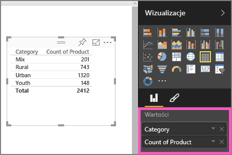
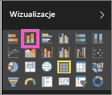

# Część 1, dodawanie wizualizacji do raportu usługi Power BI
Ten artykuł zawiera szybkie wprowadzenie do tworzenia wizualizacji w raporcie przy użyciu usługi Power BI lub programu Power BI Desktop.  Bardziej zaawansowaną zawartość umieszczono w [części 2](power-bi-report-add-visualizations-ii.md). Obejrzyj film, w którym Amanda prezentuje kilka różnych sposobów tworzenia, edytowania i formatowania wizualizacji na kanwie raportu. Wypróbuj je samodzielnie, tworząc własny raport przy użyciu [próbki danych dotyczących sprzedaży i marketingu](../sample-datasets.md).

<iframe width="560" height="315" src="https://www.youtube.com/embed/IkJda4O7oGs" frameborder="0" allowfullscreen></iframe>

## Otwieranie raportu i dodawanie nowej strony
1. Otwórz [raport w widoku do edycji](../consumer/end-user-reading-view.md). W tym samouczku jest używana [próbka danych dotyczących sprzedaży i marketingu](../sample-datasets.md).
2. Jeśli okienko Pola nie jest widoczne, wybierz ikonę strzałki, aby je otworzyć. 
   
   
3. [Dodaj do raportu pustą stronę](../power-bi-report-add-page.md).

## Dodawanie wizualizacji do raportu
1. Utwórz wizualizację, wybierając pole w okienku **Pola**.  
   
   **Zacznij od pola liczbowego**, takiego jak SalesFact (Informacje o sprzedaży) > Sales $ (Sprzedaż w USD). Usługa Power BI tworzy wykres kolumnowy dla jednej kolumny.
   
   
   
   **Możesz też zacząć od pola kategorii**, takiego jak Name (Nazwa) lub Product (Produkt): usługa Power BI utworzy tabelę i doda to pole do obszaru **Wartości**.
   
   
   
   **Albo zacznij od pola geograficznego**, takiego jak Geo (Geograficzne) > City (Miasto). Usługi Power BI i Mapy Bing utworzą wizualizację mapy.
   
   
2. Utwórz wizualizację, a następnie zmień jej typ. Wybierz pozycję **Product (Produkt) > Category (Kategoria)**, a następnie pozycję **Product (Produkt) > Liczba elementów: Product**, aby dodać je do obszaru **Wartości**.
   
   
3. Zmień wizualizację na wykres kolumnowy, wybierając ikonę wykresu kolumnowego.
   
   
4. Po utworzeniu wizualizacji w raporcie można [przypiąć je do pulpitu nawigacyjnego](../service-dashboard-pin-tile-from-report.md). Aby przypiąć wizualizację, wybierz ikonę pinezki .
   
   
  

## Następne kroki
 Kontynuuj: [Część 2, dodawanie wizualizacji do raportu usługi Power BI](power-bi-report-add-visualizations-ii.md)
   
   [Wypróbuj interakcje z wizualizacjami](../consumer/end-user-reading-view.md) w raporcie.
   
   [Wykorzystaj inne możliwości wizualizacji](power-bi-report-visualizations.md).
   
   [Zapisz raport](../service-report-save.md).
