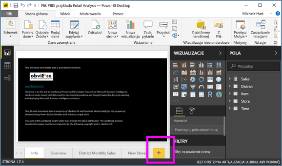

# Część 2, dodawanie wizualizacji do raportu usługi Power BI
W [części 1](power-bi-report-add-visualizations-ii.md) utworzono podstawową wizualizację przez zaznaczenie pól wyboru obok nazw pól.  W części 2 dowiesz się, jak używać metody przeciągania i upuszczania oraz jak w pełni korzystać z okienek **Pola** i **Wizualizacje** na potrzeby tworzenia i modyfikowania wizualizacji.

### Wymagania wstępne
- [Część 1](power-bi-report-add-visualizations-ii.md)
- Power BI Desktop — wizualizacje można dodać do raportów za pomocą usługi Power BI lub programu Power BI Desktop. W tym samouczku wykorzystywany jest program Power BI Desktop. 
- [Przykład Retail Analysis](http://download.microsoft.com/download/9/6/D/96DDC2FF-2568-491D-AAFA-AFDD6F763AE3/Retail%20Analysis%20Sample%20PBIX.pbix)

## Tworzenie nowej wizualizacji
W tym samouczku skorzystamy z naszego zestawu danych Retail Analysis i utworzymy kilka kluczowych wizualizacji.

### Otwieranie raportu i dodawanie nowej, pustej strony
1. Otwórz plik PBIX przykładu Retail Analysis w programie Power BI Desktop. 
      

2.  [Dodaj nową stronę](../power-bi-report-add-page.md), wybierając żółtą ikonę ze znakiem plus w dolnej części obszaru roboczego.

### Dodawanie wizualizacji z porównaniem sprzedaży z bieżącego roku i z ostatniego roku
1. Z tabeli **Sales** (Sprzedaż) wybierz pozycje **This Year Sales** > **Value** (Sprzedaż z bieżącego roku > Wartość) i **Last Year Sales** (Sprzedaż z ostatniego roku). Usługa Power BI utworzy wykres kolumnowy.  Okazuje się to być całkiem interesujące, więc warto dokonać szczegółowej analizy. Jakie są wyniki sprzedaży w poszczególnych miesiącach?  
   
   
2. Z tabeli Time (Czas) przeciągnij pozycję **FiscalMonth** (Miesiąc obrachunkowy) do obszaru **Oś**.  
   
3. [Zmień wizualizację](power-bi-report-change-visualization-type.md) na wykres warstwowy.  Istnieje wiele typów wizualizacji do wyboru. Jeśli potrzebujesz pomocy w zdecydowaniu, którego typu użyć, zapoznaj się z [opisem każdego z nich, wskazówkami dotyczącymi najlepszych rozwiązań i samouczkami](power-bi-visualization-types-for-reports-and-q-and-a.md). W okienku Wizualizacje wybierz ikonę Wykres warstwowy .
4. Posortuj wizualizację, wybierając wielokropek i pozycję **Sortuj według: FiscalMonth (Miesiąc obrachunkowy)**.
5. [Zmień rozmiar wizualizacji](power-bi-visualization-move-and-resize.md), wybierając wizualizację, chwytając jeden z okręgów konturu i przeciągając do nowej pozycji. Rozszerz ją do takich rozmiarów, aby nie wyświetlał się już pasek przewijania, ale aby pozostało dość miejsca na dodanie kolejnej wizualizacji.
   
   
6. [Zapisz raport](../service-report-save.md).

### Dodawanie wizualizacji mapy z porównaniem sprzedaży według lokalizacji
1. Z tabeli **Store** (Sklep) wybierz pozycję **Territory** (Terytorium). Usługa Power BI rozpozna, że terytorium to lokalizacja, i utworzy wizualizację mapy.  
   
2. Przeciągnij pozycję **Total Stores** (Łączna liczba sklepów) do obszaru Rozmiar.  
   
3. Dodaj legendę.  Aby wyświetlić dane według nazw sklepów, przeciągnij pozycję **Chain** (Sieć) do obszaru Legenda.  
   

## Następne kroki
* Więcej informacji o [wizualizacjach w raportach usługi Power BI](power-bi-report-visualizations.md).  
* Masz więcej pytań? [Odwiedź społeczność usługi Power BI](http://community.powerbi.com/)

