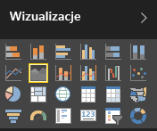

# Podstawowy wykres warstwowy
Podstawowy wykres warstwowy (zwany również wykresem warstwowym) jest oparty na wykresie liniowym. Obszar pomiędzy osią i linią jest wypełniony kolorami wskazującymi ilość. 

Wykresy warstwowe podkreślają znaczenie zmiany w czasie. Można ich używać do zwracania uwagi na wartość całkowitą w trendzie. Na przykład dane reprezentujące zysk w czasie można przedstawić na wykresie warstwowym, aby podkreślić łączny zysk.

## Kiedy należy używać podstawowego wykresu warstwowego
Podstawowe wykresy warstwowe są doskonałym wyborem:

* W przypadku wyświetlania i porównywania trendu ilościowego w serii czasu. 
* W przypadku poszczególnych serii przedstawiających fizycznie zliczany zestaw.

### Wymagania wstępne
 - w usłudze Power BI
 - Przykład Retail Analysis

Aby móc wykonać te instrukcje, zaloguj się w usłudze Power BI, wybierz pozycję **Pobierz dane \> Przykłady \> Przykład Retail Analysis > Połącz**, a następnie wybierz pozycję **Przejdź do pulpitu nawigacyjnego**. 

## Tworzenie podstawowego wykresu warstwowego
 

1. Na pulpicie nawigacyjnym „Przykład analizy detalicznej” wybierz kafelek **Magazyny razem**, aby otworzyć raport „Przykład analizy detalicznej”.
2. Wybierz pozycję **Edytuj raport**, aby otworzyć raport w widoku do edycji.
3. Dodaj nową stronę raportu, wybierając żółtą ikonę ze znakiem plus (+) w dolnej części raportu.
4. Utwórz wykres warstwowy wyświetlający sprzedaż w tym roku i sprzedaż w zeszłym roku według miesięcy.
   
   a. W okienku POLA wybierz pozycję **Sales \> Last Year Sales** oraz **This Year Sales > Value**.

   

   b.  Przekonwertuj wykres na podstawowy wykres warstwowy, wybierając ikonę wykresu warstwowego w okienku Wizualizacje.

   
   
   c.  Wybierz pozycje **Czas\> Miesiąc**, aby ją dodać do źródła **Oś**.   
   
   
   d.  Aby wyświetlić wykres według miesięcy, wybierz wielokropek (prawy górny róg wizualizacji) i wybierz pozycję **Sortuj według miesięcy**. Aby zmienić kolejność sortowania, ponownie wybierz przycisk wielokropka, a następnie wybierz pozycję **Sortuj rosnąco** albo **Sortuj malejąco**.

## Wyróżnianie i filtrowanie krzyżowe
Aby uzyskać informacje o korzystaniu z okienka filtrów, zobacz [Dodawanie filtru do raportu](../power-bi-report-add-filter.md).

Aby wyróżnić jeden określony obszar swojego wykresu, zaznacz ten obszar lub jego górną krawędź.  W odróżnieniu od innych typów wizualizacji, jeśli na tej samej stronie istnieją inne wizualizacje, wyróżnienie podstawowego wykresu warstwowego nie powoduje filtrowania krzyżowego innych wizualizacji na stronie raportu. Jednak wykresy warstwowe są celem filtrowania krzyżowego wyzwalanego przez inne wizualizacje na stronie raportu. 

1. Wypróbuj to, wybierając obszar wykresu i kopiując go do innej strony raportu (CTRL-C i CTRL-V).
2. Wybierz jeden z obszarów przyciemnionych, a następnie inny przyciemniony obszar. Zobaczysz, że nie ma to wpływu na inne wizualizacje na stronie.

    

3. Teraz wybierz element na jednej z innych wizualizacji na stronie, takich jak słupek wykresu kolumnowego lub miesiąc na wykresie liniowym. Zwróć uwagę na wpływ na wykres warstwowy — zostanie on odfiltrowany.  

     

Aby dowiedzieć się więcej, zobacz [Interakcje wizualne w raportach](../service-reports-visual-interactions.md)

## Istotne zagadnienia i rozwiązywanie problemów   
* [Zwiększanie dostępności raportu dla osób niepełnosprawnych](../desktop-accessibility.md)
* Podstawowe wykresy warstwowe nie są efektywne w przypadku porównywania wartości ze względu na zamknięcia w obszarach warstwowych. Usługa Power BI używa przezroczystości, aby wskazywać obszary nachodzące na siebie. Jednak działa to dobrze tylko w przypadku dwóch lub trzech różnych obszarów. Jeśli chcesz porównać trend składający się z ponad trzech miar, spróbuj użyć wykresów liniowych. Jeśli chcesz porównać ilość wobec więcej niż trzech miar, spróbuj użyć mapy drzewa.

## Następny krok
[Raporty w usłudze Power BI](power-bi-visualization-card.md)  

