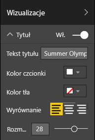
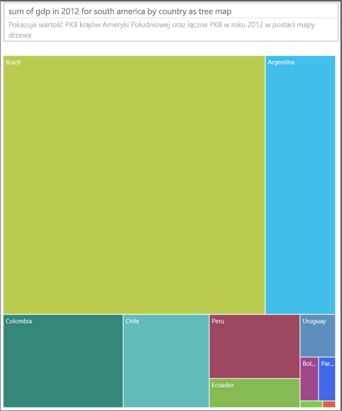

# Najlepsze rozwiązania dotyczące projektowania raportów i wizualizacji
<!-- Shared newnav Include -->
[!INCLUDE [newnavbydefault](../includes/newnavbydefault.md)]

## Wprowadzenie
W tym oficjalnym dokumencie przedstawiono najlepsze rozwiązania dotyczące projektowania raportów w usłudze Power BI. Rozpoczęto w nim od planowania i omówiono zasady projektowania, które można zastosować do raportów oraz do stron i poszczególnych wizualizacji wchodzących w skład raportu.  Wiele z tych najlepszych rozwiązań ma też zastosowanie do pulpitów nawigacyjnych.

Mamy nadzieję, że ten dokument ułatwi Ci szybkie rozpoczęcie pracy, że zastosujesz zdobytą wiedzę podczas tworzenia własnych raportów oraz wizualizacji i że będziesz kontynuować konwersację na ten temat w społeczności community.powerbi.com. Stosowanie wizualizacji i projektowanie raportów analizy biznesowej to teraz bardzo popularny temat. Wielu liderów, blogerów i witryn zajmuje się nim bardzo szczegółowo (na końcu wymieniono kilka przykładów).   

> [!NOTE]
> Zalecenia przedstawione w tym dokumencie to wskazówki — można je stosować w przypadkach, w których ma to sens. Dla każdej zasady, którą opisano poniżej, istnieją zazwyczaj przypadki, w których są uzasadnione powody do jej zignorowania.
> 
> 

*Jesteśmy przytłoczeni ilością informacji, nie dlatego, że jest ich zbyt wiele, ale dlatego, że nie wiemy, jak nad nimi zapanować.*
— Stephen Few

## Spojrzenie na krajobraz i terminologię
W usłudze Power BI raport może zawierać jedną lub więcej stron. Wszystkie strony razem są określane zbiorczo jako raport. Podstawowe elementy raportu to wizualizacje (elementy wizualne), obrazy autonomiczne i pola tekstowe. Od poszczególnych punktów danych, przez elementy raportu aż po same strony raportu — dostępne są niezliczone opcje formatowania.

Rozpoczniemy od etapu planowania raportu, przejdziemy do podstawowych zasad projektowania raportu, następnie omówimy zasady projektowania wizualizacji i zakończymy omówieniem najlepszych rozwiązań dla poszczególnych typów wizualizacji.

Szczegółowe wskazówki i instrukcje dotyczące tworzenia i używania raportów usługi Power BI są dostępne tutaj: **powerbi.com > Learn (Nauka)**.

## Przed utworzeniem pierwszej wizualizacji... skup się na wymaganiach
Tworzenie raportu rozpoczyna się przed utworzeniem pierwszej wizualizacji, ponieważ dobry raport wymaga planowania.  Ustal, z jakimi danymi musisz pracować, i spisz wymagania dotyczące raportu. Spróbuj odpowiedzieć sobie na pytania: jaka jest potrzeba biznesowa, jak te dane będą używane i przez kogo? Najistotniejsze pytanie brzmi: jakie decyzje ma podejmować czytelnik na podstawie tego raportu?

Odpowiedzi na te pytania będą kluczowe dla kształtu projektu. Każdy raport stanowi pewną opowieść. Zadbaj o to, aby była to opowieść zgodna z właściwą potrzebą biznesową. Dodawanie wizualizacji w celu nadania wynikom analiz bardziej dramatycznego efektu może być kuszące, ale jeśli te wyniki analiz nie odpowiadają właściwej potrzebie biznesowej, raport nie będzie przydatny — takie wizualizacje mogą wręcz rozpraszać użytkowników. Może się też okazać, że z używanych danych nie można wydobyć informacji potrzebnych do podjęcia decyzji. Czy za pomocą tego raportu można mierzyć potrzebne wartości?

Raporty mogą służyć do m.in. monitorowania, odkrywania informacji, śledzenia, prognozowania, mierzenia, zarządzania i testowania. Jeśli na przykład potrzeba biznesowa to raport dotyczący sprzedaży służący do pomiaru wydajności, można zaprojektować raport do sprawdzania bieżącej sprzedaży oraz porównywania jej z poprzednimi wynikami sprzedaży i z wynikami konkurencji, który zawiera kilka kluczowych wskaźników wydajności wyzwalających alerty.  Być może osoby przeglądające raport będą mogły przechodzić do szczegółowych danych liczbowych sprzedaży w celu sprawdzenia zamknięć sklepów lub problemów z łańcuchem zaopatrzenia, które mogą wpływać na sprzedaż.  Inną opcją przejścia do szczegółów może być możliwość wyświetlenia sprzedaży według sklepów, regionów, produktów lub sezonów.

Ważne jest, aby rozumieć klientów, którzy będą korzystać z raportu, i zaprojektować raport, w którym używana będzie znana terminologia i który zapewni dane na poziomie szczegółowości oraz złożoności zgodnym z poziomem wiedzy klientów. Istnieje więcej niż jeden typ klienta? To samo rozwiązanie nie zawsze sprawdza się u wszystkich. Zaprojektuj osobne strony raportu odpowiednie do wiedzy osób, które będą z nich korzystać. Pamiętaj o nadaniu każdej stronie właściwej etykiety, aby klienci łatwo rozpoznawali strony przeznaczone właśnie dla nich. Innym rozwiązaniem jest zastosowanie fragmentatorów, aby klienci mogli dostosować stronę do własnych potrzeb. Zaangażuj klientów w planowanie, aby uniknąć problemów wynikających z błędnych wyobrażeń o ich potrzebach.  Przygotuj się na taką ewentualność, że pracę będzie trzeba zacząć od początku i powtórzyć w całości.

Po zidentyfikowaniu potrzeby biznesowej, klientów i metryk do uwzględnienia następnym krokiem jest wybranie odpowiednich wizualizacji do przedstawienia opowieści oraz jak najefektywniejsze zaprezentowanie tych wizualizacji. To bardzo szerokie zagadnienie. Zaczniemy od pewnych podstawowych zasad projektowania raportu.

## Zasady projektowania raportu
Miejsce na stronach raportu jest ograniczone i jednym z najtrudniejszych zadań jest pomieszczenie na nich wszystkich potrzebnych elementów przy zapewnieniu zrozumiałości informacji. Ważne jest też, aby strona miała estetyczny wygląd. Kluczem do sukcesu jest znalezienie równowagi między estetyką a użytecznością.

Przyjrzyjmy się układowi, przejrzystości i estetyce.

### Układ — kanwa raportu
Ilość miejsca na kanwie raportu jest skończona.  Jeśli na jednej stronie raportu nie mieszczą się wszystkie elementy, podziel go na kilka stron.  Stronę raportu można dopasować do określonej grupy odbiorców (np. pracowników działu kadr, informatycznego czy sprzedaży) lub do określonego zagadnienia biznesowego (np. „Jak usterki wpływają na przestoje?” lub „Jak kampania marketingowa wpływa na wskaźniki nastrojów?”) albo do postaci wątku progresywnego (np. pierwsza strona może stanowić przegląd lub służyć do przyciągania uwagi, druga strona może zawierać omówienie danych, trzecia — szczegóły itp.).  Jeśli cały raport mieści się na jednej stronie — świetnie. W przeciwnym razie utwórz osobne strony raportu i rozdziel między nie zawartość w logiczny sposób.  Nie zapomnij nadać stronom opisowych i przydatnych nazw.

Myśl o tym jak o rozmieszczaniu prac w galerii sztuki. Nie umieszcza się 50 obrazów w małym pomieszczeniu, nie zapełnia się go krzesłami i nie maluje każdej ściany na inny kolor. Właściwe podejście to wybranie tylko elementów o wspólnym motywie, rozmieszczenie ich w pomieszczeniu z dużą ilością miejsca dla oglądających, aby umożliwić im poruszanie się i rozważenie tego, co widzą, oraz opatrzenie wszystkiego etykietami informacyjnymi. To nie przypadek, że ściany większości współczesnych galerii są białe.
W tym artykule rozpoczniemy od przykładu raportu, który wymaga sporego nakładu pracy.  W miarę stosowania do niego najlepszych rozwiązań i zasad projektowania jego wygląd będzie coraz lepszy.

**Ilustracja 1.    Ta nieładna strona raportu wymaga sporego nakładu pracy**

W powyższym przykładzie występuje wiele problemów projektowych związanych z miejscem (układem), które omówiono poniżej:

* wyrównanie, kolejność i odległości między elementami
* niewydajne wykorzystanie miejsca i sortowanie
* bałagan

### Wyrównanie, kolejność i odległości między elementami
Układ elementów raportu wpływa na poziom zrozumienia i prowadzi oko czytelnika po stronie raportu. Rozmieszczenie elementów stanowi pewną opowieść.  Może ona brzmieć „zacznij tutaj, a potem spójrz tutaj” lub „te 3 elementy są ze sobą powiązane”.

* W większości kultur czytelnicy przeglądają zawartość od lewej do prawej i od góry do dołu. Umieść najważniejszy element w lewym górnym rogu raportu. Pozostałe wizualizacje zorganizuj w taki sposób, aby zapewnić logiczną nawigację i zrozumienie informacji.
* Elementy, które wymagają od odbiorcy dokonania wyboru, umieść po lewej stronie wizualizacji, na które wpływają te wybory. Dotyczy to na przykład fragmentatorów.
* Powiązane elementy umieść obok siebie. Bliskość sugeruje, że elementy są powiązane.
* Innym sposobem zakomunikowania powiązania jest dodanie obramowania lub koloru tła wokół powiązanych elementów. Aby natomiast odróżnić poszczególne sekcje raportu, dodaj separator.
* Za pomocą pustego miejsca wizualnie podziel stronę raportu na sekcje.
* Wypełnij stronę raportu. Jeśli okaże się, że zostało dużo niewykorzystanego miejsca, powiększ wizualizacje lub pomniejsz kanwę.
* Dobrze przemyśl rozmiary elementów raportu. Rozmiary wizualizacji nie powinny zależeć od dostępności miejsca.
* Ważne elementy powinny być większe od innych. Możesz też dodać element wizualny, taki jak strzałka, aby przyciągnąć do nich uwagę.
* Zadbaj o wyrównanie elementów na stronie raportu: symetryczne lub celowo niesymetryczne.

Przyjrzyjmy się bliżej kwestii wyrównania.

#### Wyrównanie
Wyrównanie nie oznacza, że różne składniki muszą mieć ten sam rozmiar ani że w każdym wierszu raportu musi znajdować się taka sama liczba elementów. Oznacza jedynie, że strona ma strukturę pomagającą w nawigacji i czytaniu.

W zaktualizowanym raporcie poniżej składniki są teraz wyrównane do lewej i prawej krawędzi, a każdy wiersz raportu jest również wyrównany w poziomie i w pionie. Fragmentatory znajdują się po lewej stronie wizualizacji, na które wpływają.

**Ilustracja 2.    Nasz przykład nieładnego raportu z poprawionym układem**

Usługa Power BI udostępnia narzędzia ułatwiające wyrównywanie wizualizacji. W programie Power BI Desktop, gdy jest wybranych wiele wizualizacji, położenie wizualizacji można uzgodnić za pomocą opcji **Wyrównanie i rozłożenie** na wstążce **Elementy wizualne**.

**Ilustracja 3.    Wyrównywanie wizualizacji w programie Power BI Desktop**

W usłudze Power BI w trybie online i programie Power BI Desktop masz ścisłą kontrolę nad rozmiarem i położeniem wizualizacji za pośrednictwem karty **Ogólne** w okienku formatowania dla wszystkich wizualizacji:

**Ilustracja 4.    Ustawianie dokładnego położenia wizualizacji**

Na przykładowej stronie raportu (ilustracja 2) 2 karty i duże obramowanie mają wyrównanie **Pozycja X** o wartości 200.

#### Dopasowanie do ilości miejsca
Jak najlepiej wykorzystaj dostępne miejsce.  Jeśli wiesz, jak raport będzie wyświetlany, projektuj pod tym kątem. Zmniejsz ilość wolnego miejsca w celu wypełnienia kanwy.  Dołóż starań, aby wyeliminować potrzebę stosowania pasków przewijania poszczególnych wizualizacji.  Wypełnij miejsce, ale dbając o to, aby wizualizacje nie były rozmieszczone zbyt ciasno obok siebie.

##### Dopasowywanie rozmiaru strony
Dzięki zmniejszeniu rozmiaru strony poszczególne elementy wydają się większe względem całej strony. W tym celu zaznacz wszystkie wizualizacje na stronie i użyj karty **Rozmiar strony** w okienku formatowania.  

Oto strona raportu o rozmiarze 4:3, a następnie 16:9. Zauważ, że układ 16:9 wygląda dużo lepiej. Dostępna jest taka ilość miejsca, że można usunąć pasek przewijania z drugiej wizualizacji.

**Ilustracja 5a.    Strona raportu o rozmiarze 4:3**

**Ilustracja 5b.    Strona raportu o rozmiarze 16:9**

Czy opracowywany raport będzie wyświetlany na ekranie o proporcjach 4:3, 16:9 lub innych? Na dużych czy małych ekranach? Na ekranach o wszystkich możliwych współczynnikach proporcji i rozmiarach?  Weź to pod uwagę podczas projektowania.

Nasza przykładowa strona raportu wydaje się nieco zatłoczona. Nie wybierając żadnej wizualizacji, otwórz okienko formatowania przez wybranie ikony wałka do malowania. Rozwiń pozycję **Rozmiar strony** i zmień wartość pozycji **Wysokość** na 900.

**Ilustracja 6.    Zwiększanie wysokości strony**

#### Ograniczanie zbędnych elementów
Stronę raportu pełną zbędnych elementów trudno jest szybko zrozumieć, więc odbiorcy mogą nawet nie chcieć się wysilać.  Usuń wszystkie elementy raportu, które nie są niezbędne. Nie dodawaj ozdobników, które nie ułatwiają zrozumienia ani nawigacji. Strona raportu musi komunikować informacje tak wyraźnie, szybko i zwięźle, jak to tylko możliwe.

Edward Tufte w książce *The Visual Display of Quantitative Information* (Graficzne prezentowanie informacji ilościowych) nazywa to „proporcją danych do ilości tekstu”.  Po prostu usuń wszystko, co nie jest niezbędne.

Przez usunięcie niepotrzebnych rzeczy zwiększysz ilość miejsca na stronie raportu i uzyskasz więcej przestrzeni na zastosowanie najlepszych rozwiązań, które omówiliśmy w sekcji „Wyrównanie, kolejność i odległości między elementami”.

Nasz przykład już wygląda lepiej. Usunęliśmy sporo zbędnych elementów i dodaliśmy kształty w celu zgrupowania elementów.  Zniknął obraz tła, zbędny kształt strzałki i pole tekstowe, jedną z wizualizacji przenieśliśmy na kolejną stronę w raporcie itp. Wydłużyliśmy też rozmiar strony, aby zwiększyć puste (żółte) miejsce.

**Ilustracja 7.    Nasz przykład nieładnego raportu po usunięciu zbędnych elementów**

### Umożliwianie szybkiego zrozumienia
Tekst ogólny powinien umożliwiać osobie bez żadnej wiedzy wstępnej szybkie zrozumienie raportu bez dodatkowych wyjaśnień. Odbiorcom powinno wystarczyć jedno spojrzenie do ustalenia, czego dotyczą strona oraz poszczególne tabele i wykresy.   

Spojrzenia odbiorców raportu powinny padać najpierw na element, który powinni obejrzeć w pierwszej kolejności, a następnie wędrować od lewej do prawej, od góry do dołu.  Aby zmienić to zachowanie, dodaj podpowiedzi wizualne, takie jak etykiety pól tekstowych, kształty, obramowania albo wyróżnianie rozmiarem i kolorem.  

#### Pola tekstowe
Czasami tytuły wizualizacji nie są w stanie zakomunikować wszystkiego.  Aby przekazać osobom przeglądającym raporty dodatkowe informacje, dodaj pola tekstowe.  Pola tekstowe mogą zawierać opisy stron raportu, grup wizualizacji lub poszczególnych wizualizacji. Mogą zawierać wyjaśnienia wyników lub dokładniej definiować wizualizacje, składniki wizualizacji albo relacje między wizualizacjami. Za pomocą pól tekstowych można przyciągać uwagę odbiorców na podstawie różnych kryteriów wymienionych w polu tekstowym.

W usłudze Power BI wybierz z górnego menu pozycję **Pole tekstowe**. (W programie Power BI Desktop wybierz pozycję **Pole tekstowe** w obszarze **Wstawianie** na wstążce).

**Ilustracja 8.    Dodawanie pola tekstowego**

Wpisz tekst w pustym polu, a następnie za pomocą kontrolek na dole ustaw krój i rozmiar czcionki oraz wyrównanie i inne opcje. Za pomocą uchwytów zmień rozmiar pola.

**Ilustracja 9.    Formatowanie pola tekstowego**

Uważaj, aby nie przesadzić. Za dużo tekstu w raporcie będzie rozpraszać uwagę i odciągać ją od wizualizacji. Jeśli uznasz, że strona raportu wymaga ogromnej ilości tekstu, aby była zrozumiała, zacznij od nowa.  Zastanów się, czy informacji nie da się zakomunikować lepiej za pomocą innej wizualizacji. Być może dostosowanie natywnych tytułów wizualizacji pozwoli uczynić ją bardziej zrozumiałą?   

#### Tekst
Utwórz wytyczne dotyczące stylu tekstu i stosuj je do wszystkich stron raportu. Wybierz tylko kilka krojów czcionek, rozmiarów tekstu i kolorów.  Stosuj te wytyczne dotyczące stylu nie tylko do elementów tekstowych, ale też do opcji czcionek wybieranych w wizualizacjach (zobacz „Tytuły i etykiety, które są częścią wizualizacji” poniżej). Ustal reguły stosowania pogrubienia, kursywy, większego rozmiaru czcionki, określonych kolorów itd.  Unikaj używania wyrazów składających się z samych wielkich liter i podkreśleń.

#### Kształty
Kształty mogą ułatwiać nawigowanie i zrozumienie. Za pomocą kształtów można grupować powiązane informacje, wyróżniać ważne dane i przyciągać wzrok odbiorcy, na przykład dodając kształt strzałki. Kształty ułatwiają odbiorcy ustalenie, gdzie należy zacząć i jak interpretować raport. W ramach projektowania często określa się to jako *kontrast*.

**Ilustracja 10a.    Kształty w usłudze Power BI**

**Ilustracja 10b.    Kształty w programie Power BI Desktop**

Jak wygląda obecnie nasza przykładowa strona?  Na ilustracji 11 pokazano bardziej przejrzystą i mniej zatłoczoną stronę ze spójnymi krojami tekstu, czcionkami i kolorami.  Tytuł strony w lewym górnym rogu informuje, czego dotyczy strona.

**Ilustracja 11.    Nasz przykład raportu z zastosowanymi wytycznymi dotyczącymi tekstu i dodanym tytułem**

W tym przykładzie w lewym górnym rogu dodano tytuł strony raportu — to tu w pierwszej kolejności będą zerkać odbiorcy. Rozmiar czcionki to 28, a jej krój to Segoe Bold. Wyróżnia się ona na tle pozostałej części strony.  Nasze wytyczne dotyczące stylu tekstu to: brak tła, czarne tytuły, legendy i etykiety. Zastosowano je do wszystkich wizualizacji na stronie, o ile było to możliwe (osi ani etykiet wykresu kombi nie można edytować).  Ponadto:

* Karty: **Etykieta kategorii** jest wyłączona, a opcja **Tytuł** jest włączona i ustawiono dla niej czarny tekst wyśrodkowany o rozmiarze 12 pkt.
* Tytuły wizualizacji: jeśli są włączone, mają ustawiony tekst wyrównany do lewej o rozmiarze 12 pkt.
* Fragmentatory: **Nagłówek** jest wyłączony, a **Tytuł** — włączony. Pozycja **Elementy** > **Tekst** jest pozostawiona w kolorze szarym z tekstem o rozmiarze 10 pkt.
* Wykresy punktowy i kolumnowy: czarna czcionka na osiach X i Y oraz w tytułach tych osi, jeśli są używane.

#### Kolor
Używaj kolorów w sposób spójny.  Poniżej, w sekcji „Zasady projektowania wizualizacji”, omówimy kolory dokładniej. Jednak już tu warto wspomnieć o przemyślanym wybieraniu kolorów. Nie powinny one utrudniać odbiorcom szybkiego zrozumienia raportu.  Zbyt wyraziste kolory przeciążają zmysły. W tej sekcji skupiamy się przede wszystkim na tym, jak nie używać kolorów.

#### Tła
Jako tła stron raportów należy ustawiać kolory, które nie odciągają uwagi od samego raportu, nie kolidują z innymi kolorami na stronie ani nie psują ogólnej estetyki. Pamiętaj, że niektóre kolory mają konkretne znaczenie.  Na przykład w Stanach Zjednoczonych kolor czerwony w raporcie jest zwykle interpretowany jako sygnał złych wiadomości.

**Ilustracja 12. Ustawianie tła raportu**

Nie tworzysz dzieła sztuki, ale raport funkcjonalny. Wybierz kolor, który poprawia czytelność i wyeksponowanie elementów raportu.  

Z badania dotyczącego stosowania kolorów i wizualizacji na stronach internetowych wynika, że większy kontrast kolorów przyspiesza zrozumienie: The effect of text and background colour on visual search of Web pages (Wpływ kolorów tła i tekstu na wizualne przeszukiwanie stron internetowych) i **Determining Users’ Perception of Web Page Visual Complexity and Aesthetic Characteristics (Ustalanie postrzeganych przez użytkowników cech estetycznych i złożoności wizualnej stron internetowych)**.

Zastosowaliśmy wybrane najlepsze rozwiązania dotyczące kolorów do naszego przykładowego raportu (ilustracje 20 i 21) poniżej. Najważniejszą zmianą była zmiana koloru tła na czarny.  Żółte tło było zbyt wyraziste i nieprzyjemne dla oczu.  Ponadto na wykresie z liczbą nazwisk sportowców według lat i klas żółta część słupków wtapiała się w żółte tło.  Zastosowanie czarnego (lub białego) tła daje maksymalny kontrast i sprawia, że uwaga skupia się na wizualizacjach.

Oto dodatkowe czynności, które wykonano, aby ulepszyć ten przykładowy raport:

**Tytuł strony**

Zmieniliśmy tło na czarne. Tytuł zniknął, ponieważ pole tekstowe umożliwiało używanie tylko czarnej czcionki.   Aby rozwiązać ten problem, dodaliśmy zamiast tego tytuł pola tekstowego.  Zaznacz pole tekstowe, wymaż tekst, a następnie na karcie Wizualizacje wybierz pozycję **Tytuł** i włącz ją. Wybierz strzałkę, aby rozwinąć opcje **Tytuł**, wpisz **Letnie igrzyska olimpijskie** w polu **Tekst tytułu**, a następnie wybierz biały kolor dla pozycji **Kolor czcionki**.

**Ilustracja 13. Dodawanie tytułu strony**

**Karty**

W przypadku kart wizualizacji otwórz okienko formatowania (ikona wałka do malowania) i włącz opcję **Tło**. Wybierz kolor biały z przezroczystością na poziomie 0%. Następnie włącz opcję **Tytuł**, wybierz biały kolor dla pozycji **Kolor czcionki** i czarny dla pozycji **Kolor tła**.

**Fragmentatory**

Do tego momentu dwa używane fragmentatory miały różne formatowanie, co nie wygląda dobrze z projektowego punktu widzenia. Kolor tła obu fragmentatorów zmieniliśmy na akwamarynowy.  Akwamaryna to dobry wybór, ponieważ należy do palety kolorów strony — widać ten kolor na kartogramie, mapie drzewa i wykresie kolumnowym.

**Ilustracja 14. Zmienianie koloru tła fragmentatora**

Dodaliśmy cienkie białe obramowanie.

**Ilustracja 15. Dodawanie obramowania do fragmentatora**

Szara czcionka jest mało widoczna na akwamarynowym tle, więc kolor pozycji **Elementy** zmieniliśmy na biały.

**Ilustracja 16. Zmienianie koloru czcionki fragmentatora**

Na koniec w obszarze **Tytuł** zmieniliśmy **kolor czcionki** na biały i dodaliśmy czarny **kolor tła**.

**Ilustracja 17. Formatowanie tytułu fragmentatora**

**Kształt prostokąta**

Także prostokąt zniknął po zmianie koloru tła na czarne.  Aby rozwiązać ten problem, zaznacz ten kształt i w okienku **Formatowanie kształtu** włącz opcję **Tło**.

**Ilustracja 18. Formatowanie kształtu**

**Wykresy kolumnowy, bąbelkowy, kartogram i mapa drzewa**

Dodaj białe tło do pozostałych wizualizacji na stronie raportu. W okienku formatowania rozwiń opcję **Linia** i ustaw dla pozycji **Kolor linii** kolor biały, a dla pozycji **Grubość** wartość 3.

**Ilustracja 19. Dodawanie białego tła do pozostałych wizualizacji**

**Ilustracja 20. Przykładowy raport z zastosowanymi najlepszymi rozwiązaniami dotyczącymi kolorów (czarne tło)**

**Ilustracja 21.    Przykładowy raport z zastosowanymi najlepszymi rozwiązaniami dotyczącymi kolorów (białe tło)**
 

### Estetyka
Omówiliśmy już większość zagadnień związanych z estetyką, takich jak wyrównanie, kolory, wybór czcionek i zbędne elementy.  Jednak istnieje jeszcze kilka najlepszych rozwiązań dotyczących projektowania raportów, które warto poruszyć. Dotyczą one ogólnego wyglądu raportu.  

Pamiętaj, że raport ma przede wszystkim spełniać potrzebę biznesową, a nie ładnie wyglądać.  Jednak pewien poziom estetyki jest wymagany, szczególnie jeśli chodzi o pierwsze wrażenie. Tony Bodoh, doradca z Nashville, wyjaśnia, że „emocje są wyzwalane na pół sekundy przed logiką”.  Odbiorcy reagują na stronę raportu w pierwszej kolejności na poziomie emocjonalnym, zanim przyjrzą się jej dokładniej. Jeśli strona wygląda chaotycznie, nieprzejrzyście, nieprofesjonalnie... odbiorca może nigdy nie dotrzeć do ważnych wniosków, które są na niej prezentowane.

Wayne Eckerson, bloger serwisu TDI i analityk branży firmy TechTarget, przedstawił doskonałą metaforę.  Projektowanie raportu przypomina urządzanie pokoju.  Wraz z upływem czasu kupujemy wazon, sofę, stolik, obraz.  Każdy z tych elementów podoba się nam sam w sobie. Jednak mimo że osobno każdy z nich jest wart zakupu, w zestawieniu nie współgrają, albo konkurują o uwagę.

Na czym należy się skoncentrować:

* Utworzenie wspólnego motywu lub wyglądu raportu i stosowanie go na wszystkich stronach raportu.
* Stosowanie osobnych obrazów i innych grafik do wspierania przekazu, ale nie w sposób odciągający uwagę od głównego wątku.
* Stosowanie wszystkich omówionych do tej pory w tym artykule najlepszych rozwiązań.

## Zasady projektowania wizualizacji
Omówiliśmy zasady projektowania raportów i organizowanie elementów raportu w sposób ułatwiający szybkie zapoznanie się z nim.  Teraz przyjrzymy się zasadom projektowania dotyczącym samych wizualizacji.  Natomiast w następnej sekcji zajmiemy się poszczególnymi wizualizacjami i omówimy najlepsze rozwiązania dotyczące niektórych z najczęściej używanych typów wizualizacji.

W tej sekcji zapomnimy na chwilę o naszej przykładowej stronie raportu i przeanalizujemy inne przykłady.  Po przedyskutowaniu zasad projektowania wizualizacji wrócimy do tej przykładowej strony raportu i zastosujemy zdobytą wiedzę (z instrukcjami krok po kroku).  

### Planowanie — wybór właściwej wizualizacji
Tak jak ważne jest zaplanowanie raportu przed rozpoczęciem tworzenia go, tak i każda wizualizacja wymaga planowania.  Zastanów się, „o czym ma opowiadać dana wizualizacja”? Następnie ustal, jaki typ wizualizacji najlepiej nada się do tego celu. Postęp można pokazać za pośrednictwem cyklu sprzedaży w postaci wykresu słupkowego, ale czy wykres kaskadowy lub lejkowy nie będzie lepszy? Aby uzyskać pomoc w tym zakresie, przeczytaj ostatnią sekcję tego dokumentu, „Typy wizualizacji i najlepsze rozwiązania", w której opisano najlepsze rozwiązania dotyczące niektórych z najpopularniejszych typów.  Często pierwszy wybrany typ wizualizacji nie okazuje się być najlepszą opcją.  Aby zobaczyć, który typ wizualizacji najlepiej oddaje przekaz, wypróbuj ich kilka.

Warto zrozumieć różnice między danymi podzielonymi na kategorie a danymi ilościowymi i wiedzieć, jakie typy wizualizacji najlepiej pasują do poszczególnych typów danych. Dane ilościowe często określa się jako miary i zwykle są to dane liczbowe. Dane podzielone na kategorie często określa się jako wymiary i można je klasyfikować. Omówiono to bardziej szczegółowo w sekcji „Wybieranie właściwej miary”, poniżej.

Unikaj stosowania bardziej ozdobnych lub złożonych typów wizualizacji tylko w celu polepszenia wyglądu raportu. Poszukaj najprostszej opcji, która zapewni odpowiedni przekaz informacji. Poziome wykresy słupkowe i proste wykresy liniowe pozwalają szybko komunikować informacje.  Są dobrze znane i wygodne — większość odbiorców bez problemu je zinterpretuje.  Ich dodatkową zaletą jest to, że większość osób czyta od lewej do prawej i od góry do dołu, więc przeglądanie i interpretowanie tych wykresów zajmuje tylko chwilę.

Czy uzyskanie właściwych informacji wymaga przewinięcia zastosowanej wizualizacji? Unikaj przewijania, jeśli to możliwe.  Spróbuj zastosować filtry oraz hierarchie i przechodzenie do szczegółów, a jeśli to nie pozwoli wyeliminować paska przewijania, rozważ wybranie wizualizacji innego typu. Jeśli nie można wyeliminować przewijania, lepszym rozwiązaniem jest przewijanie w poziomie niż w pionie.

Nawet w przypadku wybrania absolutnie najodpowiedniejszej wizualizacji nadal możesz potrzebować pomocy dotyczącej właściwego komunikowania „opowieści”.  Temu właśnie służą etykiety, tytuły, menu, kolory i rozmiary. Omówimy te elementy później w sekcji „Elementy projektu”.

### Wybieranie właściwej miary
Czy „opowieść” snuta przy użyciu wizualizacji jest atrakcyjna? Czy ma to znaczenie?  Nie konstruuj wizualizacji wyłącznie dla samej przyjemności ich tworzenia. Być może na początku wydawało się, że opowieść o danych będzie interesująca, ale okazało się, że tak nie jest. Nie obawiaj się rozpocząć od nowa i poszukać bardziej interesującej opowieści. Zdarza się też, że opowieści nic nie brakuje, ale potrzebny jest inny sposób mierzenia.

Na przykład załóżmy, że chcesz zmierzyć sukcesy kierowników ds. sprzedaży. Jakiej miary użyjesz?  Czy miarą najlepszej wydajności będzie sprzedaż całkowita lub zysk całkowity, tempo wzrostu w poprzednim roku, czy może wydajność względem celu? Aneta, pracownica działu sprzedaży, wypracowała największy zysk, więc jeśli na wykresie słupkowym pokażesz zysk całkowity według sprzedawców, jej wyniki będą fantastyczne na tle innych sprzedawców.  Jednak koszty sprzedaży u Anety są wysokie (koszty podróży, wysyłki, produkcyjne itp.), więc wzięcie pod uwagę samej tylko sprzedaży nie ilustruje dobrze zagadnienia.

#### Odzwierciedlanie rzeczywistości zamiast jej zniekształcania
Bez problemu można utworzyć wizualizację, która zniekształci prawdę. Istnieje witryna, w której entuzjaści danych udostępniają „złe” wizualizacje. W takich przypadkach powtarzającym się w komentarzach motywem jest rozczarowanie firmą, która utworzyła i rozpowszechniła daną wizualizację.  Komunikat jest prosty: takiej firmie nie można ufać.

Dlatego twórz wizualizacje, które nie zniekształcają celowo rzeczywistości ani nie są zmanipulowane w celu uzyskania konkretnego wyniku.  Oto przykład:

**Ilustracja 22.    Wykres zniekształcający rzeczywistość**

W tym przykładzie wydaje się, że istnieje ogromna różnica między czterema firmami i że firma B odnosi znacznie większe sukcesy niż pozostałe trzy firmy.  Zauważmy jednak, że oś X nie rozpoczyna się od zera, a różnice między firmami mają wartości w granicach marginesu błędu.  Oto te same dane z osią X rozpoczynającą się od zera.

**Ilustracja 23.    Wykres realistyczny**

Odbiorcy oczekują, że oś X będzie zaczynać się od zera, i często przyjmują takie założenie. Jeśli zdecydujesz się zastosować oś, która nie zaczyna się od zera, zrób to w taki sposób, aby nie zniekształcać wyników. Rozważ też dodanie wskaźnika wizualnego lub pola tekstowego z informacją o odstępstwie od normy.  

### Elementy projektu
Po wybraniu typu oraz miary i utworzeniu wizualizacji czas dostroić szczegóły wyglądu pod kątem maksymalnej efektywności.  Co omówiono w tej sekcji:

* Układ, miejsce i rozmiar
* Elementy tekstowe: etykiety, adnotacje, menu, tytuły
* Sortowanie
* Interakcje wizualne
* Kolor

#### Dostosowywanie wizualizacji w celu najlepszego wykorzystania miejsca
Jeśli próbujesz pomieścić w raporcie wiele wykresów, maksymalizacja „proporcji danych do ilości tekstu” ułatwi wyeksponowanie opowieści i danych. Jak wspomniano powyżej, termin „proporcja danych do ilości tekstu” wymyślił Edward Tufte: celem jest usunięcie z wykresu jak największej liczby oznaczeń bez pogarszania możliwości interpretacji danych przez odbiorcę.

W pierwszym zestawie przedstawionych poniżej wykresów istnieją nadmiarowe etykiety osi (Sty 2014, Kwi 2014 itp.) i tytuły („według daty”). Tytuły poszczególnych wykresów zajmują też dedykowane miejsce w poziomie wzdłuż tych wykresów. Usuwając tytuły wykresów i włączając osobne etykiety osi, pozbędziemy się pewnej ilości tekstu i lepiej wykorzystamy miejsce. Można usunąć etykiety osi dwóch górnych wykresów, aby dodatkowo zmniejszyć ilość tekstu i wypełnić więcej miejsca danymi.

W przypadku przywoływania konkretnych okresów można narysować linie lub prostokąty za wszystkimi wykresami, aby zwrócić uwagę na przedstawione porównania.

**Ilustracja 24.    Przed**

**Ilustracja 25.    Po**

**Aby włączyć lub wyłączyć tytuły osi**

Wybierz wizualizację, aby ją uaktywnić, i otwórz okienko formatowania. Rozwiń opcje **osi X** lub **osi Y** i przeciągnij suwak **Tytuł**, aby włączyć lub wyłączyć tę opcję.

**Ilustracja 26.    Włączanie i wyłączanie tytułów osi**

**Aby włączyć lub wyłączyć etykiety osi**

Wybierz wizualizację, aby ją uaktywnić, i otwórz okienko formatowania. Obok pozycji **Oś X** i **Oś Y** są suwaki.  Przeciągnij suwak, aby włączyć lub wyłączyć etykiety osi.

**Ilustracja 27. Włączanie lub wyłączanie etykiet osi**

> [!TIP]
> Etykiety osi Y warto na przykład wyłączyć, gdy są włączone **etykiety danych**.
> 
> 

**Aby usunąć tytuły wizualizacji**

Wybierz wizualizację, aby ją uaktywnić, i otwórz okienko formatowania. Ustaw suwak **Tytuł** w pozycji Wyłączony.

**Ilustracja 28.    Usuwanie tytułów wizualizacji**

Zastanów się nad sposobem, w jaki raport będzie wyświetlany, i upewnij się, że wizualizacje i tekst są wystarczająco duże i wystarczająco ciemne, aby można je było odczytać. Jeśli na stronie znajduje się proporcjonalnie większa wizualizacja, odbiorcy mogą uznać, że jest ona najważniejsza. Zadbaj o odpowiednią ilość miejsca między wizualizacjami, aby raport nie wyglądał na przepełniony i pozostał przejrzysty.  Wyrównaj wizualizacje tak, aby kierować wzrokiem odbiorców.

**Aby zmienić rozmiar wizualizacji**

Wybierz wizualizację, aby ją uaktywnić. Chwyć i przeciągnij jeden z uchwytów, aby dostosować rozmiar.

**Ilustracja 29. Zmienianie rozmiaru wizualizacji**

**Aby przenieść wizualizację**

Wybierz wizualizację, aby ją uaktywnić. Zaznacz i przytrzymaj pasek uchwytu w górnej środkowej części wizualizacji, a następnie przeciągnij tę wizualizację do nowej lokalizacji.

**Ilustracja 30. Przenoszenie wizualizacji**

#### Tytuły i etykiety, które są częścią wizualizacji
Zadbaj o to, aby tytuły i etykiety były czytelne i nie wymagały objaśnień. Tekst w tytułach i na etykietach musi mieć optymalny rozmiar i wyróżniające się kolory (na przykład czarny zamiast domyślnego szarego). Wcześniej wspominaliśmy o wytycznych dotyczących stylu (w sekcji „Tekst” powyżej). Ogranicz liczbę kolorów i rozmiarów — zbyt wiele różnych rozmiarów i kolorów czcionki sprawi, że strona będzie przeładowana i nieprzejrzysta.  Rozważ zastosowanie tego samego koloru i rozmiaru czcionki tytułu na wszystkich wizualizacjach na stronie raportu, a następnie wybierz takie samo wyrównanie dla wszystkich tytułów na stronie raportu.  

**Okienko formatowania**

W przypadku wszystkich dostosowań formatowania wymienionych poniżej wybierz ikonę wałka do malowania, aby otworzyć okienko formatowania.

**Ilustracja 31. Otwieranie okienka formatowania**

Następnie wybierz element wizualizacji do dostosowania i upewnij się, że ma ustawienie Włączone. Przykłady elementów wizualizacji: **Oś x**, **Oś y**, **Tytuł**, **Etykiety danych** i **Legenda**. Poniżej przedstawiono przykład elementu **Tytuł**.

**Ilustracja 32. Formatowanie tytułu wizualizacji**

**Ustawianie rozmiaru tekstu**

Rozmiar tekstu można dostosować w tytułach i na etykietach danych, ale nie w przypadku osi X oraz Y ani legendy.  W szczególności w przypadku etykiet danych wypróbuj opcję **Jednostki wyświetlania** i różne liczby w polu **Miejsca dziesiętne**, aż znajdziesz optymalny poziom szczegółowości dla raportu.   

**Ustawianie wyrównania tekstu**

Opcje wyrównania tytułu to: do lewej, do prawej i wyśrodkowanie.  Wybierz jedną z nich i zastosuj to samo ustawienie do wszystkich wizualizacji na stronie.  

**Ustawianie położenia tekstu**

W przypadku niektórych osi Y i legendy można dostosować położenie tekstu.   Niezależnie od tego, jaką opcję wybierzesz, zastosuj ją też do innych osi Y i innych legend na stronie.

**Ustawianie długości tytułów i etykiet**

Dostosuj długość tytułów, tytułów osi, etykiet danych i legend. Jeśli zdecydujesz się na wyświetlanie którychkolwiek z tych elementów, dostosowanie długości (wraz z rozmiarem tekstu) zapewni, że nic nie zostanie obcięte. W przypadku elementów **Tytuł** i **Legenda** odpowiednim ustawieniem jest **Tekst tytułu**. Wpisz tu rzeczywisty tytuł, który pojawi się na wizualizacji. W przypadku elementów **Oś X** i **Oś Y** odpowiednim ustawieniem jest **Styl** — wybierz pozycję z listy rozwijanej. W przypadku elementów **Etykiety danych** odpowiednie ustawienia to **Wyświetl** i **Dziesiętne**. Z listy rozwijanej **Wyświetl** wybierz jednostki miary: miliony, tysiące, brak, automatycznie itp. Za pomocą pola **Dziesiętne** poinformuj usługę Power BI, ile miejsc dziesiętnych należy wyświetlić.

**Ustawianie koloru tekstu**

Kolor tekstu można dostosować w tytułach oraz na osiach i etykietach danych.  

#### Tytuły i etykiety, które nie są częścią wizualizacji
Wcześniej w tym dokumencie omówiliśmy dodawanie pól tekstowych do stron raportu. Czasami tytuły wizualizacji nie są w stanie zakomunikować wszystkiego.  Aby przekazać osobom przeglądającym raporty dodatkowe informacje, dodaj pola tekstowe.  
Zadbaj o to, aby strona raportu nie była zbyt skomplikowana ani zbyt przeładowana, i spójnie używaj czcionek, rozmiarów, kolorów oraz wyrównania pól tekstowych. Aby wprowadzić poprawkę w tekście w polu tekstowym, wybierz to pole tekstowe w celu wyświetlenia menu formatowania.

**Ilustracja 33. Formatowanie czcionki używanej w polu tekstowym**

#### Sortowanie
Naprawdę prostym sposobem szybkiego przekazania wglądu w informacje jest ustawienie sortowania wizualizacji. Na przykład posortowanie wykresów słupkowych w kolejności malejącej lub rosnącej na podstawie wartości pasków pozwala szybko wyświetlić istotne informacje przyrostowe bez używania dodatkowego miejsca.

Aby posortować wykres, wybierz wielokropek (...) w prawym górnym rogu wykresu, wybierz pozycję **Sortuj**, a następnie wybierz pola, według których chcesz sortować, oraz kierunek. Aby uzyskać więcej informacji, zobacz [Zmienianie sposobu sortowania wizualizacji](../consumer/end-user-change-sort.md).

#### Interakcje z wykresami i wzajemne oddziaływania wykresów
Jedną z najbardziej atrakcyjnych funkcji usługi Power BI jest możliwość edytowania sposobu, w jaki wykresy oddziałują na inne wykresy.  Domyślnie dla wykresów jest włączone wyróżnianie krzyżowe: po wybraniu punktu danych powiązane dane na innych wykresach są wyróżniane, a dane niepowiązane — wygaszane. To zachowanie można zastąpić, aby używać dowolnego wykresu jako prawdziwego filtru, co pozwoli zaoszczędzić miejsce na stronie. Aby to zrobić, wybierz pozycję **Interakcje wizualne** z paska menu.

**Ilustracja 34. Interakcje wizualne**

Następnie w przypadku każdej wizualizacji na stronie zdecyduj, czy ma ona być używana do filtrowania, do wyróżniania, czy też nie ma być używana do niczego. Nie wszystkie wizualizacje można wyróżnić — w takich przypadkach sterowanie wyróżnieniem nie jest dostępne. Aby uzyskać więcej informacji, zobacz [Interakcje wizualne w usłudze Power BI](../consumer/end-user-interactions.md).

> [!TIP]
> Dla osób dopiero poznających usługę Power BI ta możliwość kliknięcia i interakcji z raportami może nie być od razu oczywista. Dodaj pola tekstowe, aby pomóc im zrozumieć, co mogą kliknąć w celu znalezienia większej ilości szczegółowych informacji.
> 
> 

#### Używanie kolorów w wizualizacjach
Wcześniej w tym dokumencie wspomnieliśmy o tym, jak ważne jest przygotowanie planu stosowania kolorów w raporcie. W tej sekcji powtórzymy kilka rzeczy, ale dotyczy ona głównie tego, jak używać kolorów w poszczególnych wizualizacjach. Obowiązują te same zasady: kolorów używa się, aby powiązać ze sobą raporty, wyeksponować ważne dane i poprawić zrozumienie wizualizacji przez odbiorcę. Zbyt wiele różnych kolorów rozprasza uwagę i utrudnia ustalenie, gdzie należy spojrzeć. Nie poświęcaj przejrzystości dla estetyki. Kolor dodawaj tylko wtedy, gdy ułatwia on zrozumienie treści.

> [!TIP]
> Poznaj odbiorców raportu i wszelkie reguły dotyczące znaczenia kolorów.  Na przykład w Stanach Zjednoczonych kolor zielony jest zwykle interpretowany jako sygnał dobrych wiadomości, a czerwony — złych.
> 
> 

Co omówiono w tym temacie:

1. Kolor danych
2. Kolor etykiet danych
3. Kolor wartości podzielonych na kategorie
4. Kolor wartości liczbowych

**Wyróżnianie interesujących danych za pomocą kolorów**

Najprostszym sposobem używania koloru jest zmiana koloru jednego lub kilku punktów danych, aby zwrócić na nie uwagę. W tym przykładzie kolor zmienia się, gdy zmieniono cykl igrzysk olimpijskich z 4-letniego na 2-letni, aby igrzyska letnie występowały na przemian z zimowymi.

**Ilustracja 35.    Przekazywanie informacji za pomocą koloru**

Kolory punktów danych można zmienić na karcie **Kolory danych** w okienku formatowania. Aby dostosować osobno każdy punkt danych, upewnij się, że jest włączona opcja **Pokaż wszystkie**.

**Ilustracja 36. Ustawianie kolorów punktów danych**

> [!NOTE]
> Usługa Power BI stosuje do wizualizacji raportu motyw domyślny.  Kolory motywu zostały tak dobrane, aby zapewnić zróżnicowanie i kontrast. Aby odejść od palety motywu domyślnego, wybierz pozycję **Kolor niestandardowy**.
> 
> 

**Ilustracja 37. Wybieranie koloru niestandardowego**

W programie Power BI Desktop można nawet wyróżnić elementy odstające lub sekcję linii przy użyciu drugiej serii:

**Ilustracja 38.    Kreślenie wartości odstających przy użyciu programu Power BI Desktop**

Tutaj wartości w serii wartości odstających istnieją tylko tam, gdzie średnia temperatura w sierpniu spada poniżej 60. Osiągnięto to przez utworzenie kolumny obliczeniowej języka DAX przy użyciu następującej formuły:

Wartości odstające = if(Edycje[Temperatura]<60, Edycje[Temperatura], BLANK())

W tym przykładzie wystąpiły 3 wartości odstające: 1952, 1956 i 2000.

**Kolory etykiet i tytułów**

Podczas przeglądania wszystkich dostępnych opcji formatowania znajdziesz wiele różnych miejsc, w których można dodać kolor do tytułów i legend. Na przykład możesz zmienić kolor tytułów osi i etykiet danych. Zachowaj przy tym ostrożność.  Najlepiej jest używać jednego koloru w przypadku wszystkich tytułów wizualizacji.  Podobnie jak w przypadku wszystkich wskazówek zawartych w tym dokumencie, zawsze mogą wystąpić sytuacje, w których warto odstąpić od reguł. Jednak powody do takiego odstąpienia powinny być dobrze przemyślane.

**Kolory wartości podzielonych na kategorie**

Wykresy z seriami zazwyczaj mają na legendzie wartości podzielone na kategorie. Na przykład każdy kolor na legendzie poniżej reprezentuje inną kategorię kraju/regionu.

**Ilustracja 39. Zastosowanie kolorów domyślnych**

Kolory, których usługa Power BI używa domyślnie, dobrano w celu zapewnienia dobrego odseparowania kolorystycznego między wartościami podzielonymi na kategorie, aby można je było łatwo odróżnić. Czasami zmienia się te kolory w celu dopasowania ich do schematu firmowego itp. Jednak może to prowadzić do problemów.

**Ilustracja 40. Kolor zastosowany w postaci odcieni pojedynczego koloru**

Pozostając przy pojedynczym odcieniu i różnicując intensywność koloru, w tej wizualizacji wprowadzono fałszywe poczucie uporządkowania między kategoriami. Taki wygląd sugeruje, że ciemniejsze bąbelki znajdują się wyżej lub niżej w pewnej skali niż jaśniejsze. Zwykle oprócz porządku alfabetycznego nie ma żadnej naturalnej kolejności w przypadku tego typu wartości podzielonych na kategorie.
Aby zmienić kolory domyślne, otwórz okienko formatowania, a następnie wybierz pozycję **Kolory danych**.

**Kolory wartości liczbowych**

W przypadku pól mających jakiś naturalny porządek oraz wartości liczbowych można również kolorować punkty danych według wartości. Może to ułatwić zaprezentowanie rozkładu wartości względem danych oraz umożliwić pokazanie dwóch zmiennych na pojedynczym wykresie. Na przykład z tego wykresu jasno wynika, że chociaż Chiny mają najwięcej medali, Japonia i Tajlandia uczestniczyły w większej liczbie igrzysk olimpijskich.

**Ilustracja 41. Kolorowanie punktów danych według wartości**

Aby utworzyć ten wykres, dodaj wartość do pola Nasycenie koloru, a następnie dostosuj te kolory w okienku formatowania.

**Ilustracja 42. Dodawanie wartości do pola Nasycenie koloru**

**Ilustracja 43. Dopasowywanie kolorów używanych do stopniowania nasycenia**

Za pomocą koloru można też eksponować zróżnicowanie wokół wartości centralnej. Na przykład pokoloruj wartości dodatnie na zielono, a ujemne — na czerwono. Podczas przypisywania kolorów do wartości dodatnich lub ujemnych pamiętaj o różnicach kulturowych. Nie we wszystkich kulturach kolor zielony znaczy „dobrze”, a czerwony — „źle”.

**Ilustracja 44.    Kolorowanie w celu wyeksponowania zróżnicowania wokół wartości centralnej**
 

### Zasady projektowania wizualizacji — zastosowane do przykładowej strony raportu
Teraz zastosujmy omówione powyżej zasady wizualizacji do naszego przykładowego raportu.

Przed

**Ilustracja 45.    Przykładowy raport (przed)**

Po

**Ilustracja 46. Przykładowy raport (po)**

#### Co zrobiliśmy?
1. Fragmentator: usunęliśmy pozycje puste z fragmentatorów, dodając filtr na poziomie strony i wybierając tylko medale złote, srebrne i brązowe. Zmieniliśmy ustawienie **Kontrolki wyboru** na Wyłączone dla pozycji **Wybór pojedynczego elementu** i **Zaznacz wszystko**.
2. Bąbelkowy: zbyt duża liczba elementów w legendzie sprawiała, że nie mieściły się na ekranie i trzeba było je przewijać.  Usunęliśmy legendę. Zamiast niej włączyliśmy **etykiety kategorii**. Klienci mogą umieszczać kursor na bąbelkach, aby wyświetlić szczegóły. Skróciliśmy tytuł i usunęliśmy tekst „według kraju/regionu”, ponieważ wydaje się to być oczywiste. Włączyliśmy etykiety obu osi w celu ułatwienia zrozumienia wykresu.
3. Kartogram: zmieniliśmy **kolory danych** na bardziej wyróżniające. Włączyliśmy opcję **Rozbieżność** i określiliśmy kolor różowy jako **Minimum**, a kolor czerwony jako **Maksimum**.
4. Mapa drzewa: usunęliśmy filtr, który odfiltrowywał tylko dane dotyczące Stanów Zjednoczonych. Dla **etykiet danych** ustawiliśmy wyświetlanie 1 miejsca dziesiętnego. W tej wizualizacji używano pola klasy, co nie było bardzo przydatne, ponieważ ta wartość prawie zawsze wynosi 33% (złote/srebrne/brązowe).  Wybraliśmy inne interesujące pole: płeć. Ze względów projektowych zmieniliśmy kolor związany ze sportami wodnymi na niebieski,a z lekkoatletyką — na szary.
5. Górny wykres słupkowy: skróciliśmy tytuł, usunęliśmy etykiety danych, wyłączyliśmy tytuł legendy. Zmieniliśmy kolejność słów w tytule, aby uzgodnić ją z wykresem poniżej.
6. Dolny wykres słupkowy: posortowaliśmy słupki według lat w kolejności rosnącej, aby uzgodnić kolejność z wykresem powyżej. Zmieniliśmy kolory, dopasowując je do klasy. Zmieniliśmy tytuł. Wyłączyliśmy legendę, aby uzyskać więcej miejsca na dane. Włączyliśmy etykiety danych, które nie będą wyświetlane w raporcie (ponieważ wizualizacja jest za mała, aby można było odczytać etykiety), ale będą wyświetlane po otwarciu wizualizacji w trybie koncentracji uwagi. [Dowiedz się więcej na temat trybu koncentracji uwagi](../consumer/end-user-focus.md). Dodaliśmy do opcji **Etykietki narzędzi** pozycję Liczba wydarzeń (osobnych), więc po umieszczeniu wskaźnika na skumulowanej kolumnie w etykietce narzędzia pojawi się informacja o tym, ile wydarzeń zorganizowano w danym roku.
7. Interakcje wizualne: wyłączyliśmy interakcje dla obu kart, ponieważ zawsze powinny być na nich wyświetlane sumy liczby rozgrywek i dyscyplin.

## Typy wizualizacji i najlepsze rozwiązania
Usługa Power BI natywnie udostępnia wiele typów wizualizacji.  Gdy doda się do nich wizualizacje niestandardowe udostępniane przez firmę Microsoft i społeczność usługi Power BI, to łączna liczba opcji wizualizacji stanie się zbyt wielka, aby można ją tu było udokumentować. Przyjrzyjmy się jednak niektórym z najczęściej używanych natywnych typów wizualizacji.  

### Wykresy liniowe

Wykresy liniowe to zaawansowana metoda analizowania danych na przestrzeni czasu.  Przeglądanie danych w tabelach nie pozwala wykorzystać szybkości, z jaką ludzkie oko dostrzega wartości szczytowe, spadki, cykle i wzorce.  
W przykładzie poniżej przedstawiono trendy dotyczące liczby przyznanych medali i liczby sportowców zdobywających te medale.  

**Ilustracja 47.    Wykresy liniowe**

#### Najlepsze rozwiązania
* Pierwszą rzeczą, jaką dostrzega się, spoglądając na wykres liniowy, jest kształt krzywej.  Oznacza to, że należy zastosować taką oś X, aby można było wyciągnąć z krzywej wnioski. Powinna to być na przykład oś czasu lub kategorii dystrybucji.  Jeśli na osi X znajdą się pola kategorii, takie jak produkt lub lokalizacja geograficzna, wykres liniowy nie będzie interesujący, ponieważ z kształtu krzywej nic nie będzie wynikać.
* Jeśli umieszczasz wiele wykresów jeden pod drugim, tak jak tutaj, aby ułatwić porównanie różnych serii, uzgodnij oś X. Użyj filtrów, aby upewnić się, że wyświetlany jest ten sam zakres wartości.  Jeśli na przykład używasz zakresów dat, upewnij się, że są to te same zakresy.  Na przykład na obu wykresach są przedstawione lata od 1896 do 2012.
* W pełni wykorzystaj miejsce.  Jeśli w przypadku konkretnych danych ma to sens, ustaw punkt początkowy i końcowy osi Y w taki sposób, aby wyeliminować puste miejsce u góry i u dołu wykresu i skoncentrować się na rzeczywistych punktach danych. W tym celu wybierz ikonę wałka do malowania, aby otworzyć okienko formatowania. Rozwiń obszar **Oś Y** i ustaw punkty **Początek** i **Koniec**.
  
  
  
  **Ilustracja 48. Ustawianie punktów początkowego i końcowego**
* Kolejnym powodem, aby jawnie ustawić punkt początkowy i końcowy, może być porównywanie dwóch lub większej liczby wykresów na tej samej stronie przy użyciu tego samego pola osi Y.  Jeśli na przykład przyglądamy się skumulowanej liczbie wydarzeń i dla Zjednoczonego Królestwa ta liczba wynosi od 1 do 70, a dla Australii — od 1 do 12, na tych dwóch wykresach liniowych zostaną wyświetlone dwie całkiem różne osie Y (zobacz ilustrację x). Utrudnia to szybkie porównywanie. Zamiast tego warto ustawić dla obu wykresów ten sam zakres osi Y (zobacz ilustrację x).
  
  
  
  **Ilustracja 49. Wykresy liniowe z różnymi osiami Y**
  
  
  
  **Ilustracja 50. Wykresy liniowe z uzgodnionymi osiami Y**

Aby uzyskać więcej informacji, zobacz:

* [Dostosowywanie osi X i Y](power-bi-visualization-customize-x-axis-and-y-axis.md)
* [Line charts and irregular intervals](http://www.perceptualedge.com/articles/visual_business_intelligence/line_graphs_and_irregular_intervals.pdf) (Wykresy liniowe i odstępy nieregularne)
* [Line charts 101](http://www.columnfivemedia.com/data-visualization-101-line-charts) (Podstawy wykresów liniowych)

### Wykresy słupkowe/kolumnowe

O ile wykresy liniowe są standardem w przypadku analizowania danych na przestrzeni czasu, to wykresy słupkowe są standardem, jeśli chodzi o przeglądanie konkretnych wartości w różnych kategoriach.  Posortowanie słupków według liczb pozwala natychmiast zobaczyć największe wartości i rozkład.  Poziome wykresy słupkowe dobrze sprawdzają się w przypadku długich etykiet.  

**Ilustracja 51. Poziomy wykres słupkowy**

#### Najlepsze rozwiązania
* Wyświetlaj etykiety danych dla wartości.  Ułatwia to zidentyfikowanie określonych wartości. Aby to zrobić, otwórz okienko formatowania i włącz opcję **Etykiety danych**.
  
  
  
  **Ilustracja 52. Włączanie etykiet danych**
* Powyższy wykres słupkowy naprawdę przydaje się do porównywania jednej miary z wieloma innymi **w tym samym punkcie czasu**.  O ile przedstawiony wcześniej wykres liniowy odzwierciedlał trend na przestrzeni czasu, wykres słupkowy przedstawia trend dla jednej kategorii w określonym punkcie czasu.  Od razu widać, że Hiszpania ma jeden z najgorszych poziomów bezrobocia na świecie — 25%.
* Jeśli cały wykres słupkowy/kolumnowy nie mieści się w wyznaczonym miejscu, usługa Power BI dodaje paski przewijania. Jeśli to możliwe i ma sens, stosuj strukturę wizualizacji i raportu umożliwiającą wyświetlenie całego wykresu, aby odbiorcy mogli łatwo zapoznać się z całym rozkładem.  Niestety w naszym przykładzie jest to niemożliwe ze względu na dużą liczbę istniejących na świecie krajów.
  
  Jednym ze sposobów ograniczenia uwzględnianych wartości jest używanie filtru. Można na przykład dodać filtr na poziomie wizualizacji, który spowoduje wyświetlanie kraju tylko w przypadku, gdy poziom bezrobocia wynosi powyżej 20%.
* Na wykresach słupkowych/kolumnowych można przechodzić do szczegółów (i wracać do bardziej ogólnych informacji).  Jest to dobry sposób na upakowanie większej ilości informacji w wizualizacji bez zajmowania dodatkowego miejsca.  W poniższym przykładzie istnieje hierarchia: regiony > kraje.  Kliknięcie dwukrotne regionu powoduje przejście do krajów z tego regionu.  Aby uzyskać więcej informacji na temat przechodzenia do szczegółów, zobacz [Przechodzenie do szczegółów w wizualizacji](../consumer/end-user-drill.md).
  
  
  
  **Ilustracja 53. Przechodzenie do szczegółów**

Aby uzyskać więcej informacji na temat wykresów słupkowych i kolumnowych:

* [Bar charts 101](http://blog.newscred.com/article/data-visualization-101-bar-charts) (Podstawy wykresów słupkowych)
* [Data Visualization Catalogue: Bar Chart](http://www.datavizcatalogue.com/methods/bar_chart.html#.VYV-hY3bLJw) (Katalog wizualizacji danych: wykres słupkowy)
* [Data Visualization Catalogue: Multi-set Bar Chart](http://www.datavizcatalogue.com/methods/multiset_barchart.html#.VYV_gI3bLJw) (Katalog wizualizacji danych: wykres słupkowy z wieloma zestawami)

### Skumulowane wykresy słupkowe/kolumnowe

Kumulując różne kategorie w obrębie słupka lub kolumny, można dodać kolejny wymiar do wykresu słupkowego/kolumnowego.  Teraz wykres będzie komunikować informacje o jednym ogólnym trendzie (za pomocą wysokości/długości), ale też o wpływie kategorii na ten trend. Na wykresie poniżej przedstawiono ogólny wzrost przychodów najważniejszych drużyn piłkarskich do powyżej 6 mld w 2014 roku.

**Ilustracja 54. Skumulowany wykres kolumnowy**

Z tego skumulowanego wykresu kolumnowego wynika, że całkowity przychód rośnie z czasem i że kategorie Reklamy i Emisje przynoszą coraz większy przychód na przestrzeni czasu — co powoduje ogólny wzrost przychodu.  Jednak ten wykres nie ułatwia porównania wpływu, jaki poszczególne z tych trzech kategorii mają na siebie nawzajem. Na przykład: jak wzrost przychodu z reklamy wypada w porównaniu ze wzrostem przychodu z emisji lub związanym z dniem meczu?  Wykres liniowy w przypadku tych danych byłby lepszym wyborem. Można go też użyć jako wizualizacji towarzyszącej.  

**Ilustracja 55. Konwertowanie na wykres liniowy**

Na tym wykresie liniowym łatwiej jest dostrzec, że najbardziej wzrósł przychód z reklamy, potem przychód z emisji, a najmniej przychód związany z dniem meczu.

#### Najlepsze rozwiązania
* Tak jak w przypadku kolumn/słupków — można wybrać wykres poziomy lub pionowy.   Wykres poziomy jest lepszym rozwiązaniem w przypadku długich etykiet, a pionowy w przypadku danych serii czasu.  
* Unikaj skumulowanych wykresów słupkowych/kolumnowych, jeśli chcesz ilustrować trendy i inne wzorce zmian na przestrzeni czasu.  Do tego celu lepiej nadają się inne wykresy, jak wykresy liniowe.
* Można też oprzeć rozkład na ilości całkowitej lub przedstawić go w postaci procentu całości.  
* Few zauważa, że *trudno jest porównywać segmenty skumulowanego słupka. Jeśli zostałyby one rozmieszczone obok siebie, zaczynałyby się od tej samej linii poziomej i pięłyby się w górę, łatwo byłoby porównać ich wysokości, ale gdy są skumulowane jeden na drugim, to zadanie staje się trudne. Ponadto mimo że dość łatwo jest dostrzec, jak (przychód) zmienia się z miesiąca na miesiąc, dosyć trudno jest dostrzec, jak (przychód) zmienia się w innych kategoriach*.  
* Wykresy 100% skumulowane są dobrym rozwiązaniem w przypadku wartości procentowych, których suma wynosi 100.  W poniższym przykładzie przedstawiono rozkład kategorii według drużyn.  Wartości procentowe są względne i od razu widać wzorce. Na przykład głównym źródłem przychodu drużyny Everton jest emisja (ponad 70%), natomiast drużyna PSG uzyskuje tylko 20% przychodu z emisji.  Dzięki temu, że wykres jest poziomy, łatwiej jest zmieścić etykiety drużyn i dostrzec wpływ typu przychodu.
  
  
  
  **Ilustracja 56. Poziomy wykres skumulowany**

Aby uzyskać więcej informacji o wykresach skumulowanych:

* [Data Visualization Catalogue: Stacked bar graphs](http://www.datavizcatalogue.com/methods/stacked_bar_graph.html#top) (Katalog wizualizacji danych: skumulowane wykresy słupkowe)
* [When are 100% stacked bar graphs useful?](http://www.perceptualedge.com/blog/?p=2239) (Kiedy przydają się wykresy 100% skumulowane słupkowe)?

### Wykresy kombi słupkowe/kolumnowe

W usłudze Power BI można łączyć wykresy kolumnowe i liniowe w wykresy kombi. Są to: wykres liniowy i skumulowany kolumnowy oraz wykres liniowy i kolumnowy grupowany. Połączenie dwóch oddzielnych wizualizacji w jedną pozwala zaoszczędzić cenne miejsce na kanwie.

Na dwóch zrzutach ekranu poniżej przedstawiono sytuacje „przed” i „po”.  Pierwsza strona zawiera dwie oddzielne wizualizacje: wykres kolumnowy przedstawiający populację na przestrzeni czasu i wykres liniowy przedstawiający PKB na przestrzeni czasu. Te wykresy nadają się do utworzenia wykresu kombi, ponieważ mają taką samą oś X (lata) i takie same wartości (2002–2012).  Dlaczego nie połączyć ich w celu porównania tych dwóch trendów na jednej wizualizacji?  Połączenie tych dwóch wykresów umożliwia szybsze porównywanie danych.

Nowa strona raportu zawiera jedną wizualizację: wykres liniowy i skumulowany kolumnowy. Równie łatwo można było utworzyć wykres liniowy i kolumnowy grupowany.  Łatwiej jest teraz dostrzec relację między tymi dwoma trendami.   Widać, że do 2008 roku trend populacji i PKB był taki sam. Ale od 2009 roku przyrost populacji uległ spłaszczeniu, a PKB utracił stabilność.  

 **Ilustracja 57. Dwa oddzielne wykresy**

 **Ilustracja 58. Jeden wykres kombi**

#### Najlepsze rozwiązania
Wykresy kombi sprawdzają się najlepiej, gdy obie wizualizacje mają co najmniej jedną wspólną oś.

Zwracaj uwagę na osie. Czy utworzony wykres kombi jest łatwy w odczycie i interpretacji?  Czy może są na nim używane różne zakresy i wartości? Jeśli na przykład skala osi Y wykresu kolumnowego jest znacznie mniejsza niż skala osi Y wykresu liniowego, z wykresu kombi nie będzie można wiele wywnioskować.  Zauważ na przykład trzecią linię (akwamarynową) całkiem u dołu.

   

   **Ilustracja 59. Nieudany wykres liniowy**

Z wykresu kombi nie będzie też można wiele wywnioskować, jeśli na wykresie kolumnowym i liniowym będą używane dwie różne miary i nie zostaną dla nich utworzone osobne osie.  Na przykład w przypadku kwot walutowych i wartości procentowych. Pamiętaj o uwzględnieniu obu osi, aby ułatwić odbiorcom zrozumienie wykresu. Rozważ też dodanie etykiet osi.

Aby to zrobić, otwórz okienko formatowania, rozwiń pozycję **Oś Y** i włącz opcję **Pokaż dodatkową** (jeśli nie jest jeszcze włączona). To ustawienie czasami trudno jest znaleźć. Rozwiń pozycję **Oś Y (kolumna)** i przewiń w dół do pozycji **Pokaż dodatkową**. Ponadto włącz opcję **Tytuł** ustawienia Oś Y (kolumna) oraz opcję **Tytuł** ustawienia Oś Y (wiersz).

**Ilustracja 60. Pokazywanie osi dodatkowej**

**Ilustracja 61. Tworzenie zamiast tego wykresu kombi**

* Zastosuj dwie osie. To doskonały sposób, aby porównać wiele miar z różnymi zakresami wartości. To też doskonały sposób, aby zilustrować korelację między dwiema miarami na jednej wizualizacji.

Aby uzyskać więcej informacji:

* [Wykres kombi w usłudze Power BI](power-bi-visualization-combo-chart.md)
* [The danger of dual-scaled Axes in visuals](http://www.perceptualedge.com/articles/visual_business_intelligence/dual-scaled_axes.pdf) (Problemy związane z osiami o różnych skalach w wizualizacjach)

### Wykres punktowy

Czasami trzeba wyświetlić wiele zmiennych razem — wykres punktowy bywa bardzo przydatną metodą prezentowania ogólnego obrazu.  Na wykresach punktowych wyświetlane są relacje między dwiema (punktowy) lub trzema (bąbelkowy) miarami ilościowymi.  Wykres punktowy zawsze ma dwie osie wartości: jeden zestaw danych liczbowych jest wyświetlany wzdłuż osi poziomej, a drugi — wzdłuż osi pionowej. Na wykresie kreślone są punkty występujące na przecięciu wartości liczbowych x i y, co zapewnia połączenie tych par wartości w pojedynczych punktach danych. Te punkty danych mogą być rozproszone równomiernie lub nierównomiernie wzdłuż osi poziomej, w zależności od danych.

Na wykresie bąbelkowym zamiast punktów danych używane są bąbelki. Rozmiar bąbelka reprezentuje dodatkowy wymiar danych.

Wykres bąbelkowy poniżej dotyczy Ameryki Południowej: porównano na nim wartości PKB na mieszkańca (oś Y), sumy PKB (oś X) i populacje poszczególnych krajów Ameryki Południowej.  Rozmiary bąbelków odpowiadają całkowitej populacji poszczególnych krajów. Brazylia ma największą populację (rozmiar bąbelka) i największy udział w PKB Ameryki Południowej (bąbelek jest położony najdalej na osi X).  Jednak PKB na mieszkańca w Urugwaju, Chile i Argentynie jest większy niż w Brazylii (te bąbelki znajdują się wyżej wzdłuż osi Y).

**Ilustracja 62. PKB i populacja w Ameryce Południowej na wykresie bąbelkowym**

Jeśli dodasz oś odtwarzania, możesz poudawać Hansa Roslinga i przedstawić historię tych zmian na przestrzeni czasu (https://www.youtube.com/watch?v=PbaDBJWCeD4)). Aby dodać oś odtwarzania, przeciągnij pole daty/godziny do elementu **Odtwórz oś**.

#### Najlepsze rozwiązania
* Wykresy punktowe i bąbelkowe doskonale nadają się do prowadzenia narracji. Nie są jednak bardzo przydatne podczas eksplorowania danych.  Oto co mówi Stephen Few w akapicie poniżej: *Siła tego podejścia ujawnia się, gdy stosuje się je w celu zaprezentowania opowieści. Kiedy Rosling opowiada, co dzieje się na wykresie, gdy bąbelki przemieszczają się i zmieniają się ich wartości, wskazując, na co mamy zwrócić uwagę, informacje nabierają życia. Jednak animowane wykresy bąbelkowe są znacznie mniej skuteczne podczas samodzielnego eksplorowania i analizowania danych. Wątpię, aby Rosling używał tej metody do odnajdywania wątków. Używa jej raczej tylko do opowiadania o nich, gdy już je pozna. Gdy bąbelki się poruszają, nie jesteśmy w stanie śledzić więcej niż jednego naraz, więc musimy wielokrotnie odtwarzać animację, aby zorientować się, co się dzieje. Możemy dodać trasy do wybranych bąbelków, co umożliwia przejrzenie pełnych ścieżek tych bąbelków, ale w razie używania tras w przypadku więcej niż kilku bąbelków wykres szybko stanie się zbyt przeładowany informacjami. Ogólnie rzecz biorąc, chcę powiedzieć, że nie jest to najlepszy sposób wyświetlania tych informacji do potrzeb eksploracji i analizy.*
* Dodaj etykiety osi X i Y, aby ułatwić „snucie opowieści”.  Szczególnie w przypadku wykresów bąbelkowych mamy do czynienia z wieloma składnikami, więc etykiety ułatwiają zrozumienie wizualizacji.
* Dodaj etykiety danych, aby ułatwić interpretowanie wizualizacji.  Szczególnie w przypadku wykresów bąbelkowych, gdy legenda zawiera wiele elementów, rozróżnienie między podobnymi kolorami może być trudne.  W wizualizacji powyżej kolory legendy dla Surinamu, Kolumbii i Ekwadoru są bardzo podobne.
* Po utworzeniu wykresu punktowego wyświetlany jest tylko jeden punkt danych, w którym zagregowane są wszystkie wartości na osiach X i Y? A może na wykresie wszystkie wartości są zagregowane wzdłuż pojedynczej linii poziomej lub pionowej?  Aby rozwiązać ten problem, dodaj pole do obszaru **Szczegóły** w celu poinformowania usługi Power BI o tym, jak należy zgrupować wartości. To pole musi być unikatowe dla każdego punktu do wykreślenia. Aby uzyskać pomoc, zapoznaj się z [samouczkiem dotyczącym wykresów punktowych i bąbelkowych w usłudze Power BI](power-bi-visualization-scatter.md).

### Wykresy mapy drzewa

Mapy drzewa bywają bardzo przydatne, gdy trzeba zapewnić dobry przegląd względnych rozmiarów różnych składników wchodzących w skład całości — szczególnie gdy można je zgrupować według kategorii.  Na przykład gdy trzeba zapoznać się z nowym rodzajem działalności, mapa drzewa przedstawiająca główne składniki ułatwia zrozumienie ogólnego rozkładu.

Na pierwszym wykresie poniżej od razu widać, że PKB Brazylii stanowi około połowę PKB Ameryki Południowej, a PKB Wenezueli i Argentyny są podobnej wielkości.

Jeśli trzeba zapewnić szerszy kontekst, ale nadal komunikować wpływ najistotniejszych krajów, można utworzyć hierarchie wizualizacji z elementami kategorii (krajami) zagnieżdżonymi w regionach. Z drugiej mapy drzewa wynika przede wszystkim, jakie są względne wartości dla regionów, natomiast w obrębie poszczególnych regionów widać, które kraje mają największy udział. Widzimy, że istnieją trzy dominujące regiony (Europa, Azja i Ameryka Północna), a w nich łatwo dostrzegamy najważniejsze kraje/regiony.

Głównym ograniczeniem związanym z mapą drzewa są niewielkie możliwości porównywania różnych prostokątów poza największymi.  Jest to dobry wykres, jeśli chcemy uzyskać ogólny przegląd, ale wykresy kolumnowy i słupkowy są prawdopodobnie lepszymi rozwiązaniami do dokładniejszego porównywania rozmiarów różnych składników.
 
Na przykład pierwsza mapa drzewa pozwala ogólnie zorientować się w wielkości PKB, ale trudno jest za jej pomocą zidentyfikować konkretne różnice między krajami, szczególnie tymi reprezentowanymi przez mniejsze prostokąty bez etykiet. W przypadku danych wymagających porównania jednej grupy lepszym rozwiązaniem może być wykres słupkowy lub kolumnowy.

**Ilustracja 63. Porównanie PKB Ameryki Południowej w postaci mapy drzewa**

Tutaj dodaliśmy kolejny poziom danych, region, i widzimy całkowite udziały w PKB poszczególnych regionów, a także względne udziały w obrębie regionów. Należy pamiętać, że w razie zastosowania takiego rozwiązania w przypadku miar, które się nie sumują (na przykład wartości średnich), suma szczegółów może nie odpowiadać wartości rzeczywistej na poziomie zagregowanym.

**Ilustracja 64. PKB według regionów i krajów w postaci mapy drzewa**

Aby uzyskać więcej informacji na temat map drzewa, kliknij poniższe linki.

* [Treemaps overview](http://www.perceptualedge.com/articles/b-eye/treemaps.pdf) (Omówienie map drzewa)
* [Data Visualization Catalogue: Tree maps](http://www.datavizcatalogue.com/methods/treemap.html#.VYhylI3bL7Y) (Katalog wizualizacji danych: mapy drzewa)

### Inne wykresy
#### Wykresy kołowe lub pierścieniowe

Wykresy słupkowe/kolumnowe/liniowe wystarczają do realizacji większości celów. Ogólnie uważa się, że interpretacja wykresów kołowych i pierścieniowych jest trudna i że często zniekształcają one dane. O ile to możliwe, unikaj ich. Stephen Few opisał ich historię i związane z nimi problemy w artykule „Save the Pies for Dessert” (Pączki zostawmy na deser) ([www.percetualedge.com/articles/08-21-07.pdf](http://www.perceptualedge.com/articles/08-21-07.pdf))

Wyjaśnia on jedyny przypadek, w którym wykresy kołowe mogą być przydatne: podczas porównywania relacji części do całości. Ale nawet takie zastosowania tych wykresów rzadko są znacznie lepsze niż na przykład zastosowanie wykresu 100% skumulowanego słupkowego.

Inny interesujący artykuł (oraz animację) na temat wykresów kołowych można znaleźć w [witrynie Darkhorse Analytics](http://www.darkhorseanalytics.com/blog/salvaging-the-pie).

#### Mierniki promieniowe i kluczowe wskaźniki wydajności

Mierniki promieniowe wydają się być dobrymi wizualizacjami do wskazywania wydajności względem wyznaczonego celu i są bardzo popularne na pulpitach nawigacyjnych dla kierownictwa. Jednak mają dwie istotne wady. Podobnie jak w przypadku wykresów kołowych, trudno jest zinterpretować kąt zacienionego obszaru w porównaniu do kąta półpełnego (180 stopni) lub linii docelowej. Ponadto taki wykres wymaga sporo miejsca do zilustrowania pojedynczej metryki.

Dobrą alternatywą jest prosta wizualizacja kluczowego wskaźnika wydajności.

Kluczowe wskaźniki wydajności ilustrują wartość, stan, cel, odchylenie od celu i trend, wykorzystując tyle samo miejsca. Jeśli cel nie jest spełniony, kolor zielony zmienia się w czerwony. Kolor żółty może wskazywać osiągnięcie celu pośredniego. Tę wizualizację znacznie łatwiej jest odczytać i zinterpretować niż miernik.

Aby uzyskać więcej informacji, zobacz:

* [Wykresy w postaci mierników promieniowych w usłudze Power BI](power-bi-visualization-radial-gauge-charts.md)
* [Kluczowe wskaźniki wydajności w usłudze Power BI](power-bi-visualization-kpi.md)

## Podsumowanie
Czas na przetestowanie tych najlepszych rozwiązań.  Pozostawaj w kontakcie i udostępniaj własne najlepsze rozwiązania. Nie zgadzasz się z naszymi zaleceniami? Możesz nam podać doskonały powód do odstąpienia od reguł?  Czekamy także na takie informacje.  

### Polecana literatura
Obecnie dostępnych jest wiele dobrych książek ułatwiających zespołom ulepszanie technik projektowania wizualizacji. Na pewno warto przeczytać książkę Stephena Fewa: *Information Dashboard Design* (Projektowanie informacyjnych pulpitów nawigacyjnych). Więcej szczegółów podaje on w dwóch innych książkach: *Show Me the Numbers* (Pokażcie mi liczby) i *Now You See It* (Teraz widać to wyraźnie). Few i inni czerpią inspiracje od Edwarda R. Tufte’a, którego książka *The Visual Display of Quantitative Information* (Graficzne prezentowanie informacji ilościowych) jest uznawana za pozycję klasyczną w tej dziedzinie. Tufte napisał też następujące książki: *Visual Explanations* (Wyjaśnienia wizualne), *Envisioning Information* (Wizualizacja informacji) i *Beautiful Evidence* (Piękny dowód). Inne świetne rozwiązanie to nowa książka Andy’ego Kirka *Data Visualization: A Handbook for Data Driven Design* (Wizualizacja danych: podręcznik projektowania opartego na danych) Inni polecani autorzy: Lachlan James, William McKnight i Boris Evelson (Forrester); Darkhorse Analytics.

Masz więcej pytań? [Odwiedź społeczność usługi Power BI](http://community.powerbi.com/)

