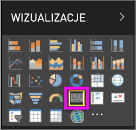
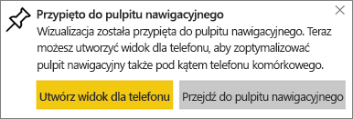
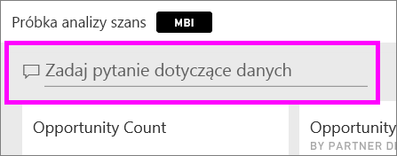
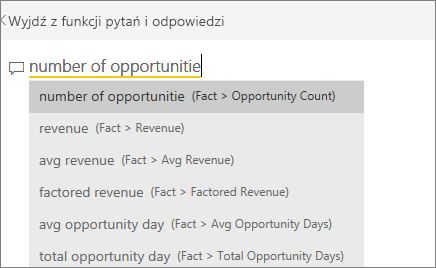
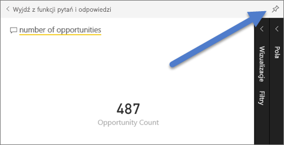
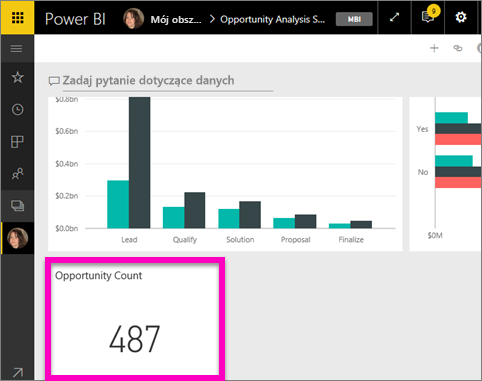
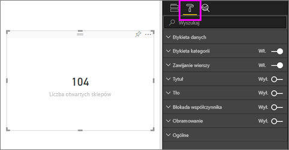
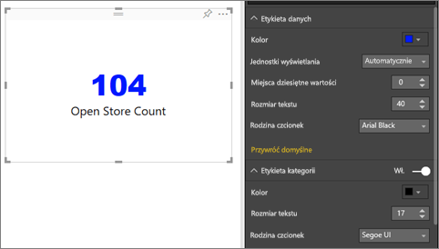
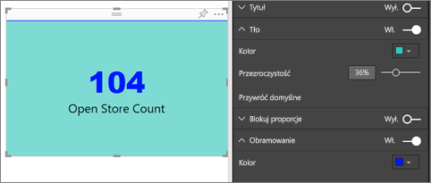

# Wizualizacje w postaci kart
Czasami jedna liczba jest najważniejsza i chcesz ją śledzić na swoim pulpicie nawigacyjnym lub w raporcie usługi Power BI, np. łączna sprzedaż, udział w rynku rok do roku lub łączna liczba szans sprzedaży. Ten typ wizualizacji jest nazywany *kartą*. Podobnie jak w przypadku niemal wszystkich natywnych wizualizacji usługi Power BI, karty można tworzyć przy użyciu edytora raportu lub funkcji Pytania i odpowiedzi.

## Tworzenie karty za pomocą edytora raportu
W poniższych instrukcjach używane są przykładowe dane dotyczące analizy handlu detalicznego. Aby je wykonać, [pobierz przykład](../sample-datasets.md) dla usługi Power BI (app.powerbi.com) lub dla programu Power BI Desktop.   

1. Rozpocznij od [pustej strony raportu](../power-bi-report-add-page.md) i wybierz pole **Store** \> **Open store count**. Jeśli używasz usługi Power BI, należy otworzyć raport w [widoku do edycji](../service-interact-with-a-report-in-editing-view.md).

    Usługa Power BI tworzy wykres kolumnowy dla jednej liczby.

   
2. W okienku Wizualizacje wybierz ikonę karty.

   
6. Umieść kursor nad kartą i wybierz ikonę pinezki , aby dodać wizualizację do pulpitu nawigacyjnego.

   
7. Przypnij kafelek do istniejącego lub nowego pulpitu nawigacyjnego.

   * Istniejący pulpit nawigacyjny: z listy rozwijanej wybierz nazwę pulpitu nawigacyjnego.
   * Nowy pulpit nawigacyjny: wpisz nazwę nowego pulpitu nawigacyjnego.
8. Wybierz pozycję **Przypnij**.

   Komunikat o powodzeniu (w prawym górnym rogu) informuje o tym, że wizualizacja została dodana do pulpitu nawigacyjnego jako kafelek.

   
9. Wybierz pozycję **Przejdź do pulpitu nawigacyjnego**. Tam możesz [edytować i przenieść](../service-dashboard-edit-tile.md) przypiętą wizualizację.

## Tworzenie karty za pomocą pola pytania funkcji Pytania i odpowiedzi
Skorzystanie z pola pytania funkcji Pytania i odpowiedzi jest najprostszym sposobem utworzenia karty. Pole pytania funkcji Pytania i odpowiedzi jest dostępne w usłudze Power BI z poziomu pulpitu nawigacyjnego lub raportu oraz w widoku raportu programu Desktop. Poniższe kroki przedstawiają tworzenie karty z poziomu pulpitu nawigacyjnego usługi Power BI. Jeśli chcesz utworzyć kartę za pomocą funkcji Pytania i odpowiedzi w programie Power BI Desktop, [wykonaj te instrukcje](https://powerbi.microsoft.com/en-us/blog/power-bi-desktop-december-feature-summary/#QandA), aby uzyskać wersję zapoznawczą funkcji Pytania i odpowiedzi dla raportów w programie Power BI Desktop.

1. Utwórz [pulpit nawigacyjny](../service-dashboards.md) i [pobierz dane](../service-get-data.md). W tym przypadku jest używany [przykład Opportunity Analysis](../sample-opportunity-analysis.md).

1. W polu pytania w górnej części pulpitu nawigacyjnego rozpocznij wpisywanie tego, co chcesz wiedzieć o danych. 

   

> [!TIP]
> Z poziomu raportu usługi Power BI w widoku do edycji wybierz pozycję **Zadaj pytanie** z górnego paska menu. W przypadku raportu programu Power BI Desktop znajdź jakieś wolne miejsce w raporcie i kliknij je dwukrotnie, aby otworzyć pole pytania.

3. Na przykład wpisz w polu pytania „number of opportunities” (liczba możliwości).

   

   Pole pytania pomaga zadać pytanie, pokazując sugestie i inne sformułowania, a na koniec wyświetla łączną liczbę.  
4. Wybierz ikonę pinezki  w prawym górnym rogu, aby dodać kartę do pulpitu nawigacyjnego.

   
5. Przypnij kartę jako kafelek do istniejącego lub nowego pulpitu nawigacyjnego.

   * Istniejący pulpit nawigacyjny: z listy rozwijanej wybierz nazwę pulpitu nawigacyjnego. Twój wybór będzie ograniczony tylko do tych pulpitów nawigacyjnych wewnątrz bieżącego obszaru roboczego.
   * Nowy pulpit nawigacyjny: wpisz nazwę nowego pulpitu nawigacyjnego a zostanie ona dodana do Twojego bieżącego obszaru roboczego.
6. Wybierz pozycję **Przypnij**.

   Komunikat o powodzeniu (w prawym górnym rogu) informuje o tym, że wizualizacja została dodana do pulpitu nawigacyjnego jako kafelek.  

   
7. Wybierz pozycję **Przejdź do pulpitu nawigacyjnego**, aby wyświetlić nowy kafelek. Tam możesz [zmienić nazwę, rozmiar, dodać hiperlink i zmienić położenia kafelka i inne](../service-dashboard-edit-tile.md) na pulpicie nawigacyjnym.

   

## Istotne zagadnienia i rozwiązywanie problemów
- Jeśli pole pytania nie jest w ogóle widoczne, skontaktuj się z administratorem systemu lub dzierżawy.    
- Jeśli używasz programu Power BI Desktop i dwukrotne kliknięcie pustego miejsca w raporcie nie otwiera pola funkcji Pytania i odpowiedzi, konieczne może być jej włączenie.  Wybierz pozycję **Plik > Opcje i ustawienia > Opcje > Funkcje w wersji zapoznawczej > Pytania i odpowiedzi**, a następnie ponownie uruchom program Power BI Desktop.

## Formatowanie karty
Istnieje wiele opcji zmieniania etykiet, tekstu, koloru i innych elementów. Najlepszym sposobem zapoznania się z nimi jest utworzenie karty, a następnie eksplorowanie okienka Formatowanie. Oto tylko kilka spośród dostępnych opcji formatowania. 

1. Rozpocznij, wybierając ikonę wałka do malowania, aby otworzyć okienko formatowania. 

    
2. Rozwiń węzeł **Etykieta danych**, a następnie zmień kolor, rozmiar i rodzinę czcionek. Jeśli masz tysiące sklepów, możesz użyć opcji **Jednostki wyświetlania**, aby pokazać liczbę w tysiącach i kontrolować liczbę miejsc dziesiętnych. Na przykład można użyć wersji 125,8K zamiast 125 832,00.

3.  Rozwiń węzeł **Etykieta kategorii**, a następnie zmień rozmiar i kolor.

    

4. Rozwiń węzeł **Tło** i przesuń suwak do położenia oznaczającego włączenie.  Teraz możesz zmienić kolor tła i przezroczystość.

    

5. Zmieniaj ustawienia opcji formatowania do momentu uzyskania wybranego wyglądu karty. 

    

## Następne kroki
[Wykresy kombi w usłudze Power BI](power-bi-visualization-combo-chart.md)

[Typy wizualizacji w usłudze Power BI](power-bi-visualization-types-for-reports-and-q-and-a.md)
