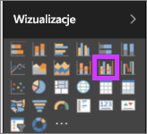
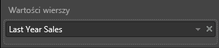
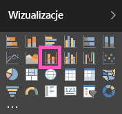
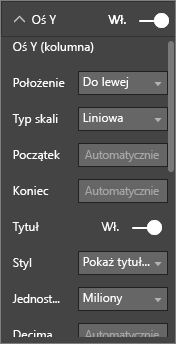
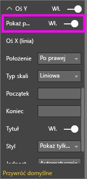

# Wykres kombi w usłudze Power BI
W usłudze Power BI wykres kombi to pojedyncza wizualizacja łącząca wykres liniowy i kolumnowy. Łączenie 2 wykresów w jednym umożliwia szybsze porównywanie danych.

Wykresy kombi mogą mieć jedną lub dwie osie Y.

## Kiedy należy używać wykresu kombi
Wykresy kombi są doskonałym wyborem:

* gdy masz wykres liniowy i kolumnowy o takiej samej osi X.
* aby porównać wiele miar z różnymi zakresami wartości.
* aby zilustrować korelację między dwoma miarami w jednej wizualizacji.
* aby sprawdzić, czy jedna miara realizuje cel, który jest definiowany przez inną miarę
* aby zaoszczędzić miejsce na kanwie.

### Wymagania wstępne
Wykresy kombi są dostępne w usłudze Power BI i w programie Power BI Desktop. W tym samouczku do utworzenia wykresu kombi jest używana usługa Power BI. Aby samodzielnie wykonywać odpowiednie czynności, otwórz usługę Power BI i połącz się z przykładem „Retail Analysis” ([instrukcje znajdują się poniżej](#create)).

## Tworzenie podstawowego, jednoosiowego wykresu kombi
Obejrzyj, jak Will tworzy wykres kombi przy użyciu przykładu sprzedaży i marketingu.

<iframe width="560" height="315" src="https://www.youtube.com/embed/lnv66cTZ5ho?list=PL1N57mwBHtN0JFoKSR0n-tBkUJHeMP2cP" frameborder="0" allowfullscreen></iframe>  

 Aby utworzyć własny wykres kombi, zaloguj się w usłudze Power BI, a następnie wybierz pozycję **Pobierz dane \> Przykłady \> Przykład Retail Analysis &gt; Połącz &gt; Przejdź do pulpitu nawigacyjnego**.

1. Na pulpicie nawigacyjnym „Przykład analizy detalicznej” wybierz kafelek **Magazyny razem**, aby otworzyć raport „Przykład analizy detalicznej”.
2. Wybierz pozycję **Edytuj raport**, aby otworzyć raport w widoku do edycji.
3. [Dodaj nową stronę raportu](../power-bi-report-add-page.md).
4. Utwórz wykres kolumnowy wyświetlający marżę sprzedaży i marżę brutto według miesięcy za bieżący rok.

    a.  W okienku Pola wybierz pozycje **Sprzedaż** \> **Sprzedaż tegoroczna** > **Wartość**.

    b.  Przeciągnij pozycję **Sprzedaż** \> **Marża brutto w tym roku** do źródła **Wartość**.

    c.  Wybierz pozycje **Czas** \> **Miesiąc obrachunkowy**, aby je dodać do źródła **Oś**.

    
5. Wybierz wielokropek (...) w górnym prawym rogu wizualizacji, a następnie wybierz pozycję **Sortuj według miesiąca obrachunkowego**. Aby zmienić kolejność sortowania, ponownie wybierz przycisk wielokropka, a następnie wybierz pozycję **Sortuj rosnąco** lub **Sortuj malejąco**.

6. Przekształć wykres kolumnowy w wykres kombi. Dostępne są dwa wykresy kombi: **liniowy i skumulowany kolumnowy** oraz **liniowy i kolumnowy grupowany**. Po wybraniu wykresu kolumnowego z okienka **Wizualizacje** wybierz pozycję **Wykres liniowy i kolumnowy grupowany**.

    
7. Z okienka **Pola** przeciągnij pozycje **Sprzedaż** \> **Sprzedaż zeszłoroczna** do zasobnika **Wartości wiersza**.

   

   Twój wykres kombi powinien wyglądać następująco:

   

## Tworzenie wykresu kombi z dwoma osiami
W tym zadaniu porównamy marżę brutto i sprzedaż.

1. Utwórz nowy wykres liniowy, który śledzi wartość **Gross Margin last year %** względem wartości **Month**. Wybierz przycisk wielokropka, aby posortować według **miesiąca** i **rosnąco**.  
W styczniu % marży brutto był równy 35%, wzrósł do 45% w kwietniu, spadł w lipcu i ponownie wzrósł w sierpniu. Czy podobny wzorzec sprzedaży wystąpił w poprzednim i bieżącym roku?

   
2. Dodaj pozycje **This Year Sales > Value** i **Last Year Sales** do wykresu liniowego. Skala wartości **Gross Margin Last Year %** jest znacznie mniejsza niż skala wartości **Sales**, co utrudnia porównanie.      

   
3. Aby ułatwić odczytanie i interpretację wizualizacji, przekonwertuj wykres liniowy na wykres liniowy i skumulowany kolumnowy.

   
4. Przeciągnij pozycję **Gross Margin Last Year %** z obszaru **Wartości w kolumnie** do obszaru **Wartości liniowe**. Usługa Power BI utworzy dwie osie, dzięki czemu zestawy danych można skalować w różny sposób, czyli po lewej stronie jest mierzona wartość sprzedaży w dolarach, a po prawej — procent. Widzimy więc odpowiedź na nasze pytanie: tak, widzimy podobny wzorzec.

       

## Dodawanie tytułów do osi
1. Wybierz ikonę wałka do malowania , aby otworzyć okienko Formatowanie.
2. Wybierz strzałkę w dół, aby rozwinąć opcje **Osi Y**.
3. W pozycji **Oś Y (Kolumna)** ustaw wartość **Pozycja** na **Lewo**, ustaw wartość **Tytuł** na **Wł.**, wartość **Styl** na **Pokaż tylko tytuł** i wartość **Wyświetlanie** na **Miliony**.

   
4. W obszarze **Oś Y (kolumna)** przewiń w dół i upewnij się, że opcja **Pokaż dodatkowe** ma wartość **Wł**. Spowoduje to wyświetlenie opcji formatowania fragmentu wykresu liniowego wykresu kombi.

   
5. Dla pozycji **Oś Y (Linia)** pozostaw wartość **Pozycja** równą **Prawo**, ustaw wartość **Tytuł** na **Wł.** i ustaw wartość **Styl** na **Pokaż tylko tytuł**.

   Wykres kombi wyświetli teraz dwie osie, obie z tytułami.

   

6. Opcjonalnie zmodyfikuj czcionkę, rozmiar i kolor tekstu oraz ustaw inne opcje formatowania, aby poprawić widoczność i czytelność wykresu.

W tym miejscu możesz chcieć:

* [Dodać wykres kombi jako kafelek pulpitu nawigacyjnego](../service-dashboard-tiles.md).
* [Zapisz raport](../service-report-save.md).
* [Zwiększanie dostępności raportu dla osób niepełnosprawnych](../desktop-accessibility.md).

## Wyróżnianie i filtrowanie krzyżowe

Wyróżnienie kolumny lub linii na wykresie kombi powoduje wyróżnienie i filtrowanie krzyżowe innych wizualizacji na stronie raportu... i na odwrót. To zachowanie domyślne można zmienić za pomocą [interakcji wizualizacji](../service-reports-visual-interactions.md).

## Następne kroki

[Wykresy pierścieniowe w usłudze Power BI](power-bi-visualization-doughnut-charts.md)

[Typy wizualizacji w usłudze Power BI](power-bi-visualization-types-for-reports-and-q-and-a.md)
