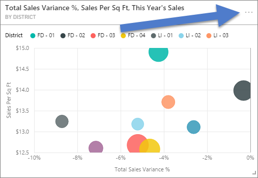
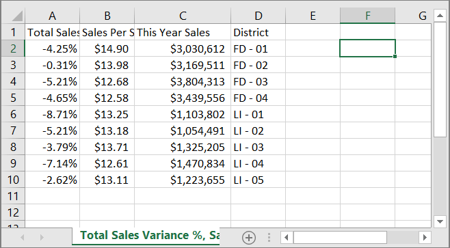
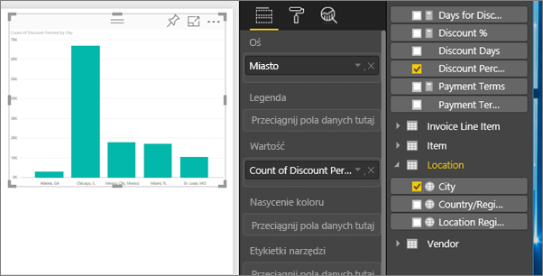
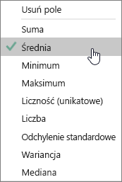
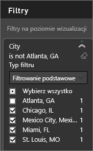
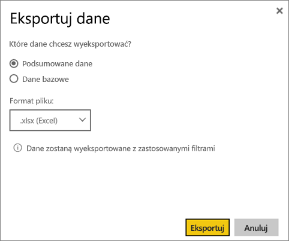
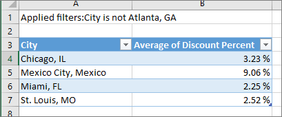
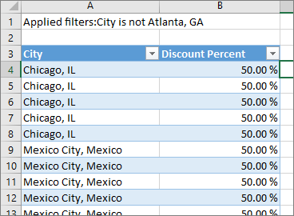
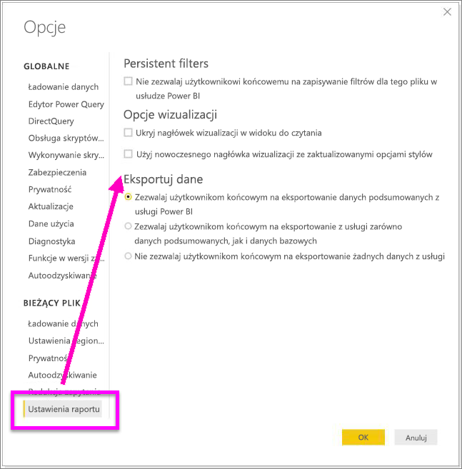

# Eksportowanie danych z wizualizacji
Jeśli chcesz zobaczyć dane, które zostały użyte do utworzenia wizualizacji, możesz wyświetlić te dane w usłudze Power BI lub wyeksportować je do programu Excel w formie pliku xlsx lub csv. Opcja eksportowania danych wymaga licencji wersji Pro lub Premium i uprawnień do edycji zestawu danych i raportu. 

Zobacz, jak Will eksportuje dane z jednej z wizualizacji w swoim raporcie, zapisuje je w pliku xlsx i otwiera je w programie Excel. Następnie postępuj zgodnie ze szczegółowymi instrukcjami poniżej wideo, aby wypróbować to samodzielnie.

<iframe width="560" height="315" src="https://www.youtube.com/embed/KjheMTGjDXw" frameborder="0" allowfullscreen></iframe>

## Z wizualizacji w pulpicie nawigacyjnym usługi Power BI
1. Wybierz wielokropek w prawym górnym rogu wykresu wizualizacji.

    
2. Wybierz ikonę **Eksportuj dane**.

    
3. Dane są eksportowane do pliku CSV. Jeśli wizualizacja jest filtrowana, pobrane dane również będą filtrowane.    
4. Przeglądarka wyświetli monit o zapisanie pliku.  Po zapisaniu otwórz plik csv w programie Excel.

    

## Z wizualizacji w raporcie
Aby skorzystać z tej metody, otwórz[raport próbnych danych dotyczących analizy zakupów](../sample-procurement.md) w [Widoku edycji](../consumer/end-user-reading-view.md). Dodaj nową pustą stronę raportu. Następnie wykonaj kroki opisane poniżej, aby dodać agregację i filtr na poziomie wizualizacji.

1. Utwórz nowy wykres kolumnowy.  W okienku Pola wybierz opcję **Lokalizacja > Miasto** i **Faktura > Procent rabatu**.  Może się okazać konieczne przeniesienie pozycji **Procent rabatu** na listę Wartość. 

    
2. Zmień agregację dla opcji **Procent rabatu** z **Liczba** na **Średnia**. Na liście Wartość wybierz strzałkę po prawej stronie pozycji **Procent rabatu** (pozycja może być nazwana **Wartość liczbowa procentu rabatu**), a następnie wybierz opcję **Średnia**.

    
3. Dodaj filtr do pola **Miasto**, aby usunąć miasto **Atlanta**.

   

   Teraz możemy wypróbować obie opcje eksportowania danych. 

4. Wybierz wielokropek w prawym górnym rogu wykresu wizualizacji. Wybierz opcję **Eksportuj dane**.

   
5. Jeśli w usłudze Power BI w trybie online wizualizacja ma agregację (np. jeśli zmieniono opcję **Liczba** na *Średnia*, *Suma* lub *Minimum*), masz dwie opcje: **Podsumowane dane** i **Dane bazowe**. W programie Power BI Desktop będzie dostępna tylko opcja **Podsumowane dane**. Aby zrozumieć agregowanie, zobacz [Agregowanie w usłudze Power BI](../service-aggregates.md).
    
6. Wybierz opcję **Podsumowane dane** > **Eksportuj**, a następnie wybierz format xlsx lub csv. Usługa Power BI eksportuje dane.  W przypadku zastosowania filtrów do wizualizacji dane zostaną wyeksportowane jako dane odfiltrowane. Po wybraniu opcji **Eksportuj** przeglądarka wyświetli monit o zapisanie pliku. Po zapisaniu otwórz plik w programie Excel.

   **Podsumowane dane**: wybierz tę opcję, jeśli chcesz wyeksportować dane dotyczące zawartości widocznej w tej wizualizacji.  Ten typ eksportu przedstawia tylko dane (kolumny i miary) wybrane do tworzenia wizualizacji.  Jeśli wizualizacja ma agregację, wyeksportujesz dane zagregowane. Jeśli na przykład masz wykres słupkowy przedstawiający 4 słupki, otrzymasz 4 wiersze danych. Podsumowane dane są dostępne w formacie xlsx i csv.

   W tym przykładzie dane wyeksportowane do programu Excel pokazują jedną sumę dla każdego miasta. Ponieważ odfiltrowaliśmy Atlantę, nie jest uwzględniana w wynikach.  Pierwszy wiersz naszego arkusza przedstawia filtry, które zostały użyte podczas wyodrębniania danych z usługi Power BI.

   
7. Teraz spróbuj wybrać opcję **Dane bazowe** > **Eksportuj** i format xlsx. Usługa Power BI eksportuje dane. W przypadku zastosowania filtrów do wizualizacji dane zostaną wyeksportowane jako dane odfiltrowane. Po wybraniu opcji **Eksportuj** przeglądarka wyświetli monit o zapisanie pliku. Po zapisaniu otwórz plik w programie Excel.

   >[!WARNING]
   >Eksportowanie danych bazowych umożliwia użytkownikom wyświetlenie wszystkich szczegółowych danych — każdej kolumny w danych. Administratorzy usługi Power BI mogą wyłączyć tę funkcję w organizacji. Jeśli jesteś właścicielem zestawu danych, możesz ustawić zastrzeżone kolumny na „ukryte”, aby nie były wyświetlane na liście pól w programie Power BI Desktop lub usłudze Power BI.

   **Dane bazowe**: wybierz tę opcję, jeśli chcesz wyświetlić dane w wizualizacji ***oraz*** dodatkowe dane z modelu (zobacz poniższą ilustrację, aby uzyskać szczegółowe informacje).  Jeśli wizualizacja ma agregację, wybranie opcji *Dane bazowe* spowoduje usunięcie agregacji. Po wybraniu opcji **Eksportuj** dane zostaną wyeksportowane do pliku xlsx, a przeglądarka wyświetli monit o zapisanie pliku. Po zapisaniu otwórz plik w programie Excel.

   W tym przykładzie dane wyeksportowane do programu Excel pokazują jeden wiersza dla każdego wiersza z miastami w zestawie danych oraz procent rabatu dla tego wpisu. Innymi słowy dane są spłaszczone i nie są agregowane. Pierwszy wiersz naszego arkusza przedstawia filtry, które zostały użyte podczas wyodrębniania danych z usługi Power BI.  

   

## Eksportowanie szczegółów danych bazowych
Zawartość widoczna na ekranie po wybraniu opcji **Dane bazowe** może być różna. Zrozumienie tych szczegółów może wymagać pomocy administratora lub działu IT. W usłudze lub programie Power BI Desktop w widoku raportowania *miara* jest wyświetlana na liście Pola z ikoną kalkulatora . Miary są tworzone w programie Power BI Desktop, a nie w usłudze Power BI.

| Wizualizacja zawiera |                                                                              Dane widoczne w pliku eksportu                                                                              |
|-----------------|-------------------------------------------------------------------------------------------------------------------------------------------------------------------------------------|
|   Agregacje    |                                                 *Pierwsza* agregacja i nieukryte dane z całej tabeli dla danej agregacji                                                  |
|   Agregacje    | Powiązane dane — jeśli wizualizacja używa danych z innych tabel danych *\*\*powiązanych*\* z tabelą danych, która zawiera agregację (o ile jest to relacja \*:1 lub 1:1) |
|    Miary     |                                      Wszystkie miary w wizualizacji *i* wszystkie miary z dowolnej tabeli danych zawierającej miarę użytą w wizualizacji                                      |
|    Miary     |                                       Wszystkie nieukryte dane z tabel zawierających tę miarę (o ile jest to relacja \*:1 lub 1:1)                                       |
|    Miary     |                                      Wszystkie dane ze wszystkich tabel powiązanych z tabelami zawierającymi miary w obrębie łańcucha typu \*:1 dla relacji 1:1                                      |
|  Tylko miary  |                                                   Wszystkie nieukryte kolumny ze wszystkich powiązanych tabel (w celu rozwinięcia miary)                                                   |
|  Tylko miary  |                                                             Podsumowane dane zduplikowanych wierszy dla miar modelu.                                                              |

### Ustawianie opcji eksportu
Projektanci raportów usługi Power BI kontrolują typy opcji eksportowania danych, które są dostępne dla klientów. Są to:
- Allow export of only summarized data (Zezwalaj tylko na eksportowanie podsumowanych danych) (jest to ustawienie domyślne dla nowych raportów) 
- Allow exporting of summarized and underlying data (Zezwalaj na eksportowanie danych podsumowanych i bazowych) (to była opcja domyślna do października 2018 r.) 
- Don't allow exporting of any data (Nie zezwalaj na eksportowanie żadnych danych)  

    > [!IMPORTANT]
    > Zalecamy, aby projektanci raportów wrócili do starych raportów i ręcznie zresetowali opcję eksportu, zgodnie z potrzebami.

1. Aby ustawić te opcje, uruchom program Power BI Desktop.

2. W lewym górnym rogu wybierz kolejno opcje **Plik** > **Opcje i ustawienia** > **Opcje**. 

3. W obszarze **Bieżący plik** wybierz opcję **Ustawienia raportu**.

    

4. Wybierz opcję z listy rozwijanej **Eksportuj dane**.

Można również zaktualizować to ustawienie w usłudze Power BI.  

Należy pamiętać, że jeśli występuje konflikt między ustawieniami portalu administratora usługi Power BI a ustawieniami raportu w zakresie eksportowania danych, ustawienia administratora zastąpią ustawienia eksportowania danych. 

## Ograniczenia i istotne zagadnienia
* Maksymalna liczba wierszy, które można eksportować z programu **Power BI Desktop** i **usługi Power BI** do pliku csv to 30 000.
* Maksymalna liczba wierszy, które można wyeksportować w formacie xlsx, wynosi 150 000.
* Eksportowanie przy użyciu *danych bazowych* nie będzie działać, jeśli źródłem danych jest aktywne połączenie usług Analysis Services oraz wersja jest starsza niż 2016 i tabele w modelu nie mają unikatowego klucza.  
* Eksportowanie przy użyciu *danych bazowych* nie będzie działać, jeśli pozycja *Pokaż elementy bez danych* jest włączona dla eksportowanej wizualizacji.
* W przypadku używania zapytania bezpośredniego maksymalna ilość danych, które można wyeksportować, to 16 MB. Może to spowodować wyeksportowanie mniejszej liczby wierszy, zwłaszcza wtedy, gdy istnieje wiele kolumn, dane są trudne do skompresowania lub zachodzą inne czynniki zwiększające rozmiar plików i zmniejszające liczbę eksportowanych wierszy.
* Jeśli wizualizacja używa danych z więcej niż jednej tabeli danych i nie ma relacji tych tabel w modelu danych, są eksportowane tylko dane dla pierwszej tabeli. 
* Wizualizacje niestandardowe oraz wizualizacje języka R nie są obecnie obsługiwane.
* Eksportowanie danych nie jest dostępne w przypadku użytkowników spoza organizacji, którzy używają udostępnionego pulpitu nawigacyjnego. 
* W usłudze Power BI nazwę pola (kolumny) można zmienić przez dwukrotne kliknięcie pola i wpisanie nowej nazwy.  Ta nowa nazwa jest *aliasem*. Raport usługi Power BI może zawierać zduplikowane nazwy pól, ale program Excel nie zezwala na duplikaty.  Dlatego w przypadku wyeksportowania danych do programu Excel aliasy pól są przywracane do oryginalnych nazw pól (kolumn).  
* Jeśli w pliku csv znajduje się znak Unicode, tekst w programie Excel może nie być wyświetlany prawidłowo. Chociaż otworzenie pliku w Notatniku będzie działać prawidłowo. Przykłady znaków Unicode to symbole walut i obce słowa. Można obejść ten problem, importując plik csv do programu Excel, zamiast otwierać go bezpośrednio. Aby to zrobić:

  1. Otwórz program Excel.
  2. Na karcie **Dane** wybierz opcję **Pobierz dane zewnętrzne** > **Z tekstu**.
* Administratorzy usługi Power BI mają możliwość wyłączenia eksportowania danych.

## Następne kroki
[Pulpity nawigacyjne w usłudze Power BI](../consumer/end-user-dashboards.md)  
[Power BI — podstawowe pojęcia](../consumer/end-user-basic-concepts.md)

Masz więcej pytań? [Zadaj pytanie społeczności usługi Power BI](http://community.powerbi.com/)

