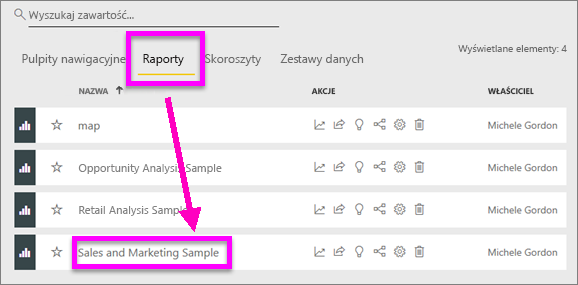

# Kartogramy w usłudze Power BI
Kartogram używa cieniowania lub barwienia, lub wzorców do wyświetlania, jak wartość różni się w części lokalizacji geograficznej lub regionu.  Szybko wyświetlaj te względne różnice za pomocą cieniowania tych zakresów od jasnych (rzadsze/mniejsze) do ciemnych (częstsze/większe).    

## Co jest wysyłane do usługi Bing
Usługa Power BI integruje się z usługą Bing w celu zapewnienia domyślnych współrzędnych mapy (w procesie zwanym kodowaniem geograficznym). Podczas tworzenia wizualizacji mapy w usłudze Power BI lub programie Power BI Desktop dane w zasobnikach **Lokalizacja**, **Szerokość geograficzna** i **Długość geograficzna** (które są używane do tworzenia tej wizualizacji) są wysyłane do usługi Bing.

Użytkownik lub administrator może być zmuszony do aktualizacji zapory, aby umożliwić dostęp do adresów URL używanych przez usługę Bing do geokodowania.  Te adresy URL to:
- https://dev.virtualearth.net/REST/V1/Locations    
- https://platform.bing.com/geo/spatial/v1/public/Geodata    
- https://www.bing.com/api/maps/mapcontrol

Aby uzyskać więcej informacji o danych wysyłanych do usługi Bing i wskazówkach dotyczących zwiększenia sukcesu kodowania geograficznego, zobacz [Porady i wskazówki dotyczące wizualizacji map](power-bi-map-tips-and-tricks.md).

## Kiedy należy używać kartogramu
Kartogramy są doskonałym wyborem:

* do wyświetlania informacji ilościowych na mapie.
* do pokazywania wzorców przestrzennych i relacji.
* gdy dane są standaryzowane.
* podczas pracy z danymi socjoekonomicznymi.
* gdy zdefiniowane regiony są ważne.
* w celu uzyskania przeglądu rozkładu w różnych lokalizacjach geograficznych.

### Wymagania wstępne
- Usługa Power BI lub program Power BI Desktop
- Próbka sprzedaży i marketingu

Przykład w tym samouczku obejmuje usługę Power BI, a nie program Power BI Desktop.

## Tworzenie kartogramu podstawowego
Na tym filmie Kim tworzy mapę podstawową i przekształca ją w kartogram.

<iframe width="560" height="315" src="https://www.youtube.com/embed/ajTPGNpthcg" frameborder="0" allowfullscreen></iframe>

### Pobieranie danych i dodawanie nowej pustej strony do raportu
1. Aby utworzyć własny kartogram, [pobierz przykład sprzedaży i marketingu](../sample-datasets.md), logując się do usługi Power BI i wybierając pozycje **Pobierz dane \> Przykłady \> Sprzedaż i marketing \> Połącz**.
2. Gdy pojawi się komunikat o powodzeniu, zamknij go i wybierz kartę **Raporty**. Następnie wybierz pozycję **Próbka sprzedaży i marketingu**, aby otworzyć raport.

   
3. Usługa Power BI otworzy raport. Wybierz pozycję **Edytuj raport**, aby otworzyć raport w [widoku do edycji](../service-interact-with-a-report-in-editing-view.md).

4. Dodaj nową stronę, wybierając żółty znak plus w dolnej części kanwy raportu.

    

### Tworzenie kartogramu
1. W okienku Pola wybierz pole **Geograficzny** \> **Stan**.    

   
5. [Przekształć wykres](power-bi-report-change-visualization-type.md) w kartogram. Pamiętaj, że **Stan** obecnie znajduje się w źródle **Lokalizacja**. Mapy Bing używają pola w źródle **Lokalizacja** do tworzenia mapy.  Lokalizacja może obejmować różne prawidłowe lokalizacje: kraje, województwa, powiaty, miasta, kody pocztowe lub inne kody itd. Mapy Bing udostępniają kształty kartogramów dla lokalizacji na całym świecie. Bez prawidłowego wpisu w źródle lokalizacji usługa Power BI nie może utworzyć kartogramu.  

   
6. Przefiltruj mapę, aby wyświetlić tylko kontynentalne Stany Zjednoczone.

   a.  W dolnej części okienka wizualizacji wyszukaj obszar **Filtry**.

   b.  Umieść kursor nad pozycją **Stan** i kliknij cudzysłów ostrokątny rozwijania  
   

   c.  Umieść znacznik wyboru obok pozycji **Wszystkie** i usuń znacznik wyboru obok pozycji **AK**.

   
7. Wybierz pozycję **SalesFact** \> **Wskaźniki nastrojów klientów**, aby je dodać do źródła **Nasycenie koloru**. Pole w źródle **Nasycenie koloru** steruje cieniowaniem mapy.  
   
8. Kartogram zostanie zacieniowany na zielono i czerwono, gdzie kolor czerwony reprezentuje niższe wartości wskaźnika nastrojów klientów, a zielony reprezentuje wyższe, bardziej pozytywne wskaźniki nastrojów klientów.  W tym miejscu został wyróżniony stan Wyoming (WY), gdzie wskaźniki nastrojów klientów są bardzo dobre i wynoszą 74.  
   
9. [Zapisz raport](../service-report-save.md).
##    Dostosowanie formatowania koloru
Usługa Power BI zapewnia dużą kontrolę nad wyglądem kartogramu.
1. Wybierz ikonę wałka do malowania, aby otworzyć okienko Formatowanie.

    

2. Wybierz pozycję **Kolory danych**, aby wyświetlić opcje kolorów.
3. Ustaw kolory Minimalny i Maksymalny na żółty i niebieski. Dodaj wartości minimalne i maksymalne na podstawie swoich danych. Poeksperymentuj z tymi kontrolkami, dopóki nie uzyskasz żądanego wyglądu. 

    

## Wyróżnianie i filtrowanie krzyżowe
Aby uzyskać informacje o korzystaniu z okienka filtrów, zobacz [Dodawanie filtru do raportu](../power-bi-report-add-filter.md).

Wyróżnianie lokalizacji na kartogramie powoduje krzyżowe filtrowanie innych wizualizacji na stronie raportu... i na odwrót.

1. Aby kontynuować, najpierw zapisz ten raport, wybierając pozycję **Plik > Zapisz**. 

2. Skopiuj kartogram, używając klawiszy CTRL+C.

3. W dolnej części kanwy raportu wybierz kartę **Wskaźniki nastrojów klientów**, aby otworzyć stronę raportu Nastrój.

    

4. Przenieś i zmień rozmiar wizualizacji na stronie, aby zrobić trochę miejsca, a następnie wklej kartogram z poprzedniego raportu za pomocą klawiszy CTRL+V.

   

5. Na kartogramie wybierz stan.  Spowoduje to wyróżnienie innych wizualizacji na stronie. Na przykład wybranie pozycji **Texas** pokazuje, że wskaźnik nastrojów klientów wynosi 74 i że stan Texas znajduje się w regionie Central District \#23.   
   
2. Wybierz punkt danych na wykresie liniowym VanArsdel — wskaźniki nastrojów klientów według miesiąca. Spowoduje to przefiltrowanie kartogramu, aby pokazać dane wskaźników nastrojów klientów dla firmy VanArsdel, a nie jej konkurentów.  
   

## Istotne zagadnienia i rozwiązywanie problemów
Dane mapy mogą być niejednoznaczne.  Na przykład istnieje Paryż we Francji, ale jest również Paryż w Teksasie. Twoje dane geograficzne prawdopodobnie znajdują się w oddzielnych kolumnach — kolumnie na nazwy miast, kolumnie na nazwy województw lub powiatów itd. — więc usługa Bing nie może ustalić, który Paryż jest który. Jeśli zestaw danych zawiera już dane współrzędnych geograficznych, usługa Power BI ma specjalne pola, aby sprawić, że dane mapy będą jednoznaczne. Przeciągnij pole zawierające dane szerokości geograficznej do obszaru wizualizacji \> Szerokość geograficzna.  Wykonaj te same czynności dla danych długości geograficznej.    

Jeśli masz uprawnienia do edycji zestawu danych w programie Power BI Desktop, obejrzyj ten film, aby uzyskać pomoc na temat niejednoznaczności mapy.

<iframe width="560" height="315" src="https://www.youtube.com/embed/Co2z9b-s_yM" frameborder="0" allowfullscreen></iframe>

Jeśli nie masz dostępu do danych współrzędnych geograficznych, [wykonaj te instrukcje, aby zaktualizować zestaw danych](https://support.office.com/article/Maps-in-Power-View-8A9B2AF3-A055-4131-A327-85CC835271F7).

Aby uzyskać pomoc na temat wizualizacji map, zobacz [Porady i wskazówki dotyczące wizualizacji map](../power-bi-map-tips-and-tricks.md).

## Następne kroki

[Mapowanie kształtów](desktop-shape-map.md)

[Typy wizualizacji w usłudze Power BI](power-bi-visualization-types-for-reports-and-q-and-a.md)