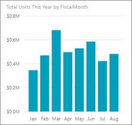
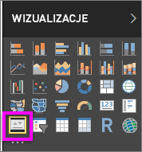
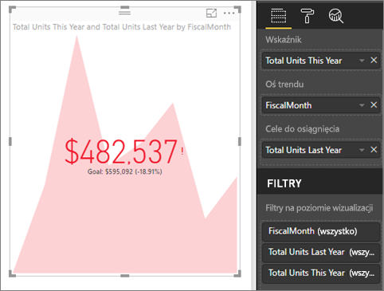

# Wizualizacje kluczowych wskaźników wydajności
Kluczowy wskaźnik wydajności (KPI) to wizualna podpowiedź przedstawiająca postęp w realizacji mierzalnego celu. Więcej informacji na temat kluczowych wskaźników wydajności można uzyskać w witrynie [Microsoft Developer Network](https://msdn.microsoft.com/library/hh272050).

Jeśli nie masz konta usługi Power BI, na początku [zacznij korzystać z bezpłatnej wersji próbnej](https://app.powerbi.com/signupredirect?pbi_source=web).

## Wymagania wstępne
* [Program Power BI Desktop jest dostępny bezpłatnie!](https://powerbi.microsoft.com/en-us/get-started/)
* [Przykład Retail Analysis Sample — plik PBIX](http://download.microsoft.com/download/9/6/D/96DDC2FF-2568-491D-AAFA-AFDD6F763AE3/Retail%20Analysis%20Sample%20PBIX.pbix)

## Kiedy używać kluczowych wskaźników wydajności
Kluczowe wskaźniki wydajności są doskonałym wyborem w następujących sytuacjach:

* Aby zmierzyć postęp (czy wyprzedzam harmonogram, czy mam opóźnienie).
* Aby zmierzyć odległość do celu (jak duże jest moje wyprzedzenie lub opóźnienie).   

## Wymagania dotyczące kluczowego wskaźnika wydajności
Kluczowy wskaźnik wydajności (KPI) jest oparty na określonej mierze i jest zaprojektowany, aby ułatwić oszacowanie bieżącej wartości i stanu metryki względem zdefiniowanego celu. W związku z tym wizualizacja kluczowego wskaźnika wydajności wymaga *podstawowej* miary, która da w wyniku wartość i *docelową* miarę lub wartość, oraz *progu* lub *celu*.

Obecnie zestaw danych kluczowego wskaźnika wydajności musi zawierać wartości docelowe kluczowego wskaźnika wydajności. Jeśli zestaw danych nie zawiera tych wartości, można je utworzyć przez dodanie arkusza programu Excel z wartościami docelowymi do modelu danych lub pliku PBIX.

## Jak utworzyć kluczowy wskaźnik wydajności
Aby kontynuować, otwórz [plik PBIX Retail Analysis](http://download.microsoft.com/download/9/6/D/96DDC2FF-2568-491D-AAFA-AFDD6F763AE3/Retail%20Analysis%20Sample%20PBIX.pbix) w programie Power BI Desktop. Utworzymy kluczowy wskaźnik wydajności, który będzie mierzyć postęp realizacji celu sprzedaży.

Możesz też obejrzeć klip wideo, w którym pokażemy Ci, jak utworzyć pojedyncze wizualizacje metryk: mierniki, karty i kluczowe wskaźniki wydajności.

<iframe width="560" height="315" src="https://www.youtube.com/embed/xmja6EpqaO0?list=PL1N57mwBHtN0JFoKSR0n-tBkUJHeMP2cP" frameborder="0" allowfullscreen></iframe>

1. Otwórz raport w widoku raportu i wybierz żółtą kartę, aby dodać nową stronę.    
2. W okienku Pola wybierz pozycje **Sales > Total Units This Year** (Sprzedaż > Całkowita liczba jednostek w bieżącym roku).  To będzie wskaźnik.
3. Dodaj pozycję **Time > FiscalMonth** (Czas > Miesiąc obrachunkowy).  To będzie reprezentacja trendu.
4. WAŻNE: posortuj wykres według **miesięcy obrachunkowych**. Po przekształceniu wizualizacji w kluczowy wskaźnik wydajności opcja sortowania będzie niedostępna.

    
5. Przekształć wizualizację w kluczowy wskaźnik wydajności, wybierając ikonę kluczowego wskaźnika wydajności w okienku Wizualizacje.
   
    
6. Dodaj cel. Dodaj wartość sprzedaży z ostatniego roku jako cel. Przeciągnij pozycję **Total Units Last Year** (Całkowita liczba jednostek w ostatnim roku) do pola **Cele do osiągnięcia**.
   
    
7. Opcjonalnie sformatuj kluczowy wskaźnik wydajności, wybierając ikonę wałka do malowania w celu otwarcia okienka Formatowanie.
   
   * **Wskaźnik** — steruje jednostkami wyświetlania wskaźnika i liczbą miejsc dziesiętnych.
   * **Oś trendu** — jeśli zostanie ustawiona na wartość **Wł.**, oś trendu jest wyświetlana jako tło wizualizacji kluczowego wskaźnika wydajności.  
   * **Cele** — jeśli zostanie ustawiona na wartość **Wł.**, wizualizacja wyświetla cel i odległość od celu w postaci wartości procentowej.
   * **Kodowanie kolorami > Kierunek** — niektóre kluczowe wskaźniki wydajności są postrzegane jako *lepsze* dla wyższych wartości, a niektóre jako *lepsze* dla niższych wartości. Na przykład zarobki w porównaniu do czasu oczekiwania. Zwykle wyższa wartość dochodów jest lepsza niż wyższa wartość czasu oczekiwania. Wybierz pozycję **high is better** (wyższa wartość jest lepsza) i opcjonalnie zmień ustawienia kolorów.

Kluczowe wskaźniki wydajności są również dostępne w usłudze Power BI i na urządzeniach przenośnych, dzięki czemu możesz na bieżąco śledzić stan swojej firmy.

## Istotne zagadnienia i rozwiązywanie problemów
* Jeśli Twój kluczowy wskaźnik wydajności nie wygląda jak ten powyżej, być może należy przeprowadzić sortowanie według miesięcy obrachunkowych. Ponieważ kluczowe wskaźniki wydajności nie mają opcji sortowania, sortowanie według miesięcy obrachunkowych należy przeprowadzić *przed* przekształceniem wizualizacji w kluczowy wskaźnik wydajności.

## Następne kroki

[Mapy podstawowe w usłudze Power BI](power-bi-map-tips-and-tricks.md)

[Typy wizualizacji w usłudze Power BI](power-bi-visualization-types-for-reports-and-q-and-a.md)