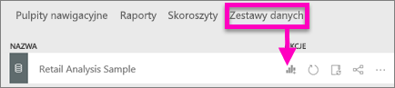
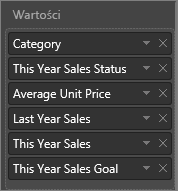
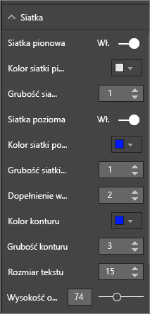
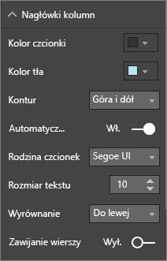
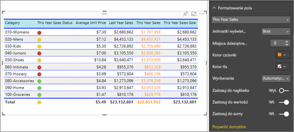
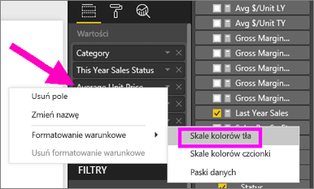
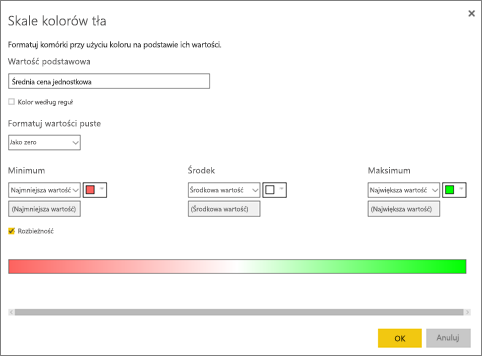
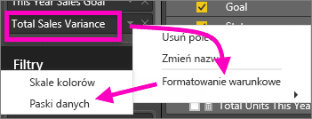
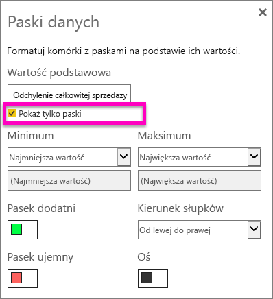
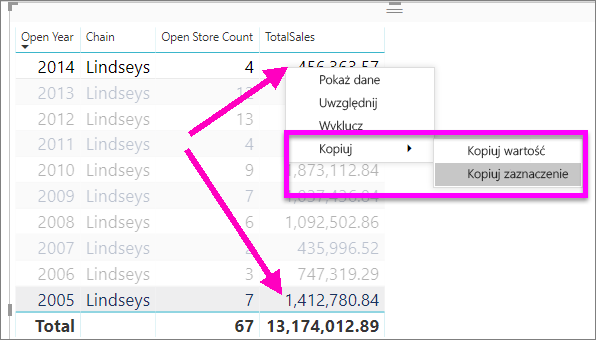

# Tabele w raportach i na pulpitach nawigacyjnych usługi Power BI
Tabela to siatka zawierająca powiązane dane w postaci logicznej serii wierszy i kolumn. Może również zawierać nagłówki i wiersze sum. Tabele dobrze się sprawdzają w przypadku porównań ilościowych, gdy analizuje się wiele wartości z jednej kategorii. Na przykład ta tabela zawiera 5 różnych miar dla **kategorii**.

Twórz tabele w raportach i wyróżniaj krzyżowo elementy w tabeli z innymi wizualizacjami na tej samej stronie raportu.  Ponadto możesz zaznaczać do wyróżnienia krzyżowego wiersze, kolumny, a nawet pojedyncze komórki. Zaznaczone pojedyncze komórki oraz zaznaczone obszary składające się z wielu komórek można kopiować i wklejać w innych aplikacjach.

## Kiedy używać tabeli
Tabele są doskonałym wyborem do następujących celów:

* Wyświetlanie i porównywanie szczegółowych danych i dokładnych wartości (zamiast ich reprezentacji wizualnych)
* Wyświetlanie danych w formacie tabelarycznym
* Wyświetlanie danych liczbowych według kategorii   

> [!NOTE]
> Jeśli tabela zawiera zbyt wiele wartości, warto rozważyć przekonwertowanie jej na macierz i (lub) zastosowanie funkcji przechodzenia do szczegółów. Maksymalna liczba punktów danych, które będą wyświetlane w tabeli, wynosi 3500.

## Wymagania wstępne
- Usługa Power BI lub program Power BI Desktop
- Przykład Retail Analysis

## Tworzenie tabeli
Utworzymy tabelę przedstawioną powyżej, aby wyświetlić wartości sprzedaży według kategorii produktów. Aby można było wykonać te instrukcje, zaloguj się w usłudze Power BI, wybierz pozycję **Pobierz dane \> Przykłady \> Próbka analizy handlu detalicznego > Połącz**, a następnie wybierz pozycję **Przejdź do pulpitu nawigacyjnego**. Tworzenie wizualizacji wymaga uprawnień do edytowania zestawu danych i raportu. Na szczęście przykłady usługi Power BI można w całości edytować. W przypadku, gdy raport został udostępniony, nie będzie można utworzyć żadnych wizualizacji w raportach.

1. W lewym okienku nawigacji wybierz opcję **Obszary robocze > Mój obszar roboczy**.    
2. Wybierz kartę Zestawy danych i przewiń w dół do dodanego przez Ciebie zestawu danych Próbka analizy handlu detalicznego.  Wybierz ikonę **Utwórz raport**.

    
2. W edytorze raportu wybierz pozycję **Item (Element)** > **Category (Kategoria)**.  Usługa Power BI automatycznie tworzy tabelę, która zawiera wszystkie kategorie.

    
3. Wybierz pozycję **Sales (Sprzedaż) > Average Unit Price (Średnia cena jednostkowa)**, **Sales (Sprzedaż) > Last Year Sales (Sprzedaż w zeszłym roku)** oraz **Sales (Sprzedaż) > This Year Sales (Sprzedaż w tym roku)** i wybierz wszystkie 3 opcje: Value (Wartość), Goal (Cel) i Status (Stan).   
4. W okienku Wizualizacje odszukaj obszar **Wartości**, a następnie przeciągaj i upuszczaj wartości, aż kolejność kolumn będzie zgodna z pierwszą ilustracją na tej stronie.  Obszar Wartości powinien wyglądać następująco.

    
5. Przypnij tabelę do pulpitu nawigacyjnego, wybierając ikonę pinezki.  

     

## Formatowanie tabeli
Istnieje wiele sposobów formatowania tabeli. Omówimy tu tylko niektóre z nich. Dobrym sposobem na dowiedzenie się więcej o innych opcjach formatowania jest otwarcie okienka formatowania (ikona wałka do malowania ) i przejrzenie opcji.

* Spróbuj sformatować siatkę tabeli. W tym miejscu dodaliśmy niebieską siatkę pionową, dodaliśmy więcej miejsca do wierszy oraz zwiększyliśmy nieco obramowanie oraz rozmiar tekstu.

    

    
* W nagłówkach kolumn zmieniliśmy kolor tła, dodaliśmy obramowanie i zwiększyliśmy rozmiar czcionki. 

    

    

* Możesz nawet zastosować formatowanie do poszczególnych kolumn i nagłówków kolumn. Rozpocznij od rozwinięcia obszaru **Formatowanie pola** i wybrania kolumny do formatowania z listy rozwijanej. W zależności od wartości kolumn funkcja formatowania pola umożliwia ustawianie elementów, takich jak: jednostki wyświetlania, kolor czcionki, liczba miejsc dziesiętnych, tło, wyrównanie i inne. Po dostosowaniu ustawień zdecyduj, czy chcesz również zastosować te ustawienia w nagłówku i wierszu sum.

    

* Po dodaniu jeszcze kilku opcji formatowania tabela wygląda tak. Ponieważ istnieje tak wiele opcji formatowania, najlepiej jest rozpocząć zapoznawanie się z nimi od formatowania domyślnego: otwórz okienko formatowania  i zacznij przeglądać opcje. 

    

### Formatowanie warunkowe
Jeden z typów formatowania jest określany jako *formatowanie warunkowe*. Jest on stosowany do pól w obszarze **Wartość** w okienku **Wizualizacje** w usłudze Power BI lub programie Desktop. 

Za pomocą formatowania warunkowego dla tabel można określić niestandardowe kolory czcionek i kolory tła komórek na podstawie wartości komórek. Można nawet używać gradientów kolorów. 

1. W okienku **Wizualizacje** w usłudze Power BI lub programie Desktop w obszarze **Wartości** wybierz strzałkę w dół obok wartości, którą chcesz sformatować (lub kliknij to pole prawym przyciskiem myszy). Można zarządzać tylko formatowaniem warunkowym pól w obszarze **Wartości** w obszarze **Pola**.

    
2. Wybierz pozycję **Skale kolorów tła**. W wyświetlonym oknie dialogowym można skonfigurować kolor, a także wartości *Minimum* i *Maksimum*. W przypadku wybrania pola **Rozbieżność** można skonfigurować też wartość opcjonalną *Środek*.

    

    Zastosujmy formatowanie niestandardowe do naszych wartości Average Unit Price (Średnia cena jednostkowa). Wybierz pozycję **Rozbieżność**, dodaj kolory i wybierz przycisk **OK**. 

    
3. Dodaj do tabeli nowe pole zawierające wartości zarówno dodatnie, jak i ujemne.  Wybierz pozycję **Sales (Sprzedaż) > Total Sales Variance (Całkowita wariancja sprzedaży)**. 

    
4. Dodaj formatowanie warunkowe w postaci paska danych, wybierając strzałkę w dół obok pozycji **Total Sales Variance** (Całkowita wariancja sprzedaży) i wybierając pozycję **Formatowanie warunkowe > Paski danych**.

    
5. W wyświetlonym oknie dialogowym ustaw kolory dla opcji **Pasek dodatni** oraz **Pasek ujemny**, umieść znacznik wyboru obok pozycji **Pokaż tylko pasek** i wprowadź inne zmiany według własnego uznania.

    

    Po wybraniu przycisku **OK** paski danych zastąpią wartości liczbowe w tabeli, co ułatwi jej przeglądanie.

    
6. Aby usunąć formatowanie warunkowe z wizualizacji, wystarczy ponownie kliknąć pole prawym przyciskiem myszy i wybrać pozycję **Usuń formatowanie warunkowe**.

> [!TIP]
> Formatowanie warunkowe jest również dostępne w okienku formatowania (ikona wałka do malowania). Wybierz wartość do sformatowania, a następnie ustaw opcję **Skale kolorów** lub **Paski danych** na **Wł.**, aby zastosować ustawienia domyślne. Aby dostosować ustawienia, wybierz pozycję **Kontrolki zaawansowane**.
> 
## Kopiowanie wartości z tabel usługi Power BI do użycia w innych aplikacjach

Tabela lub macierz może mieć zawartość, której chcesz używać w innych aplikacjach, takich jak Dynamics CRM lub Excel, a nawet w innych raportach usługi Power BI. Klikając prawym przyciskiem myszy w usłudze Power BI, możesz skopiować jedną komórkę lub grupę komórek do schowka i wkleić je w innej aplikacji.

* Aby skopiować wartość pojedynczej komórki, zaznacz komórkę, kliknij prawym przyciskiem myszy, i wybierz polecenie **Skopiuj wartość**. Niesformatowaną wartość komórki ze schowka możesz teraz wkleić w innej aplikacji.

    

* Aby skopiować więcej niż jedną komórkę, zaznacz zakres komórek lub użyj klawisza CTRL, aby zaznaczyć co najmniej jedną komórkę. Kopia będzie obejmować nagłówki kolumn i wierszy.

    

    Kopia obejmuje nagłówki kolumn i wierszy.

    

## Dopasowywanie szerokości kolumn w tabeli
Czasami usługa Power BI obcina nagłówek kolumny w raporcie i na pulpicie nawigacyjnym. Aby wyświetlić całą nazwę kolumny, przesuń kursor myszy na miejsce z prawej strony nagłówka w celu wyświetlenia strzałki podwójnej, zaznacz i przeciągnij.

## Istotne zagadnienia i rozwiązywanie problemów
* W przypadku stosowania formatowania kolumny można wybrać tylko jedną opcję wyrównania dla kolumny: Automatycznie, Do lewej, Do środka i Do prawej. Zazwyczaj kolumna zawiera tylko tekst lub tylko liczby, a nie kombinację tych elementów. Jednak w sytuacji, gdy kolumna zawiera liczby i tekst, użycie opcji **Automatycznie** powoduje wyrównanie tekstu do lewej i wyrównanie liczb do prawej. Takie zachowanie obsługuje języki, w których tekst jest czytany od lewej do prawej.   

## Następne kroki

[Mapy drzewa w usłudze Power BI](power-bi-visualization-treemaps.md)

[Typy wizualizacji w usłudze Power BI](power-bi-visualization-types-for-reports-and-q-and-a.md)