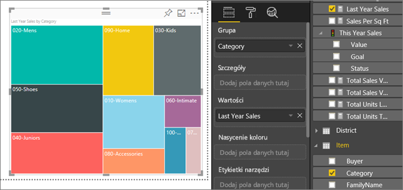
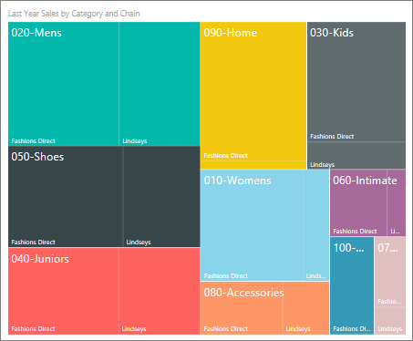

# Mapy drzewa w usłudze Power BI
Mapy drzewa prezentują dane hierarchiczne w formie zestawu zagnieżdżonych prostokątów.  Każdy poziom hierarchii jest przedstawiany jako kolorowy prostokąt (często określany jako „gałąź”) zawierający inne prostokąty („liście”).  Obszar wewnątrz każdego prostokąta jest przydzielany na podstawie mierzonej wartości. Następnie prostokąty są układane według rozmiaru od lewego górnego rogu (największe) do prawego dolnego rogu (najmniejsze).

Jeśli na przykład analizujemy sprzedaż, za prostokąty najwyższego poziomu, nazywane również *gałęziami*, możemy przyjąć kategorie odzieży: **Urban**, **Rural**, **Youth** i **Mix**.  Prostokąty mojej kategorii zostałyby podzielone na mniejsze prostokąty, nazywane również *liśćmi*, dla producentów odzieży w ramach tej kategorii. Te mniejsze prostokąty miałyby określony rozmiar i cieniowanie na podstawie liczby sprzedanych artykułów.  

W gałęzi **Urban** powyżej sprzedano dużo odzieży `Maximus`, mniej `Natura` i `Fama` oraz kilka sztuk `Leo`.  Dlatego gałąź **Urban** mojej mapy drzewa miałaby:
* największy prostokąt dla pozycji `Maximus` w lewym górnym rogu
* nieco mniejsze prostokąty dla pozycji `Natura` i `Fama`
* wiele innych prostokątów odpowiadających całej reszcie sprzedanej odzieży oraz 
* niewielki prostokąt dla pozycji `Leo`.  

Możemy porównać wielkość sprzedaży poszczególnych kategorii odzieży, porównując rozmiar i cieniowanie każdego węzła liścia; większe i ciemniejsze prostokąty oznaczają wyższą wartość.

## Kiedy używać mapy drzewa
Mapy drzewa są doskonałym wyborem:

* do wyświetlania dużych ilości danych hierarchicznych.
* gdy wykres słupkowy nie jest w stanie skutecznie zaprezentować dużej liczby wartości.
* do pokazania proporcji między poszczególnymi częściami i całością.
* do pokazania schematu rozkładu miary dla każdego poziomu kategorii w hierarchii.
* do pokazania atrybutów z użyciem kodowania kolorami i rozmiarami.
* do odnajdywania schematów, odstających wartości, najważniejszych elementów oraz wyjątków.

### Wymagania wstępne
 - Usługa Power BI lub program Power BI Desktop
 - Przykład Retail Analysis

## Tworzenie podstawowej mapy drzewa
Czy chcesz najpierw obejrzeć, jak ktoś inny tworzy mapę drzewa?  Przewiń film wideo do 2:10, aby zobaczyć, jak Amanda tworzy mapę drzewa.

<iframe width="560" height="315" src="https://www.youtube.com/embed/IkJda4O7oGs" frameborder="0" allowfullscreen></iframe>

Możesz również utworzyć własną mapę drzewa. W poniższych instrukcjach używane są przykładowe dane dotyczące analizy handlu detalicznego. Aby można było wykonać te instrukcje, zaloguj się w usłudze Power BI, wybierz pozycję **Pobierz dane \> Przykłady \> Próbka analizy handlu detalicznego \> Połącz \> Przejdź do pulpitu nawigacyjnego**. Tworzenie wizualizacji w raporcie wymaga uprawnień do edytowania zestawu danych i raportu. Na szczęście przykłady usługi Power BI można edytować. Nie możesz jednak dodać wizualizacji do raportu, który ktoś Ci udostępnił.  

1. Wybierz kafelek „Total stores”, aby otworzyć przykładowy raport analizy handlu detalicznego.    
2. Otwórz [Widok do edycji](../service-interact-with-a-report-in-editing-view.md) i wybierz miarę **Sales** > **Last Years Sales**.   
      
3. Przekonwertuj wykres na mapę drzewa.  
      
4. Przeciągnij pozycję **Item** > **Category** do obszaru **Grupa**. Usługa Power BI tworzy mapę drzewa, na której rozmiar prostokątów jest oparty na całkowitej sprzedaży, a kolor oznacza kategorię.  W ten sposób utworzyliśmy hierarchię, która prezentuje wizualnie względną wielkość całkowitej sprzedaży według kategorii.  Kategoria **Men’s** ma najwyższą sprzedaż, zaś kategoria **Hosiery** najniższą.   
      
5. Przeciągnij pozycję **Store** > **Chain** do obszaru **Szczegóły**, aby dokończyć mapę drzewa. Teraz możesz porównać sprzedaż z ostatniego roku według kategorii i sieci.   
   
   
   > [!NOTE]
   > Pozycje Nasycenie koloru i Szczegóły nie mogą być używane jednocześnie.
   > 
   > 
5. Umieść kursor nad obszarem **Chain**, aby wyświetlić etykietkę narzędzia tej części dla wartości **Category**.  Na przykład umieszczenie kursora na pozycji **Fashions Direct** w prostokącie **090-Home** spowoduje wyświetlenie etykietki narzędzia dla części Fashions Direct kategorii Home.  
   
6. [Dodaj mapę drzewa jako kafelek pulpitu nawigacyjnego (przypnij wizualizację)](../service-dashboard-tiles.md). 
7. [Zapisz raport](../service-report-save.md).

## Wyróżnianie i filtrowanie krzyżowe
Aby uzyskać informacje o korzystaniu z okienka filtrów, zobacz [Dodawanie filtru do raportu](../power-bi-report-add-filter.md).

Wyróżnienie elementu Category lub Detail na mapie drzewa powoduje wyróżnienie krzyżowe i filtrowanie krzyżowe innych wizualizacji na stronie raportu... i na odwrót. Aby kontynuować, dodaj wizualizacje do tej strony raportu albo skopiuj mapę drzewa na jedną z innych niepustych stron w tym raporcie.

1. Na mapie drzewa zaznacz element Category lub Chain w ramach wartości Category.  Spowoduje to wyróżnienie krzyżowe innych wizualizacji na stronie. Wybierając na przykład pozycję **050-Shoes**, wyświetlimy informacje, że sprzedaż butów w zeszłym roku wyniosła 3 640 471 USD, z czego 2 174 185 USD w ramach sieci Fashions Direct.  
   

2. Na wykresie kołowym **Last Year Sales by Chain** wybierz wycinek **Fashions Direct**.  
       

3. Aby zarządzać sposobem, w jaki odbywa się wzajemne wyróżnianie krzyżowe i filtrowanie krzyżowe dla wykresów, zobacz [Interakcje wizualizacji w raporcie usługi Power BI](../service-reports-visual-interactions.md)

## Następne kroki

[Wykresy kaskadowe w usłudze Power BI](power-bi-visualization-waterfall-charts.md)

[Typy wizualizacji w usłudze Power BI](power-bi-visualization-types-for-reports-and-q-and-a.md)