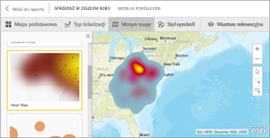
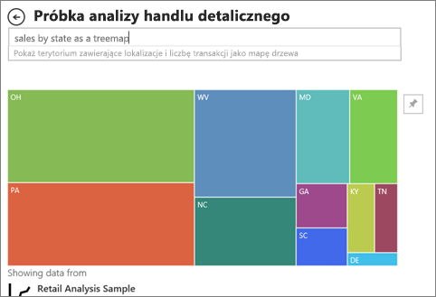

# Typy wizualizacji w usłudze Power BI
## Wizualizacje usługi Power BI
Będziemy dodawać nowe wizualizacje, cierpliwości!

Zapoznaj się z usługą [Microsoft AppSource](https://appsource.microsoft.com/marketplace/apps?product=power-bi-visuals), gdzie znajdziesz rosnącą listę [wizualizacji niestandardowych](../power-bi-custom-visuals.md), które można pobrać do użycia we własnych pulpitach nawigacyjnych i raportach. Jesteś osobą kreatywną? [Dowiedz się, jak tworzyć i dodawać własne wizualizacje do tej witryny społeczności](../developer/office-store.md).  

## Lista wizualizacji dostępnych w usłudze Power BI
Wszystkie te wizualizacje można dodać do raportów usługi Power BI, określić w funkcji pytań i odpowiedzi, a także przypiąć do pulpitów nawigacyjnych.

### Wykresy warstwowe: Podstawowy (warstwowy) i Skumulowany

>[!TIP]
>Podstawowy wykres warstwowy jest oparty na wykresie liniowym z obszarem pomiędzy osią i wypełnioną linią.

Aby uzyskać więcej informacji, zobacz [Samouczek: podstawowy wykres warstwowy](power-bi-visualization-basic-area-chart.md).

### Wykresy słupkowe i kolumnowe
 

 

>[!TIP]
>Wykresy słupkowe są standardowe w przypadku wyszukiwania określonej wartości w różnych kategoriach.

### Karty: wiele wierszy

### Karty: pojedyncza liczba

Aby uzyskać więcej informacji, zobacz [Tworzenie karty (kafelka z dużą liczbą)](power-bi-visualization-card.md).

### Wykresy kombi

>[!TIP]
>Wykres kombi łączą wykresy kolumnowe i wykresy liniowe. Dostępne opcje do wyboru to *Wykres liniowy i skumulowany* oraz *Wykres liniowy i kolumnowy grupowany*.

Aby uzyskać więcej informacji, zobacz [Samouczek: wykresy kombi w usłudze Power BI](power-bi-visualization-combo-chart.md).

### Wykresy pierścieniowe

>[!TIP]
>Wykresy pierścieniowe są podobne do wykresów kołowych.  Pokazują relację między częściami względem całości.

Aby uzyskać więcej informacji, zobacz [Samouczek: wykresy pierścieniowe w usłudze Power BI](power-bi-visualization-doughnut-charts.md).

### Wykresy lejkowe

>[!TIP]
>Lejki pomagają wizualizować proces zawierający etapy, w którym elementy przepływają sekwencyjnie od jednego etapu do następnego.  Użyj wykresu lejkowego, jeśli pomiędzy etapami zachodzi sekwencyjny przepływ elementów, na przykład w przypadku procesu sprzedaży rozpoczynającego się od potencjalnych klientów i kończącego się na realizacji zakupu.

Aby uzyskać więcej informacji, zobacz [Samouczek: wykresy lejkowe w usłudze Power BI](power-bi-visualization-funnel-charts.md).

### Wykresy w postaci wskaźników

>[!TIP]
>Wyświetla bieżący stan w kontekście realizacji celu.

Aby uzyskać więcej informacji, zobacz [Samouczek: wykresy w postaci wskaźników w usłudze Power BI](power-bi-visualization-radial-gauge-charts.md).

### Wskaźniki KPI

>[!TIP]
>Przedstawiają postępy na drodze do mierzalnego celu.

Aby uzyskać więcej informacji, zobacz [Samouczek: kluczowe wskaźniki wydajności w usłudze Power BI](power-bi-visualization-kpi.md).

### Wykresy liniowe

>[!TIP]
>Wyróżniają ogólny kształt całej serii wartości, zazwyczaj w czasie.

### Mapy: mapy podstawowe

>[!TIP]
>Używane do kojarzenia informacji dotyczących kategorii i ilości z lokalizacjami.

Aby uzyskać więcej informacji, zobacz [Porady i wskazówki dotyczące wizualizacji w formie map](power-bi-map-tips-and-tricks.md).

### Mapy: mapy ArcGIS

Aby uzyskać więcej informacji, zobacz [Samouczek: mapy ArcGIS w usłudze Power BI](../power-bi-visualization-arcgis.md).

### Mapy: mapy wypełnione (Choropleth)

>[!TIP]
>Im bardziej intensywny kolor, tym większa wartość.

Aby uzyskać więcej informacji, zobacz [Samouczek: mapy wypełnione w usłudze Power BI](power-bi-visualization-filled-maps-choropleths.md).

### Macierz

### Wykresy kołowe

### Wykresy punktowe i bąbelkowe

>[!TIP]
>Wyświetlają relacje między dwiema (wykres punktowy) lub trzema (wykres bąbelkowy) miarami ilościowymi — czy istnieją, w jakiej kolejności itp.

Aby uzyskać więcej informacji, zobacz [Samouczek: wykresy punktowe w usłudze Power BI](power-bi-visualization-scatter.md).

### Fragmentatory

Aby uzyskać więcej informacji, zobacz [Samouczek: fragmentatory w usłudze Power BI](power-bi-visualization-slicers.md).

### Obrazy autonomiczne

Aby uzyskać więcej informacji, zobacz [Dodawanie widgetu obrazu do pulpitu nawigacyjnego](../service-dashboard-add-widget.md).

### Tabele

>[!TIP]
>Sprawdzają się w przypadku porównań ilościowych między elementami, jeśli istnieje wiele kategorii.

Aby uzyskać więcej informacji, zobacz [Praca z tabelami w usłudze Power BI](power-bi-visualization-tables.md).

### Mapy drzewa

Aby uzyskać więcej informacji, zobacz [Samouczek: mapy drzewa w usłudze Power BI](power-bi-visualization-treemaps.md).

>[!TIP]
>To wykresy składające się z kolorowych prostokątów, w których rozmiar reprezentuje wartość.  Mogą być hierarchiczne z prostokątami zagnieżdżonymi w prostokątach głównych.

### Wykresy kaskadowe

>[!TIP]
>Wykresy kaskadowe pokazują sumę bieżącą, gdy wartości są dodawane lub odejmowane.

Aby uzyskać więcej informacji, zobacz [Samouczek: wykresy kaskadowe w usłudze Power BI](power-bi-visualization-waterfall-charts.md).

## Poinformuj funkcję pytań i odpowiedzi, której wizualizacji użyć
Podczas wpisywania zapytań w języku naturalnym w funkcji pytań i odpowiedzi usługi Power BI możesz określić typ wizualizacji w zapytaniu.  Na przykład:

„***sales by state as a treemap***” (sprzedaż według stanu w formie mapy drzewa)

## Następne kroki
[Wizualizacje w raportach usługi Power BI](power-bi-report-visualizations.md)    
[Odpowiednie odwołanie do wizualizacji z witryny sqlbi.com](http://www.sqlbi.com/wp-content/uploads/videotrainings/dashboarddesign/visuals-reference-may2017-A3.pdf)

[Raporty w usłudze Power BI](../consumer/end-user-reports.md)

[Power BI — podstawowe pojęcia](../consumer/end-user-basic-concepts.md)

Masz więcej pytań? [Odwiedź społeczność usługi Power BI](http://community.powerbi.com/)

