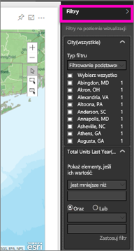
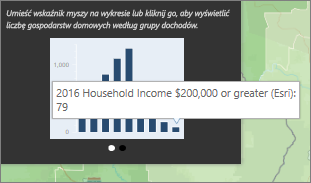
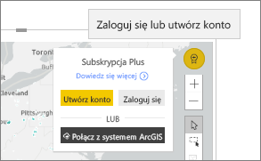

# Interakcje z mapami ArcGIS w usłudze Power BI
Ten temat przedstawia perspektywę osoby *korzystającej* z mapy ArcGIS w usłudze Power BI, programie Desktop lub aplikacji mobilnej. Jeśli twórca mapy ArcGIS udostępni Ci ją, możesz z niej korzystać na wiele sposobów.  Aby dowiedzieć się więcej na temat tworzenia mapy ArcGIS, zobacz [ArcGIS maps by esri tutorial (Samouczek Mapy ArcGIS firmy Esri)](../power-bi-visualization-arcgis.md).

Kombinacja map ArcGIS i usługi Power BI przenosi tworzenie map na zupełnie nowy poziom wykraczający poza prezentację punktów na mapie. Dostępne opcje obejmujące mapy podstawowe, typy lokalizacji, motywy, style symboli i warstwy referencyjne pozwalają tworzyć okazałe i bogate w informacje wizualizacje map. Połączenie autorytatywnych warstw danych (na przykład dotyczących spisu) na mapie z analizą przestrzenną umożliwia lepsze zrozumienie danych używanych w wizualizacji.

> [!TIP]
> GIS (ang. Geographic Information System) to inaczej system informacji geograficznej.
> 

W tym przykładzie używamy mapy ArcGIS utworzonej w [samouczku firmy Esri dotyczącym map ArcGIS](../power-bi-visualization-arcgis.md). Przedstawia ona zeszłoroczną sprzedaż w poszczególnych miastach przy użyciu podstawowej mapy ulicznej, symboli bąbelków reprezentujących wielkość i warstwy referencyjnej prezentującej średni dochód na gospodarstwo domowe. Mapy zawiera trzy pinezki i jedno (purpurowe) koło przedstawiające czas dojazdu.

> [!TIP]
> Odwiedź [stronę firmy Esri dotyczącą usługi Power BI](https://www.esri.com/powerbi), aby zobaczyć szereg przykładów i przeczytać opinie klientów. Następnie zobacz stronę firmy Esri [ArcGIS Maps for Power BI Getting Started page (Wprowadzenie do komponentu ArcGIS Maps for Power BI)](https://doc.arcgis.com/en/maps-for-powerbi/get-started/about-maps-for-power-bi.htm).
> 
> 

 

## Zgoda użytkownika
Gdy współpracownik udostępni Ci mapę ArcGIS po raz pierwszy, usługa Power BI wyświetli monit. Komponent ArcGIS Maps for Power BI jest dostarczany przez firmę Esri (www.esri.com) i korzystanie z niego podlega ogólnym warunkom oraz zasadom ochrony prywatności firmy Esri. Użytkownicy usługi Power BI, którzy chcą korzystać z wizualizacji komponentu ArcGIS Maps for Power BI, muszą zaakceptować okno dialogowe ze zgodą.

## Narzędzia wyboru
Komponent ArcGIS Maps for Power BI udostępnia trzy tryby wybierania. Maksymalnie można zaznaczyć 250 punktów danych jednocześnie.

 Umożliwia wybranie poszczególnych punktów danych.

 Rysuje prostokąt na mapie i wybiera zawarte w nim punkty danych. Użyj klawisza CTRL, aby wybrać więcej niż jeden prostokątny obszar.

 Umożliwia użycie granic lub wielokątów w ramach warstwy referencyjnej w celu wybrania zawartych w nich punktów danych.

 

## Interakcja z mapą ArcGIS
Dostępne funkcje zależą od tego, czy jest się *twórcą* (osobą, która stworzyła mapę) czy *użytkownikiem* (któremu ktoś inny udostępnił mapę ArcGIS). Jeśli korzystasz z mapy ArcGIS jako użytkownik (w [widoku do czytania](../consumer/end-user-reading-view.md)), możesz wykonywać następujące akcje.

* Jeśli jesteś użytkownikiem wersji Premium z uprawnieniami do *przeglądania*, będziesz mieć możliwość [wyświetlania danych użytych do utworzenia wizualizacji](../consumer/end-user-show-data.md), [subskrybowania](../consumer/end-user-subscribe.md), oglądania mapy w [ trybie koncentracji uwagi i trybie pełnoekranowym](../consumer/end-user-focus.md), [wyświetlania powiązanej zawartości](../consumer/end-user-related.md), [przeprowadzania interakcji z filtrami](../consumer/end-user-report-filter.md) ustawionymi przez *autora raportu*, [udostępniania raportu](../service-share-reports.md) i nie tylko.

* Podobnie jak w przypadku innych typów wizualizacji, użytkownicy usługi Power BI **Pro** mogą wykonywać wszystkie czynności tak jak użytkownicy wersji Premium, a ponadto [eksportować dane bazowe](power-bi-visualization-export-data.md), [pobierać metryki użycia](../service-usage-metrics.md), zapisywać kopię i [publikować w Internecie](../service-publish-to-web.md) i nie tylko.

    
* Rozwiń okienko **Filtry**, aby eksplorować mapy przy użyciu filtrów.   
      
* Jeśli mapa ma warstwę referencyjną, wybierz lokalizacje, aby wyświetlić szczegóły w etykietce narzędzia. Poniżej wybraliśmy hrabstwo Adams, aby wyświetlić dane dotyczące średniego dochodu na gospodarstwo domowe zawarte w warstwie referencyjnej, którą dodał twórca mapy.
  
      
  
    W tym przypadku mamy również wykres. Wybierz słupek na wykresie, aby wyświetlić szczegółowe dane. Widać, że 79 gospodarstw domowych w hrabstwie Adams uzyskuje dochód na poziomie co najmniej 200 000 USD.
  
    
  
    Wybierz strzałkę, aby wyświetlić dodatkowe wykresy.
* Aby wyświetlić szczegółowe informacje w etykietce narzędzia, umieść kursor nad symbolem lokalizacji na mapie podstawowej.     
  
  
  > [!TIP]
  > Wybranie konkretnej lokalizacji może wymagać powiększenia wyświetlanego obszaru.  Jeśli lokalizacje nakładają się na siebie, usługa Power BI może wyświetlać więcej niż jedną etykietkę narzędzia naraz. Aby przechodzić między etykietkami narzędzi, wybieraj strzałki.
  > 
  > 
  > 
  > 
* Jeśli twórca dodał do mapy ArcGIS warstwę infografiki, w prawym górnym rogu mapy zostaną wyświetlone dodatkowe dane.  W tym przykładzie twórca mapy dodał informacje o dzieciach poniżej 14 lat.
  
    

## Istotne zagadnienia i ograniczenia
Komponent ArcGIS Maps for Power BI jest dostępny w ramach następujących usług i aplikacji:

<table>
<tr><th>Usługa/aplikacja</th><th>Dostępność</th></tr>
<tr>
<td>Power BI Desktop</td>
<td>Tak</td>
</tr>
<tr>
<td>Usługa Power BI (app.powerbi.com)</td>
<td>Tak</td>
</tr>
<tr>
<td>Aplikacje mobilne Power BI</td>
<td>Tak</td>
</tr>
<tr>
<td>Usługa Power BI — publikowanie w Internecie</td>
<td>Nie</td>
</tr>
<tr>
<td>Power BI Embedded</td>
<td>Nie</td>
</tr>
<tr>
<td>Osadzanie usługi Power BI (PowerBI.com)</td>
<td>Nie</td>
</tr>
</table>

**Jak współpracują ze sobą komponenty ArcGIS Maps for Power BI?**
Komponent ArcGIS Maps for Power BI jest dostarczany przez firmę Esri (www.esri.com). Korzystanie z komponentu ArcGIS Maps for Power BI objęte jest treścią ogólnych [warunków](https://go.microsoft.com/fwlink/?LinkID=8263222) oraz [zasadami ochrony prywatności](https://go.microsoft.com/fwlink/?LinkID=826323) firmy Esri. Użytkownicy usługi Power BI, którzy chcą korzystać z wizualizacji komponentu ArcGIS Maps for Power BI, muszą zaakceptować okno dialogowe ze zgodą (zobacz Zgoda użytkownika, aby uzyskać więcej szczegółów).  Korzystanie z komponentu ArcGIS Maps for Power BI firmy Esri objęte jest treścią ogólnych warunków oraz zasadami ochrony prywatności firmy Esri, do których można przejść z okna dialogowego zgody użytkownika. Każdy użytkownik musi wyrazić zgodę przed pierwszym użyciem komponentu ArcGIS Maps for Power BI. Gdy użytkownik zaakceptuje zgodę, dane powiązane z elementem wizualnym zostaną wysłane do usług Esri co najmniej w celu geokodowania, czyli przekształcania informacji o lokalizacji na długość i szerokość geograficzną, którą można przedstawić na mapie. Należy założyć, że wszelkie dane powiązane z wizualizacją danych mogą zostać wysłane do usług Esri. Firma Esri zapewnia usługi, takie jak mapy podstawowe, narzędzia analizy przestrzennej, geokodowanie itp. Element wizualny komponentu ArcGIS Maps for Power BI wchodzi w interakcję z tymi usługami przy użyciu połączenia SSL chronionego przez certyfikat dostarczony i utrzymywany przez firmę Esri. Dodatkowe informacje o komponencie ArcGIS Maps for Power BI można uzyskać na stronie [ArcGIS Maps for Power BI — strona produktu](https://www.esri.com/powerbi) firmy Esri.

**Power BI Plus**    

Gdy użytkownik rejestruje się w subskrypcji Plus oferowanej przez firmę Esri za pośrednictwem komponentu ArcGIS Maps for Power BI, wchodzi w bezpośrednią relację z firmą Esri. Usługa Power BI nie wysyła informacji osobistych dotyczących użytkownika do firmy Esri. Użytkownik loguje się i ufa aplikacji usługi AAD firmy Esri przy użyciu własnej tożsamości usługi AAD. Dzięki temu użytkownik udostępnia swoje informacje osobiste bezpośrednio firmie Esri. Gdy użytkownik dodaje zawartość subskrypcji Plus do elementu wizualnego komponentu ArcGIS Maps for Power BI, inni użytkownicy usługi Power BI również będą potrzebować subskrypcji Plus od firmy Esri, aby wyświetlić lub edytować tę zawartość. 

W przypadku szczegółowych pytań technicznych dotyczących działania komponentu ArcGIS Maps for Power BI firmy Esri należy skontaktować się z firmą Esri za pośrednictwem ich strony pomocy technicznej.

**Mapa ArcGIS nie jest wyświetlana**    
W usługach lub aplikacjach, w których komponent ArcGIS Maps for Power BI nie jest dostępny, będzie wyświetlana pusta wizualizacja z logo usługi Power BI.

**Na mapie nie widać wszystkich moich informacji**    
W przypadku geokodowania szerokości/długości geograficznej na mapie jest wyświetlanych maksymalnie 30 000 punktów danych. W przypadku geokodowania punktów danych, takich jak kody pocztowe lub adresy pocztowe, tylko 15 000 pierwszych punktów jest objętych geokodowaniem. Limit 1500 adresów nie dotyczy geokodowania nazw miejsc ani krajów.

**Czy korzystanie z komponentu ArcGIS Maps for Power BI wiąże się z opłatami?**

Komponent ArcGIS Maps for Power BI jest dostępny dla wszystkich użytkowników usługi Power BI bez konieczności ponoszenia dodatkowych kosztów. Jak wspomniano wcześniej w tym artykule, jest to komponent dostarczany przez firmę **Esri**, dlatego jego używanie podlega ogólnym warunkom oraz zasadom ochrony prywatności określonym przez firmę **Esri**. Jeśli subskrybujesz usługę ArcGIS **Plus**, są naliczane opłaty.

**Wyświetlany jest błąd informujący o przepełnieniu pamięci podręcznej**

Jest to błąd, którego naprawianie jest w toku.  Tymczasowym rozwiązaniem jest wybranie linku wyświetlanego w komunikacie o błędzie w celu uzyskania instrukcji dotyczących czyszczenia pamięci podręcznej usługi Power BI.

**Czy można wyświetlać mapy ArcGIS w trybie offline?**

Nie, usługa Power BI wymaga połączenia z siecią, aby wyświetlać mapy.

## Następne kroki
Uzyskiwanie pomocy: firma **Esri** udostępnia [kompleksową dokumentację](https://go.microsoft.com/fwlink/?LinkID=828772) dotyczącą zestawu funkcji komponentu **ArcGIS Maps for Power BI**.

W ramach [wątku społeczności usługi Power BI związanego z komponentem **ArcGIS Maps for Power BI**](https://go.microsoft.com/fwlink/?LinkID=828771) można zadawać pytania, znajdować najnowsze informacje, zgłaszać problemy i szukać odpowiedzi.

Jeśli masz sugestię dotyczącą tego, co można poprawić, prześlij ją na [listę pomysłów usługi Power BI](https://ideas.powerbi.com).

[ArcGIS Maps for Power BI — strona produktu](https://www.esri.com/powerbi)
