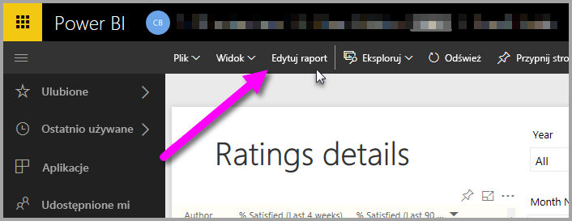
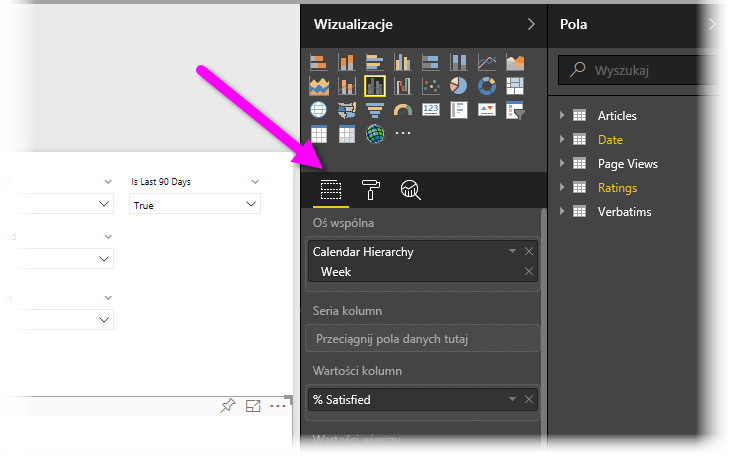
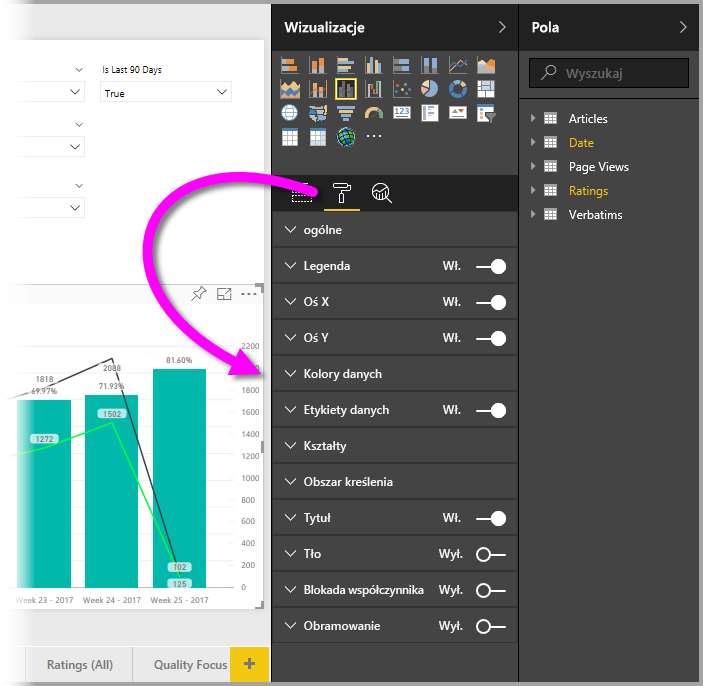
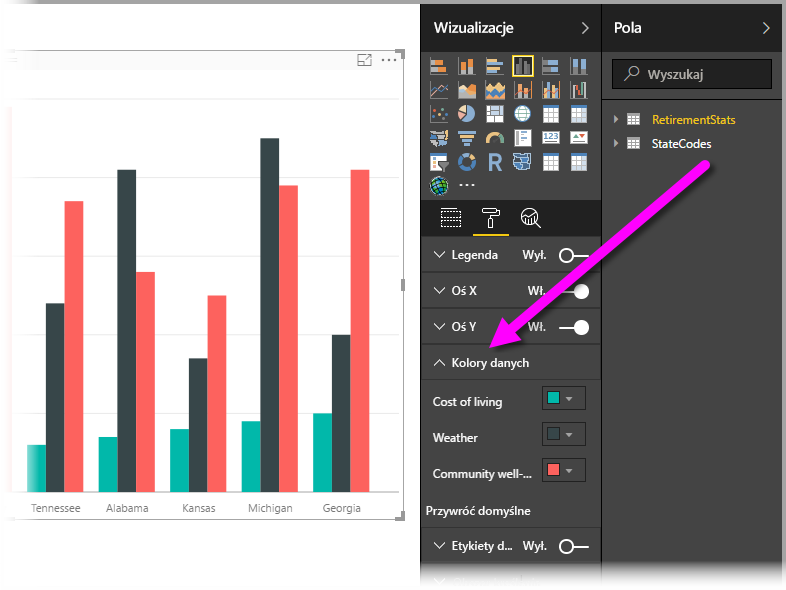
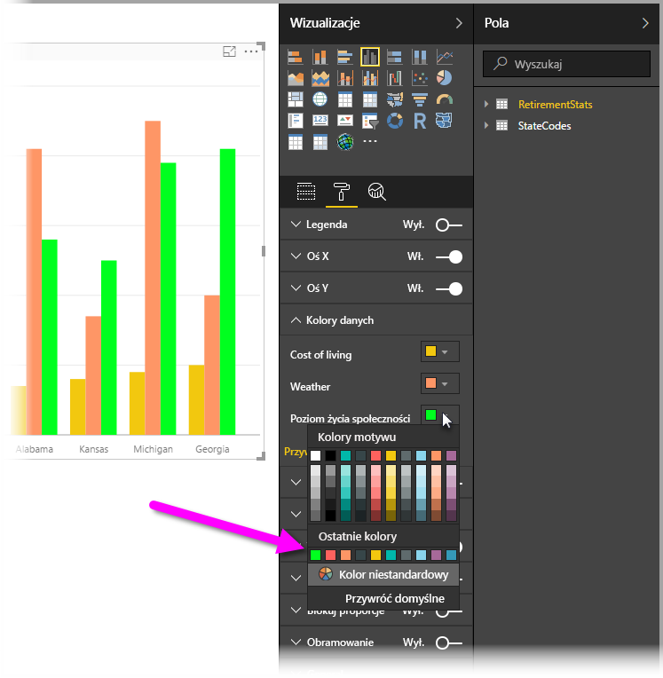
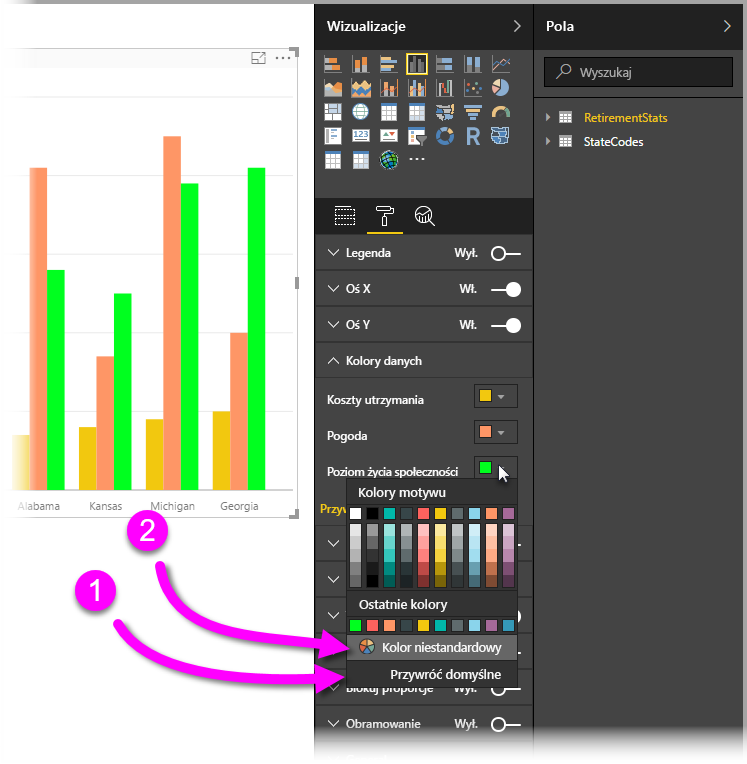
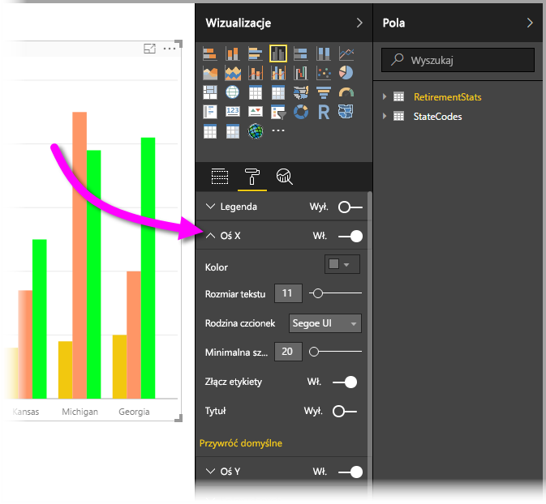

# Wprowadzenie do formatowania za pomocą kolorów i właściwości osi
W **usłudze Power BI** można zmienić kolor serii danych, punktów danych, a nawet tła wizualizacji. Można również zmienić sposób wyświetlania osi x i y, zyskując pełną kontrolę nad wyglądem pulpitów nawigacyjnych i raportów.

Aby rozpocząć, wybierz **raport** w okienku **Mój obszar roboczy**. Następnie w menu u góry wybierz polecenie **Edytuj raport**.  

Podczas edytowania raportu przy wybranej wizualizacji w okienku **Wizualizacje** można dodawać lub zmieniać wizualizacje. Bezpośrednio pod obszarem dostępnych wizualizacji znajdują się trzy ikony: **Pola** (słupki), **Formatowanie** (wałek do malowania) i **Analiza** (lupa). Na poniższej ilustracji wybrano ikonę **Pola**, pod którą widać żółty pasek.

Po wybraniu ikony **Formatowanie** w obszarze poniżej jest wyświetlany kolor i dostosowania osi dostępne dla aktualnie wybranej wizualizacji.  

Można dostosować wiele elementów poszczególnych wizualizacji:

* Legenda
* Oś X
* Oś Y
* Kolory danych
* Etykiety danych
* Kształty
* Obszar kreślenia
* Tytuł
* Tło
* Blokada współczynnika
* Obramowanie

> [!NOTE]
>  
> Nie wszystkie elementy będą widoczne przy każdym typie wizualizacji. Wybranie wizualizacji wpływa na dostępność dostosowań. Na przykład wykresy kołowe nie mają osi x, dlatego nie będzie jej widać po wybraniu tego wykresu.

Zwróć też uwagę, że jeśli nie masz wybranej wizualizacji, zamiast ikon widać **filtry**, które można stosować do wszystkich wizualizacji na stronie.

Pokażemy parę przykładów: pierwszy z dostosowaniem kolorów, a drugi ze zmianą właściwości osi. Zobaczysz, że można spędzić cały dzień na dostosowywaniu kolorów, osi i etykiet.

## Praca z kolorami

Przedstawimy kroki umożliwiające dostosowanie kolorów na wykresie.

1. Wybieram pozycję **Wykres kolumnowy grupowany** na kanwie raportu.
2. Następnie wybieram ikonę **Formatowanie**, aby wyświetlić dostępne dostosowania.
3. W kolejnym kroku wybieram małą strzałkę w dół, widoczną z lewej strony dostosowania **Kolory danych**. Zostaną wyświetlone opcje specyficzne dla wybranej wizualizacji, umożliwiające dostosowanie kolorów danych.
4. Obszar **Kolory danych** zostanie rozwinięty i pojawią się dostępne dostosowania.  
   

Wprowadzimy kilka zmian. Wybierając strzałkę w dół obok koloru, możemy zmienić każdą serię danych. Słupek **Cost of living** będzie żółty, **Weather** pomarańczowy, a **Community well-being** — zielony. Na poniższym ekranie przedstawiono ostatni krok, czyli zmianę koloru słupka **Cost of living**.  

Wprowadzone zmiany są widoczne na poniższej ilustracji. Mamy całkiem jasny wykres. Oto parę przydatnych uwag dotyczących pracy z kolorami. Liczby z tej listy są także wyświetlane na poniższym ekranie, aby ułatwić znalezienie elementów, których dotyczą te informacje.

1. Nie podobają Ci się ustawione kolory? Żaden problem. Po prostu wybierz pozycję **Przywróć domyślne**, aby przywrócić ustawienia domyślne. Możesz przywrócić jeden kolor lub całą wizualizację.
2. Chcesz wybrać kolor, którego nie ma na palecie? Wybierz pozycję **Kolor niestandardowy**, a następnie wybierz kolor ze spektrum.  
   

Chcesz cofnąć ostatnio wprowadzoną zmianę? Możesz to zrobić za pomocą dobrze znanej kombinacji **CTRL+Z**.

## Zmiana właściwości osi

Użyteczną funkcją jest możliwość modyfikowania osi X lub osi Y. Podobnie jak w przypadku kolorów, oś można zmodyfikować, wybierając ikonę strzałki w dół wyświetlaną z lewej strony osi, jak pokazano na poniższej ilustracji.  

Jeśli chcesz zwinąć opcje **osi X**, wybierz ikonę strzałki w górę obok pozycji **Oś X**.

Możesz całkowicie usunąć etykiety osi X, przełączając przycisk radiowy obok pozycji **Oś X**. Możesz także sterować wyświetlaniem tytułów osi, wybierając przycisk radiowy obok pozycji **Tytuł**.  

Dostępna jest cała gama kolorów oraz o wiele więcej dostosowań, które można zastosować do raportów i pulpitów nawigacyjnych usługi Power BI.

> [!NOTE]
>  
> Te kolory, osie i powiązane dostosowania, dostępne po wybraniu ikony **Formatowanie**, są również dostępne w programie Power BI Desktop.

## Ustawianie koloru przy użyciu wartości tekstowych

Począwszy od aktualizacji programu **Power BI Desktop** z sierpnia 2018 r., kolory danego elementu raportu można ustawiać za pomocą wartości tekstowej lub kodu szesnastkowego. Aby uzyskać więcej informacji, zobacz [Formatowanie warunkowe w tabelach](../desktop-conditional-table-formatting.md).

## Następne kroki
Aby uzyskać więcej informacji, zobacz następujący artykuł:  

* [Porady i wskazówki dotyczące formatowania kolorów w usłudze Power BI](service-tips-and-tricks-for-color-formatting.md)  
* [Formatowanie warunkowe w tabelach](../desktop-conditional-table-formatting.md)

